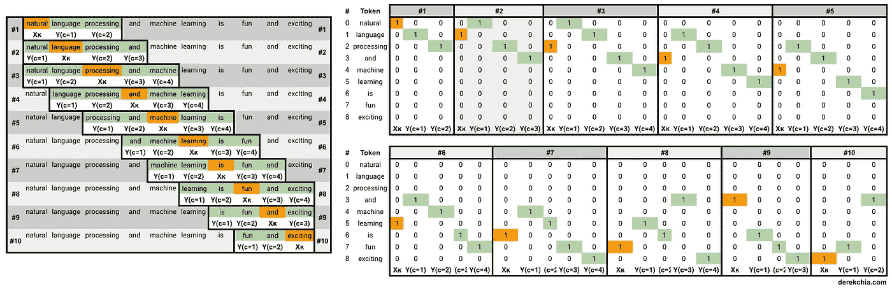
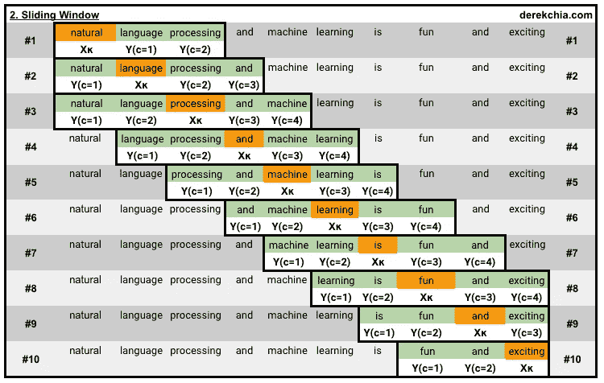
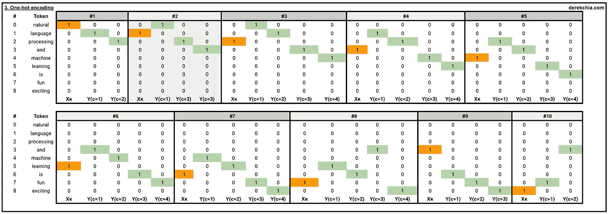
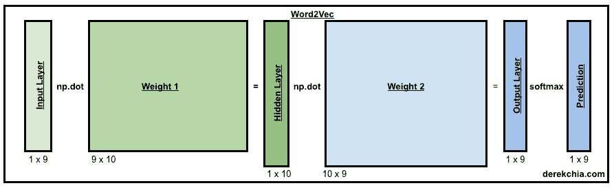
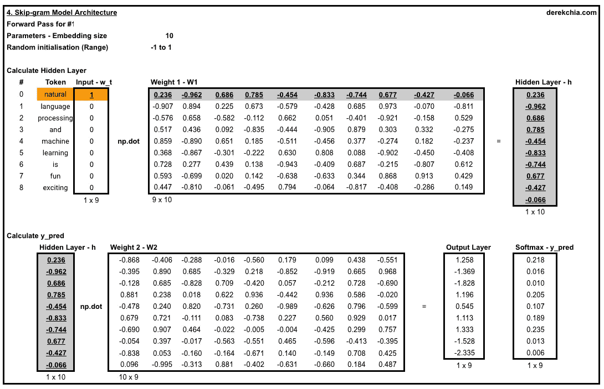
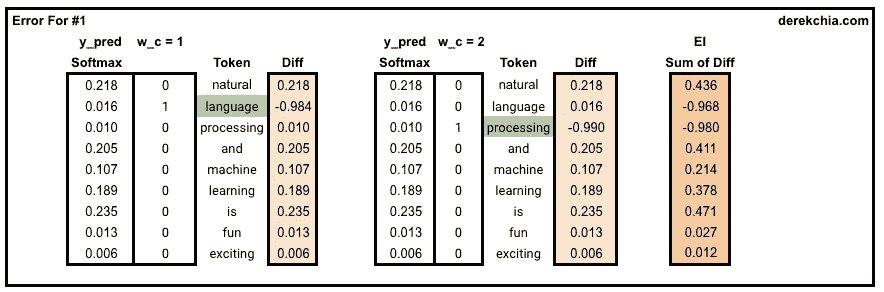
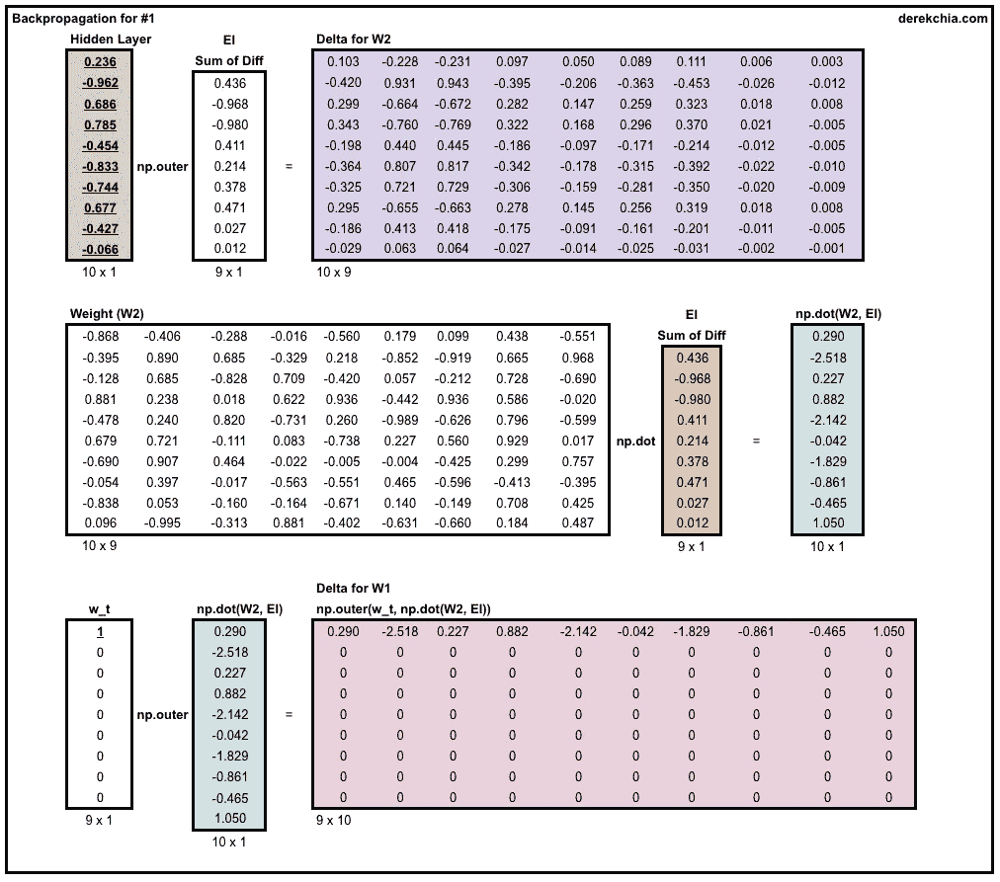
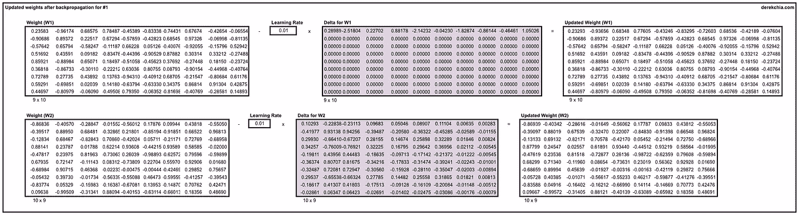
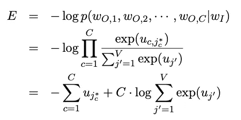
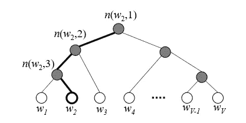

# 使用 NumPy 和 Google Sheets 的 Word2Vec 实现指南

> 原文：<https://towardsdatascience.com/an-implementation-guide-to-word2vec-using-numpy-and-google-sheets-13445eebd281?source=collection_archive---------1----------------------->

## 了解 Word2Vec 的内部工作原理

本文是使用 NumPy 和 Google Sheets 实现 Word2Vec 的指南。如果你读这篇文章有困难，可以考虑在这里订阅中级会员！

Word2Vec 被誉为自然语言处理(NLP)领域最大、最新的突破之一。这个概念简单、优雅且(相对)容易掌握。快速的谷歌搜索会返回多个关于如何使用标准库的结果，比如 [Gensim](https://radimrehurek.com/gensim/models/word2vec.html) 和 [TensorFlow](https://www.tensorflow.org/tutorials/representation/word2vec) 。此外，出于好奇，请查看 Tomas Mikolov 使用 C 的原始实现。原文可以在[这里](https://arxiv.org/pdf/1301.3781.pdf)找到。

本文的重点是详细介绍 Word2Vec。为此，我使用 NumPy 在 Python 上实现了 Word2Vec(在其他教程的帮助下),还准备了一个 Google 工作表来展示计算。以下是[代码](https://github.com/DerekChia/word2vec_numpy)和[谷歌表单](https://docs.google.com/spreadsheets/u/3/d/1mgf82Ue7MmQixMm2ZqnT1oWUucj6pEcd2wDs_JgHmco/edit?usp=sharing)的链接。



Fig. 1 — Step-by-step introduction to Word2Vec. Presented in code and Google Sheets

# 直觉

Word2Vec 的目标是为进一步的 NLP 任务生成带有语义的单词的向量表示。每个单词向量通常有几百个维度，并且语料库中的每个唯一单词被分配一个空间向量。例如，单词“happy”可以表示为 4 维向量[0.24，0.45，0.11，0.49],“sad”具有向量[0.88，0.78，0.45，0.91]。

单词到向量的转换也称为 [*单词嵌入*](https://en.wikipedia.org/wiki/Word_embedding) *。*之所以要进行这样的转换，是为了让机器学习算法可以对数字(在向量中)而不是单词进行线性代数运算。

要实现 Word2Vec，有两种风格可供选择— **连续词包(CBOW)** 或**连续跳格(SG)** 。简而言之，CBOW 试图从其相邻单词(上下文单词)中猜测输出(目标单词)，而连续跳格从目标单词中猜测上下文单词。实际上，Word2Vec 是基于[分布假设](https://en.wikipedia.org/wiki/Distributional_semantics#Distributional_hypothesis)的，其中每个单词的上下文都在它附近的单词中。因此，通过查看它的相邻单词，我们可以尝试预测目标单词。

根据 Mikolov 的说法(在这篇文章的[中引用)，Skip-gram 和 CBOW 的区别如下:](https://www.quora.com/What-are-the-continuous-bag-of-words-and-skip-gram-architectures)

> ***Skip-gram:*******好用的*** *用* ***少量的训练数据*** *，甚至代表好用的* ***生僻字*** *或词组**
> 
> ****CBOW:*** *数倍于***比【skip-gram】****精度稍好*** ***为*******频繁*** *单词****

**更详细地说，由于 **Skip-gram** 学习从给定单词预测上下文单词，在两个单词(一个不经常出现，另一个更频繁出现)并排放置的情况下，当涉及到最小化损失时，两者将具有相同的处理，因为每个单词将被视为目标单词和上下文单词。与 **CBOW** 相比，不常用的单词将只是用于预测目标单词的上下文单词集合的一部分。因此，该模型将为不常用的单词分配低概率。**

****

**Fig. 2 — Word2Vec — CBOW and skip-gram model architectures. Credit: [IDIL](http://idli.group/Natural-Language-Processing-using-Vectoriziation.html)**

# **实现进程**

**在本文中，我们将实现 **Skip-gram** 架构。为了便于阅读，内容分为以下几个部分:**

1.  ****数据准备** —定义语料库，清理、规范化和分词**
2.  ****超参数** —学习率、时期、窗口大小、嵌入大小**
3.  ****生成训练数据** —构建词汇，对单词进行一次性编码，构建将 id 映射到单词的字典，反之亦然**
4.  ****模型训练** —通过正向传递传递编码的字，计算错误率，使用反向传播调整权重并计算损失**
5.  ****推理** —获取词向量，寻找相似词**
6.  ****进一步改进** —通过跳过 gram 负采样(SGNS)和分层 Softmax 加快训练时间**

# **1.数据准备**

**首先，我们从以下语料库开始:**

> **自然语言处理和机器学习既有趣又令人兴奋**

**为了简单起见，我们选择了一个没有标点符号和大写字母的句子。此外，我们没有删除停用词“和”和“是”。**

**在现实中，文本数据是非结构化的，可能是“脏的”。清理它们将涉及诸如删除停用词、标点符号、将文本转换为小写(实际上取决于您的使用情况)、替换数字等步骤。KDnuggets 有一篇关于这个过程的优秀文章。或者，Gensim 还提供了一个使用`[gensim.utils.simple_preprocess](https://radimrehurek.com/gensim/utils.html#gensim.utils.simple_preprocess)`执行简单文本预处理的函数，它将文档转换成一系列小写标记，忽略太短或太长的标记。**

**在预处理之后，我们继续对语料库进行标记。这里，我们在空白上标记我们的语料库，结果是一个单词列表:**

> **【“自然”、“语言”、“处理”、“和”、“机器”、“学习”、“是”、“有趣”、“和”、“令人兴奋”】**

# **2.超参数**

**在我们进入实际实现之前，让我们定义一些我们稍后需要的超参数。**

**`[window_size]:`如上所述，上下文单词是与目标单词相邻的单词。但是这些词应该有多远或多近才能被认为是邻居呢？这就是我们将`window_size`定义为 2 的地方，这意味着在目标单词左右 2 的单词被认为是上下文单词。参考下面的图 3，注意，当窗口滑动时，语料库中的每个单词都将是目标单词。**

****

**FIg. 3 — With a window_size of 2, the target word is highlighted in orange and context words in green**

**`[n]:`这是单词嵌入的维度，通常在 100 到 300 之间，取决于你的词汇量。尺寸大小超过 300 往往会使[收益递减](http://www.aclweb.org/anthology/D14-1162)(参见第 1538 页图 2 (a))。请注意，尺寸也是隐藏层的大小。**

**`[epochs]:`这是训练纪元的数目。在每个时期，我们循环所有的训练样本。**

**`[learning_rate]:`学习率控制相对于损失梯度的权重调整量。**

# **3.生成培训数据**

**在这一节中，我们的主要目标是将我们的语料库转换成用于训练 Word2Vec 模型的一次性编码表示。从我们的语料库中，图 4 放大了 10 个窗口(#1 到#10)，如下所示。每个窗口由目标单词及其上下文单词组成，分别以橙色和绿色突出显示。**

****

**Fig. 4 — One-hot encoding for each target word and its context words**

**第一个和最后一个训练窗口中的第一个和最后一个元素的示例如下所示:**

> ***# 1【目标(* ***自然*** *)】、【上下文(*语言*、*处理*)】*
> *【列表(****)【1，0，0，0，0，0，0，0】***
> 列表(【0，1，0**
> 
> **** * * * * * # 2 至#9 删除*******
> 
> ***#10【目标(* ***精彩*** *)】、【上下文(*趣味*、*、*)【列表(****)【0，0，0，0，0，0，1】****)
> 列表(***

**为了生成一次性训练数据，我们首先初始化`word2vec()`对象，然后通过传递`settings`和`corpus`作为参数，使用对象`w2v`调用函数`generate_training_data`。**

**在函数`generate_training_data`中，我们执行了以下操作:**

1.  **`self.v_count` —词汇长度(注意，词汇是指语料库中唯一词的数量)**
2.  **`self.words_list` —词汇表中的单词列表**
3.  **`self.word_index` —以词汇中的每个关键字为词，以值为索引的字典**
4.  **`self.index_word` —字典，每个关键字作为索引，值作为词汇中的单词**
5.  **`for`循环使用`word2onehot`函数将每个目标及其上下文单词的一键表示追加到`training_data`。**

# **4.模特培训**

****

**Fig. 5 — Word2Vec — skip-gram network architecture**

**用我们的`training_data`，我们现在准备训练我们的模型。训练从`w2v.train(training_data)`开始，我们传入训练数据并调用函数`train`。**

**Word2Vec 模型由两个权重矩阵(`w1`和`w2`)组成，出于演示目的，我们已经将值分别初始化为(9x10)和(10x9)的形状。这有助于计算反向传播误差，这将在本文后面讨论。在实际训练中，您应该随机初始化权重(例如使用`np.random.uniform()`)。为此，注释第 9 行和第 10 行，取消第 11 行和第 12 行的注释。**

## **训练—向前传球**

**接下来，我们开始使用第一个训练示例来训练我们的第一个纪元，方法是将代表目标词的一键向量的`w_t`传递给`forward_pass`函数。在`forward_pass`函数中，我们在`w1`和`w_t`之间执行点积以产生`h`(第 24 行)。然后，我们使用`w2`和`h`执行另一个点积来产生输出层`u`(第 26 行)。最后，我们运行`u`到 [softmax](https://en.wikipedia.org/wiki/Softmax_function) 来强制每个元素在 0 和 1 的范围内，从而在返回预测矢量`y_pred`、隐藏层`h`和输出层`u`之前给出我们预测的概率(第 28 行)。**

**我附上了一些截图，以显示第一个窗口(#1)中第一个训练样本的计算，其中目标词是“自然”，上下文词是“语言”和“处理”。请随意查看谷歌表单[中的公式。](https://docs.google.com/spreadsheets/d/1mgf82Ue7MmQixMm2ZqnT1oWUucj6pEcd2wDs_JgHmco/edit?usp=sharing)**

****

**Fig. 6— Calculate hidden layer, output later and softmax**

## **训练——错误、反向传播和损失**

****误差—** 利用`y_pred`、`h`和`u`，我们继续计算这组特定目标和上下文单词的误差。这是通过总结`y_pred`和`w_c`中每个上下文单词之间的差异来完成的。**

****

**Fig. 7 — Calculating Error — context words are ‘language’ and ‘processing’**

****反向传播** —接下来，我们使用反向传播函数`backprop`，通过传入误差`EI`、隐藏层`h`和目标词`w_t`的向量，计算我们需要使用函数`backprop`改变权重的调整量。**

**为了更新权重，我们将待调整的权重(`dl_dw1`和`dl_dw2`)乘以学习率，然后从当前权重(`w1`和`w2`)中减去它。**

****

**Fig. 8 — Backpropagation — Calculating delta for W1 and W2**

****

**Fig. 9 — Backpropagation — Adjusting weights to get updated W1 and W2**

****损失** —最后，我们根据损失函数计算每个训练样本完成后的总损失。注意损失函数由两部分组成。第一部分是输出层中所有元素总和的负值(在 softmax 之前)。第二部分获取上下文单词的数量，并乘以输出层中所有元素的和的对数(在指数之后)。**

****

**Fig. 10 — Loss function for Word2Vec skip-gram. Credit: [https://arxiv.org/pdf/1411.2738.pdf](https://arxiv.org/pdf/1411.2738.pdf)**

# **5.推理**

**现在我们已经完成了 50 个纪元的训练，两个权重(`w1`和`w2`)现在都准备好执行推理。**

## **获取单词的向量**

**有了一组训练好的权重，我们可以做的第一件事就是查看词汇表中某个单词的单词向量。我们可以简单地通过对照训练的权重来查找单词的索引(`w1`)来做到这一点。在下面的例子中，我们查找单词“machine”的向量。**

```
**> print(w2v.word_vec("machine"))[ 0.76702922 -0.95673743  0.49207258  0.16240808 -0.4538815  -0.74678226  0.42072706 -0.04147312  0.08947326 -0.24245257]**
```

## **查找相似的单词**

**我们可以做的另一件事是找到相似的单词。即使我们的词汇量很小，我们仍然可以通过计算单词之间的[余弦相似度](https://en.wikipedia.org/wiki/Cosine_similarity)来实现函数`vec_sim`。**

```
**> w2v.vec_sim("machine", 3)machine 1.0
fun 0.6223490454018772
and 0.5190154215400249**
```

# ****6。进一步改进****

**如果你还在读这篇文章，干得好，谢谢你！但这并不是结束。您可能已经注意到，在上面的反向传播步骤中，我们需要调整训练样本中未涉及的所有其他单词的权重。如果你的词汇量很大(例如几万个)，这个过程会花费很长时间。**

**为了解决这个问题，下面是 Word2Vec 中的两个特性，您可以实现它们来加快速度:**

*   **[Skip-gram Negative Sampling(SGNS)](http://mccormickml.com/2017/01/11/word2vec-tutorial-part-2-negative-sampling/)有助于加快训练时间，提高生成的单词向量的质量。这是通过训练网络仅修改一小部分权重而不是所有权重来实现的。回想一下上面的例子，我们每隔一个单词更新一次权重，如果 vocab 的大小很大，这将花费很长的*时间。使用 SGNS，我们只需要更新目标词和少量(例如 5 到 20 个)随机“负面”词的权重。***
*   **[分级 Softmax](https://becominghuman.ai/hierarchical-softmax-as-output-activation-function-in-neural-network-1d19089c4f49) 也是另一个加快训练时间的技巧，取代了原来的 Softmax。主要思想是，不需要评估所有的输出节点来获得概率分布，我们只需要评估它的大约 log(以 2 为基数)。它使用二叉树([霍夫曼编码树](https://en.wikipedia.org/wiki/Huffman_coding))表示，其中输出层中的节点表示为树叶，其节点表示为与其子节点的相对概率。**

****

**Fig. 11 — Hierarchical Binary Tree — Path from root to W2 is highlighted**

**除此之外，为什么不尝试调整代码来实现连续词袋(CBOW)架构呢？😃**

# **结论**

**本文是对 Word2Vec 和 Word 嵌入世界的介绍。同样值得注意的是，有预先训练好的嵌入可用，如 [GloVe](https://nlp.stanford.edu/projects/glove/) 、 [fastText](https://fasttext.cc) 和 [ELMo](https://allennlp.org/elmo) 可以直接下载使用。还有 Word2Vec 的扩展比如 [Doc2Vec](https://radimrehurek.com/gensim/models/doc2vec.html) 和最近的 [Code2Vec](https://code2vec.org/) 其中文档和代码被转化为向量。😉**

**最后，我要感谢[任杰谭](https://medium.com/u/fdf264797c2a?source=post_page-----13445eebd281--------------------------------)、[莱米](https://twitter.com/remykarem)和[庾信](http://seowyuxin.com)花时间评论和阅读本文的草稿。💪**

***注:本文首发于我的博客*[*https://derekchia . com/an-implementation-guide-to-word 2 vec-using-numpy-and-Google-sheets/*](https://derekchia.com/an-implementation-guide-to-word2vec-using-numpy-and-google-sheets/)**

# **参考**

**[](https://github.com/nathanrooy/word2vec-from-scratch-with-python/blob/master/word2vec.py) [## nathan rooy/word 2 vec-用 python 从头开始

### 用 Python 从头开始实现了一个非常简单、简单、低效的 skip-gram word2vec

github.com](https://github.com/nathanrooy/word2vec-from-scratch-with-python/blob/master/word2vec.py) [](https://nathanrooy.github.io/posts/2018-03-22/word2vec-from-scratch-with-python-and-numpy/) [## 用 Python 和 NumPy 从头开始 Word2vec

### TL；DR - word2vec 很牛逼，也真的很简单。了解它是如何工作的，并实现您自己的版本。自从加入…

nathanrooy.github.io](https://nathanrooy.github.io/posts/2018-03-22/word2vec-from-scratch-with-python-and-numpy/) [](https://stats.stackexchange.com/questions/325053/why-word2vec-maximizes-the-cosine-similarity-between-semantically-similar-words) [## word2vec 为什么最大化语义相似词之间的余弦相似度

### 感谢您为交叉验证提供答案！你过去的一些回答不太受欢迎，你…

stats.stackexchange.com](https://stats.stackexchange.com/questions/325053/why-word2vec-maximizes-the-cosine-similarity-between-semantically-similar-words) [](/hierarchical-softmax-and-negative-sampling-short-notes-worth-telling-2672010dbe08) [## 分层软最大值和负采样:值得讲述的简短笔记

### 感谢观众对我上一篇(也是唯一一篇)帖子的意外和愉快的关注，这篇帖子是献给…

towardsdatascience.com](/hierarchical-softmax-and-negative-sampling-short-notes-worth-telling-2672010dbe08)**