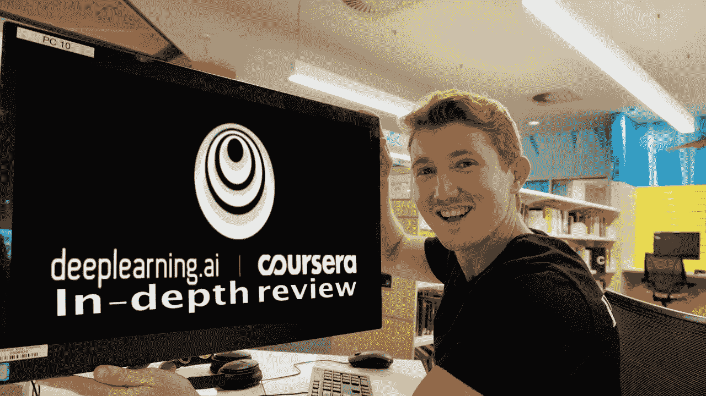
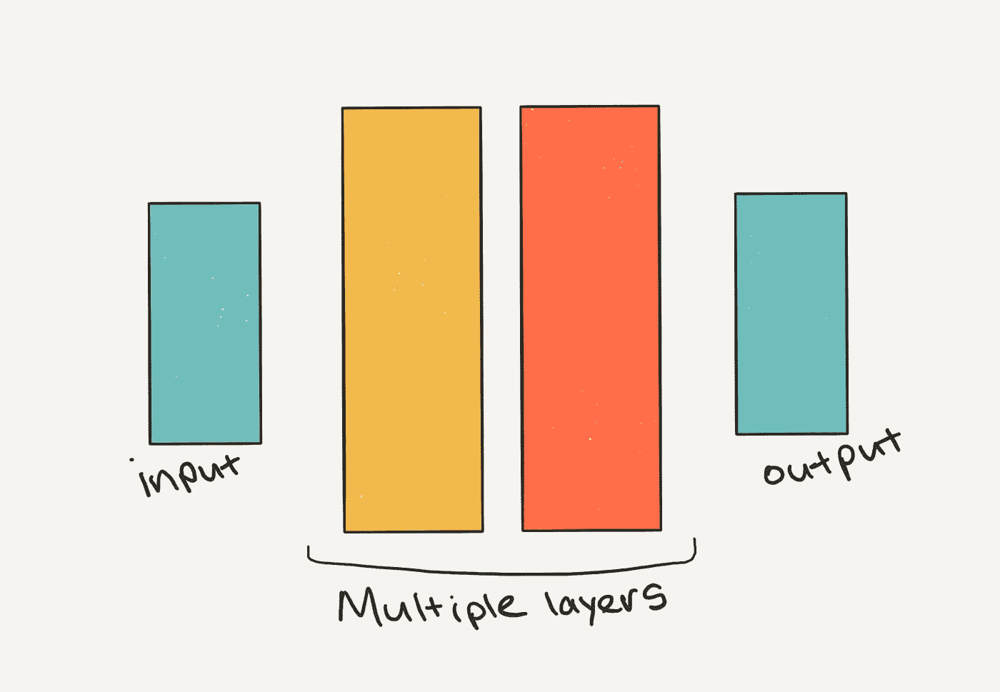
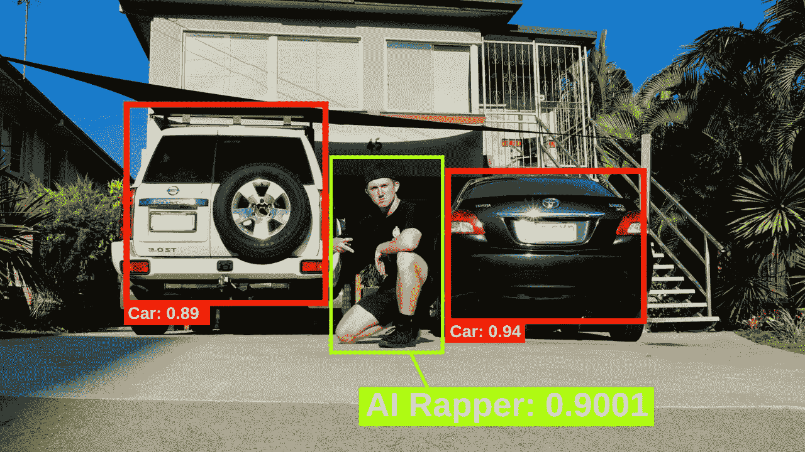
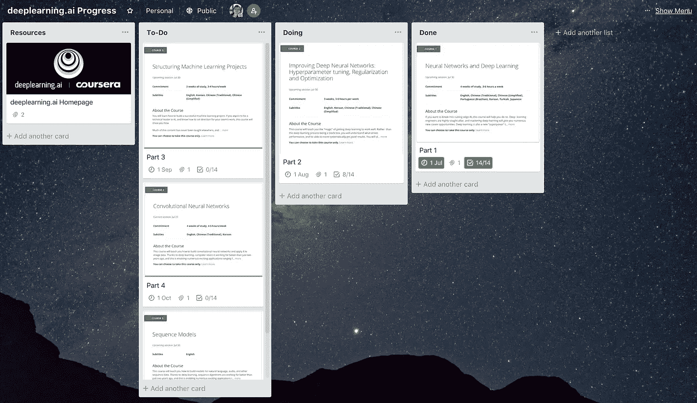
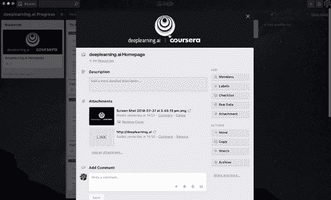
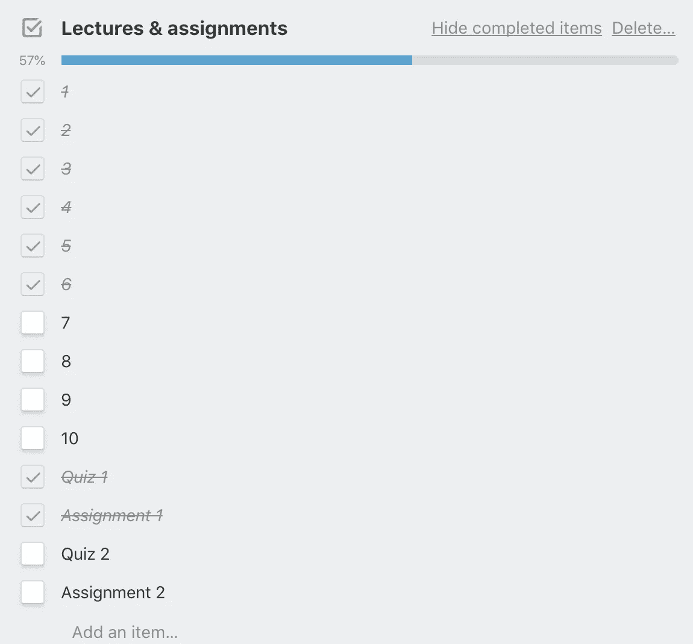
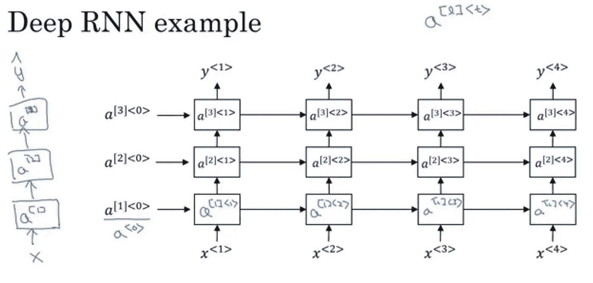

# 吴恩达深度学习(deeplearning.ai)专业化的深度回顾

> 原文：<https://towardsdatascience.com/an-in-depth-review-of-andrew-ngs-deeplearning-ai-speciliazation-99612991eb61?source=collection_archive---------2----------------------->

You can find a video version of this article on my [YouTube](https://youtu.be/ICMtmjRg0-Y).

所以你已经看到了最近关于人工智能(AI)如何改变一切的新闻。然而，AI 的想法由来已久。几十年来，像人类一样思考和说话的机器一直是电影和故事的灵感来源。

但是交易是什么？为什么这几年 AI 越来越好？

最近繁荣的主要驱动力之一是新技术与可靠的真实想法的融合。进入深度学习。

句子中的深度学习:从信息源中分层提取特征。

这个定义会根据你看的地方而变化，但是现在，它已经足够了。

深度学习利用多层神经网络将信息从输入源抽象到更结构化的输出源。这里的关键词是多层。

The ‘deep’ in deep learning refers to neural networks with multiple internal layers.

神经网络的想法从 20 世纪 40 年代就已经存在了。那么，为什么它们最近才出现如此大的回潮呢？

两个原因。

1.更多数据。
2。更强的计算能力。

对于深度学习系统来说，要从大量信息中收集切实的见解，需要有大量的信息(尽管人们正在积极努力解决这个问题)。世界各地都在通过文本、视频和音频转换成数据。我们在过去 5 年里记录的信息比人类历史上所有的信息都多。

好吧，酷。我们比以往拥有更多的数据。但是我家里有一书架的书，光坐在那里不会让我变得更聪明。我必须读它们来了解里面的内容。

这就是更多计算能力发挥作用的地方。我们的带宽有限。我们只能以一定的速度阅读。一本好书可能需要一个月或更长时间才能看完。

即使有地球上所有的人脑，我们也不可能处理我们收集的所有数据。

计算机来拯救我们！

计算硬件和可访问性的突破使得我们通过深度学习收集的所有额外信息变得比以往任何时候都更容易。使用我们的笔记本电脑，你和我现在可以加载到一个计算机仓库的接入点，所有这一切都可以在我们最喜欢的躺椅上舒适地进行。

突然之间，如果我们有一个大数据集，我们想从中收集见解，我们可以做过去需要 1000 个小时(可能几年)才能睡个好觉的事情(有些事情需要更长一点时间)。

好了，技术概述到此为止。所以你对学习深度学习感兴趣？好吧，这篇文章就是来帮忙的。这是目前你能获得的最好的深度学习课程之一的概述。

说真的，如果你想节省自己的时间，现在就去 [Coursera](http://bit.ly/CourseraDanielBourke) 搜索“深度学习”，选择[deep learning . ai specialization](http://bit.ly/dlcoursera)并加入其中。

还在吗？太好了。先说为什么。

# 为什么要报名 deeplearning.ai specialisation？

你可能已经体验过深度学习的一些结果了。也许自己都不知道。

脸书的照片标记系统使用它。它们的面部识别能力和人类一样好。

谷歌的所有(或接近)产品都使用它。

随着时间的推移，你的智能手机可能会使用它的一个版本来提高电池寿命。

优步用它来确保你在正确的时间和正确的司机联系。

但是随着我们关于世界的信息量的增加，深度学习的用例也在增加。

律师用它来找出如何对法律案件做出更好的决定，房地产经纪人用它来更好地给房子定价，医生用它来帮助他们做出更好的诊断。

课程讲师吴恩达将人工智能称为新的电力。

> 人工智能是新的电力。—吴恩达

目前，人工智能仅限于我们的智能手机和智能扬声器，但很快，它将被注入到我们与之互动的一切事物中。就像现在一样，大部分都在幕后。

deeplearning.ai 专业致力于教你最先进的技术以及如何自己构建它们。

如果你是一名软件开发人员，想要建立深度学习模型，或者你有一点编程经验，想要做同样的事情，那么这门课程就是为你准备的。

如果你只是想了解一些用例，以及它会如何影响你的行业，我会去别处看看。

深度学习和机器学习技能很受欢迎。如果你像我一样，正在寻求职业改变，本课程将帮助你踏上这条道路。

不管你有什么理由。开始前确保你有一个。把它写下来，当学习变得困难时，它会给你一些参考。它会提醒你为什么开始。

# 你需要从什么开始，你会学到什么？

你已经知道为什么了。你想建立影响世界的技术。或者您希望从您的业务数据中收集更好的见解。或者你想要一份新工作。太好了。这些都是合理的理由。

有理由是第一步。现在，你需要从什么开始？

## 前提条件是什么？

课程页面列出了编程经验以及数学和机器学习的基础知识作为先决条件。

Python 是这门课程和许多深度学习的首选语言。因此，如果你至少有几个月的 Python 经验，或者对其他编程语言和意识形态有经验，你应该处于一个很好的位置。

至于数学，除了高中，我从来没有上过数学课。如果我需要为这门课学习一些数学，我会去可汗学院。

课程中涉及的一些数学话题(全部链接到可汗学院)。

*   [统计和概率](https://www.khanacademy.org/math/statistics-probability)
*   [多变量微积分](https://www.khanacademy.org/math/multivariable-calculus)
*   [线性代数](https://www.khanacademy.org/math/linear-algebra)
*   [矩阵](https://www.khanacademy.org/math/precalculus/precalc-matrices)

在开始课程之前，这些我都没有深入了解。主要讲师吴恩达做了大量的数学解释，足以让你在课堂上开始。对于更深入的内容，你会发现上面的链接很有帮助。

至于机器学习经验，在开始之前，我已经完成了 Coursera 上的 [Andrew 的机器学习课程。100%需要吗？不。但它确实对一些概念有帮助。这个课程是免费的，但它是在 Matlab/Octave 中完成的，我发现这有点难，因为我已经习惯了 Python。](https://www.coursera.org/learn/machine-learning)

总的来说，如果你接受过高中数学教育，并且习惯于用 Python 编写几行函数，那么你已经有足够的东西可以开始了。

所以你准备好开始了。史诗。你实际上会学到什么？

这门课程分为五个部分。每一个都可以单独完成，但我发现它们是对彼此的很好的补充。

每个部分的时间分配在 2-4 周之间不等，建议每周学习 4-5 小时。我通常可以在一天 6-8 小时内完成一周的课程和评估，包括休息时间。也就是说，整个课程花了我大约 4-5 周的时间。

## 第 1 部分:神经网络和深度学习

本节介绍神经网络和深度学习的概念。有点像这篇文章的介绍，但有实际的代码和更多的深度。

您将从头开始构建自己的神经网络，并了解 Python 的数值库 NumPy。

白手起家是什么意思？

从头开始不需要使用任何框架。想象一个框架是别人写的代码的集合，它使你写的代码更小(更少的行)。一些流行的深度学习框架有 Keras、TensorFlow 和 PyTorch。每当你看到一篇标题为“11 行代码的最佳结果”的文章时，这篇文章可能会用到这些框架中的一个。

同样的 11 行代码在 NumPy/pure Python 中可能会变成 50 多行。第一部分将带您浏览完整的 50 行代码，以了解框架在幕后做了什么。

## 第 2 部分:改进深度神经网络:超参数调整、正则化和优化

深度学习通常被称为黑盒，意思是，你的模型学习东西，但你不太确定它是如何学习的。

这样做的问题是，如果你的模型不像你希望的那样工作，就很难改进它。

通过第 2 部分，您将了解常见的深度学习花絮，如超参数调整、初始化、优化、小批量梯度下降和正则化。

哇哦。慢点。这些术语是什么？

现在，只要把它们看作是最大限度地利用你的神经网络的方法。

您还将体验到将数据集分成训练集、验证集和测试集的感觉。训练集是你的神经网络学习的地方，验证和测试集是你可以测试你的网络对看不见的数据的鲁棒性。

第 1 部分从 Python 和 NumPy 开始，第 2 部分将向您展示最流行的深度学习库之一 TensorFlow。

好了，现在你知道了如何构建自己的深度神经网络，并且你对自己想要从事的一些项目有了一些想法。但是怎么做呢？第 3 部分支持你。

## 第 3 部分:构建机器学习项目

这一节很大，不是就长度而言，而是就实用性而言。能够构建机器学习系统是一回事，但能够在它们出现问题时进行诊断并加以改进以供未来使用则是另一回事。

第 3 部分介绍了两个案例研究。你被放在驾驶座上，决定如何使用深度学习系统来解决他们内部的问题。或者如何改进当前的深度学习系统。

> 我见过一些团队因为不理解本课程中教授的原则而浪费了几个月或几年的时间。—吴恩达

课程二和课程三对于 deeplearning.ai 专业来说是非常独特的。我还没见过很多其他课程像安德鲁那样谈论这些话题。

## 第 4 部分:卷积神经网络

当谈到计算机视觉时，卷积神经网络(CNN)是蜜蜂的膝盖。

深度学习带来了面部识别方面令人难以置信的进步(还记得脸书的面部识别吗？)，对 x 光报告和自动驾驶汽车系统(如特斯拉的 autopilot)进行分类。

在第一周，你将学习构成卷积神经网络的所有部分，然后进行编程作业，一步一步地构建你自己的模型。

在接下来的三周里，Andrew 将向您展示如何将您在第一周制作的 CNN 带入深度卷积模型(添加更多层)。正是从这里，你将接触到 Keras，一个建立在库 TensorFlow 之上的深度学习框架。

您将练习实现深度 CNN，例如 YOLOv2 算法来检测图像和视频中的对象。你甚至可以上传你自己的图片，我对此很感兴趣。

最后一个项目包括建立一个面部识别系统，只允许微笑的人进入你的家。如果你要举办一个派对，把这个变成现实可能会很方便。

在第 4 部分之后，您现在将知道如何让计算机看到。但是如果你有一堆音频数据呢？文字呢？CNN 可用于此，但序列模型是首选。

## 第 5 部分:序列模型

你在西班牙。你喝了太多西班牙葡萄酒。现在你需要找到一个浴室，但你不会说一句西班牙语。别担心，你在谷歌翻译中调出你的手机类型“请到洗手间”。你找到离你最近的人，指着你的手机。按下麦克风按钮，你的手机会显示“Bao por favor”。你的新西班牙朋友微笑着指给你看街道。

这整个互动是由葡萄酒和深度学习推动的。谷歌的翻译只是使用深度序列模型的产品的一个例子。

序列模型是一种接受发生在一个时间序列上的任何类型的数据的模型。想想一段时间内的音频波或一个句子中的单词。

您将开始逐步了解递归神经网络，这是一种流行的序列模型。然后你将使用长短期记忆细胞(LTSM 氏)来建立你自己的爵士乐即兴演奏模型。我从来不擅长演奏乐器，但由于深度学习，我能够教计算机为我演奏一首爵士乐独奏。

接下来，您将讨论自然语言处理(NLP)。您将学习如何用数字表示单词，然后如何训练递归神经网络来理解它们。计算机对数字的理解远胜于文字。

最后，Andrew 将带您了解 RNN 在语音识别和触发单词检测中的应用。这两项技术让我们可以说‘嘿，Siri，帮我找一下去最近的咖啡馆的方向。’“嘿，Siri”是触发词，将空气中的声波转化为你的 iPhone 可以理解的东西(一系列数字)的整个过程就是语音识别。

深度学习正在让计算机更好地识别语音和自然语言，但仍有很多改进的空间。与 Alexa 或 Google Home 的任何互动超过几个基本句子和对话就开始中断。这类问题使得 NLP 成为深度学习研究中最令人兴奋的领域之一。

## 评价

在每周讲座结束时，会有一个测验和与你上周所学内容相关的编程作业。

作业存放在 Jupyter 笔记本上，与课程所在的网页浏览器相同。Jupyter 笔记本是许多不同类型的编码项目的漂亮界面，尤其是数据科学和深度学习。在浏览器中完成评估的一个好处是评分几乎是即时的。你可以直接看到哪里出错了。

每项评估都有一个 80%的门槛。作业或测验不及格？没问题。每 8 小时你有 3 次提交的机会。如果你一直失败，休息一会儿再回来。

我不能分享每个作业中的代码，因为这违反了课程指南。没有代码可以在论坛或其他在线资源上共享。但是，您可以在论坛上使用伪代码(与您的问题类似但不会透露确切细节的代码)提问。

## 临时演员

对于专业化的前半部分，在每周课程结束时，会对深度学习超级英雄进行采访。安德鲁与 Yann LeCun 和 Geoffrey Hinton 等人坐下来讨论深度学习的现状和该领域的发展方向。这些采访是课程中我最喜欢的部分之一。

# 从哪里可以学到？

好吧，你知道为什么你想研究深度学习，你会学到什么，但你去哪里找到所有这些美丽的信息？

## 视频和讲座

所有的视频采访和讲座都可以在 [deeplearning.ai YouTube 频道](https://www.youtube.com/channel/UCcIXc5mJsHVYTZR1maL5l9w)上免费获得。

## 评估和课程论坛

要访问课程论坛和评估，您需要在 Coursera 上注册。

## 任何你想去的地方

在线学习的美妙之处在于你可以在任何地方学习。你需要一台能上网的电脑来进行评估，但你可以通过 Coursera 的移动应用程序离线观看视频讲座。

如果你是一个优秀的自学者，在线学习可能对你来说是完美的。我大部分时间都是一个人在寝室学习。但是，如果你更喜欢在一个小组中学习，你可能想说服你的一些朋友和你一起努力深入学习。

# 你什么时候能学会？

就像网飞一次发布整季一样，当你报名参加课程时，你不必等着获取资料。如果你想的话，你可以在 3 天的马拉松中完成。如果你这样做了，我会印象深刻，但是睡眠确实有助于巩固你所学的东西。

每隔几周就会有新的一批开始。你可以随时开始，但是如果你选择了其中的一天，你将会有全世界的人和你一起学习。这是有帮助的，因为这意味着论坛将会有人在你提问和回答的同时提问和回答。

# 怎么学？

你已经知道细节了。你知道什么时候开始，你知道你要学什么，现在你该怎么做？

这个没有正确的答案。对我有效的不一定对你有效。

我用特雷罗来追踪我的进度。Trello 是一个免费的应用程序，可以帮助你可视化你的计划。在开始上课之前，我在黑板上画出了课程表。

这是一个示例板的样子。

You can view a public version of the full board [here](https://trello.com/b/keUQEGEc).

在最左边，你会有你需要访问的资源。以下栏目包含您尚未完成的部分课程。

第 2 部分在*做*栏，因为这是你目前正在做的事情。第一部分被移到*完成*栏，因为你已经完成了。

Within each part, you have a list of the lectures and assessment items you need to complete and tick them off as you go.

Trello 帮助我想象我已经做了什么和我下一步需要做什么。预产期也有助于我与其他同学保持同步。

## 你必须遵循时间线吗？

不。你可以想多快就多慢。您将获得评估到期日的更新提醒，但这不是强制性的，它们更多的是为了让您受到鼓励并走上正轨。

从长远来看，我在大约 4-5 周内完成了课程，每周学习 3-4 天，每天学习 6-8 小时。

## 你如何获得帮助？

很可能你最终会在编程作业中遇到问题。或者也许你想知道更多关于某个话题。当这发生时，论坛是你的朋友。

由于该课程已经推出了几个月，因此有一堆问题已经得到了解答。快速搜索你的问题通常会发现一些学生有类似的问题。

如果你的问题没有得到回答，不要害怕寻求帮助。不管你认为你的问题有多没意义，它仍然是一个问题。过去认为我的问题很愚蠢阻碍了我的学习。现在我意识到，认为你的问题是愚蠢的，是愚蠢的。

当你问一个问题的时候，尽可能的清晰。大声读出来，看看有没有意义。我经常被一个问题困扰，忘记清楚地表达自己，这降低了我被帮助的机会。

## 这要花多少钱？

你可以在 YouTube 上免费观看所有的课程讲座。但是如果你在 Coursera 上注册完全专业化，费用是每月 64 澳元(约 47 美元)。

完整的专业化建议需要 4-5 个月完成，但因为我完成得更快，我只支付了 2 个月的费用(总共 128 澳元)。

Coursera 经常提供他们专业的 7 天试用期。所以你可以注册，看看这个课程是否适合你，如果不适合，取消你的订阅。

有资格的人可以得到经济资助。要获得这个，你必须在课程报名时[申请。](https://learner.coursera.help/hc/articles/209819033)

## 内容的结构是怎样的？

专业化分为五个部分。每一部分都分为 2-4 周的讲座和评估。

讲座时长从 5 分钟到 20 分钟不等，平均每次 10 分钟左右。

我发现我可以用 1.5 倍的速度在 3 小时内听完一周的课。

Andrew 使用 keynote 和画外音来教授内容。他在讲话时经常会在幻灯片上做注解，以进一步阐明观点。我真的很喜欢这种教学风格。

An example lecture slide. The blue writing was annotated alongside Andrew’s voice over.

## 你如何完成课程？

在每周内容的最后，有一个测验和一个编程作业。一旦你完成了某个部分的所有测验和编程作业，你就可以查看你的竞赛证书了。

完成专业化的所有五个部分意味着你将获得 Coursera 颁发的结业证书。这为你的 LinkedIn 个人资料增添了一个新的亮点。不要害怕分享，你为此付出了努力。

## 您可以在多长时间内访问这些内容？

无限期。这些讲座在 YouTube 上，我仍然可以在 Coursera 上访问这些讲座，尽管我不再为专业化付费了。

至于评估，我发现在完成一个编程任务后很难回到 Jupyter 笔记本上，所以我确保在工作时下载它们以供将来参考。

# 摘要

在我学过的所有课程中，这是迄今为止最好的课程之一。Andrew 是一名实践者，他在每堂课中编织他从经验中获得的知识。他参与了这场游戏，所以你知道你所学到的已经付诸实践了。

有时很困难。我遇到了很多障碍。但是有了论坛和互联网，我知道只要我有耐心，我就能解决问题。

我最喜欢的两个部分是第 3 部分和第 5 部分。任何与语言和交流有关的东西都让我着迷，所以第 5 部分是一个真正的亮点。很高兴在第 3 部分听到 Andrew 关于如何从机器学习项目中获得最大收益的内部智慧。

# 接下来呢？

哇哦。你做到了。恭喜你。你通过了课程。但你总是会的，只是需要一点努力。

一切似乎都很模糊。

“我真的学到什么了吗？”我问我自己当我完成的时候。

这门课程充满了知识。我发现自己在第 5 部分提出的问题在第 2 部分的讲座中得到了回答。但是没关系。我只记得我所学的 1%,所以回顾一些东西有助于在我的大脑中重建更强的联系。

现在我知道，当我遇到深度学习问题时，我可以参考讲座并刷新我的记忆。但我也知道这个领域发展的速度有多快，讲座中的内容可能会过时。这就是补充学习的用武之地。

我发现在完成 [deeplearning.ai 专业化](http://bit.ly/dlcoursera)的同时完成 Udacity 和 fast.ai 的其他一些深度学习课程非常有帮助。一个过程失败了，另一个过程就开始了，反之亦然。

完成专业化只是新的学习旅程的开始。

无论是将你新发现的技能应用到你自己的项目中，还是用它们来改进现有的项目，都意味着你可能需要不断学习。最终，你会遇到一些你必须自己寻找答案的事情。

如果你做了什么，一定要分享你的作品，写一篇博文，或者制作一个关于它的视频。这样你就可以练习交流你学到的技能，如果你的项目需要改进，其他人可以提供他们的建议。

活着是令人激动的时刻。人工智能被证明是历史上最具影响力的技术之一。深度学习是许多最新进展的一个重要原因，并且可能会有更多进展。

所以，如果你想加入并驾驭社会的潮流，那就去学习吧。或者更好的是，在 Coursera 上注册参加[deep learning . ai specialization，获得深度学习。](http://bit.ly/dlcoursera)

喜欢你读的书吗？如果你更喜欢视觉效果，我的 YouTube 上有一个[视频版本](https://youtu.be/ICMtmjRg0-Y)。

我完成了这门课程，作为[我自己的人工智能硕士学位](http://bit.ly/AIMastersDegree)的一部分。