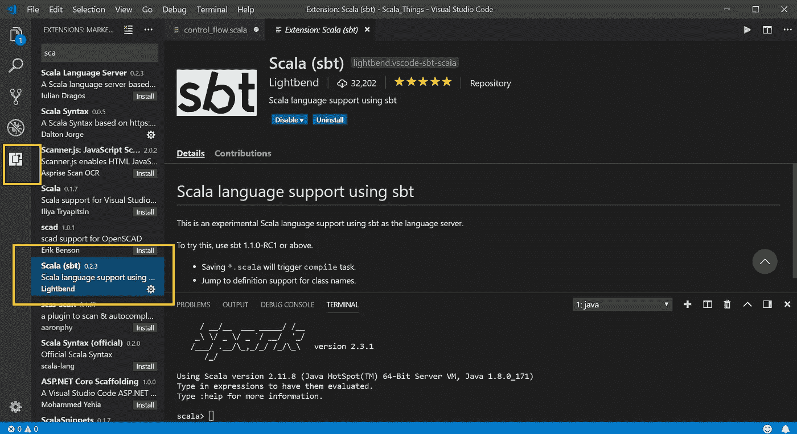

# Scala 简介

> 原文：<https://towardsdatascience.com/an-intro-to-scala-part-1-installation-set-up-and-hello-world-58a076a6818e?source=collection_archive---------13----------------------->


欢迎阅读我的 Scala 系列的第一篇文章。本教程旨在教授 Scala 入门知识，作为学习 Apache Spark 的前奏。

第一部分可以在 Medium 上找到，但是本指南的其余部分可以在 project Github 页面的以下链接中找到:

[Scala 简介](https://github.com/hjhuney/Intro-to-Scala/)

Scala 是一种面向对象的函数式编程语言。它与 Java 关系最密切，所以 Java 程序员应该在学习它上有所帮助。然而，Scala 被设计得更加简洁，并且具有函数式编程语言的特性。

Spark 是一个为大数据处理而设计的开源集群计算框架。它是用 Scala 写的。Spark 可以在 Python ( [PySpark](http://spark.apache.org/docs/2.2.0/api/python/pyspark.html) )和 R ( [SparkR 和 sparklyr](https://eddjberry.netlify.com/post/2017-12-05-sparkr-vs-sparklyr/) )中运行；不过，Spark 的[最佳性能](https://www.dezyre.com/article/why-learn-scala-programming-for-apache-spark/198)可以在 Scala 中实现。

# **其他资源**

我将提供一些其他来源作为替代和参考。何塞·波尔蒂利亚的 Udemy 课程非常棒，我的博客系列将大致遵循他的“ [Scala 和 Spark for Big Data and Machine Learning](https://www.udemy.com/scala-and-spark-for-big-data-and-machine-learning/)”课程的结构。如果你学视频格式比较好，我强烈推荐那个课程。

Twitter 的 Marius Eriksen 发表了“[有效的 Scala](http://twitter.github.io/effectivescala/) ”，可以在网上免费获得。这也是一个很好的资源。

如果你有 Python 背景，你也可以看看这本由 [Rob Story](https://github.com/wrobstory) 撰写的 [Python 转 Scala 电子书](https://wrobstory.gitbooks.io/python-to-scala/content/index.html)。它“短小精悍”,是所有 Pythoners 爱好者和 Pythonistas 的快速参考！

就这样，让我们开始吧！

# **下载 Scala**

第一个任务是下载 Scala。诚然，这可能是该过程中最具挑战性的部分之一。你需要经历几个步骤。如果你用的是 Windows 10，我推荐 YouTube 上的以下教程:

[如何在 Windows 10 上安装和设置 SBT+Scala](https://www.youtube.com/watch?v=haMI6uoMKs0)

你也可以自己决定是否要安装 SBT，因为还有其他运行 Scala 的选项(比如 [IntelliJ](https://www.jetbrains.com/idea/) )。

如果你使用的是基于 Linux 的操作系统，这里有一个类似的视频。我不能保证这一点，但它是由同一作者。

[如何在 Ubuntu 上安装和设置 SBT](https://www.youtube.com/watch?v=uYcSYCGITeU)

最后，这里是一些 Mac 指令。

[如何在 Mac 上安装 Scala](https://www.youtube.com/watch?v=OKiwZFMgnEk)

虽然我发现安装 Scala 比 Python 或 R 更难，但如果你正在努力，网上有很多资源。好消息是，对大多数人来说，这可能是最具挑战性的部分。

# **VS Scala 的代码**

我们将在早期的练习中使用命令提示符，但是我们最终将需要一个代码编辑器。我推荐 VS 代码，我将带你了解如何下载。

显然，您也可以自由使用其他选项，比如 Atom 或 Sublime。或者，如果你想使用一个完整的 IDE， [IntelliJ](https://www.jetbrains.com/idea/) 是一个不错的选择，并且有一个 [Scala 插件](https://plugins.jetbrains.com/plugin/1347-scala)适合它。

如果你想使用 VS 代码但还没有，在这里下载[。](https://code.visualstudio.com/)

一旦你的计算机上有了 VS 代码，启动它。在屏幕的左侧，您应该会看到一些图标。这些图标中的一个是各种各样的正方形。如果你悬停在它上面，它应该会显示“扩展”点击那个。



在搜索栏中，输入“Scala”。您应该会看到 Scala 的一些插件选项。转到“Scala (sbt)”安装。下面的截图突出显示了框和正确的插件。

你也可以考虑一些其他的 Scala 插件。我没有对其他插件做太多改动，但是我也下载了 Scala 语法插件。

无论如何，现在你应该已经配置好运行 Scala 文件了。

# **入门**

一旦你安装了所有的东西，你应该能够通过你的命令提示符运行 Scala。如果您成功地按照说明操作，并且正在运行 Windows，您可以打开命令提示符(快捷方式:在“开始”菜单的搜索框中输入“cmd ”)并键入:

```
spark-shell
```

这将在本地模式下启动 Spark，这是我们用来学习 Scala 基础知识的。

# **“Hello World”命令行提示**

让我们从简单的 print 语句开始。Scala 的打印语句看起来与 Java 相似，但更简洁一些。

```
println(“Hello world!”)
```

瞧啊。现在你已经运行了你的第一个 Scala 程序。

# **《你好世界》VS 代码**

在我们上完几课之前，我们不需要代码编辑器，但是如果你也想确保 Scala 在 VS 代码中正常工作，那么进入 File -> New File。将文件另存为“hello_world.scala”。在文件中输入正确的代码，然后保存。

现在打开你的终端:查看->终端。正如我们在命令提示符中所做的那样，在终端中输入“spark-shell”。要运行该程序，请输入:

```
:load hello_world.scala
```

有了这个，你应该得到你的打印输出。

# **第二部**

这就是第 1 部分。第 2 部分介绍了数据类型；在[项目 Github repo](https://github.com/hjhuney/Intro-to-Scala#part-2-data-types) 查看。