# 贝叶斯推理导论数学冒险

> 原文：<https://towardsdatascience.com/an-introduction-to-bayesian-inference-a-mathematical-venture-9919a2937f28?source=collection_archive---------8----------------------->

嗨，这是我的第一篇博客文章，所以如果我在写文章时犯了任何错误或错过了任何惯例，请在评论中告诉我。(关于内容的礼貌反馈总是被邀请的:)。

在统计领域，统计学家和数据科学家采用了两种著名的方法来解决现实世界的预测问题，这两种方法被称为频率主义方法和贝叶斯方法。

黄金贝叶斯法则告诉我们:

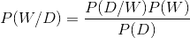

其中 W 是统计模型的参数，该模型对数据 d 后面的分布进行建模。基于相同的表示，让我们来定义什么是频率主义者和贝叶斯方法？

频率主义方法是一种统计学家认为存在一个参数的真实值，概率是根据频率来定义的方法。遵循贝叶斯方法的统计学家认为，参数没有真实值，但参数本身遵循特定的分布，只有数据是真实的。

在本文中，我们将关注线性回归的贝叶斯版本。那么，现在让我们正确定义贝叶斯推理。

贝叶斯推断是一种方法，其中我们定义了具有某种分布的某些参数的先验。这种分布可以认为相当于我们手中已有的问题知识。使用与我们的问题相关的数据进一步更新该分布，这导致了称为后验分布的新分布。后验分布是我们对问题的先验知识和来自数据集的数据的组合。

但是，当大多数人都在使用频率主义方法时，我们为什么还需要贝叶斯方法呢？这个问题的答案如下:

1.  让我们定义一个参数θ的先验，我们想要计算 *P( 99 < θ < 100)* 这只能在贝叶斯方法的情况下计算，因为频率主义方法给我们一个点估计。
2.  与频率主义方法相比，贝叶斯方法提供了更多的概括。
3.  贝叶斯方法避免了过度拟合。

等等，那我们为什么不用贝叶斯？，让我们先了解一下贝叶斯方法的缺点。

1.  我们必须假设一个先验，这可能是一个非常费力的过程，因为我们假设的分布可能不接近原始分布。这导致后验估计的扰动。
2.  在一些甚至大多数情况下，后验概率的计算是难以处理的(这是其不受欢迎的主要原因之一)

现在让我们推导出我们最喜欢的线性回归的贝叶斯版本。

让我们先设置问题:

等式 1 表示可观察到的数据集为 *xᵢ* 和 *yᵢ.*

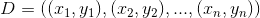

Equation 1

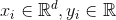

Equation 2

如果 *W* 代表回归模型的权重，而 *Y₁、Y₂,…、Yₙ* 是由参数 w 给出的独立随机变量，则 Yᵢ可以定义为:

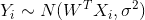

Equation 3\. Description of Random Variable Y.

我们的权重(参数)的先验分布由下式给出:

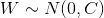

Equation 4\. Description of the distribution of W.

其中 *C* 是协方差矩阵，因为 w 是多元高斯，因为 Xᵢ是 *d* 维的。

我们希望每个维度上的权重相互正交，因此我们可以将其定义为 b⁻ I，其中 b 是多元精度矩阵。精度只不过是方差的倒数和 b > 0。

因此，我们的权重遵循以下分布:

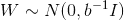

Equation 5\. Refined notation for distribution of W

类似地，我们也可以精确地表示 Y 的分布:

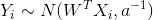

Equation 6\. Refined notation for distribution of Y

其中 a⁻ = σ

在贝叶斯推理中，我们估计后验分布 P(W/D ),它由下式给出:

在哪里

P(D/W)是可能性。

P(W)是先验分布。

P(D)就是证据。

现在首先让我们计算最大似然估计(MLE 实际上是一种解决线性回归的常用方法，因为它假设参数有一个给定的真值) :

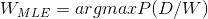

Equation 7\. Computation of MLE estimate of the weights

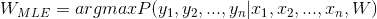

Equation 8.

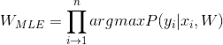

Equation 9.

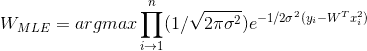

Equation 10.

现在，如果我们将所有项相乘，那么我们可以将乘积转换为指数幂的和，这将更容易处理。

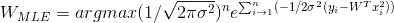

Equation 11

我们现在将把它转换成矢量化符号，因为这样更容易计算梯度。考虑以下变化:

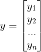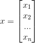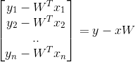

因此，等式 11 中的求和变为:

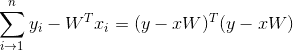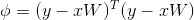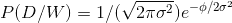

Equation 12

为了估计等式 12 的最大值，需要找到它对变量 w 的导数。通过最小化ϕ.可以获得相同的结果现在我们来计算ϕ对 w 的导数

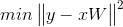

Equation 13

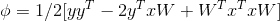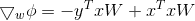

∇ϕ称为梯度向量，它包含 w 的每一维的偏导数

当我们设置∇ϕ = 0 时，可以找到等式 13 的最小值。

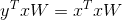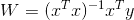

(xᵗx)⁻ xᵗ被称为伪逆，它非常接近 x⁻，因为 x 是一个 *n* x *d* 矩阵，因此它是不可逆的。所以，我们不能用等式 14。

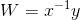

Equation 14

让我们通过计算黑森∇ ϕ w.r.t 对 w 的二阶导数来验证这一点

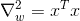

Equation 15

为了使一阶导数成为最小值，Hessian 矩阵应该是半正定矩阵。矩阵 xᵗx 确实是半正定的，因为它本质上是可逆的，并且是其内部元素的平方。因此，我们确信我们已经找到了极小点。

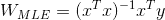

最后，现在我们可以根据权重预测 y 的值，如下所示:

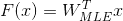

我们已经完成了可能性的计算，让我们继续计算后验分布。

我们知道，使用 P(D/W)和 P(W ),我们可以通过对可能性和先验的乘积进行积分来获得 P(D)。因此，我们可以丢弃来自后验计算的证据，因为它将是一个常数。

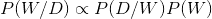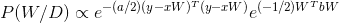

这里，左边的指数对应于似然，第二个指数对应于先验(我已经从两个等式中删除了乘数常数，因为它们是正的，不会影响计算。)

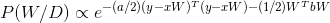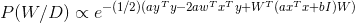

Equation 16

我们希望我们的后验概率本质上是多元高斯的。也许通过比较等式 17 和等式 16 的参数，我们可以很容易地估计该高斯函数的参数。

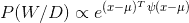

Equation 17

通过比较这些等式，我们得到:

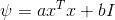

Equation 18

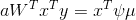

Equation 19

因此，根据等式 19，我们可以获得均值等式:

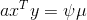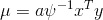

现在我们有了后验分布的均值和精度(方差),但在得出结论之前，我们需要验证ψ的逆是否存在。

从 MLE 计算中我们知道 xᵗx 是半正定的，现在我们加上 bI，其中 b 是协方差矩阵，因此它默认是半正定的。所以这使得ψ是半正定的，因此是可逆的。

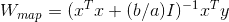

MAP 估计表明它本质上是 MLE 和先验的结合。先验的增加有助于映射 n 避免过度拟合，因此这被称为正则化参数。

最后，我们结束了计算参数的 MAP 估计。现在，我们可以用它来预测任意 x 值的 y 值。在下一篇文章中，我们将讨论朴素贝叶斯算法的贝叶斯版本。我希望这篇文章是有帮助的。

谢谢你。