# 贝叶斯推理导论——数学冒险(二)

> 原文：<https://towardsdatascience.com/an-introduction-to-bayesian-inference-a-mathematical-venture-part-2-6e66be32c54?source=collection_archive---------21----------------------->

在本文的最后一篇文章中，我们探讨了贝叶斯线性回归模型。在本文中，我们将探索贝叶斯朴素贝叶斯分类任务背后所涉及的数学。

> 在我们开始之前，我想重复一下在朴素贝叶斯的解决方案的推导过程中采用的最重要的假设，即**特征是相互独立的**。

首先，我们将设置问题，然后一步一步地复习数学。

分类问题的目标是计算 p(y|x，D ),其中 D 是数据集，x 是数据实例，y 是标签。

设置:

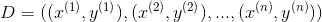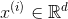

这里，xʲ是有限集合 a 上的 d 维向量，yʲ可以从集合{1，2，…，m}中取值

为了建模我们的数据实例，我们选择随机变量 Xʲ和 Yʲ.

我们在 *x* 和 *y* 之间的联合分布可以进一步细分为:

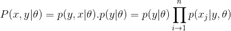

现在我们将逐一定义这些概率分布。

由于 y 是分类性质的，我们必须将 p(y|θ)定义为由θ参数化的分类分布。

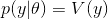

其中 V(y)是由每个标签的向量的每个维度上的概率组成的向量。

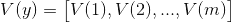

p(x|y，θ)也将被定义为 d 维分类分布，因为 x 具有 d 维。

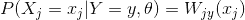

这种分类分布将是矩阵 W，其中每行对应不同的 y 值，列对应 x 中的不同特征

其中 W(Xⱼ = xⱼ,Y = y)将代表 p(Xⱼ = xⱼ|Y = y，θ)的概率。

矩阵的行总计为 1，因为它表示完整的分类概率分布。

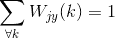

为了进行贝叶斯分析，我们需要定义联合对{V，wⱼ}的先验，因为它们充当我们分布的参数。

现在，我们将定义参数 V 和 w。简化计算的明智选择将用于共轭。因此，我们将采用狄利克雷分布，因为我们的参数 X，Y 本质上是分类的。

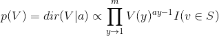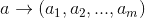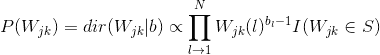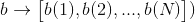

我们的最终目标是根据给定的数据集 D. From Bayes 规则计算新数据点所属的类:

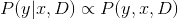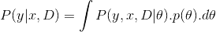

因为我们知道每个观察值都是相互独立的，所以我们可以将 x，y，D 之间的联合分布分成 x，y 和 D，给定θ。

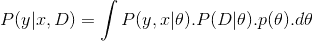

现在，我们可以利用朴素贝叶斯算法的条件独立性假设来进一步拆分公式。

让我们用它们实际的公式来代替这些符号。

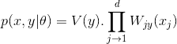

在未来，我们知道我们需要将这种分类分布与先验的狄利克雷分布相结合，以获得我们的狄利克雷后验分布。因此，我们想把分类分布写成狄利克雷分布，这样就很容易把它们结合起来。

标准的狄利克雷分布采用以下形式:

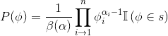

Equation 1.

其中，ϕ是 m 维参数向量，α是分布的另一个参数，也是向量，β是β函数，根据等式 1 中的公式，最后，s 是概率单纯形。其中 s 是在ϕ.的这 m 个参数上定义的一组 PMF 你可以探究在这个[环节](https://en.wikipedia.org/wiki/Simplex)中，一个概率单纯形究竟是什么。

回到我们的问题，我们希望我们的分类分布有一种格式，这样我们可以很容易地把它转换成狄利克雷后验分布。

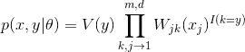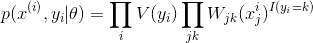

这些方程看起来很完美，因为我们有类似于狄利克雷先验的基。如果你对这个等式感到有点害怕，请保持冷静，因为我们很快就会很好地利用它。

现在，让我们为我们的先验做同样的事情。

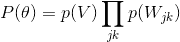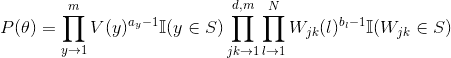

让我们把 P(x，y，d)的各项一个一个相乘，让我们用 p(θ)和 p(xʲ,yⱼ|(θ)).开始

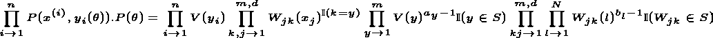

我们知道狄利克雷分布和分类分布是共轭的，因此我们将相应的共轭项组合在一起。

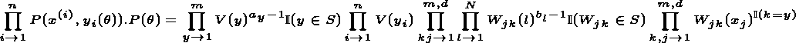

相似的术语已经组合在一起，但是由于不同的产品指数，我们不能直接将它们相乘，因此我们需要稍微改变它们。

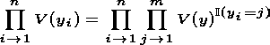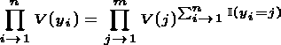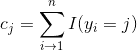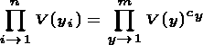

Cⱼ基本上是 yⱼ拥有标签 j 的次数

c 现在变成了一个向量，类似于狄利克雷分布中的向量。这使得我们更容易将这两者结合起来，现在剩下要做的就是将它们结合在一起。

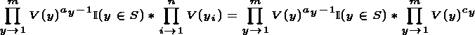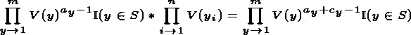

让我们对另一对也做同样的事情。

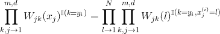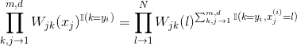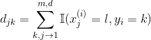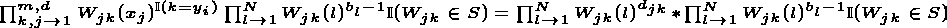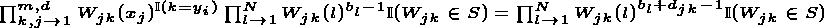

现在一切都设置好了，我们只需要将这些项与 P(x，y|θ)相乘

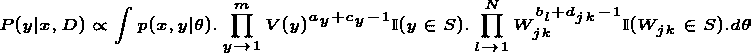

在哪里

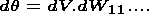

我们可以看到一些漂亮的方程，它们是共轭的结果。

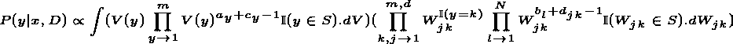

在上面的等式中，我们可以看到第一个括号是分布 V(y)的预期值，第二个括号也有些相同，但让我们更深入地研究一下，因为它可能会让人难以理解。

如果 y 等于第二个括号中的 k，则它成为分布 W 的期望值，但是当 y 不等于 k 时，则指数变为 1，因此，底数变为 1，使其成为仅分布值上的积分，从而将其积分为 1。

所以，我们现在要做的就是把这些项替换成它们的期望值。结果是:

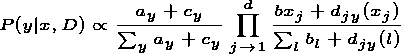

我知道这可能有点脱离网格，但我会尝试在一篇完全不同的文章中添加期望值的计算，因为数学已经变得疯狂了。

最后的等式是:

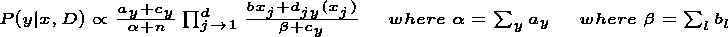

为了计算这个类，我们需要将数据实例的值代入等式，并找到它的 argmax。

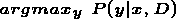

因此，我们成功地推导了几乎所有需要达到这一点的步骤。我希望这至少在某些情况下对你有用。下一篇文章将是关于贝叶斯隐马尔可夫模型，我也将写一篇小文章解释狄利克雷分布的期望值的计算。谢谢你。