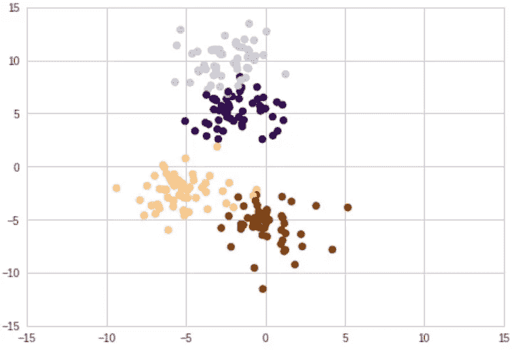
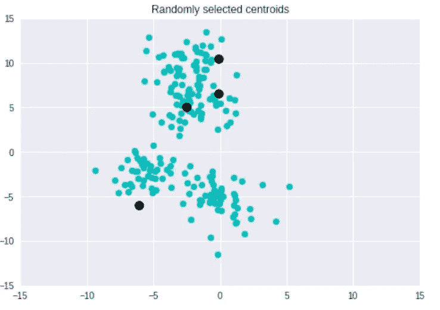
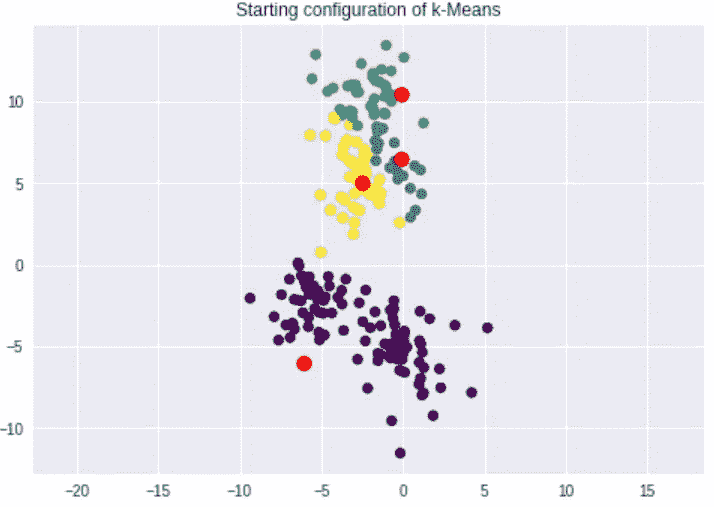
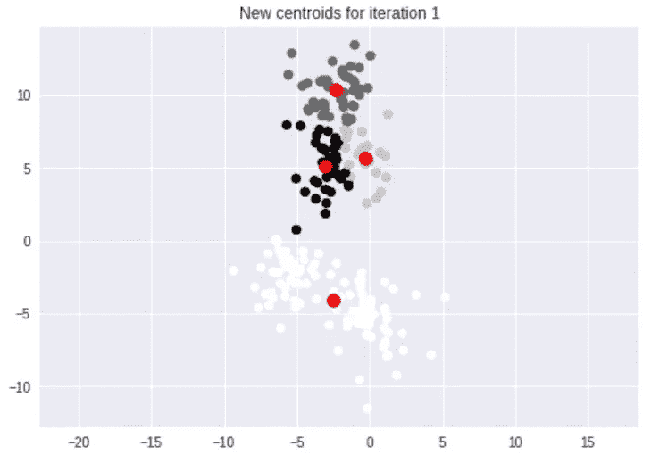
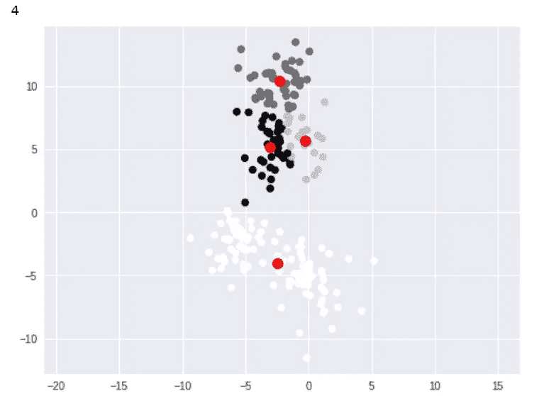
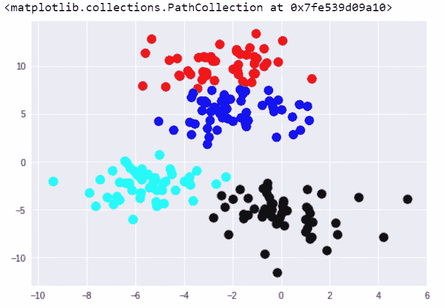
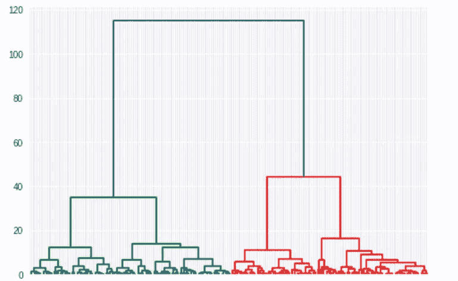
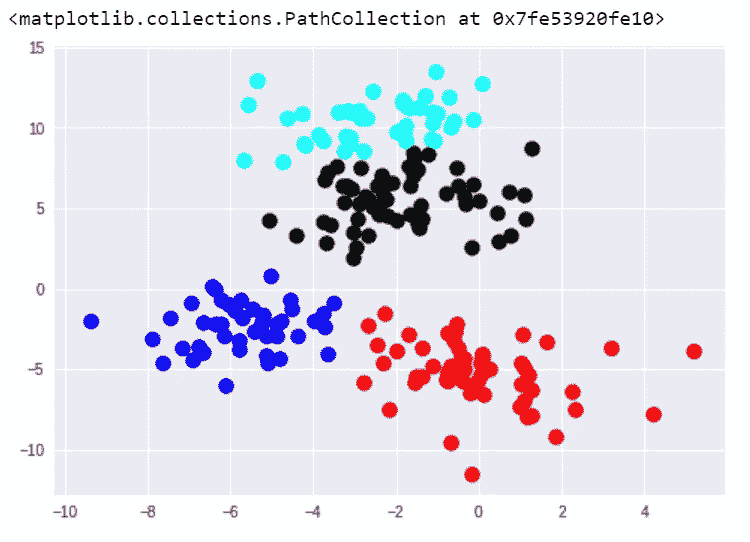

# Python 中聚类算法的介绍

> 原文：<https://towardsdatascience.com/an-introduction-to-clustering-algorithms-in-python-123438574097?source=collection_archive---------1----------------------->

在数据科学中，我们经常会思考如何利用数据对新的数据点进行预测。这被称为“监督学习”然而，有时我们不想“做预测”,而是想将数据分成不同的类别。这被称为“无监督学习”

为了说明这种差异，假设我们在一家大型披萨连锁店工作，我们的任务是在订单管理软件中创建一个功能，为客户预测送货时间。为了实现这一点，我们得到了一个数据集，其中包含过去几次交付的交付时间、行驶距离、星期几、时间、现有员工和销售量。根据这些数据，我们可以预测未来的交货时间。这是监督学习的一个很好的例子。

现在，让我们假设比萨饼连锁店想要向顾客发送有针对性的优惠券。它想把顾客分成 4 类:大家庭、小家庭、单身人士和大学生。我们获得了之前的订购数据(例如订单规模、价格、频率等)，我们的任务是将每个客户归入四个类别之一。这将是“无监督学习”的一个例子，因为我们不做预测；我们只是把顾客分成几组。

聚类是最常用的无监督学习形式之一。在本文中，我们将探讨两种最常见的聚类形式:k-means 和层次聚类。

**了解 K-Means 聚类算法**

让我们看看 k-means 聚类是如何工作的。首先，让我给你介绍我的好朋友，blobby 即 Python 的 [sci-kit 学习库](http://scikit-learn.org/stable/)中的 [make_blobs](http://scikit-learn.org/stable/modules/generated/sklearn.datasets.make_blobs.html) 函数。我们将使用 make _ blobs 创建四个随机集群来帮助我们完成任务。

```
# import statements
from sklearn.datasets import make_blobs
import numpy as np
import matplotlib.pyplot as plt# create blobs
data = make_blobs(n_samples=200, n_features=2, centers=4, cluster_std=1.6, random_state=50)# create np array for data points
points = data[0]# create scatter plot
plt.scatter(data[0][:,0], data[0][:,1], c=data[1], cmap='viridis')
plt.xlim(-15,15)
plt.ylim(-15,15)
```

你可以在下面看到我们的“斑点”:



我们有四个彩色集群，但是上面的两个集群和下面的两个集群有一些重叠。k-means 聚类的第一步是选择随机质心。因为我们的 k=4，我们需要 4 个随机质心。下面是它在我的实现中从头开始的样子。



接下来，我们取每个点，找到最近的质心。度量距离的方法有很多种，我用的是[欧氏距离](https://en.wikipedia.org/wiki/Euclidean_distance)，可以用 Python 中的 [np.linalg.norm](https://docs.scipy.org/doc/numpy/reference/generated/numpy.linalg.norm.html) 来度量。



现在我们有了 4 个集群，我们找到了集群的新的质心。



然后，我们再次将每个点匹配到最近的质心，重复这个过程，直到我们不能再改进聚类。在这种情况下，当过程结束时，我得到了下面的结果。



请注意，这些集群与我最初的集群有些不同。这是随机初始化陷阱的结果。本质上，我们的起始质心可以决定我们的聚类在 k 均值聚类中的位置。

这不是我们想要的结果，但是解决这个问题的一个方法是使用 [k-means ++算法，](http://theory.stanford.edu/~sergei/papers/kMeansPP-soda.pdf)它提供了更好的初始播种，以便找到最佳的聚类。幸运的是，这是在我们将在 Python 中使用的 k-means 实现中自动完成的。

**在 Python 中实现 K-Means 聚类**

要在 Python 中运行 k-means，我们需要从 sci-kit learn 中导入 [KMeans。](http://scikit-learn.org/stable/modules/generated/sklearn.cluster.KMeans.html)

```
# import KMeans
from sklearn.cluster import KMeans
```

注意，在文档中，k-means ++是缺省的，所以我们不需要为了运行这个改进的方法而做任何改变。现在，让我们在 blobss 上运行 k-means(这些 blob 被放入一个名为“points”的 numpy 数组中)。

```
# create kmeans object
kmeans = KMeans(n_clusters=4)# fit kmeans object to data
kmeans.fit(points)# print location of clusters learned by kmeans object
print(kmeans.cluster_centers_)# save new clusters for chart
y_km = kmeans.fit_predict(points)
```

现在，我们可以通过在 matplotlib 中运行以下代码来查看结果。

```
plt.scatter(points[y_km ==0,0], points[y_km == 0,1], s=100, c='red')
plt.scatter(points[y_km ==1,0], points[y_km == 1,1], s=100, c='black')
plt.scatter(points[y_km ==2,0], points[y_km == 2,1], s=100, c='blue')
plt.scatter(points[y_km ==3,0], points[y_km == 3,1], s=100, c='cyan')
```

瞧啊。我们有 4 个集群。请注意，k-means++算法比我在示例中运行的普通 ole' k-means 做得更好，因为它几乎完美地捕捉到了我们创建的初始聚类的边界。



K-means 是最常用的聚类形式，因为它速度快且简单。另一种非常常见的聚类方法是层次聚类。

**实现凝聚层次聚类**

凝聚层次聚类在一个关键方面不同于 k-means。我们不是选择一些聚类，从随机的质心开始，而是从数据集中的每个点作为一个“聚类”开始然后我们找到最近的两个点，并把它们组合成一个簇。然后，我们找到下一个最近的点，这些成为一个集群。我们重复这个过程，直到我们只有一个巨大的星团。

在这个过程中，我们创建了一个树状图。这是我们的“历史”你可以看到我们下面的数据点的树状图，以了解正在发生的事情。



树状图标出了每个聚类和距离。我们可以使用树状图找到我们选择的任何数字的聚类。在上面的树状图中，很容易看到第一个集群(蓝色)、第二个集群(红色)和第三个集群(绿色)的起点。这里只有前 3 个是用颜色编码的，但是如果你看树状图的红色一边，你也可以发现第 4 个集群的起点。该树状图一直运行，直到每个点都是它自己的单独聚类。

让我们看看凝聚层次聚类在 Python 中是如何工作的。首先，让我们从 [scipy.cluster.hierarchy](https://docs.scipy.org/doc/scipy/reference/cluster.hierarchy.html) 和 [sklearn.clustering](http://scikit-learn.org/stable/modules/clustering.html) 中导入必要的库。

```
# import hierarchical clustering libraries
import scipy.cluster.hierarchy as sch
from sklearn.cluster import AgglomerativeClustering
```

现在，让我们创建我们的树状图(上面我已经向您展示过了)，确定我们需要多少个聚类，并保存这些聚类中的数据点以绘制它们的图表。

```
# create dendrogram
dendrogram = sch.dendrogram(sch.linkage(points, method='ward'))# create clusters
hc = AgglomerativeClustering(n_clusters=4, affinity = 'euclidean', linkage = 'ward')# save clusters for chart
y_hc = hc.fit_predict(points)
```

现在，我们将像使用 k-means 算法一样，使用 matplotlib 查看我们的聚类。

```
plt.scatter(points[y_hc ==0,0], points[y_hc == 0,1], s=100, c='red')
plt.scatter(points[y_hc==1,0], points[y_hc == 1,1], s=100, c='black')
plt.scatter(points[y_hc ==2,0], points[y_hc == 2,1], s=100, c='blue')
plt.scatter(points[y_hc ==3,0], points[y_hc == 3,1], s=100, c='cyan')
```

结果如下:



在这种情况下，k-means 和层次聚类之间的结果非常相似。然而，情况并非总是如此。一般来说，凝聚层次聚类的优点是它往往会产生更准确的结果。缺点是，与 k-means 相比，层次聚类更难实现，并且消耗更多的时间/资源。

**延伸阅读**

如果你想了解更多关于聚类的知识，我强烈推荐 George Seif 的文章“数据科学家需要了解的 5 种聚类算法”

**其他资源**

1.  G.詹姆斯，d .威滕等人。艾尔。*统计学习简介*，第十章:无监督学习，[链接](http://www-bcf.usc.edu/~gareth/ISL/ISLR%20Seventh%20Printing.pdf) (PDF)
2.  安德里亚·特雷维尼奥，*K 均值聚类介绍*，[链接](https://www.datascience.com/blog/k-means-clustering)
3.  基里尔·叶列缅科，*机器学习 A-Z* (Udemy 课程)，[链接](https://www.udemy.com/machinelearning/learn/v4/overview)