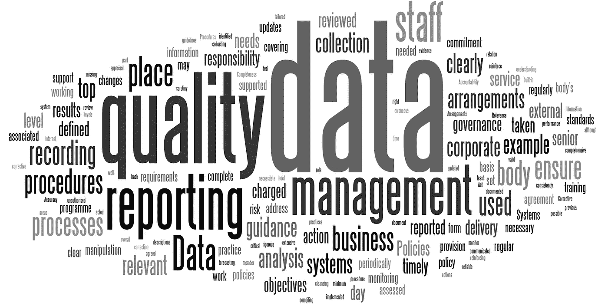

# 数据质量简介

> 原文：<https://towardsdatascience.com/an-introduction-to-data-quality-951cc6fe0274?source=collection_archive---------11----------------------->

Image Reference: [www.datapine.com](http://www.datapine.com/blog/data-quality-management-and-metrics/)

# 1.什么是数据质量？

数据质量有许多定义，一般来说，数据质量是对有多少数据可用并适合其服务环境的评估。

许多因素有助于衡量数据质量，例如:

*   *数据一致性*:违反数据集定义的语义规则。[1].
*   *数据准确性:*当数据库中存储的数据值与真实值相符时，数据是准确的。[1]
*   *数据唯一性*:针对特定字段、记录或数据集，衡量系统内部或跨系统存在的多余重复。[2]
*   *数据完整性:*数据集合中存在的值的程度。[1]
*   *数据及时性:*数据的年龄在多大程度上适用于手头的任务。[3]

其他因素也可以考虑[4]，如可用性、易操作性、可信度和流通性。

# 2.为什么数据质量很重要？

提高数据质量是一个关键问题，因为数据被视为组织内所有活动的核心，数据质量差会导致报告不准确，从而导致不准确的决策和经济损失。

# 3.如何提高数据质量？

通过以下方式提高数据质量:

1.  培训员工
2.  实施数据质量解决方案

# 3.1.培训员工

在考虑实现数据质量解决方案之前，首先我们必须尽量减少由组织内的人工活动(如数据输入)导致的数据质量问题。此外，所有开发人员和数据库管理员都必须对业务流程有很好的了解，并且在开发和设计数据库和应用程序时必须参考统一的模式。[5]

# 3.2.实施数据质量解决方案

提高数据质量的另一种方法是实施数据质量解决方案。数据质量解决方案是一套执行质量任务的工具或应用程序，例如:

*   知识库创建:知识库是用于信息传播的机器可读资源。[6]
*   重复数据删除:根据一组语义规则删除重复的信息。
*   数据清理:从值中删除不需要的字符和符号。
*   数据分析:是检查从现有信息源(例如数据库或文件)获得的数据并收集关于该数据的统计数据或信息摘要的过程。[7]
*   数据匹配:数据匹配描述了使用记录链接和实体解析等技术来比较两组收集的数据。[8]

# 4.流行的数据质量解决方案

在这一部分，我将展示一些市场上最流行的数据质量解决方案。

# 4.1.IBM Infosphere 信息服务器

IBM InfoSphere Information Server 是一个市场领先的数据集成平台，它包括一系列产品，使您能够理解、清理、监控、转换和交付数据，并通过协作来弥合业务和 IT 之间的差距。InfoSphere Information Server 提供了大规模并行处理(MPP)能力，以提供一个高度可伸缩和灵活的集成平台，处理所有大小数据量。

InfoSphere Information Server 使您能够灵活地满足您独特的信息集成需求——从数据集成到数据质量和数据治理——以便为您的任务关键型业务计划(如大数据和分析、数据仓库现代化、主数据管理和影响点分析)提供可信的信息。[9]

*   首页:[https://www.ibm.com/analytics/information-server](https://www.ibm.com/analytics/information-server)

# 4.2.信息数据质量

Informatica 数据质量为内部或云中的所有业务应用程序的所有利益相关者、项目和数据域提供值得信赖的数据。[10]

*   首页:[https://www . informatica . com/products/data-quality/informatica-data-quality . html](https://www.informatica.com/products/data-quality/informatica-data-quality.html)

# 4.3.Oracle 数据质量

Oracle Enterprise Data Quality 为交易方和产品数据提供了一种完整的、同类最佳的方法，可生成与应用程序集成的可信主数据，从而提高业务洞察力。[11]

*   首页:[http://www . Oracle . com/us/products/middleware/data-integration/enterprise-data-quality/overview/index . html](http://www.oracle.com/us/products/middleware/data-integration/enterprise-data-quality/overview/index.html)

# 4.4.Microsoft 数据质量服务

SQL Server 数据质量服务(DQS)是一种知识驱动的数据质量产品。DQS 使您能够建立一个知识库，并使用它来执行各种关键的数据质量任务，包括纠正、丰富、标准化和重复数据删除。DQS 使您能够通过使用参考数据提供商提供的基于云的参考数据服务来执行数据清理。DQS 还为您提供集成到其数据质量任务中的分析，使您能够分析数据的完整性。[12]

*   首页:[https://docs . Microsoft . com/en-us/SQL/data-quality-services/data-quality-services](https://docs.microsoft.com/en-us/sql/data-quality-services/data-quality-services)

# 4.5.Melissa 数据质量

自 1985 年以来，Melissa 一直在提供具有广泛功能的企业数据质量工具，包括数据分析和标准化、清理、丰富、链接和重复数据删除。我们的使命是为组织提供一流的解决方案，提供可信、可靠、准确的信息，以获得更好的洞察力。[10]

*   首页:[https://www.melissa.com/uk/data/data-quality](https://www.melissa.com/uk/data/data-quality)

# 4.6.数据质量

Talend 的企业数据质量工具可以分析、清理和屏蔽数据，同时监控任何格式或大小的数据质量。重复数据消除、验证和标准化为访问、报告、分析和运营创建了干净的数据。利用外部来源丰富数据，用于邮政验证、业务识别、信用评分信息等。[13]

*   主页:【https://www.talend.com/products/data-quality/ 

# 4.7.Syncsort Trillium 软件领先

Syncsort 的 Trillium 云提供了行业领先的企业数据质量解决方案，具有 Syncsort 管理的强化安全 colud 环境的部署便利性和运营灵活性。[14]

*   首页:【http://www.syncsort.com/en/About/Trillium-Software 

# 4.8.SAS 数据质量

SAS 数据质量软件使您能够提高数据的一致性和完整性。当您提高数据质量时，您就提高了分析结果的价值。

SAS 数据质量软件支持各种数据质量操作。数据质量操作采用预定义的规则，这些规则适用于数据的特定上下文(如姓名或街道地址)。数据质量操作的例子包括大小写、解析、模糊匹配和标准化。[15]

*   首页:[https://www.sas.com/en_us/software/data-quality.html](https://www.sas.com/en_us/software/data-quality.html)

# 5.参考

*   [1] C. Batini，C. Cappiello，C. Francalanci，A. Maurino，“数据质量评估和改进的方法学”， *ACM 计算调查(CSUR)，*第 41 卷，第 16 页，2009 年。
*   [2] D. McGilvray，“质量数据和可信信息的十个步骤”，*麻省理工学院信息质量行业研讨会，* 2008。
*   [3] R. Y. W. a. D. M. Strong，“超越准确性:数据质量对数据消费者意味着什么”，*《管理信息系统杂志》，*第 12 卷，第 5-33 页，1996 年。
*   [4] Sidi Fatimah，Shariat Panahy，Payam Hassany，Lilly Suriani Affendey，Marzanah A. Jabar，Hamidah Ibrahim，Aida Mustapha，“数据质量:数据质量维度调查”，载于*Proceedings-2012 International Conference on Information Retrieval and Knowledge Management，CAMP’12*，2012 年。
*   [5] Herzog，Thomas N .，scheuren，f.j，winkler，“什么是数据质量，我们为什么要关心”，*《工业工程与管理学报》，*第 4 卷(2)，第 2 版，第 1–9 页，2016 年。
*   [6] M. Rouse，“知识库”，TechTarget，2007 年第 3 期。【在线】。可用:【https://searchcrm.techtarget.com/definition/knowledge-base.】T4【2018 年 9 月 12 日访问】。
*   [7]“数据剖析”，维基百科，[在线]。可用:[https://en.wikipedia.org/wiki/Data_profiling.](https://en.wikipedia.org/wiki/Data_profiling.)【2018 年 9 月 12 日接入】。
*   [8]“什么是数据匹配？，“Techopedia，[在线]。可用:[https://www.techopedia.com/definition/28041/data-matching.](https://www.techopedia.com/definition/28041/data-matching.)【2018 年 9 月 12 日获取】。
*   [9]“IBM 信息服务器”，IBM，[在线]。可用:[https://www.ibm.com/analytics/information-server.](https://www.ibm.com/analytics/information-server.)【2018 年 9 月 12 日接入】。
*   [10]“最佳数据质量软件”，G2Crowd，[在线]。可用:[https://www.g2crowd.com/categories/data-quality.](https://www.g2crowd.com/categories/data-quality.)【2018 年 9 月 12 日获取】。
*   [11]“Oracle 企业数据质量”，Oracle，[在线]。可用:[http://www . Oracle . com/us/products/middleware/data-integration/enterprise-data-quality/overview/index . html](http://www.oracle.com/us/products/middleware/data-integration/enterprise-data-quality/overview/index.html.)【2018 年 12 月 9 日访问】。
*   [12]“数据质量服务”，微软，2013 年 10 月 12 日。【在线】。可用:[https://docs . Microsoft . com/en-us/SQL/data-quality-services/data-quality-services？view=sql-server-2017。](https://docs.microsoft.com/en-us/sql/data-quality-services/data-quality-services?view=sql-server-2017.)【2018 年 12 月 9 日接入】。
*   [13]“数据质量”，塔伦德，[在线]。可用:[https://www.talend.com/products/data-quality/.](https://www.talend.com/products/data-quality/.)【2018 年 9 月 12 日接入】。
*   [14]“Trillium 软件”，Syncsort，[在线]。可用:[http://www.syncsort.com/en/About/Trillium-Software.](http://www.syncsort.com/en/About/Trillium-Software.)【2018 年 9 月 12 日接入】。
*   [15]“SAS 数据质量和数据质量服务器”，SAS，[在线]。可用:[http://support . SAS . com/software/products/data qual/index . html](http://support.sas.com/software/products/dataqual/index.html.)【2018 年 9 月 12 日访问】