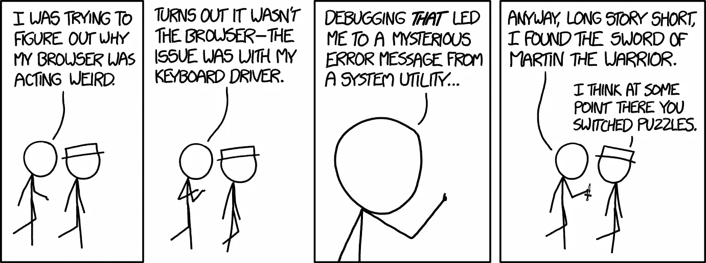
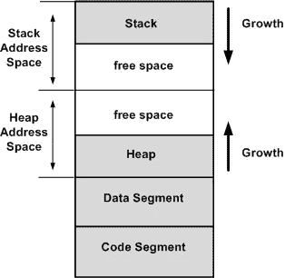
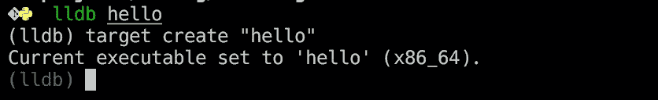
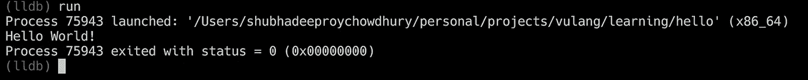
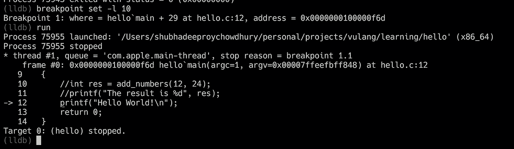
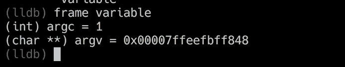
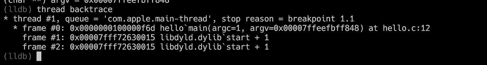
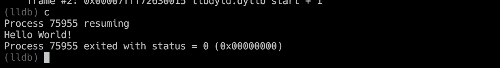

# 调试介绍(用 C 和 lldb 编写)，第一部分

> 原文：<https://towardsdatascience.com/an-introduction-to-debugging-in-c-and-lldb-part-i-e3c51991f83a?source=collection_archive---------4----------------------->



Source — [https://xkcd.com/1722/](https://xkcd.com/1722/)

# 什么是调试？

“bug”这个词(以及由此而来的“debugging”)是如何理解我们(计算机程序员)所联想到的含义的，还不完全清楚。这可能要归功于哈佛大学马克 2 号计算机中传说中的飞蛾，也可能是在比 T1 更早的时候创造的。无论起源是什么，作为程序员，我们都有关于调试的故事要分享。有时它们很悲伤，有时它们描述了几个令人疲惫不堪的小时，但大多数时候它们都有一个快乐的结局。但是我们都有一个共同点，我们会遇到调试。几乎每天。因此，在开始调试之前，让我们先定义一下它是什么。

我建议调试的定义如下—

*调试是一个开发人员(他可能是也可能不是他要调试的代码的作者)使用各种可用的工具，努力改变以前编写的代码的一部分，以消除在编译(或语法检查)时没有发现的错误(换句话说，在特定条件下在运行时出现的错误)的过程。*

听起来很酷吗？还是恐吓？如果是后者，那么你应该继续读下去。也许这个小帖子终究会帮到你。

# 不同类型的调试

人们有许多不同的方法来执行调试。但是在列出它们之前，我们需要理解*任何调试过程主要(大部分时间)由两个主要活动组成。第一——调查程序执行的不同阶段不同变量的值，第二——检查控制流的方向(我们是否进入了“if”块？“while”循环中的“break”语句到达了吗？…)*

*   **打印语句** —在运行代码时，使用“Print”(或“printf”或“echo”或任何等效的东西)来输出一些值。这可能是开始调试任何东西的最简单的方法。这也是最笨拙和费时的方法。它之所以笨拙，是因为一旦我们完成了，我们很容易在代码中留下所有那些(或其中的一部分)打印语句，导致不干净的代码(在一些非常罕见的情况下，在生产中破坏它)。).这很费时间，因为我们必须编写所有的打印语句，然后在程序执行的时候监视它们。
*   **使用日志记录** —这种方法也是基于文本的，就像打印一样，但是有很多优点。我们实际上可以将结构化消息从我们的程序转发到日志管理平台，然后使用这些工具在文本语料库中执行各种搜索以收集必要的信息，而不是仅仅将“stdout”作为输出机制(对于打印来说)。这是一个非常有效的方法。对于任何严肃的生产应用程序来说，日志记录都是必不可少的。但是它也有自己的局限性。我们仍然必须在代码中手工编写所有的日志语句(如果不需要的话就删除它们)，而且我们也不能(在大多数情况下)窥视程序执行的内幕。
*   **交互式(符号)调试器**——如果你曾经使用过类似“gdb”(或“ipdb”或“pydb”或“lldb”之类的东西，那么你就知道我在说什么。至于其他的，在你自己的开发机器中有可用的工具，这些工具在运行时以一种交互的方式给你一个强大的访问程序的权限，并且让你在一段运行的代码上执行非常低级(和高级)的调查。这种调试的优点是，您不需要做任何额外的工作来开始调试代码。你只需启动调试器并指向可执行文件，瞧！您正在运行一个程序，但是您也拥有实时调查(如果需要，甚至更改)它的所有权力。酷！

# 关于虚拟内存的几句话

在我们使用调试器进行任何严肃的调试之前，我们需要理解操作系统是如何给程序分配内存的。有一篇由[彼得·萨尔兹曼](http://dirac.org/linux/gdb/01-Introduction.php)撰写的关于交互式调试的精彩(可能是最好的)介绍，我的帖子只是它的前几页的一个小摘要(由于 lldb 的缘故，有一点额外的内容)，但是我仍然会花时间说几句关于 VM 的话。任何感到好奇的人请跟随彼得的指南(和他在那里提到的链接)。

当一个程序启动时，操作系统会在主内存(ram)中分配一块内存，以便该进程可以运行。这被称为*虚拟内存空间。*它是一种复杂的高级机制，涉及操作系统和 CPU 的内存管理单元(MMU)。我们不需要详细讨论这个问题。但是我们确实需要知道，在 VM 内部，有一块内存被分配给两个不同的数据结构所使用的进程。栈和堆(除了一些为其他东西保留的其他块)。它看起来像下面这样—



scource — [https://open4tech.com/concept-heap-usage-embedded-systems/](https://open4tech.com/concept-heap-usage-embedded-systems/)

任何由我们或我们正在使用的库分配的动态内存都将位于堆内部。堆栈由“帧”组成。每一帧代表一个函数调用。当一个新的函数被调用时，一个新的帧被插入到栈顶。如果您将分配的 VM 想象为主内存中的一个垂直内存块，那么随着进程的进行，堆栈向下增长，堆向上增长(如上图所示)。

当我们调试时，我们将需要框架的概念。

# 正在调试

*我将展示与 lldb 相关的命令，并在最近的 MacBook Pro 中执行(预装了*[*llvm*](https://llvm.org/)*)。* `*cc*` *和* `*lldb*` *的版本都在*之后

```
Apple LLVM version 9.1.0 (clang-902.0.39.2) (result of cc --version)lldb-902.0.79.7 (result of lldb --version)
```

我们先写一个你能想象到的最简单的 C 程序。我将使用“vim”作为编辑器。你可以用任何你想要的东西。

```
vim hello.c
```

进入编辑器后，请复制粘贴(或键入)以下代码—

```
#include<stdio.h>int main(int argc, char* argv){ printf("Hello World!\n"); return 0;
}
```

保存并退出编辑器，然后执行以下操作

```
cc -g --std=c99 -Wall hello.c -o hello
```

下面是我们为编译器使用的一些标志的描述

*   `-g`它告诉我们的编译器在输出文件中嵌入调试信息(例如符号表)
*   `--std=c99`我们正在使用的 C 语言标准
*   `-Wall`捕捉所有的警告

为了查看我们所做的*实际上运行了*，我们可以尝试下面的方法

```
./hello
Hello World!
```

到目前为止一切顺利！现在让我们启动调试器。为此，请使用以下命令

```
lldb hello
```

如果一切正常，它将显示如下内容—



这是交互式调试器的提示。在我们的例子中是`lldb`

引用 lldb 文档中的话，`gdb`中的命令是“自由形式的[”。然而，lldb 已经努力使命令标准化。`lldb`中的命令遵循以下模式—](https://lldb.llvm.org/tutorial.html)

`<noun> <verb> [-options [option-value]] [argument [argument...]]`

这里的`noun`代表你正在努力工作的对象。这可以是`thread`或`frame`或类似的。而`verb`就是实际的命令。所以与`gdb`不同，要查看当前堆栈的所有帧，你必须输入`thread backtrace`(对于`gdb`，它只是简单的`backtrace`)。如果您在最开始输入这个命令，您将得到“错误:无效进程”。这是因为尽管我们已经用可执行文件的名称启动了调试器(在我们的例子中是`hello` ),但我们实际上并没有请求运行它。所以下面是您应该运行的第一个命令— `run`。它将产生如下输出—



我们已经成功地在调试器中运行了可执行文件。但是！我们对此没有任何控制。它跑了。成功了。最后以 0 状态退出。这里没有魔法。所以，让我们创造一些。我们将使用`breakpoint set`命令。断点是源文件中的特定代码行，调试器将在那里暂停执行，并给我们一个交互提示，以便与正在运行的进程混合:)(`-l 10`表示我的源文件中我想暂停执行的那一行。对你来说，行号可以不同)



注意这里的魔力。*我们已经在原始源文件的行号后面设置了断点，但是我们正在加载和运行可执行文件，然而调试器不知如何连接它们，并在正确的代码行挂起。*在此阶段，我们可以检查当前框架中的不同变量及其值。为了检查变量，我们这样做



瞧啊。我们有与当前框架相关的所有变量及其类型和值。现在是`thread backtrace`的时候了——



正如我们所见，我们的函数调用`main`位于堆栈的顶部。但这不是我们唯一的框架。我们有一些其他的与函数调用相关的帧，但是我们没有做。这些是在运行时加载的动态库。

最后，由于我们没有什么要进一步研究的(我们正在运行一个非常简单的代码)，我们需要知道如何从进程暂停的地方恢复它。我们如何前进？嗯，有两个命令。简称`step`或`s`，简称`continue`或`c`。它们之间的区别在于，`step`只是执行下一条指令，然后再次挂起。这是一种在运行过程中一步一步的旅程，而`c`将执行所有的指令，直到遇到下一个断点或过程结束。这里我们不想单步执行流程，所以我们使用`c`,因为没有更多的断点，流程将结束运行。



这是第一部分的结尾。我们在这里学习了调试的基础知识。但是我们还没有进行任何真正的调试。我们将在第二部分看到这一点。

如果你喜欢这篇小文章，请尽情鼓掌。这将鼓励我多写这样的文章。也请大家分享评论。他们非常有帮助:)

第二部分见。调试愉快！