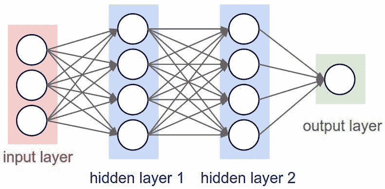
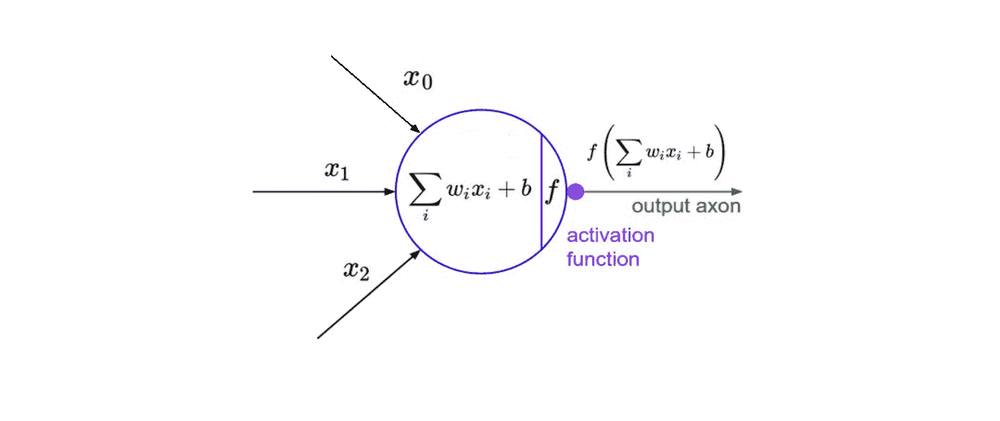
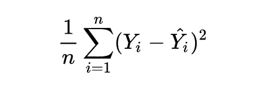
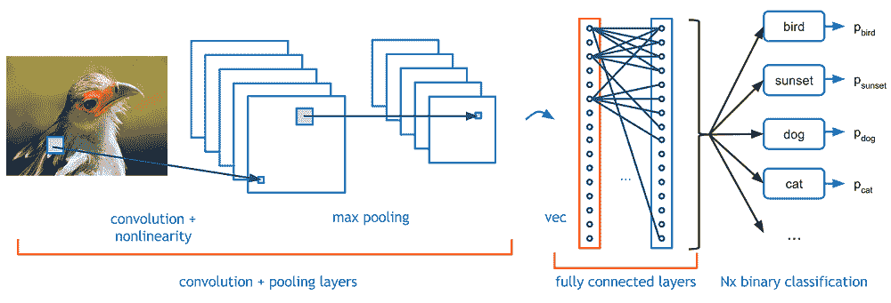

# 深度学习导论

> 原文：<https://towardsdatascience.com/an-introduction-to-deep-learning-af63448c122c?source=collection_archive---------3----------------------->

近年来，深度学习已经成为科技界的一个热门词汇。我们似乎总是在关于人工智能的新闻中听到它，然而大多数人实际上并不知道它是什么！在这篇文章中，我将揭开深度学习这个时髦词汇的神秘面纱，并提供它如何工作的直觉。

# **建立直觉**

一般来说，深度学习是一种机器学习方法，它接受一个输入 X，并用它来预测一个输出 y。例如，给定过去一周的股票价格作为输入，我的深度学习算法将尝试预测第二天的股票价格。

给定输入和输出对的大型数据集，深度学习算法将尝试最小化其预测和预期输出之间的差异。通过这样做，它试图学习给定输入和输出之间的关联/模式——这反过来允许深度学习模型归纳到它以前没有见过的输入。

作为另一个例子，假设输入是狗和猫的图像，输出是这些图像的标签(即输入图片是狗还是猫)。如果输入具有狗的标签，但是深度学习算法预测猫，那么我的深度学习算法将学习到我的给定图像的特征(例如，锋利的牙齿、面部特征)将与狗相关联。

# **深度学习算法如何“学习”？**

深度学习算法使用一种叫做神经网络的东西来寻找一组输入和输出之间的关联。基本结构如下所示:

神经网络由输入层、隐藏层和输出层组成，所有这些层都由“节点”组成。输入层接受数据的数字表示(例如，具有像素规格的图像)，输出层输出预测，而隐藏层与大多数计算相关。

我不会在数学上太深入，但是信息是通过上面显示的函数在网络层之间传递的。这里需要注意的要点是可调权重和偏差参数——在上面的函数中分别用 w 和 b 表示。这些对于深度学习算法的实际“学习”过程是必不可少的。

在神经网络将其输入一直传递到其输出之后，网络通过称为损失函数的东西来评估其预测(相对于预期输出)的好坏。例如，“均方误差”损失函数如下所示。

*Y hat 代表预测，而 Y 代表预期产量。如果同时使用输入和输出批次，则使用平均值(n 代表样本数)*

我的网络的目标最终是通过调整网络的权重和偏差来最小化这种损失。在通过梯度下降使用被称为“反向传播”的东西时，网络回溯通过它的所有层，以在损失函数的相反方向上更新每个节点的权重和偏差——换句话说，反向传播的每次迭代应该导致比以前更小的损失函数。

在不进行证明的情况下，网络的权重和偏差的持续更新最终会将其变成一个精确的函数逼近器——一个对输入和预期输出之间的关系进行建模的函数逼近器。

# 那么为什么叫“深度”学习呢？

深度学习的“深度”部分是指创建深度神经网络。这是指具有大量层的神经网络-通过添加更多的权重和偏差，神经网络提高了逼近更复杂函数的能力。

# 结论和要点

深度学习最终是一个广阔的领域，比我描述的要复杂得多。对于不同的任务，存在各种类型的神经网络(例如，用于计算机视觉的卷积神经网络，用于 NLP 的递归神经网络)，并且远远超出了我所介绍的基本神经网络。

*上图:一个卷积神经网络*

即使你不记得这篇文章的所有内容，这里也有一些要点:

*   深度学习指的是深度神经网络
*   深度神经网络发现一组输入和输出之间的关联
*   反向传播是用来更新神经网络参数的东西

深度学习的含义是疯狂的。虽然我给出了相当简单的应用示例，如图像分类和股票价格预测，但最终还有更多！视频合成、自动驾驶汽车、人类水平的游戏人工智能等等——所有这些都来自深度学习。如果你有兴趣了解更多，我写了一篇关于使用深度强化学习玩 doom 的文章——点击下面的链接查看！

[深度强化学习的厄运](https://medium.com/@james.liangyy/playing-doom-with-deep-reinforcement-learning-e55ce84e2930)