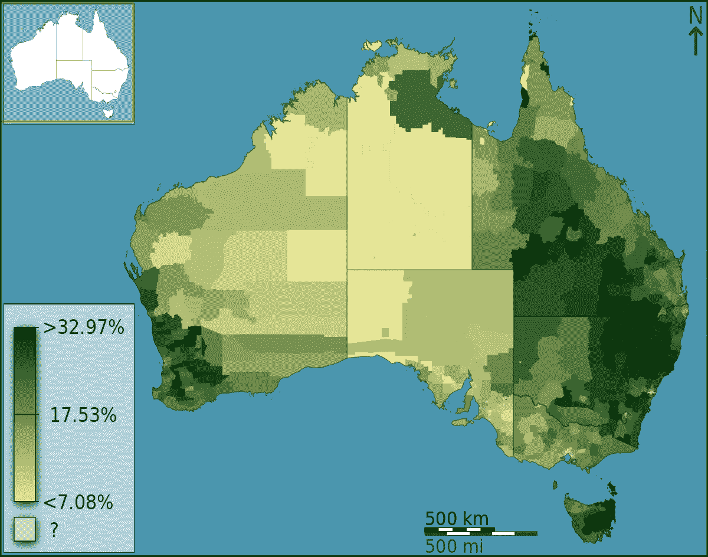
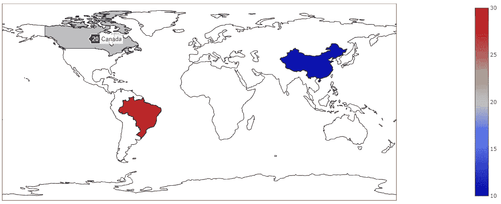
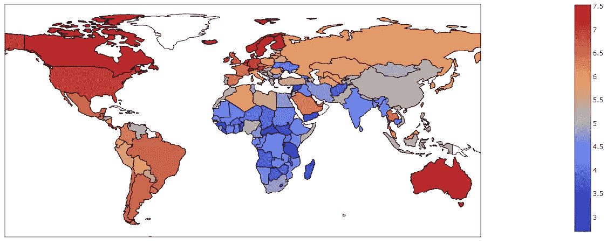
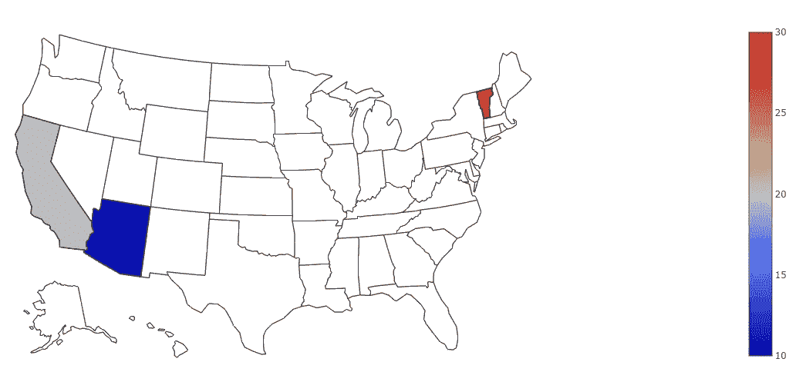
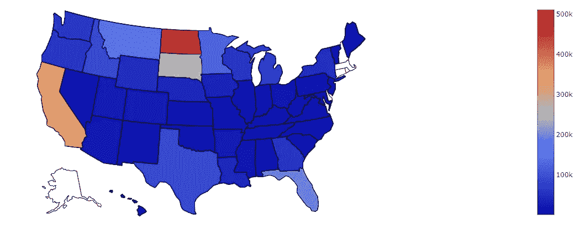
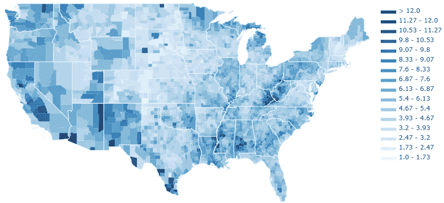
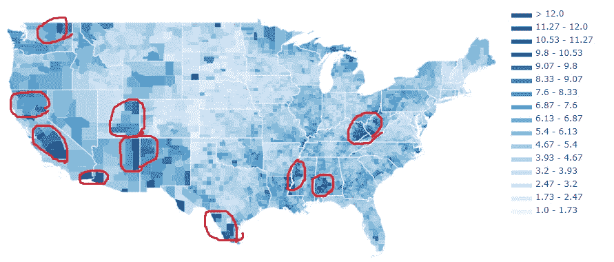

# 地理数据可视化导论

> 原文：<https://towardsdatascience.com/an-introduction-to-geographical-data-visualization-3486959cd4b8?source=collection_archive---------4----------------------->



Choropleth map from [Wiki](https://en.wikipedia.org/wiki/Choropleth_map)

我一直对那些成功地将数据与地理信息结合起来的数字印象深刻。它们是我能想到的最漂亮的数据可视化的例子，你只需扫一眼就能看到的信息令人震惊。

这类图形被称为 choropleth 地图，根据[维基](https://en.wikipedia.org/wiki/Choropleth_map)的定义:

> 专题地图，其中区域根据地图上显示的统计变量(如人口密度或人均收入)的测量值成比例地进行着色或图案化

把它们想象成考虑了地理边界的热图。

我们可以使用 plotly 库制作 choropleth 地图。

我们将从一个简单的例子开始。我们进口如下:

```
**import** plotly **as** py
**import** plotly.graph_objs **as** go
```

我们希望创建一个“数据”变量，并将其传递到 go 中。Figure()方法生成 choropleth 图。

先来一张大千世界的地图吧！

我们将“数据”变量定义如下:

```
data = dict (
    type = 'choropleth',
    locations = ['China','Canada','Brazil'],
    locationmode='country names',
    colorscale = ['Viridis'],
    z=[10,20,30])
```

“数据”变量是一个字典。我们把它的“类型”定义为 choropleth。在“位置”中，我们给出了各个国家的名称，在位置模式中，我们告诉我们计划通过国家名称指定位置的方法。最后，我们指定色阶和我们希望分配给每个国家的值。

你可以在线或离线运行 plotly，为了避免创建帐户，我将离线运行它。

我们通过以下方式生成图像:

```
map = go.Figure(data=[data])
py.offline.plot(map)
```

得到一张世界地图。请注意，当我们将鼠标悬停在一个国家上方时，我们会得到它的名称和指定值。



我们可以通过绘制每个国家的幸福指数，让这张地图变得更有趣，而不是给几个国家任意赋值。

使用来自 [2017 年世界幸福报告](https://www.kaggle.com/unsdsn/world-happiness)的数据，我们可以使用下面的代码创建这个数字

```
**import** plotly **as** py
**import** plotly.graph_objs **as** go
**import** pandas **as** pddf = pd.read_csv("2017.csv")

data = dict (
    type = 'choropleth',
    locations = df['Country'],
    locationmode='country names',
    colorscale = ['Viridis'],
    z=df['Happiness.Score'])

map = go.Figure(data=[data])
py.offline.plot(map)
```

生成下图。无需任何统计分析，我们可以自信地说，一些最幸福的国家在欧洲和北美，而一些最不幸福的国家集中在非洲。这就是地理可视化的力量。



现在让我们对美国做一些深入的可视化。

我们首先更改“数据”变量，以便 locationmode 指定美国各州。接下来，我们添加一个“布局”变量，允许我们自定义地图的某些方面。在这种情况下，我们告诉地图集中在美国，而不是显示整个世界，这是默认的。如果你愿意，你也可以关注亚洲、欧洲、非洲、北美或南美。

综上所述，我们使用以下代码为亚利桑那州、加利福尼亚州和佛蒙特州赋值:

```
data = dict (
    type = 'choropleth',
    locations = ['AZ','CA','VT'],
    locationmode='USA-states',
    colorscale = ['Viridis'],
    z=[10,20,30])

lyt = dict(geo=dict(scope='usa'))
map = go.Figure(data=[data], layout = lyt)
py.offline.plot(map)
```

要获得这张地图:



我们现在可以开始做一些有趣的事情了。

众所周知，世界正在经历蜜蜂数量的快速下降。这太糟糕了，因为这将意味着可爱的蜂蜜坚果麦片早餐的终结。我们可以获得每个州的蜂群数量，并使用我们的绘图技能来查看哪些州拥有最多的蜂群。

```
df = pd.read_csv("honeyproduction.csv")

data = dict (
    type = 'choropleth',
    locations = df['state'],
    locationmode='USA-states',
    colorscale = ['Viridis'],
    z=df['numcol'])

lyt = dict(geo=dict(scope='usa'))
map = go.Figure(data=[data], layout = lyt)
py.offline.plot(map)
```

看起来北达科他州拥有最多的殖民地，紧随其后的是加利福尼亚州，在这个国家的其他地方还有很大的改进空间。我们还遗漏了阿拉斯加和右上角几个州的一些数据，但这是该数据集的局限性。



我们已经谈到了幸福和蜂群。现在只剩下失业了。

让我们更深入地研究，而不是看国家或州，我们可以绘制每个州的县。我们将从[这里](https://raw.githubusercontent.com/plotly/datasets/master/laucnty16.csv)得到每个县 2016 年的失业率数据。

每一个县都可以用一个 5 位数的 FIP 号码来唯一识别。

我们从导入开始，注意这次我们导入了 plotly.figure_factory

```
**import** plotly **as** py
**import** plotly.figure_factory **as** ff
**import** numpy **as** np
**import** pandas **as** pd
```

接下来我们阅读 FIP 的数据和失业率

```
df=pd.read_csv("https://raw.githubusercontent.com/plotly/datasets/master/laucnty16.csv")
df ['FIPS'] = df['State FIPS Code'].apply(**lambda** x: str(x).zfill(2)) + df['County FIPS Code'].apply(**lambda** x: str(x).zfill(3))
fips = df['FIPS'].tolist()
values = df['Unemployment Rate (%)'].tolist()
```

由于失业有许多不同的值，我们不希望我们的色标试图代表 1000 个不同的值，我们将其限制为 12 种颜色，如下所示

```
colorscale=["#f7fbff","#ebf3fb","#deebf7","#d2e3f3","#c6dbef","#b3d2e9","#9ecae1",             "#85bcdb","#6baed6","#57a0ce","#4292c6","#3082be","#2171b5","#1361a9","#08519c","#0b4083","#08306b"]
endpts = list(np.linspace(1, 12, len(colorscale) - 1))
```

并将所有这些参数传递给我们的 choropleth 方法

```
fig = ff.create_choropleth(fips=fips, values=values, colorscale= colorscale, binning_endpoints=endpts)
py.offline.plot(fig)
```

得到



哇，多漂亮的地图啊！

使用这样的图表，我们可以快速发现失业率高的地区(用红色圈出)。



对于未来的分析，弄清楚为什么这些地区正经历更多的失业以及可以做些什么将是有趣的。

我希望您喜欢这篇地理数据可视化的快速介绍。如果您有任何问题，或者您有任何想要分享的很酷的地理数据可视化示例，请告诉我。

谢谢！