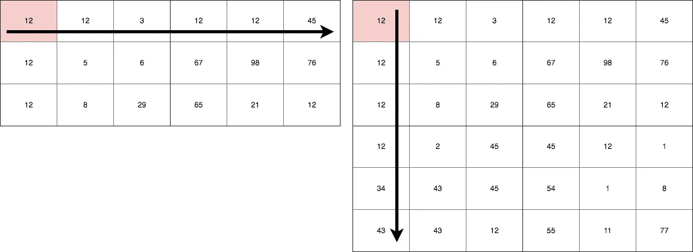
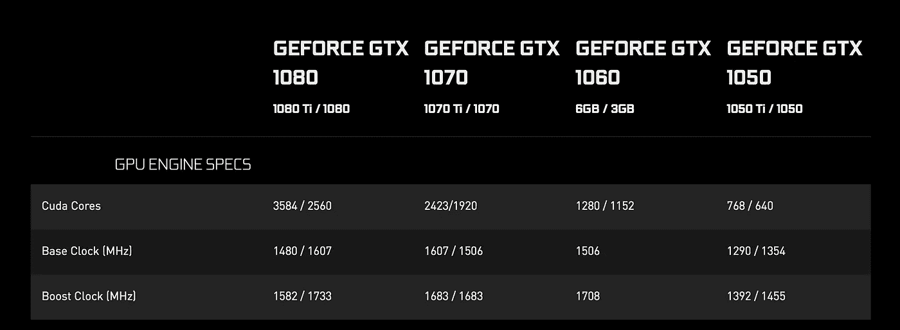

# GPU 优化简介

> 原文：<https://towardsdatascience.com/an-introduction-to-gpu-optimization-6ea255ef6360?source=collection_archive---------3----------------------->

## 借助 GPU 的强大功能加速简单的计算任务


Source: [Link](https://images.techhive.com/images/article/2016/08/speedomter-fast-speed-100678036-primary.idge.jpg)

大多数涉及大量计算的任务都需要时间，随着数据集变得越来越大，这将变得更加耗时。解决这个问题的一种方法是使用线程。在本文中，我将介绍 GPU 加速，它是如何完成的，以及一个简单的 GPU 任务 API 和一段代码。首先，让我们考虑矩阵乘法的例子。

# 矩阵乘法



Matrix Multiplication

在上面的场景中，有两个矩阵，一个大小为***3×6***，另一个大小为***6×6***。得到的矩阵大小为***3×6***。因此，对于矩阵的每个单元，将有 ***6*** 个计算。总共会有***3×6×6***多次乘法。因此，我们可以断定，这项任务需要 ***O(mn )*** 的时间量来计算。这意味着，对于一个大小为 ***2000 x 2000*** 的矩阵，将有***80 亿*** 次计算完成。这是大量的 CPU 时间！！！。

# GPU 简介

通常 GPU 包含大量的处理核心。通常从 384 到几千不等。下面简单对比一下**英伟达**的部分最新显卡。([来源](https://www.nvidia.com/en-us/geforce/products/10series/compare/))



CUDA Core Count

**CUDA** 代表**计算统一设备架构**。这些处理器运行速度相对较低，但通过使用大量 alu(算术和逻辑单元)提供了更高的并行性。点击阅读更多[。](http://www.nvidia.com/object/what-is-gpu-computing.html)


[CUDA Thread Model](https://stackoverflow.com/questions/42526790/cuda-c-programing-guide-how-do-thread-and-block-indexing-calculations-work)

此图展示了 CUDA 中的线程模型(这与市场上的其他架构(如 AMD)非常相似)。为了简单起见，我们可以假设每个 CUDA 内核或 GPU 内核一次可以运行一个线程。如果我们有一个大的数据集，我们可以把它分成几个部分。一个**网格**包含几个**块**，块是另一个矩阵，包含数量与其大小相等的**线程**。无论如何，因为这是介绍，所以让我们把注意力放在用 JAVA 开发的更简单的 API 上。

# 想想 GPU

正如我们所讨论的，每个 GPU 核心都能够运行一个单独的线程。开始类比的最简单方法是假设矩阵的每个单元将由单个 GPU 核心来计算。由于所有内核都是并行运行的，因此所有单元都将被并行计算。因此，我们的时间复杂度突然下降到 ***O(n)*** 。现在，对于 ***2000 x 2000*** 矩阵我们只需要***2000***次运行，这对于计算机来说是相当容易计算的。通常我们之前讨论的每个线程都知道它的身份，也就是它所属的 ***块*** 和 ***网格*** 。或者更简单地说，矩阵的单元位置。此外，矩阵将被加载到 GPU 的共享内存中，我们可以通过索引直接访问单元数据并进行并行处理。简单对吗？让我们检查一下代码。

# 用 APARAPI 进行 GPU 编程

什么？嗯，***APAR API(A-PARallel-API)***是 **OpenCL** 的 **JAVA** 包装器，OpenCL 是用于编写 GPU 的**开放计算语言**。这同时支持 **CUDA** 架构和 **AMD** 设备。此外，API 将更好的面向对象的 **JAVA** 带入了画面，如果我们直接用 ***C++*** 跳转到任务，这可能看起来很混乱。开始很容易。有一个 maven 依赖。但是要确保你已经正确设置了 **OpenCL** 或者 **CUDA** 。简单的谷歌搜索应该可以帮助你。大多数设备都捆绑在一起( **OSX** 和 **Windows** 设备)。

## pom.xml

## MatrixMultiplication.java

## 上述代码的详细说明

内核是由 GPU 执行的代码的一部分。内核可见的变量将被复制到 GPU RAM 中。我们以线性阵列而不是 2D 阵列的形式提供数据，因为这是 GPU 支持的方式。这并不是说它们不能处理 2D 数组，而是它们被处理的方式是通过维度的概念(我们现在还不会谈论它)。

```
Range range = Range.*create*(SIZE * SIZE);
```

上述代码在 GPU 中分配内存，以便***SIZE x SIZE***GPU 中运行的线程数量或更少(如可用)。

```
int row = getGlobalId() / SIZE;
int col = getGlobalId() % SIZE;
```

上面的代码从线程的私有内存中获取线程的 ***Id*** 。有了这个特定线程，我们就可以确定线程的单元位置。对于每个单元格，我们将执行以下操作。

```
for (int i = 0; i < SIZE; i++) {
    d[row * SIZE + col] += a[row * SIZE + i] * b[i * SIZE + col];
}
```

这是两个矩阵的相应单元的倍数的简单和。我们只是使用线程索引为单个线程定义内核，它将为所有线程并行运行。

# 结果

它很快。但是有多快呢？。这是上面程序的输出。

**1200 x 1200**

```
Starting single threaded computation
Task finished in 25269ms 
Starting GPU computation
Task finished in 1535ms
```

以下仅针对 GPU 组件运行，因为 CPU 的计算时间非常长。

**2000 x 2000** 任务用时 3757 毫秒
5000 x 5000 任务用时 5402 毫秒

希望你喜欢阅读。请一定要试试！！干杯！！