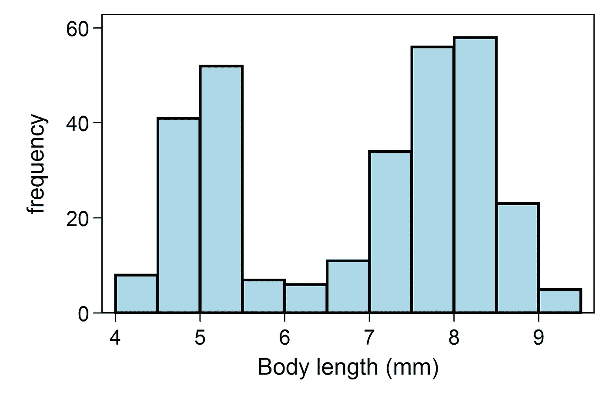
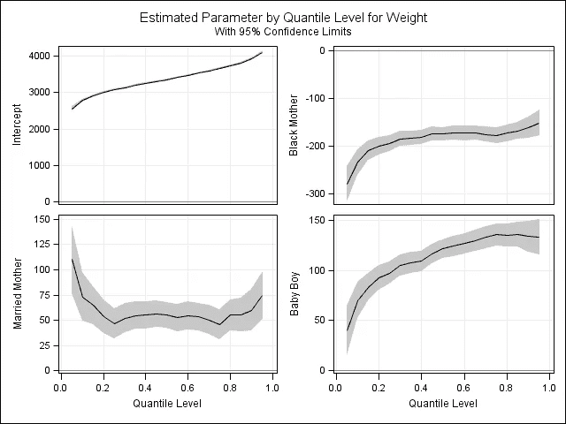
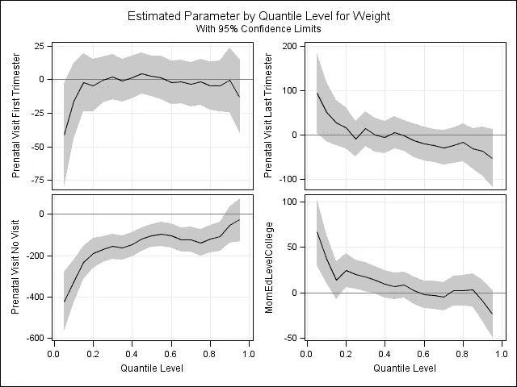
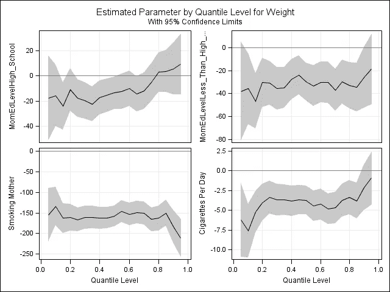
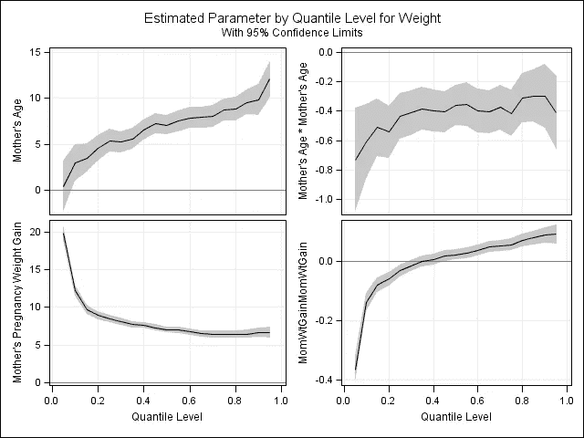
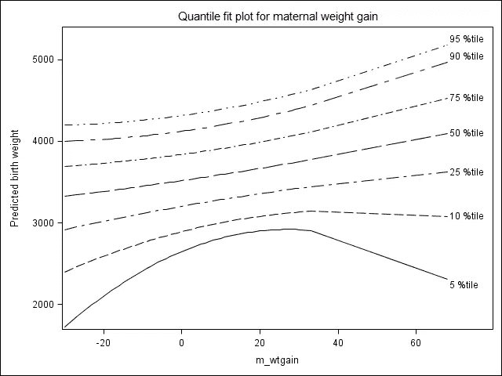

# 分位数回归简介

> 原文：<https://towardsdatascience.com/an-introduction-to-quantile-regression-eca5e3e2036a?source=collection_archive---------3----------------------->



Distribution of the lengths of ant bodies, from Wikimedia Commons

普通最小二乘回归是应用最广泛的统计方法之一。然而，它是一个参数模型，依赖于经常不满足的假设。分位数回归对残差的分布不做任何假设。它也让你探索因变量和自变量之间关系的不同方面。

# 动机

分位数回归至少有两个动机:假设我们的因变量是双峰或多峰的，也就是说，它有多个峰。如果我们知道是什么导致了多模态，我们就可以分离那个变量并进行分层分析，但是如果我们不知道，分位数回归可能是好的。在这里，OLS 回归会像依赖平均值作为双峰分布中心性的度量一样具有误导性。

如果我们的 DV 是高度倾斜的，例如，收入在许多国家，我们可能会对预测中位数(第 50 百分位)或其他分位数感兴趣；就像我们通常报告中位数收入而不是平均数收入一样。

另一个例子是，我们真正感兴趣的是处于最高或最低分位数的人。例如，如果研究性传播疾病的传播，我们可能会记录一个人在给定时间段内拥有的性伴侣数量。我们可能最感兴趣的是预测有很多伴侣的人，因为他们将是传播疾病的关键部分。

对于那些对商业感兴趣的人来说，花在商店或网站上的钱可能是不真实的。作为商店的老板，您可能更感兴趣的是找出预测最高分位数的因素，而不是平均值。

# 示例:出生体重

预测低出生体重很重要，因为出生时体重低的婴儿比正常体重的婴儿更容易出现健康并发症。通常的方法是使用 OLS 回归将平均出生体重建模为各种因素的函数，或者对出生体重进行二分法或其他分类，然后使用某种形式的逻辑回归(正常或有序)。这两者都是不够的。

对平均值建模是不够的，因为，正如我们将看到的，不同的因素在对平均值和下分位数建模时是重要的。我们经常感兴趣的是预测哪些母亲可能生下体重最低的婴儿，而不是特定母亲群体的平均出生体重。

对因变量进行分类很少是一个好主意，主要是因为它丢弃了有用的信息，并且对不同类别的人一视同仁。低出生体重的典型临界值是 2.5 公斤。然而，这意味着出生时体重为 2.49 公斤的婴儿与出生时体重为 1.0 公斤的婴儿相同，而出生时体重为 2.51 公斤的婴儿与出生时体重为 4 公斤的婴儿相同。事实显然并非如此。

出生体重的一个模型(由 SAS 提供，改编自 Koenker)包括孩子的性别、母亲的婚姻状况、母亲的种族、母亲的年龄(作为二次方)、她的教育状况、她是否进行过产前护理，如果是的话，在哪个孕期，她是否吸烟，如果是的话，每天吸多少烟，以及她的体重增加(作为二次方)。

母亲的婚姻状况被编码为已婚与未婚；种族要么是黑人要么是白人(不清楚其他种族的母亲是否被排除在外)，母亲的教育程度被编码为高中以下(参考类别)，高中毕业，某个学院，或大学毕业。产前护理编码为无、第一个三个月(参考类别)、第二个
三个月或第三个三个月。母亲的体重增加和年龄集中在方法上。

我们现在可以看看这些变量在每个分位数的影响。最好的方法可能是图形化。该程序的输出是常规回归的 9 倍长(因为我们有 9 个分位数),阅读起来很费力。但是，可以打印出来。下面显示的 SAS 代码生成四个图形面板。第一个面板:



First panel of quantile regression plots

显示截取的效果，母亲是黑人，母亲结婚，孩子是男孩。截距是未婚白人妇女所生女婴的每个分位数的平均出生体重，该妇女受教育程度不到高中，不吸烟，是平均年龄，体重平均增加。这些婴儿中只有大约 5%的体重低于 2500 克的标准体重。黑人女性所生的婴儿比白人女性所生的婴儿更轻，这种影响在低端比在其他地方更大——差异在 5%瓦片处约为 280 克，在中位数
处为 180 克，在 95%瓦片处为 160 克。母亲已婚的婴儿比母亲未婚的婴儿体重更重，而且这种影响在各个分位数上相对稳定。男孩比女孩重，这种影响在高端更大:在 5%的比例下，男孩比女孩重约 50 克，但在 95%的比例下，差异超过 100 克。

下一个面板:



2nd panel of quantile regression plots

显示了产前护理的效果，以及教育的第一部分，可以用与第一个面板相似的方式阅读。

第三个小组:



3rd panel of quantile regression plots

显示了其他教育影响和吸烟的影响。第四个也是最后一个面板:



4th panel of quantile regression plot

显示了母亲年龄和体重增加的影响。最后两个有点难以解释，因为与线性效应相比，二次效应总是如此。改善这种混乱的一种方法是绘制
不同母亲年龄或体重增加的婴儿出生体重预测图，保持其他变量的平均值或最常见值不变。下面是完成这项工作的 SAS 代码。母亲体重增加的结果:



Plot for maternal weight gain

这是一个迷人的图表！请注意，极端分位数是二次效应显著的分位数。进一步注意，体重减轻或大量增加的母亲比体重增加适度的母亲有更高的机会生下低体重婴儿。此外，体重增加较多的女性生下超大婴儿的几率更高。这种发现证实了医学观点，但不是我们可以用普通最小二乘回归发现的。

我们可以对母亲的年龄做同样的事情，但是年龄的影响不是很大，二次效应很小，我们可以考虑通过消除它来简化模型。另一方面，如果文献说母亲年龄应该有很强的二次效应，那么要么这个数据集有些奇怪，要么我们有证据反驳这种说法。需要注意的一点是，这个数据集涵盖了有限的年龄范围——所有的母亲都在 18 岁到 45 岁之间。年轻和年长的年龄可能会产生强烈的影响。

# 用于分析出生体重数据的 SAS 代码

## 程序 1:基本分位数回归

```
proc quantreg ci=sparsity/iid algorithm=interior(tolerance=1.e-4)
data=new;
class visit MomEdLevel;
model weight = black married boy visit MomEdLevel MomSmoke
cigsperday MomAge MomAge*MomAge
MomWtGain MomWtGain*MomWtGain/
quantile= 0.05 to 0.95 by 0.05
plot=quantplot;
run;
```

## 程序 2:创建二次曲线

获取预测值:

```
**proc quantreg ci=sparsity/iid algorithm=interior(tolerance=1.e-4)
data=new;
class visit MomEdLevel;
model weight = black married boy visit MomEdLevel MomSmoke
cigsperday MomAge MomAge*MomAge
MomWtGain MomWtGain*MomWtGain/
quantile= 0.05 to 0.95 by 0.05;
output out = predictquant p = predquant;
run;**
```

然后我们对其进行子集划分，只得到其他值是它们的均值或模式的情况。首先，对于产妇年龄:

```
**data mwtgaingraph;
set predictquant;
where black = 0 and married = 1 and boy = 1 and MomAge = 0 and MomSmoke = 0 and visit = 3 and MomEdLevel = 3;
run;** 
```

然后排序:

```
**proc sort data = mwtgaingraph;
by MomWtGain;
run;**
```

然后画出来。

```
**proc sgplot data = mwtgaingraph;
title ’Quantile fit plot for maternal weight gain’;
yaxis label = “Predicted birth weight”;
series x = MomWtGain y = predquant1 /curvelabel = “5 %tile”;
series x = MomWtGain y = predquant2/curvelabel = “10 %tile”;
series x = MomWtGain y = predquant5/curvelabel = “25 %tile”;
series x = MomWtGain y = predquant10/curvelabel = “50 %tile”;
series x = MomWtGain y = predquant15/curvelabel = “75 %tile”;
series x = MomWtGain y = predquant18/curvelabel = “90 %tile”;
series x = MomWtGain y = predquant19/curvelabel = “95 %tile”;
run;**
```

# 用于分位数回归的其他统计软件

我选择使用 SAS。但是，R 提供了 quantreg 包，Python 在 statsmodels 包中有分位数回归，STATA 有 qreg。其他软件也可能提供它。

# 结论

分位数回归对于不满足 OLS 回归假设的情况和感兴趣的是分位数的情况是一个有价值的工具。