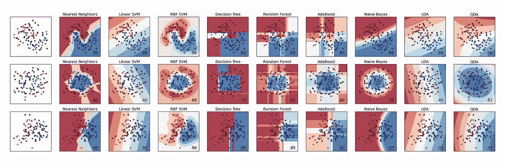
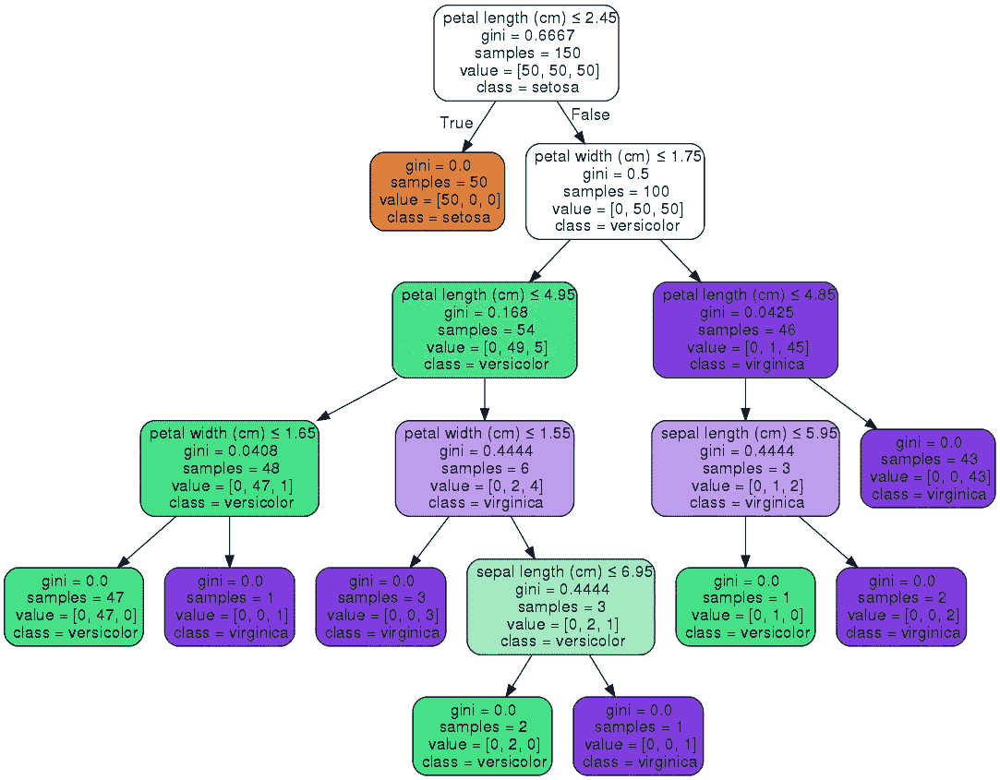

# Scikit Learn 简介:Python 机器学习的黄金标准

> 原文：<https://towardsdatascience.com/an-introduction-to-scikit-learn-the-gold-standard-of-python-machine-learning-e2b9238a98ab?source=collection_archive---------9----------------------->

A comparison Scikit Learn’s many Machine Learning models

> 想获得灵感？快来加入我的 [**超级行情快讯**](https://www.superquotes.co/?utm_source=mediumtech&utm_medium=web&utm_campaign=sharing) 。😎

# 机器学习金牌

如果你打算用 Python 做机器学习， [Scikit Learn](https://scikit-learn.org/stable/index.html) 是金标准。Scikit-learn 提供了监督和非监督学习算法的广泛选择。最棒的是，它是迄今为止最简单、最干净的 ML 库。

Scikit learn 是以软件工程的思维方式创建的。它的核心 API 设计围绕着易于使用、功能强大，并且仍然保持研究工作的灵活性。这种健壮性使得它非常适合用于任何端到端的 ML 项目，从研究阶段一直到生产部署。

# Scikit Learn 提供了什么

Scikit Learn 建立在几个常见的数据和数学 Python 库之上。这样的设计使得它们之间的集成变得非常容易。您可以将 numpy 数组和 pandas 数据帧直接传递给 Scikit 的 ML 算法！它使用以下库:

*   [**NumPy**](http://www.numpy.org/) :适用于任何矩阵运算，尤其是数学运算
*   [**SciPy**](https://www.scipy.org/) :科学技术计算
*   **:数据可视化**
*   **[**IPython**](https://ipython.org/):Python 的交互控制台**
*   **[**Sympy**](https://www.sympy.org/en/index.html) :符号数学**
*   **[**熊猫**](https://pandas.pydata.org/) :数据处理、操纵、分析**

**Scikit Learn 专注于机器学习，例如*数据建模*。It *与数据的加载、处理、操作和可视化*无关。因此，对于那些额外的步骤，使用上面的库，尤其是 NumPy，是自然和常见的做法；他们是天生的一对！**

**Scikit 强大的算法产品包括:**

*   ****回归:**拟合线性和非线性模型**
*   ****聚类:**无监督分类**
*   ****决策树:**用于分类和回归任务的树归纳和修剪**
*   ****神经网络:**用于分类和回归的端到端训练。可以很容易地在元组中定义层**
*   ****支持向量机:**用于学习决策边界**
*   ****朴素贝叶斯**:直接概率建模**

**除此之外，它还有一些其他库通常不提供的非常方便和高级的功能:**

*   ****集成方法:** Boosting、Bagging、随机森林、模型投票和平均**
*   ****特征操作**:降维、特征选择、特征分析**
*   ****异常值检测:**用于检测异常值和剔除噪声**
*   ****模型选择和验证:**交叉验证、超参数调整和指标**

# **味觉测试**

**为了让您体验使用 Scikit Learn 来训练和测试 ML 模型是多么容易，这里有一个关于决策树分类器的示例。**

**在 Scikit Learn 中，用于分类和回归的决策树非常容易使用，内置了一个类。我们将首先加载我们的数据集，它实际上是内置在库中的。然后我们将初始化我们的分类决策树，这也是一个内置的类。跑步训练是一个简单的小程序！`.fit(X, Y)`函数训练模型，其中 *X* 是输入的 numpy 数组，而 *Y* 是相应的输出的 numpy 数组**

**Scikit Learn 还允许我们使用 graphviz 库可视化我们的树。它附带了一些选项，有助于可视化模型学习到的决策节点和拆分，这对理解其工作原理非常有用。下面我们将根据特性名称给节点着色，并显示每个节点的类别和特性信息。**

****

**除此之外，Scikit Learn 的文档非常精美！每个[算法参数](https://scikit-learn.org/stable/modules/generated/sklearn.tree.DecisionTreeClassifier.html#sklearn.tree.DecisionTreeClassifier)都有清晰的解释和直观的命名。此外，他们还提供带有示例代码的[教程，介绍如何训练和应用该模型、其优缺点以及实际应用技巧！](https://scikit-learn.org/stable/modules/tree.html)**

# **喜欢学习？**

**在 twitter 上关注我，我会在这里发布所有最新最棒的人工智能、技术和科学！也在 LinkedIn 上与我联系！**