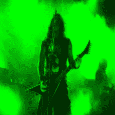
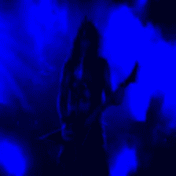

# MXNet API 介绍—第 4 部分

> 原文：<https://towardsdatascience.com/an-introduction-to-the-mxnet-api-part-4-df22560b83fe?source=collection_archive---------0----------------------->

在[第三部](https://medium.com/@julsimon/an-introduction-to-the-mxnet-api-part-3-1803112ba3a8)中，我们建立并训练了我们的第一个神经网络。我们现在知道的足够多，可以举更高级的例子。

最先进的深度学习模型非常复杂。他们有数百层**，需要几天——如果不是几周——来训练大量的数据。构建和调整这些模型需要大量的专业知识。**

**幸运的是，使用这些模型要简单得多，只需要**几行代码**。在本文中，我们将使用一个名为 **Inception v3** 的预训练图像分类模型。**

## **盗梦空间 v3**

**[Inception v3](https://arxiv.org/abs/1512.00567) 发布于 2015 年 12 月，是 [GoogleNet](https://arxiv.org/abs/1409.4842) 模型的一个进化版本(该模型赢得了 [2014 ImageNet 挑战赛](http://image-net.org/challenges/LSVRC/2014/))。我们不会深入研究论文的细节，但转述其结论，Inception v3 比当时可用的最佳模型精确 15-25%，同时在计算上便宜 6 倍，使用的参数至少少 5 倍(即使用模型需要更少的 RAM)。**

**那真是一头野兽。那么我们如何让它发挥作用呢？**

## **MXNet 模型动物园**

**[模型动物园](http://mxnet.io/model_zoo/)是一群**预先训练好的模型**随时可以使用。你会发现**模型定义**、**模型参数**(即神经元权重)和指令(可能)。**

**让我们下载定义和参数(您可能需要更改文件名)。随意打开第一个文件:你会看到所有层的定义。第二个是二进制文件，别管它；)**

```
$ wget [http://data.dmlc.ml/models/imagenet/inception-bn/Inception-BN-symbol.json](http://data.dmlc.ml/models/imagenet/inception-bn/Inception-BN-symbol.json)$ wget [http://data.dmlc.ml/models/imagenet/inception-bn/Inception-BN-0126.params](http://data.dmlc.ml/models/imagenet/inception-bn/Inception-BN-0126.params)$ mv Inception-BN-0126.params Inception-BN-0000.params
```

**由于这个模型已经在 [ImageNet](http://www.image-net.org/) 数据集上训练过，我们还需要下载相应的图像**类别**列表(其中 1000 个)。**

```
$ wget [http://data.dmlc.ml/models/imagenet/synset.txt](http://data.dmlc.ml/models/imagenet/synset.txt)$ wc -l synset.txt
    1000 synset.txt$ head -5 synset.txt
n01440764 tench, Tinca tinca
n01443537 goldfish, Carassius auratus
n01484850 great white shark, white shark, man-eater, man-eating shark, Carcharodon carcharias
n01491361 tiger shark, Galeocerdo cuvieri
n01494475 hammerhead, hammerhead shark
```

**好了，完成了。现在我们开始工作吧。**

## **加载模型**

**我们需要做的是:**

*   **从保存的状态加载模型:MXNet 称之为**检查点**。作为回报，我们得到输入*符号*和模型参数。**

```
import mxnet as mx

sym, arg_params, aux_params = mx.model.load_checkpoint('Inception-BN', 0)
```

*   **创建一个新的*模块*，并将其指定为输入*符号*。我们还可以使用一个*上下文*参数来指示我们想要在哪里运行模型:默认值是 *cpu(0)* ，但是我们将使用 *gpu(0)* 在 gpu 上运行它。**

```
mod = mx.mod.Module(symbol=sym)
```

*   **将输入符号*绑定到输入数据。我们称它为‘data ’,因为这是它在网络的**输入层**中的名字(请看 JSON 文件的前几行)。***
*   **将“数据”的**形状**定义为 1 x 3 x 224 x 224。不要慌；)‘224 x 224’是图像分辨率，模型就是这么训练的。‘3’是通道数:红、绿、蓝(按此顺序)。“1”是批量大小:我们将一次预测一个图像。**

```
mod.bind(for_training=False, data_shapes=[('data', (1,3,224,224))])
```

*   **设置模型参数。**

```
mod.set_params(arg_params, aux_params)
```

**这就够了。四行代码！现在需要把一些数据放进去，看看会发生什么。嗯……还没有。**

## **准备我们的数据**

**数据准备:让我们的生活变得悲惨自从七十年代以来…从关系数据库到机器学习到深度学习，在这方面没有什么真正改变。很无聊但是很有必要。让我们完成它。**

**请记住，该模型需要一个 4 维的*n 数组*来保存一张 224 x 224 图像的红色、绿色和蓝色通道。我们将使用流行的 [OpenCV](http://www.opencv.org) 库从我们的输入图像构建这个*n 数组*。如果没有安装 OpenCV，运行“*pip install OpenCV-python*”在大多数情况下应该足够了:)**

**以下是步骤:**

*   ****读取**图像:这将返回一个 *numpy* 数组，形状为(图像高度，图像宽度，3)，三个通道按照 **BGR** 的顺序排列(蓝、绿、红)。**

```
img = cv2.imread(filename)
```

*   ****将**图像转换为 **RGB** 。**

```
img = cv2.cvtColor(img, cv2.COLOR_BGR2RGB)
```

*   ****将**图像调整到 **224 x 224** 。**

```
img = cv2.resize(img, (224, 224,))
```

*   ****将**数组从(图像高度，图像宽度，3)整形为(3，图像高度，图像宽度)。**

```
img = np.swapaxes(img, 0, 2)
img = np.swapaxes(img, 1, 2)
```

*   **添加一个**第四维**并构建*n 数组***

```
img = img[np.newaxis, :]
array = mx.nd.array(img)>>> print array.shape
(1L, 3L, 224L, 224L)
```

**头晕？让我们看一个例子。这是我们的输入图片。**

****

**Input picture 448x336 (Source: metaltraveller.com)**

**一旦经过处理，这张图片已经被调整大小并被分割成 RGB 通道，存储在*数组【0】*([这里的](https://gist.github.com/juliensimon/c62742b200396b4eadd8229a22c4cf0b)是用来生成下面图像的代码)。**

****

**array[0][0] : 224x224 red channel**

****

**array[0][1] : 224x224 green channel**

****

**array[0][2] : 224x224 blue channel**

**如果批处理大小大于 1，那么我们将在*数组【1】*中有第二个图像，在*数组【2】*中有第三个图像，依此类推。**

**这很有趣吗？现在我们来预测一下！**

## **预测**

**您可能还记得第三部分中的[内容，一个*模块*对象必须在**批次**中向一个模型提供数据:通常的做法是使用一个**数据迭代器**(具体来说，我们使用了一个 *NDArrayIter* 对象)。](https://medium.com/@julsimon/an-introduction-to-the-mxnet-api-part-3-1803112ba3a8)**

**在这里，我们想要预测一个**单个**图像，所以尽管我们可以使用数据迭代器，但这可能是多余的。相反，我们将创建一个名为 tuple 的**，名为 *Batch* ，当它的*数据*属性被引用时，它将通过返回我们的输入 *NDArray* 来充当伪迭代器。****

```
from collections import namedtuple
Batch = namedtuple('Batch', ['data'])
```

**现在我们可以把这个“批”传递给模型，让它预测。**

```
mod.forward(Batch([array]))
```

**该模型将输出一个*n 数组*，包含 **1000 个概率**，对应于 1000 个类别。它只有一行，因为批大小等于 1。**

```
prob = mod.get_outputs()[0].asnumpy()>>> prob.shape
(1, 1000)
```

**让我们用*挤压*()把这个变成一个数组。然后，使用 *argsort* ()，我们创建第二个数组，保存这些概率的**索引**，按照**降序**排序。**

```
prob = np.squeeze(prob)>>> prob.shape
(1000,)
>> prob
[  4.14978594e-08   1.31608676e-05   2.51907986e-05   2.24045834e-05
   2.30327873e-06   3.40798979e-05   7.41563645e-06   3.04062659e-08 *etc.*sortedprob = np.argsort(prob)[::-1]>> sortedprob.shape
(1000,)
```

**根据模型，这张图最有可能的类别是 **#546** ，概率 **58%** 。**

```
>> sortedprob
[546 819 862 818 542 402 650 420 983 632 733 644 513 875 776 917 795
*etc.* >> prob[546]
0.58039135
```

**让我们找到这个类别的名称。使用 *synset.txt* 文件，我们可以构建一个**类别列表**，并在索引 546 处找到它。**

```
synsetfile = open('synset.txt', 'r')
categorylist = []
for line in synsetfile:
  categorylist.append(line.rstrip())>>> categorylist[546]
'n03272010 electric guitar'
```

**第二高的类别呢？**

```
>>> prob[819]
0.27168664
>>> categorylist[819]
'n04296562 stage
```

**很好，你不觉得吗？**

**所以你走吧。现在你知道如何使用一个**预先训练好的，最先进的模型**进行图像分类。它只需要 **4 行代码** …剩下的只是数据准备。**

**你可以在下面找到完整的代码。玩得开心，请继续关注:D**

**接下来:**

*   **[第 5 部分](https://medium.com/@julsimon/an-introduction-to-the-mxnet-api-part-5-9e78534096db):更多预训练模型(VGG16 和 ResNet-152)**
*   **[第 6 部分](https://medium.com/@julsimon/an-introduction-to-the-mxnet-api-part-6-fcdd7521ae87):树莓 Pi 上的实时物体检测(它还会说话！)**