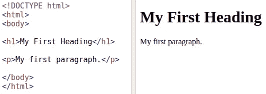
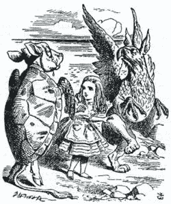
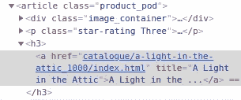
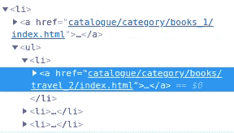
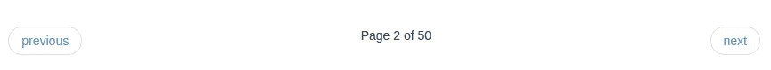
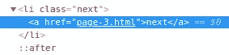
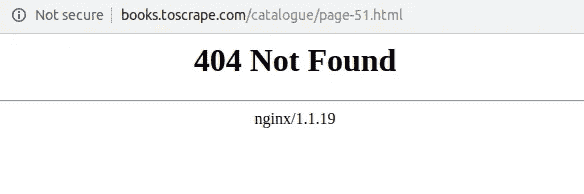
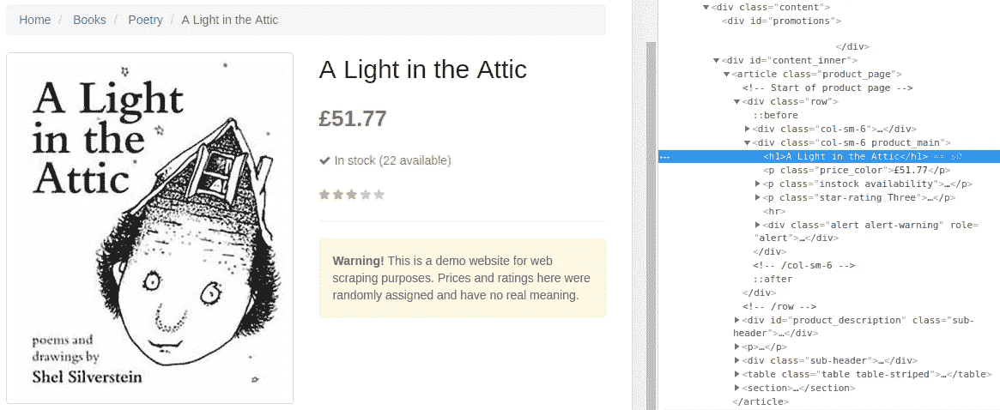
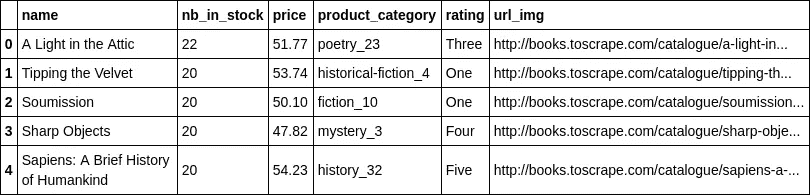

# Python 网页抓取简介

> 原文：<https://towardsdatascience.com/an-introduction-to-web-scraping-with-python-a2601e8619e5?source=collection_archive---------1----------------------->

## 让我们用 BeautifulSoup 刮一个虚构的书店网站吧！


Photo by [Darwin Vegher](https://unsplash.com/@darwiiiin?utm_source=medium&utm_medium=referral) on [Unsplash](https://unsplash.com?utm_source=medium&utm_medium=referral)

# 介绍

作为一名数据科学家，我经常发现自己在寻找可能与我的机器学习项目相关的外部数据源。问题是，很难找到与您所寻找的完全对应的开源数据集，或者允许您访问数据的免费 API。在这种情况下，web 抓取可以成为获取更多数据的一种解决方案。

## 什么是网页抓取？

网络搜集包括收集网站上的可用数据。这可以由人类用户或机器人手动完成。后者当然可以比人类用户更快地收集数据，这就是为什么我们要关注这一点。因此，这种机器人在几分钟内收集一个网站的所有数据在技术上是可能的吗？然而，这种做法的合法性没有明确界定。网站通常会在使用条款和 robots.txt 文件中说明是否允许使用刮刀。

## 它是如何工作的？

网页抓取器收集网站数据的方式与人类相同:抓取器进入网站的网页，获取相关数据，然后前进到下一个网页。每个网站都有不同的结构，这就是为什么网站抓取器通常是用来搜索一个网站的。在 web 刮刀的实现过程中出现的两个重要问题如下:

*   包含相关数据的网页的结构是什么？
*   我们如何能到达那些网页？

为了回答这些问题，我们需要了解一点网站是如何工作的。网站是使用 HTML(超文本标记语言)以及 CSS(层叠样式表)和 JavaScript 创建的。HTML 元素由标签分隔，它们直接将内容引入网页。下面是一个基本 HTML 文档的样子:



Basic HTML page

我们可以看到第一个标题的内容包含在“h1”标记之间。第一段包含在“p”标记之间。在真实的网站上，我们需要找出相关数据在哪些标签之间，并告诉我们的刮刀。我们还需要指定应该浏览哪些链接，以及它们在 HTML 文件中的位置。有了这些信息，我们的刮刀应该能够收集所需的数据。

## 我们要用什么工具？

在本教程中，我们将使用 Python 模块 requests 和 BeautifulSoup。

请求将允许我们发送 HTTP 请求来获取 HTML 文件。

申请文件链接:[http://docs.python-requests.org/en/master/](http://docs.python-requests.org/en/master/)


Requests module

BeautifulSoup 将用于解析 HTML 文件。这是最常用的网页抓取库之一。它使用起来非常简单，并且有许多功能可以帮助有效地收集网站数据。

链接到 BeautifulSoup 文档:[https://www.crummy.com/software/BeautifulSoup/bs4/doc/](https://www.crummy.com/software/BeautifulSoup/bs4/doc/)



BeautifulSoup module

# 先决条件

*   python 2.7
*   要求
*   beautifulsoup4
*   熊猫

# 目标

我们要刮一个网上书店的数据:【http://books.toscrape.com/ 

这个网站是虚构的，所以我们可以随意抓取。

在本教程中，我们将收集网站所有产品的以下信息:

*   书名
*   价格
*   有效性
*   图像
*   种类
*   等级

# 预热:获取主页的内容

首先，让我们使用请求模块来获取网站主页的 HTML。

```
u'<!DOCTYPE html>\n<!--[if lt IE 7]>      <html lang="en-us" class="no-js lt-ie9 lt-ie8 lt-ie7"> <![endif]-->\n<!--[if IE 7]>         <html lang="en-us" class="no-js lt-ie9 lt-ie8"> <![endif]-->\n<!--[if IE 8]>         <html lang="en-us" class="no-js lt-ie9"> <![endif]-->\n<!--[if gt IE 8]><!--> <html lang="en-us" class="no-js"> <!--<![endif]-->\n    <head>\n        <title>\n    All products | Books to Scrape - Sandbox\n</title>\n\n        <meta http-equiv="content-type" content="text/html; charset=UTF-8" />\n        <meta name="created" content="24th Jun 2016 09:29" />\n        <meta name="description" content="" />\n        <meta name="viewport" content="width=device-width" />\n        <meta name="robots" content="NOARCHIVE,NOCACHE" />\n\n        <!-- Le HTML5 shim, for IE6-8 support of HTML elements -->\n        <!--[if lt IE 9]>\n        <script src="//html5shim.googlecode.com/svn/trunk/html5.js"></script>\n        <![endif]-->\n\n        \n            <link rel="shortcut icon" href="static/oscar/favicon.'
```

结果还挺乱的！让我们让这更具可读性:

```
<html class="no-js" lang="en-us">
 <!--<![endif]-->
 <head>
  <title>
   All products | Books to Scrape - Sandbox
  </title>
  <meta content="text/html; charset=utf-8" http-equiv="content-type"/>
  <meta content="24th Jun 2016 09:29" name="created"/>
  <meta content="" name="description"/>
  <meta content="width=device-width" name="viewport"/>
  <meta content="NOARCHIVE,NOCACHE" name="robots"/>
  <!-- Le HTML5 shim, for IE6-8 support of HTML elements -->
  <!--[if lt IE 9]>
        <script src="//html5shim.googlecode.com/svn/trunk/html5.js"></script>
        <![endif]-->
  <link href="static/oscar/favicon.ico" rel="shortcut icon"/>
  <link href="static/oscar/css/styles.css" rel="stylesheet" type="tex
```

函数*pretify()*使 HTML 更具可读性。但是，我们不会直接使用它来探索相关数据在哪里。

让我们定义一个函数来请求和解析一个 HTML 网页，因为在本教程中我们会经常用到它:

# 在主页上查找图书 URL

现在让我们开始更深入地探讨这个问题。为了获得图书数据，我们需要能够访问他们的产品页面。第一步是找到每本书产品页面的 URL。

在浏览器中，进入网站主页，右键单击产品名称，然后单击 inspect。这将向您显示对应于该元素的网页的 HTML 部分。恭喜你，你已经找到了第一个图书链接！

请注意 HTML 代码的结构:



Inspecting HTML code

你可以对页面上的其他产品进行尝试:结构总是一样的。产品的链接对应于“a”标签的“href”属性。这属于 a 类值为“product_pod”的“article”标记。这似乎是发现产品网址的可靠来源。

BeautifulSoup 使我们能够找到那些特殊的“文章”标签。我们可以屏蔽 *find()* 函数，以便在 HTML 中找到这个标签的第一次出现:

```
<article class="product_pod">\n<div class="image_container">\n<a href="catalogue/a-light-in-the-attic_1000/index.html"></a>\n</div>\n<p class="star-rating Three">\n<i class="icon-star"></i>\n<i class="icon-star"></i>\n<i class="icon-star"></i>\n<i class="icon-star"></i>\n<i class="icon-star"></i>\n</p>\n<h3><a href="catalogue/a-light-in-the-attic_1000/index.html" title="A Light in the Attic">A Light in the ...</a></h3>\n<div class="product_price">\n<p class="price_color">\xc2\xa351.77</p>\n<p class="instock availability">\n<i class="icon-ok"></i>\n    \n        In stock\n    \n</p>\n<form>\n<button class="btn btn-primary btn-block" data-loading-text="Adding..." type="submit">Add to basket</button>\n</form>\n</div>\n</article>
```

我们还有太多的信息。

让我们通过添加其他子标签来更深入地研究树:

```
<a href="catalogue/a-light-in-the-attic_1000/index.html"></a>
```

好多了！但是我们只需要包含在' href '值中的 URL。

我们可以通过相加。get("href ")到上一条指令:

```
u'catalogue/a-light-in-the-attic_1000/index.html'
```

好了，我们设法用 BeautifulSoup 得到了我们的第一个产品 URL。

现在让我们使用 *findAll()* 函数一次性收集主网页上所有产品的 URL:

```
20 fetched products URLs
One example:
u'catalogue/a-light-in-the-attic_1000/index.html'
```

这个函数对于一次找到所有的值非常方便，但是您必须检查收集的所有信息是否相关。有时一个相同的标签可以包含完全不同的数据。这就是为什么在选择标签时尽可能具体是很重要的。在这里，我们决定依赖带有“product_pod”类的标签“article ”,因为这似乎是一个非常具体的标签，我们不太可能在其中找到除产品数据之外的数据。

前面的 URL 对应于它们相对于主页的路径。为了使它们完整，我们只需要在它们前面加上主页面的网址:[http://books.toscrape.com/index.html](http://books.toscrape.com/index.html)(去掉 index.html 部分后)。

现在让我们用它来定义一个函数，在网站的任何给定页面上检索图书链接:

# 在主页上查找图书类别 URL

现在让我们尝试检索不同产品类别对应的 URL:



Inspecting HTML code

通过检查，我们可以看到它们遵循相同的 URL 模式:“目录/类别/书籍”。

我们可以告诉 BeautifulSoup 匹配包含此模式的 URL，以便轻松检索类别 URL:

```
50 fetched categories URLs
Some examples:[u'http://books.toscrape.com/index.htmlcatalogue/category/books/travel_2/index.html',
 u'http://books.toscrape.com/index.htmlcatalogue/category/books/mystery_3/index.html',
 u'http://books.toscrape.com/index.htmlcatalogue/category/books/historical-fiction_4/index.html',
 u'http://books.toscrape.com/index.htmlcatalogue/category/books/sequential-art_5/index.html',
 u'http://books.toscrape.com/index.htmlcatalogue/category/books/classics_6/index.html']
```

我们成功地检索了 50 个类别的网址！

记住要经常检查你获取的信息，以确保所有的信息都是相关的。

如果我们想要抓取网站的某个特定部分，获取网站各个部分的 URL 会非常有用。

# 收集所有书籍数据

在本教程的最后一部分，我们将最终解决我们的主要目标:收集网站上所有书籍的数据。

我们知道如何在给定的页面中找到书籍的链接。如果所有的书都放在同一个页面上，这就容易了。然而，这种情况不太可能发生，因为在同一个页面上向用户显示所有目录对用户来说不是很友好。

通常产品会显示在多页或一页上，但通过滚动显示。在主页底部，我们可以看到有 50 个产品页面和一个“下一步”按钮，可以进入下一个产品页面。


End of the main page

在接下来的页面上，还有一个“上一页”按钮，可以返回到上一个产品页面。



End of the second page

## 获取所有页面的 URL

为了获取所有产品的网址，我们需要能够通过所有的网页。为此，我们可以反复查看所有“下一步”按钮。



Inspecting HTML code

“下一步”按钮包含“页面”模式。我们可以用它来检索下一页的 URL。但是我们要小心:上一步按钮也包含这种模式！

如果我们在匹配“页面”时有两个结果，我们应该采用第二个结果，因为它将对应于下一页。对于第一页和最后一页，我们将只有一个结果，因为我们将有“下一页”按钮或“上一页”按钮。

```
50 fetched URLs
Some examples:
['http://books.toscrape.com/index.html',
 u'http://books.toscrape.com/catalogue/page-2.html',
 u'http://books.toscrape.com/catalogue/page-3.html',
 u'http://books.toscrape.com/catalogue/page-4.html',
 u'http://books.toscrape.com/catalogue/page-5.html']
```

我们成功地获得了 50 页的网址。有趣的是，这些页面的 URL 是高度可预测的。我们可以通过将“page-X.html”递增到 50 来创建这个列表。

这个解决方案在这个例子中是可行的，但是如果页面数量发生变化(例如，如果网站决定在每页上打印更多的产品，或者如果目录发生变化)，这个解决方案就不再可行了。

一种解决方案是增加这个值，直到我们得到一个 404 页面。



404 error page

这里我们可以看到，试图转到第 51 页实际上会导致 404 错误。

幸运的是，请求的结果有一个非常有用的属性，可以向我们显示 HTML 请求的返回状态。

```
status code for page 50: 200
status code for page 51: 404
```

代码 200 表示没有错误。404 代码告诉我们没有找到该页面。

我们可以使用这些信息来获取所有页面的 URL:我们应该迭代直到得到 404 代码。

现在让我们试试这个方法:

```
50 fetched URLs
Some examples:
['http://books.toscrape.com/catalogue/page-1.html',
 'http://books.toscrape.com/catalogue/page-2.html',
 'http://books.toscrape.com/catalogue/page-3.html',
 'http://books.toscrape.com/catalogue/page-4.html',
 'http://books.toscrape.com/catalogue/page-5.html']
```

我们设法用这个更简单的方法获得了相同的 URL！

## 获取所有产品的 URL

现在，下一步是获取每个页面的所有产品 URL。这一步非常简单，因为我们已经有了所有页面的列表和从页面获取产品 URL 的功能。

让我们遍历页面并应用我们的函数:

```
1000 fetched URLs
Some examples:
[u'http://books.toscrape.com/catalogue/a-light-in-the-attic_1000/index.html',
 u'http://books.toscrape.com/catalogue/tipping-the-velvet_999/index.html',
 u'http://books.toscrape.com/catalogue/soumission_998/index.html',
 u'http://books.toscrape.com/catalogue/sharp-objects_997/index.html',
 u'http://books.toscrape.com/catalogue/sapiens-a-brief-history-of-humankind_996/index.html']
```

我们终于得到了 1000 本书的网址。这与网站上显示的号码相对应！

## 获取产品数据

最后一步是收集每个产品的数据。让我们先来看看产品页面上的信息是如何组织的:



A product page

我们可以很容易地检索到每本书的大量信息:

*   书名
*   价格
*   有效性
*   图像
*   种类
*   等级

我们开始吧！



Result dataframe

我们得到了我们的数据:我们的网络抓取实验是成功的。

在使用之前，一些数据清理可能是有用的:

*   将评级转换成数值
*   删除 product_category 列中的数字

# 包裹

我们已经看到了如何使用自动化的 web 抓取工具浏览网站并收集每个网页上的数据。为了建立有效的网页抓取工具，一个关键的事情是理解你想要抓取信息的网站的结构。这意味着如果你想在网站更新后仍然有用，你可能需要维护你的刮刀。

这个书店网站是一个简单的例子，但是在现实生活中，您可能不得不处理更复杂的网站，这些网站使用 Javascript 呈现一些内容。你可能想使用类似 Selenium 的自动浏览器来完成这些任务([https://www.seleniumhq.org/](https://www.seleniumhq.org/))。

以下是 Jupyter 笔记本的原始链接:

[](https://github.com/jonathanoheix/scraping_basics_with_beautifulsoup) [## jonathanoheix/scraping _ basics _ with _ beautiful soup

### 在 GitHub 上创建一个帐户，为 jonathanoheix/scraping _ basics _ with _ beautiful soup 开发做贡献。

github.com](https://github.com/jonathanoheix/scraping_basics_with_beautifulsoup) 

我的 LinkedIn 个人资料:【https://www.linkedin.com/in/jonathanoheix/ 