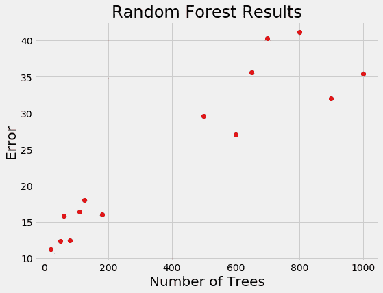
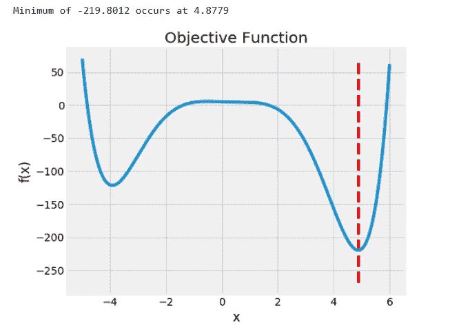
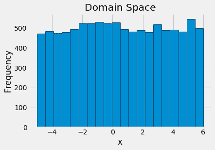
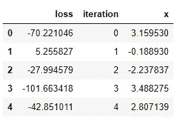
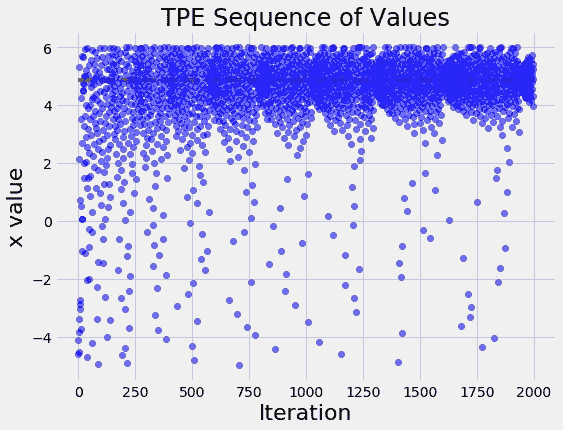
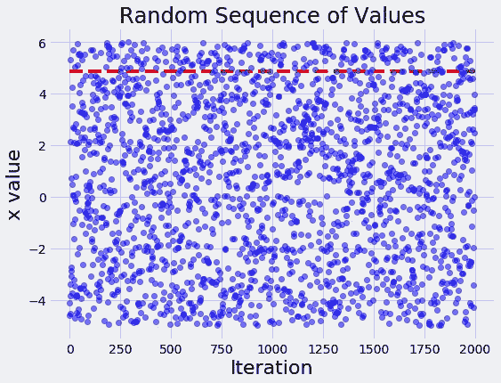
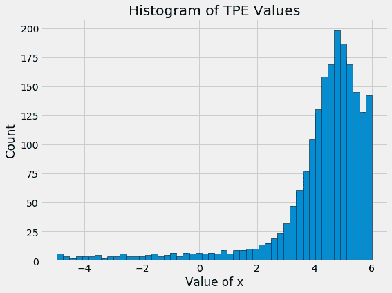
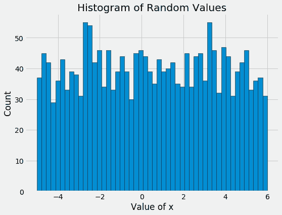

# 用 Hyperopt 实现 Python 中贝叶斯优化的介绍性示例

> 原文：<https://towardsdatascience.com/an-introductory-example-of-bayesian-optimization-in-python-with-hyperopt-aae40fff4ff0?source=collection_archive---------1----------------------->


## 学习强大优化框架基础的实践示例

虽然寻找一个函数的最小值可能看起来很平常，但这是一个延伸到许多领域的关键问题。例如，优化机器学习模型的超参数只是一个最小化问题:这意味着搜索验证损失最低的超参数。

[贝叶斯优化](https://sigopt.com/static/pdf/SigOpt_Bayesian_Optimization_Primer.pdf)是一种基于概率模型的方法，用于找到任何返回实值度量的函数的最小值。该函数可以简单到 f(x) = x，也可以复杂到深度神经网络关于数百个模型架构和超参数选择的验证误差。

[最近的结果](http://proceedings.mlr.press/v28/bergstra13.pdf)表明机器学习模型的[贝叶斯超参数优化](https://papers.nips.cc/paper/4522-practical-bayesian-optimization-of-machine-learning-algorithms.pdf)比手动、随机或网格搜索更有效，具有:

*   **测试集上更好的整体性能**
*   **优化所需的时间更少**

很明显，这么强大的方法一定很难使用，对吗？幸运的是，有许多 Python 库，比如 [Hyperopt](https://hyperopt.github.io/hyperopt/) ，允许简单应用贝叶斯优化。其实一行就可以做基本的贝叶斯优化！

Bayesian Optimization of a 1-D polynomial

如果你能理解上面代码中的一切，那么你大概可以停止阅读，开始使用这种方法。如果你想要更多的解释，在这篇文章中，我们将通过一个 Hyperopt 程序的基本结构，以便稍后我们可以将这个框架扩展到更复杂的问题，如机器学习超参数优化。这篇文章的代码可以在 GitHub 上的 [Jupyter 笔记本中找到。](https://github.com/WillKoehrsen/hyperparameter-optimization/blob/master/Introduction%20to%20Bayesian%20Optimization%20with%20Hyperopt.ipynb)

## 贝叶斯优化入门

优化是找到产生最低输出值的[目标函数](https://www.courses.psu.edu/for/for466w_mem14/Ch11/HTML/Sec1/ch11sec1_ObjFn.htm)的输入值或一组值，称为“损失”。目标函数 f(x) = x 具有单个输入，并且是一维优化问题。[通常，在机器学习](https://arxiv.org/abs/1502.02127)中，我们的目标函数是多维的，因为它接受一组模型超参数。对于低维中的简单函数，我们可以通过尝试许多输入值并查看哪一个产生最低损失来找到最小损失。我们可以创建一个输入值的网格，并尝试所有的值—网格搜索—或者随机选取一些值—随机搜索。只要目标函数的评估(“evals”)是廉价的，这些不知情的方法可能是足够的。然而，对于复杂的目标函数，如神经网络的 5 倍交叉验证误差，目标函数的每次评估意味着训练网络 5 次！

对于需要几天训练的模型，我们想要一种方法来*限制对评估函数*的调用。[对于高维问题，随机搜索实际上比网格搜索更有效](http://www.jmlr.org/papers/volume13/bergstra12a/bergstra12a.pdf)，但仍然是一种*统一方法*，其中搜索不使用先前的结果来挑选下一个输入值进行尝试。让我们看看你是否比随机搜索更聪明。假设我们从为回归任务训练随机森林中得到以下结果:



如果你选择下一批要评估的树，你会集中在哪里？很明显，最好的选择是 100 棵树左右，因为数量越少，损失越小。你基本上已经在你的头脑中完成了贝叶斯优化:使用先前的结果，你形成了目标函数的[概率模型](http://www.statisticshowto.com/probabilistic/),该模型表示更少数量的树可能导致更低的误差。

[贝叶斯优化](https://papers.nips.cc/paper/4522-practical-bayesian-optimization-of-machine-learning-algorithms.pdf)，也称为[基于序列模型的优化(SMBO)](https://arimo.com/data-science/2016/bayesian-optimization-hyperparameter-tuning/) ，通过建立目标函数的概率模型来实现这一思想，该模型将输入值映射到损失概率:p(损失|输入值)。概率模型，也称为[代理或响应面](https://en.wikipedia.org/wiki/Surrogate_model)，比实际的目标函数更容易优化。贝叶斯方法通过将一个标准(通常是[预期改进](https://www.cse.wustl.edu/~garnett/cse515t/spring_2015/files/lecture_notes/12.pdf))应用于代理来选择下一个要评估的值。**其概念是通过花更多时间选择下一个要尝试的值来限制目标函数的评估。**

[贝叶斯推理](https://en.wikipedia.org/wiki/Bayesian_inference)意味着基于新的证据更新模型，并且，随着每次评估，替代物被重新计算以结合最新的信息。算法运行的时间越长，代理函数就越接近实际的目标函数。[贝叶斯优化方法](https://static.sigopt.com/b/20a144d208ef255d3b981ce419667ec25d8412e2/pdf/SigOpt_Bayesian_Optimization_Primer.pdf)在构造替代函数的方式上有所不同:常见的选择包括高斯过程、随机森林回归，以及在 Hyperopt 中的选择 [Tree Parzen 估计器(TPE)](https://papers.nips.cc/paper/4443-algorithms-for-hyper-parameter-optimization.pdf) 。

这些方法的细节可能有点难以理解(我在这里写了一个高层次的[概述)，并且也很难找出哪个工作得最好:如果你阅读算法设计者的文章，每个人都声称他们的方法是优越的！然而，特定的算法并不像从随机/网格搜索升级到贝叶斯优化那样重要。使用任何库(](/a-conceptual-explanation-of-bayesian-model-based-hyperparameter-optimization-for-machine-learning-b8172278050f)[留兰香](https://github.com/HIPS/Spearmint)，远视， [SMAC](https://www.cs.ubc.ca/labs/beta/Projects/SMAC/) )都可以上手！记住这一点，让我们看看如何将贝叶斯优化付诸实践。

## Hyperopt 中的优化示例

在 hyperpt 中公式化一个优化问题[需要四个部分:](https://hyperopt.github.io/hyperopt/)

1.  **目标函数:**接受一个输入并返回一个损失以最小化
2.  **域空间:**要评估的输入值的范围
3.  **优化算法:**用于构造代理函数和选择下一个要评估的值的方法
4.  **结果:**算法用来建立模型的分数、值对

一旦我们知道如何指定这四个部分，它们就可以应用于任何优化问题。现在，我们将讨论一个基本问题。

## 目标函数

目标函数可以是任何返回我们想要最小化的真实值的函数。(如果我们有一个想要最大化的值，比如精度，那么我们只需要让函数返回这个度量的负值。)

这里我们将使用多项式函数，代码和图形如下所示:



这个问题是一维的，因为我们正在优化单个值 x。在 Hyperopt 中，目标函数可以接受任意数量的输入，但必须返回单个损失以最小化。

## 领域空间

域空间是我们想要搜索的输入值。作为第一次尝试，我们可以在函数定义的范围内使用均匀分布:

```
from hyperopt import hp# Create the domain space
space = hp.uniform('x', -5, 6)
```

为了可视化该域，我们可以从空间中抽取样本并绘制直方图:



Uniform domain space

如果我们知道最佳值在哪里，那么我们可以创建一个更智能的域，将更多的概率放在得分更高的区域。(关于在这个问题上使用正态分布的例子，见笔记本[。)](https://github.com/WillKoehrsen/hyperparameter-optimization)

## 最优化算法

虽然这在技术上是最困难的概念，但在 Hyperopt 中创建一个优化算法只需要一行代码。我们正在使用[树形结构的 Parzen 评估模型](https://github.com/hyperopt/hyperopt/blob/master/hyperopt/tpe.py)，我们可以让 Hyperopt 使用`suggest`方法为我们配置它。

```
from hyperopt import tpe# Create the algorithm
tpe_algo = tpe.suggest
```

幕后有很多我们不必担心的理论！在笔记本中，我们也使用随机搜索算法进行比较。

## 结果(试验)

这并不是绝对必要的，因为 Hyperopt 会在内部跟踪算法的结果。然而，如果我们想要检查算法的进展，我们需要创建一个`Trials`对象来记录值和分数:

```
from hyperopt import Trials# Create a trials object
tpe_trials = Trials()
```

## 最佳化

现在问题定义好了，就可以最小化我们的目标函数了！为此，我们使用`fmin`函数，该函数接受上述四个部分，以及最大数量的试验:

```
**{'x': 4.878208088771056}**
```

对于这次运行，该算法在不到 1000 次试验中找到了 x 的最佳值(使损失最小化的值)。最佳对象只返回使函数最小化的输入值。虽然这是我们正在寻找的，但它并没有给我们太多的方法。要获得更多细节，我们可以从 trials 对象获得结果:



可视化对于直观理解正在发生的事情很有用。例如，让我们按顺序绘制 x 的值:



随着时间的推移，输入值聚集在红线所示的最佳值周围。这是一个简单的问题，因此算法在寻找 x 的最佳值时没有太大的困难。

为了与简单的搜索形成对比，如果我们用随机搜索运行同样的问题，我们会得到下图:



随机搜索基本上是随机尝试值！当我们查看 TPE 算法和随机搜索的 x 值的直方图时，这些值之间的差异变得更加明显:



在这里，我们看到了基于贝叶斯模型的优化的主要好处:更加关注有希望的输入值。当我们搜索几十个参数，并且每个评估需要几个小时或几天的时间时，减少评估的次数是至关重要的。贝叶斯优化通过基于以前的结果推理将来应该尝试什么输入值来最小化评估的次数。

(在这种情况下，由于基本的一维目标函数和评估次数，随机搜索实际上找到了非常接近最优的 x 值。)

## 后续步骤

一旦我们掌握了如何最小化一个简单的函数，我们就可以把它扩展到任何需要优化一个返回实值的函数的问题。例如，调整机器学习模型的超参数只需要对基本框架进行一些调整:目标函数必须接受模型超参数并返回验证损失，域空间需要特定于模型。

为了了解这看起来像什么，我写了一个笔记本，在那里我调整了梯度推进机器的超参数，这将是下一篇文章！

# 结论

基于贝叶斯模型的优化是直观的:根据过去的结果选择下一个输入值进行评估，以集中搜索更有希望的值。最终结果是，与无信息随机或网格搜索方法相比，减少了搜索迭代的总次数。虽然这只是一个简单的例子，但是我们可以将这里的概念用于各种有用的情况。

这篇文章的要点是:

1.  贝叶斯优化是一种通过构建目标函数的概率(替代)模型来寻找函数最小值的有效方法
2.  代理由过去的搜索结果通知，并且通过从该模型中选择下一个值，搜索集中在有希望的值上
3.  这些方法的总体结果是减少搜索时间和更好的价值
4.  这些强大的技术可以在 Hyperopt 这样的 Python 库中轻松实现
5.  贝叶斯优化框架可以扩展到复杂的问题，包括机器学习模型的超参数调整

一如既往，我欢迎反馈和建设性的批评。可以通过推特 [@koehrsen_will](http://twitter.com/@koehrsen_will) 联系到我。