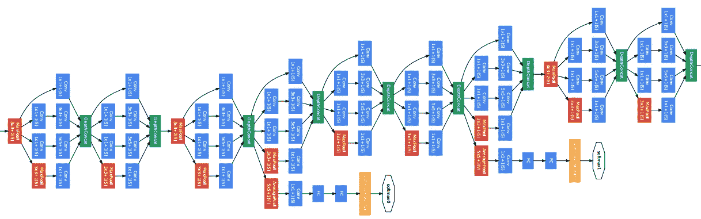
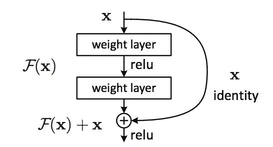
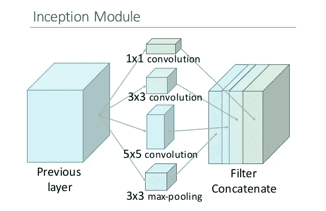
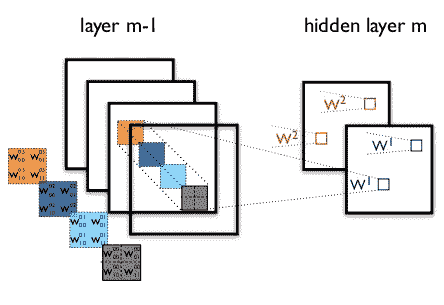
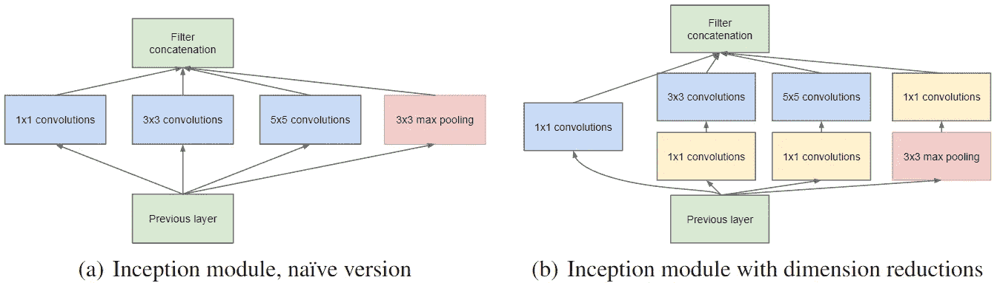
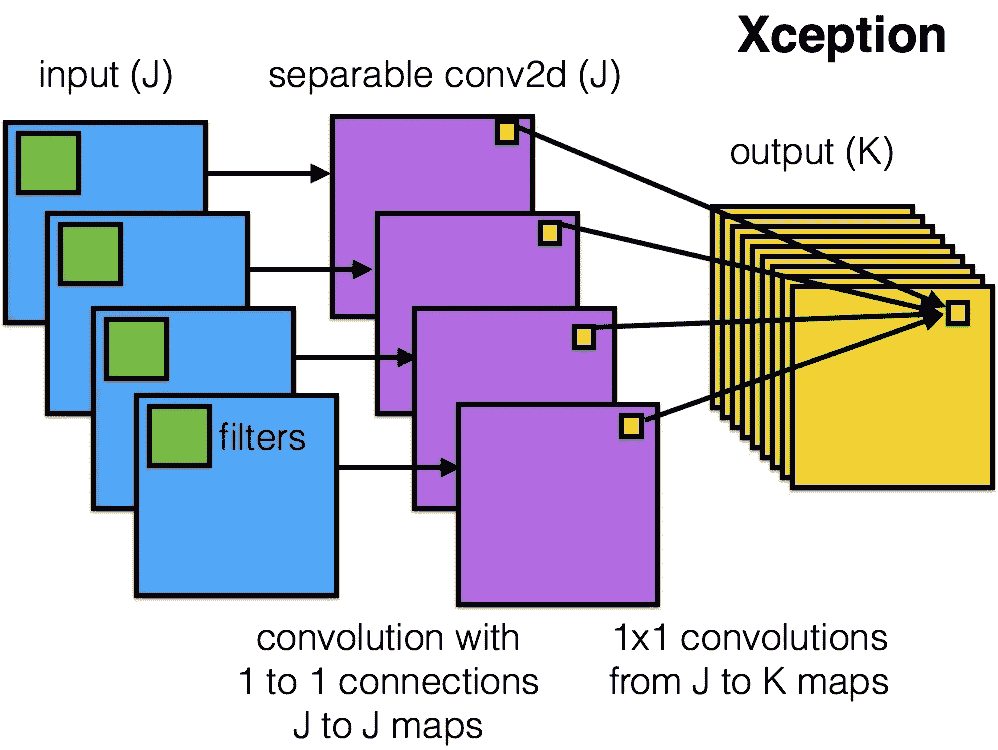

# 深层网络架构的直观指南

> 原文：<https://towardsdatascience.com/an-intuitive-guide-to-deep-network-architectures-65fdc477db41?source=collection_archive---------0----------------------->

GoogLeNet, 2014

在过去的几年里，计算机视觉深度学习的许多进展都可以归结为少数几个神经网络架构。抛开所有的数学、代码和实现细节，我想探索一个简单的问题:这些模型如何以及为什么工作？

在撰写本文时，Keras 附带了六个已经内置到库中的预训练模型[:](https://keras.io/applications/)

*   VGG16
*   VGG19
*   ResNet50
*   盗梦空间 v3
*   例外
*   MobileNet

VGG 网络，以及 2012 年的早期 AlexNet，遵循基本 conv 网络的原型布局:一系列卷积、最大池和激活层，最后是一些全连接的分类层。MobileNet 本质上是针对移动应用程序优化的 Xception 架构的简化版本。然而，剩下的三个真正重新定义了我们看待神经网络的方式。

这篇文章的其余部分将关注 ResNet、Inception 和 Xception 架构背后的直觉，以及为什么它们已经成为计算机视觉中许多后续工作的构建模块。

# 雷斯内特

ResNet 诞生于一个非常简单的观察:*为什么当你不断增加层数时，非常深的网络表现更差*？

直觉上，较深的网络应该不会比较浅的网络表现差，至少在训练时(没有过度拟合的风险)。作为一个思想实验，假设我们已经建立了一个具有 *n* 层的网络，它达到了一定的精确度。至少，具有 *n+1* 层的网络应该能够实现完全相同的精度，只要通过复制相同的前 *n* 层并对最后一层执行身份映射即可。类似地， *n+2* 、 *n+3* 和 *n+4* 层的网络都可以继续执行身份映射并达到相同的精度。然而，在实践中，这些更深的网几乎总是降低性能。

ResNet 的作者将这些问题归结为一个假设:*直接映射很难学习*。他们提出了一个解决方案:不要试图学习从 x 到 H(x)的潜在映射，而是学习两者之间的*差异*，或者“残差”然后，为了计算 H(x ),我们可以将残差加到输入中。

假设残差是 F(x)=H(x)-x，现在我们的网不是试图直接学习 H(x)，而是试图学习 F(x)+x。

这就产生了您可能见过的著名的 ResNet(或“剩余网络”)块:

ResNet block

ResNet 中的每个“块”由一系列层和一个将块的输入添加到其输出的“快捷”连接组成。“添加”操作是按元素执行的，如果输入和输出的大小不同，可以使用零填充或投影(通过 1x1 卷积)来创建匹配的维度。

如果我们回到我们的思想实验，这大大简化了我们身份层的构建。直观地说，学习将 F(x)推至 0 并将输出保留为 x 比从头开始学习一个恒等式转换要容易得多。一般来说，ResNet 给层一个“参考”点——x——来开始学习。

这个想法在实践中非常有效。以前，深度神经网络经常遇到[消失梯度](https://en.wikipedia.org/wiki/Vanishing_gradient_problem)的问题，其中来自误差函数的梯度信号随着它们反向传播到更早的层而呈指数下降。本质上，当错误信号一路传回到早期层时，它们已经小到网络无法学习了。然而，由于 ResNets 中的梯度信号可以通过快捷连接直接返回到早期层，我们可以突然构建 50 层、101 层、152 层，甚至(显然)1000+层的网络，仍然表现良好。在当时，这是一个*巨大的*飞跃，超越了之前以 22 层赢得 ILSVRC 2014 挑战赛的最先进技术。

ResNet 是我个人最喜欢的神经网络领域的发展之一。如此多的深度学习论文在没有考虑模型的底层任务的情况下，从数学、优化和训练过程的黑客攻击中获得了微小的改进。ResNet 从根本上改变了我们理解神经网络及其学习方式的方式。

有趣的事实:

*   1000+层网是开源的！我不会*真的*建议你重新训练它，[但是……](https://github.com/KaimingHe/resnet-1k-layers)
*   如果您觉得功能强大，有点兴奋，我最近将 ResNet50 移植到了开源的 Clojure ML 库 [Cortex](https://github.com/thinktopic/cortex) 。尝试一下，看看它与 Keras 相比如何！

# 开始

如果说 ResNet 是为了更深入，那么 Inception Family 则是为了更广泛。尤其是，《盗梦空间》的作者对训练大型网络的计算效率感兴趣。换句话说:*我们如何在不增加计算成本的情况下扩大神经网络的规模？*

最初的论文关注于深度网络的一个新的构建模块，这个模块现在被称为“初始模块”该模块的核心是两个关键见解的产物。

第一个见解与层操作有关。在传统的 conv 网络中，每一层都从前一层提取信息，以便将输入数据转换成更有用的表示。但是，每种图层类型提取不同种类的信息。5x5 卷积内核的输出告诉我们不同于 3x3 卷积内核的输出，3x 3 卷积内核告诉我们不同于 max-pooling 内核的输出，等等。在任何给定的层，我们如何知道什么转换提供了最“有用”的信息？

洞察力#1:为什么不让模型选择？

一个初始模块在同一输入映射上并行计算*多个不同的变换*，将它们的结果连接成一个输出。换句话说，对于每一层，Inception 做一个 5x5 的卷积变换，*和*一个 3x3，*和*一个 max-pool。模型的下一层决定是否(以及如何)使用每条信息。

这种模型架构增加的信息密度带来了一个突出的问题:我们急剧增加了计算成本。不仅大的(例如 5×5)卷积滤波器计算起来固有地昂贵，并排堆叠多个不同的滤波器极大地增加了每层的特征图的数量。这种增长成为我们模型中的致命瓶颈。

这么想吧。对于添加的每个额外滤波器，我们必须对所有输入映射进行卷积，以计算单个输出。参见下图:从单个过滤器创建一个输出贴图涉及到计算来自前一层的每一个贴图。

假设有 *M* 个输入映射。一个额外的过滤器意味着对更多的地图进行卷积； *N* 额外的过滤器意味着对 *N*M* 更多的地图进行卷积。换句话说，正如作者指出的，“任何[过滤器]数量的均匀增加都会导致计算量的二次增加。”我们天真的初始模块只是将过滤器的数量增加了三倍或四倍。从计算上来说，这是一件大坏事。

这导致了洞察力#2:使用 1x1 卷积来执行维度缩减。为了解决计算瓶颈，Inception 的作者使用 1x1 卷积来“过滤”输出的深度。1x1 卷积一次只查看一个值，但在多个通道中，它可以提取空间信息并将其压缩到更低的维度。例如，使用 20 个 1×1 过滤器，大小为 64×64×100(具有 100 个特征地图)的输入可以被压缩到 64×64×20。通过减少输入映射的数量，Inception 的作者能够并行堆叠不同的层转换，从而产生同时深(许多层)和“宽”(许多并行操作)的网络。

这种方法效果如何？《盗梦空间》的第一个版本被称为“GoogLeNet”，是我前面提到的 ILSVRC 2014 竞赛的 22 层冠军。Inception v2 和 v3 是在一年后的第二篇论文中开发的，并在几个方面对原始版本进行了改进——最显著的是通过将较大的卷积重构为更容易学习的连续较小的卷积。例如，在 v3 中，5×5 卷积被替换为 2 个连续的 3×3 卷积。

《盗梦空间》迅速成为一个定义性的模型架构。Inception 的最新版本 v4 甚至在每个模块中加入了剩余连接，创造了 Inception-ResNet 的混合体。然而，最重要的是，Inception 展示了设计良好的“网络中的网络”架构的力量，为神经网络的表现能力又增加了一步。

有趣的事实:

*   最初的《盗梦空间》论文字面上引用了“[我们需要更深入](http://knowyourmeme.com/memes/we-need-to-go-deeper)”互联网迷因作为其名称的灵感。这一定是 knowyourmeme.com 第一次被列为谷歌论文的第一参考文献。
*   第二篇启始论文(包含 v2 和 v3)是在最初的 ResNet 论文后一天发布的。2015 年 12 月是深度学习的好时机。

# 例外

Xception 代表“极限盗梦空间”很像我们之前的两个架构，它重新构建了我们看待神经网络的方式——特别是 conv 网络。顾名思义，它将盗梦空间的原则发挥到了极致。

这里有一个假设:“*跨通道相关性和空间相关性是充分解耦的，因此最好不要将它们一起映射*

这是什么意思？嗯，在传统的 conv 网中，卷积层寻找跨越*空间*和*深度*的相关性。让我们再来看看我们的标准卷积层:

在上图中，过滤器同时考虑了空间维度(每个 2x2 彩色正方形)和跨通道或“深度”维度(四个正方形的堆叠)。在图像的输入层，这相当于卷积滤镜在所有三个 RGB 通道上查看一个 2x2 像素块。问题来了:有什么理由需要我们同时考虑图像区域和通道呢？

在《盗梦空间》中，我们开始将两者稍微分开。我们使用 1x1 卷积将原始输入投影到几个独立的更小的输入空间，并从每个输入空间中使用不同类型的过滤器来转换这些更小的 3D 数据块。Xception 更进一步。它不是将输入数据划分为几个压缩块，而是分别映射*每个输出通道的空间相关性*，然后执行 1x1 深度方向卷积来捕获跨通道相关性。

作者指出，这基本上等同于一种称为“深度方向可分离卷积”的现有操作，它由一个*深度方向卷积*(为每个通道独立执行的空间卷积)和一个*点方向卷积*(跨通道的 1x1 卷积)组成。我们可以认为这是首先在 2D 空间寻找相关性，然后在 1D 空间寻找相关性。直观地说，这种 2D + 1D 映射比完全的 3D 映射更容易学习。

而且很管用！在 ImageNet 数据集上，Xception 略微优于 Inception v3，在具有 17，000 个类的更大的图像分类数据集上，xception 远远优于 Inception v3。最重要的是，它与 Inception 具有相同数量的模型参数，这意味着更高的计算效率。Xception 要新得多(它于 2017 年 4 月问世)，但如上所述，它的架构已经在通过 MobileNet 为谷歌的移动视觉应用提供支持。

有趣的事实:

*   Xception 的作者也是 Keras 的作者。弗朗索瓦·乔莱是活着的上帝。

# 走向

ResNet，Inception，Xception 就是这样！我坚信对这些网络有很强的直觉理解，因为它们在研究和工业中无处不在。我们甚至可以在自己的应用程序中使用它们，这种应用程序叫做*迁移学习*。

[迁移学习](http://cs231n.github.io/transfer-learning/)是机器学习中的一种技术，在这种技术中，我们将来自源领域(例如 ImageNet)的知识应用到可能具有明显更少数据点的目标领域。在实践中，这通常包括用来自 ResNet、Inception 等的预训练权重来初始化模型。或者将其用作特征提取器，或者微调新数据集的最后几个图层。通过迁移学习，这些模型可以重新用于我们想要的任何相关任务，从自动驾驶汽车的物体检测到为视频剪辑生成字幕。

为了开始迁移学习，Keras 有一个很棒的微调模型指南[这里](https://blog.keras.io/building-powerful-image-classification-models-using-very-little-data.html)。如果你觉得这很有趣，那就去看看吧——祝你黑客生涯愉快！