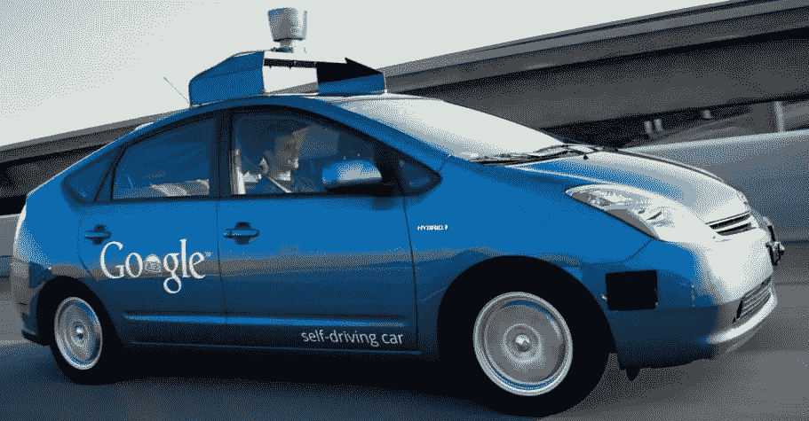
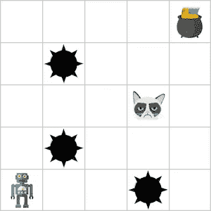
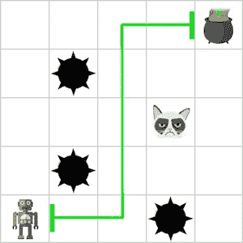
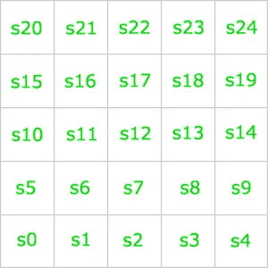
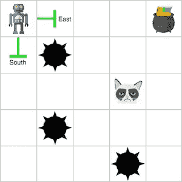
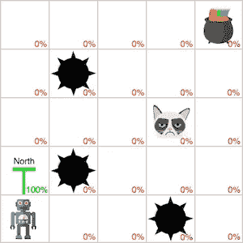
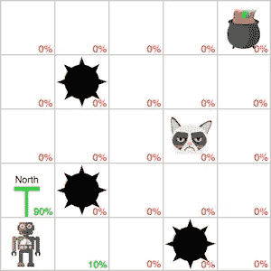
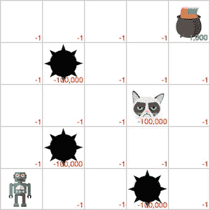
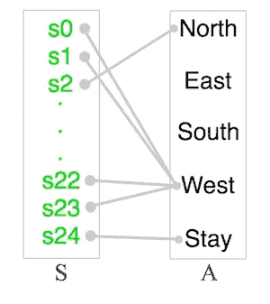
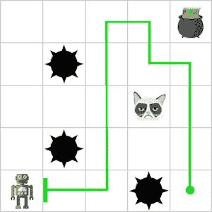

# 机器人是如何做决定的？

> 原文：<https://towardsdatascience.com/an-intuitive-guide-to-mdps-4cde2d441e8a?source=collection_archive---------7----------------------->

简而言之，我们经常希望赋予机器人对环境进行推理的能力，以便让它们达到目标。例如，自动驾驶汽车必须想出一条从你家到杂货店的好路线，更重要的是，它必须考虑当它到达十字路口时要做什么，以避免撞到汽车、人、标志、建筑物等。

Source: [CBS News](http://www.cbsnews.com/news/googles-self-driving-cars-learn-how-to-honk/)

那么我们怎样才能让机器人思考呢？这就是这篇文章的切入点。虽然我不能涵盖人工智能、机器人、机器学习和控制理论的每个方面，但让我们来看一个简单的例子。

# 网格世界

假设我们是一个寻宝者，正在寻找藏在世界某处的一罐金子。为了简单起见，让我们假设我们的世界不是地球，而是一个 *5×5* 网格。为了寻找宝藏，我们可以通过向北、向东、向南或向西从一个牢房移动到另一个牢房。此外，虽然我们对这个世界一无所知，但我们至少知道其中一个细胞里有宝藏。因此，如果我们能够成功地在世界上航行并找到宝藏，我们将会变得无比富有。不幸的是，有一个陷阱。虽然世界上大多数的牢房都是空的，但也有一些牢房里有陷阱，就像一个怪物或一个刺坑。如果我们不小心进入任何一个细胞，我们都会痛苦地死去。

既然我们想发财而不死，我们需要想出一个既能找到宝藏又能避开陷阱的计划。在我们的例子中，**计划**只是我们从当前位置到目标州(例如宝藏)可以采取的一系列行动(例如，北、东、南或西)。在我们完成计划中的每一个行动后，我们将会到达宝藏(这意味着我们不是怪物的晚餐)。听起来很简单，对吧？只要(1)想出一个从我们当前位置到宝藏的计划，然后(2)通过做建议的行动来遵循该计划，最后(3)收获无限财富的回报。

可悲的是，这并不容易。即使在这样一个简单的问题中，这可能是微不足道的，但在现实世界中，想出一个计划要难得多。事实上，如果我们有一个更难的问题，为了制定计划，我们需要用数学模型来表示它。因此，在我们可以将一张漂亮的支票存入银行账户之前，我们需要将我们的寻宝场景转换为一个数学模型，我们可以使用许多不同的规划和强化学习算法中的一种来求解该模型。

现在，我们需要解决一个大问题:

**我们如何想出一个数学模型来描述我们的场景，这样我们就可以在不被钉子刺穿或被怪物吃掉的情况下抢走宝藏？**

# MDPs

为了模拟任何这样的场景，我们可以使用一个**马尔可夫决策过程** ( **MDP** )。MDP 是我们刚刚看到的那类问题的正式表示。一般来说，它有四个部分。让我们来看看每个部分。

## **州**

集合 *S* 包含了世界上的每一个状态。在我们的寻宝世界(提醒一下，它是一个 *5×5* 网格)中，每个单元格对应一个州。这意味着我们有一组 25 个状态:

*S = {s0，s1，…，s24}*

为了方便起见，这里有一张标示世界各州的图片:

## 行动

集合 *A* 包含了**代理**在世界上可以采取的每一个动作。对了，如果你不知道什么是经纪人，那只是世界上的演员。它可能是你，一个机器人，一辆汽车，或者任何遵循计划的东西。无论如何，在我们的例子中有一组五个动作:

*A = {北，东，南，西，停留}*

为什么我们有一个*停留*行动？一旦找到宝藏，我们就可以坐在那里。在我们努力工作之后，一旦我们发现了宝藏，我们就不想离开它。

请记住，每个状态都有某些限制代理可用操作的约束。例如，如果我们在世界的一个角落，比如说左上角，我们不能向北*或向西*移动*或*，因为我们在世界的边界。我们通常将给定状态下可用的动作表示为。因此，如果我们在世界的右上角， *s20* ，这些将是代理唯一可用的操作:

*A(s20)= {东，南，停留}*

这种可视化可能会有所帮助:

## 过渡

函数 *T(s，a)* 是**转换函数**。如果代理在状态 *s* 中执行动作 *a* ，它返回世界 *S* 的每个可能状态的概率分布。例如，如果我们在世界的左下角，比方说， *s0* ，我们执行动作*北*，函数 *T(s0，北)*将返回以下概率分布:

*【s0:0.0，s1: 0.0，…，s5: 1.0，…，s24: 0.0，s25:0.0】*

如果我们在状态 *s0* 中执行动作*北*，这个符号只是分配进入世界每个状态的概率。既然我们的世界是**确定性**，那么状态 *s5* 就有 *1.0* 的概率。看看这个就明白我的意思了:

然而，在现实世界的例子中，行动的结果通常是**概率**或**随机**。这意味着一个动作可能会导致不同的状态，而不仅仅是像我们的例子那样。在一个更现实的 MDP，我们也许可以把滑倒的概率与每一个动作联系起来。因此，即使我们执行了动作*北*，我们也可能会滑倒，并意外地在错误的状态中结束。这在机器人领域经常发生:

现在，让我们假设我们有一个确定性的世界来简化事情。

## 奖励

函数 *R(s，a)* 就是**奖励函数**。它返回代理在状态 *s* 中执行动作 *a* 后的奖励。在我们的世界里，假设宝藏在世界的右上角 *s23* 。因此，如果我们处于状态 *s23* ，即 *s24* 以东的单元格，并且我们执行了动作*西*，函数 *R(s24，西)*将返回*1000*，因为我们找到了宝藏。形式上，我们应该这样写:

*R(s23，西)= 1000*

在任何空单元格中执行任何动作都将返回奖励 *-1* ，因为在空单元格上重复移动应该会有一些相关的成本。如果没有，我们可以在找到宝藏之前绕着世界转几圈，而不会受到任何惩罚。为了节省时间，我们宁愿走最短的路去寻宝。

不幸的是，如果我们降落在一个有怪物或刺坑的州，我们会得到 *-100，000* 的奖励。这个高负数代表我们的死亡。我们可能会不惜一切代价避免这种情况，除非我们是一个相当虐待狂的寻宝者。

简而言之，这就是我们的奖励世界的样子:

这四个部分完全说明了我们在第一部分中概述的问题。但所有这些都给了我们一种方法，将问题数学建模为 MDP。换句话说，虽然我们现在有了一个代表 MDP 的场景，但是我们仍然没有找到得到宝藏应该遵循的计划。我们如何着手做那件事？也就是我们应该采取什么行动才能得到宝藏，避免死亡？有许多奇特的算法，我们可以用来为我们的 MDP 获得最佳计划。然而，在我们谈论那个之前，让我们多谈一点什么是计划。

# 政策

在计划中，我们通常制定一个计划作为**政策**。顺便说一句，这只是一种真实，但现在让我们继续下去。总之，什么是政策？它只是一张地图，将世界上的每一个州与推荐的行动联系起来:

更正式一点，策略 *π* 是每个状态 *s* 和动作 *a* 之间的映射:

*π(s) = a*

太好了，贾斯汀！我想我现在明白什么是政策了。为什么我们需要一个？为什么我们要将动作映射到状态？策略很重要，因为它指定了代理在世界的每个状态下应该采取的动作。例如，让我们假设代理处于状态 *s23* ，它直接位于球门的东面。为了弄清楚要采取什么行动，我们将取出我们的策略来查看在 *s23* 中要执行什么行动。在一个理想的世界里，我们的政策应该告诉我们这一点(因为这会使我们走向宝藏):

*π(s23) =西*

然而，重要的是要注意，我们的政策并不一定要将每个州与一个好的行动联系起来。政策只是把状态和行动联系起来的东西，仅此而已。我们可以有很多政策，在所有的垃圾政策中，我们需要找到最好的一个。如果我们遵循一个糟糕的政策，我们可能会避开宝藏，做这样的事情:

注意我们是如何走过宝藏的。是啊，那可不好。另一方面，如果我们找到了**最优策略**(或者我们所能拥有的最佳策略)，这就是我们要做的:

既然我们知道什么是 MDP，什么是政策，现在最大的问题是:

**在我们将问题建模为 MDP 之后，我们如何在所有的坏政策中找到最好的政策？**

# 规划和强化学习

虽然我不能深入这个问题，因为我可以写 10 本很长的教科书来解释每个细微差别，但有许多跨越规划和强化学习的算法可以用来解决 MDP。为了让你对那里有什么有个概念，这里有一个我们可以使用的一些基本算法的快速列表:

*   价值迭代
*   策略迭代
*   TD 学习

如果您继续关注，我可能会在接下来的几周内就每个算法写一篇文章。