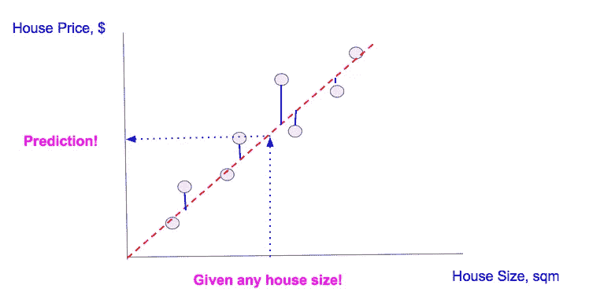
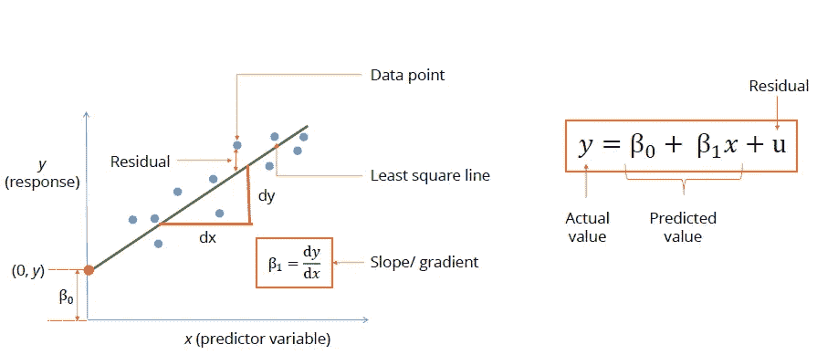
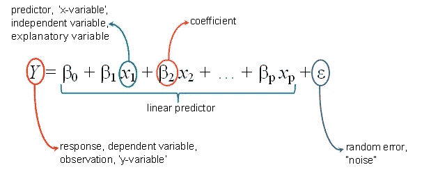
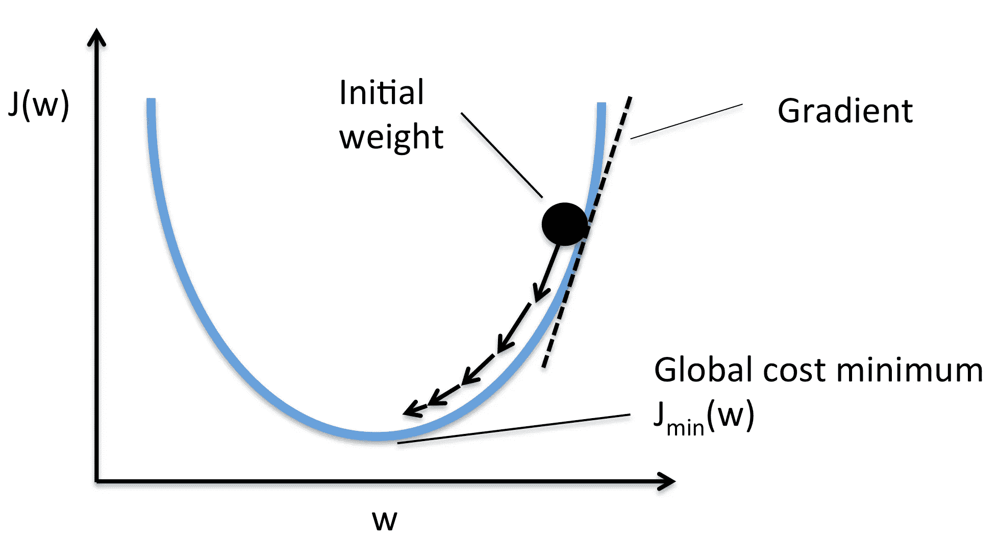

# 线性回归的直观透视

> 原文：<https://towardsdatascience.com/an-intuitive-perspective-to-linear-regression-32bb9885b312?source=collection_archive---------10----------------------->

Credit: Unsplash

# 线性回归是最简单但有效的机器学习算法

所以，你在互联网上搜寻了解线性回归后来到这里，我必须说你的搜索到此结束。

所以不要再等了，让我们直接开始吧。

> “泛化是任何机器学习算法的最终目标”

机器学习算法试图解决的两种主要问题是:

*   回归-预测给定数据点的连续值
*   分类-预测给定数据点的类别

线性回归，直观上是一种采用线性方法的回归算法。我们试图通过对现有数据进行归纳来预测给定数据点的连续值。线性部分表示我们使用线性方法对数据进行归纳。

# 一个例子

例子让它变得容易理解，所以假设你想通过知道房子的大小来预测它的价格。你有一些房价和相应大小的数据。绘制数据图表并在它们之间拟合一条线将看起来像这样:

概括地说，你画一条穿过最大值点的直线。一旦你得到那条线，对于任何大小的房子，你只要把数据点投影到那条线上，就可以得到房价。

就是这样。你完了。但是等等！

# 真正的问题是

问题是永远找不到房价。问题是找到能很好地概括数据的最佳拟合线。

使用了相同的旧直线方程: ***y = mx +c*** ，并添加了一些专门用于线性回归建模的术语。

我们将逐一检查等式的元素:

*   *y* —要预测的数值
*   *β₀ —* 直线的 y 轴截距是指直线与 y 轴的交点
*   *β*₁-线的斜率或梯度表示线有多陡
*   *x* —数据点的值
*   *u*——不明原因造成的残留或噪音

似乎我们可以通过试凑法很容易地得出最佳参数值，从而找到最佳拟合线。但是当你要解决的问题有更多维度时，事情就没那么简单了，这也被称为**维度的诅咒**。

Multiple Linear Regression

多元线性回归将有 n 个特征，我们必须找到一条线来拟合所有维度的所有数据点。你已经开始意识到这不再是一个试凑法的解决方案。

# 数学拯救世界

我们可以画出无限多条线，但永远无法确定这条线是否是最佳拟合线，所以我们的救星来了:**成本函数**

> “数学是科学女王”

我一生都在逃避数学，但你看，你就是无法逃避它。这真的很直观，让你能够看到引擎盖下发生了什么。

成本函数是一种数学构造，通过将误差平方项相加来计算

Mean Squared Error

通过稍微调整上面的等式，我们得到下面的等式:

其中 *J* 是成本符号， *θ* 是参数

我们的目标是降低成本函数，从而提高精度。我们可以通过试凑法获得参数值，并计算每个参数组合的 MSE，但这不是一种有效的技术。似乎这个问题有一个微积分解决方案。

# 梯度下降

梯度下降是一种简单的优化技术，用于寻找任何函数的最小值，在这种情况下，我们希望找到我们的 MSE 函数的最小值。

Gradient Descent

你可以把这个函数想象成一个山谷，你正站在某个随机的点上。你的目标是到达山谷的最底部，梯度下降帮助你到达山谷的最底部。

**你可以这样做:**

你会看到并弄清楚山谷的斜坡在哪里向下，然后你开始向向下的斜坡走去。一旦你看到你周围的每一个轮廓都比你站的地方高，你就声称你已经到达了最低点。

**这里是梯度下降将如何做到这一点:**

它必须知道山谷的斜坡在哪里(它不像你一样有眼睛)，所以它需要数学的帮助。

要知道函数在任一点的斜率，就要对该点的参数进行微分，因此梯度下降法对上述成本函数进行微分，从而得到该点的斜率。

为了到达最底部的点，它必须沿着与斜率相反的方向，即斜率减小的地方。

它必须一小步一小步地向最低点移动，因此学习率决定了梯度下降将采取的步长。

每次移动后，它验证当前位置是否是全局最小值。这通过该点的斜率来验证，如果斜率为零，则算法已经到达最底部的点。

在每一步之后，它更新参数(或权重),通过重复上述步骤，它到达最底部的点。

# 获胜

一旦你到达了谷底，这意味着你已经得到了对应于最小均方误差或成本函数的参数，这些参数值将为你带来最高的精度。

现在，您可以使用线性回归模型以非常高的精度预测任何不可预见的数据点的因变量。

如果你还和我在一起，那么你已经了解了线性回归的概念，并准备好应用它来解决现实世界中的问题。

# 线性回归的应用

1.  **销售驱动因素分析** —线性回归可用于根据过去的购买行为预测未来的产品销售
2.  **预测经济增长** —经济学家使用线性回归来预测一个国家或州的经济增长
3.  **得分预测** —体育分析师根据球员之前的表现，使用线性回归来预测他在接下来的比赛中的得分次数
4.  薪资估算——一个组织可以使用线性回归来计算出他们会根据工作经验付给新员工多少钱
5.  **房价预测** —线性回归分析可以帮助建筑商预测未来几个月能卖出多少房子，价格是多少
6.  **石油价格预测** —可以使用线性回归来预测石油价格

在接下来的文章中，我们将深入研究数学部分，并用 python 编写一个线性回归模型。

如果我能在任何方面改进这篇文章，请在下面的评论区给我反馈，或者给我发邮件到[sarfraz.contact@gmail.com](mailto:sarfraz.contact@gmail.com)