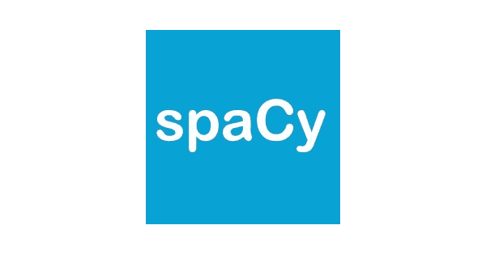
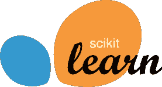
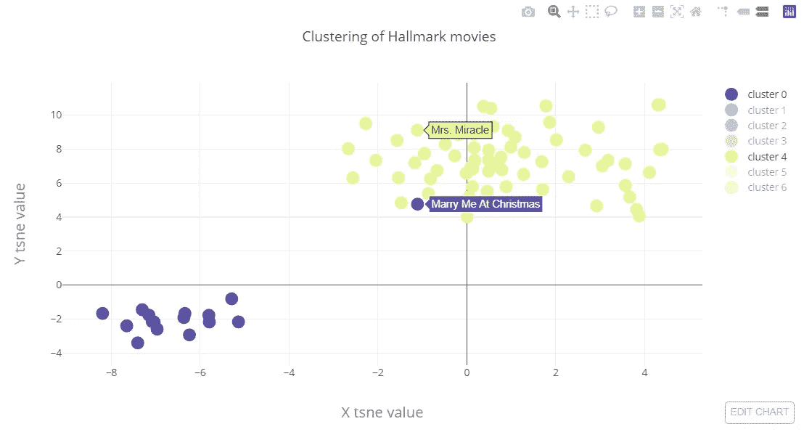

# 假日电影的 NLP 观点——第一部分:使用 Gensim 和 SKlearn 的主题建模

> 原文：<https://towardsdatascience.com/an-nlp-view-on-holiday-movies-part-i-topic-modeling-using-gensim-and-sklearn-5f7c15c8a65a?source=collection_archive---------24----------------------->


Photo by [Tom Coomer](https://unsplash.com/@tomcoomer?utm_source=medium&utm_medium=referral) on [Unsplash](https://unsplash.com?utm_source=medium&utm_medium=referral)

假期是家人、朋友、雪和我妻子关心的:老掉牙的假期电影的时间。

为了尝试帮助她永无止境的假日电影胃口，我们将检查我们是否可以创建一个新的圣诞电影。这篇博文由两部分组成:

*   第一部分:获取数据并尝试识别圣诞电影
*   第二部分:使用这个数据集尝试生成一个新的数据集

第一部分的代码可以在[这里找到](https://github.com/TDehaene/blogposts/blob/master/nlp_christmas/part_1_topic_modelling.ipynb)，完整的回购协议可以在[这里找到](https://github.com/TDehaene/blogposts/tree/master/nlp_christmas)。

# 电影

没有特别指向任何电影制作人，但就假日电影而言，霍尔马克是一座金矿。所以让我们试着去挖掘这些。

为此，我:

*   抓取了霍尔马克电影公司的维基百科页面([链接](https://en.wikipedia.org/wiki/List_of_Hallmark_Channel_Original_Movies))
*   解析 2000 - 2018 年的所有电影，获取片名和日期(使用 Beautifullsoup)

事实上:圣诞电影似乎正在蓬勃发展:

# 标题

我对我的妻子做了一个相当大胆的声明，所有的霍尔马克头衔只是“皇家”、“圣诞节”、“婚礼”、“王子”和“爱情”这些词的组合

让我们用数据来证明这一点！在 Spacy 的快速引理化之后，只有 8 个结果支持这个假设😕。其中最精彩的是《圣诞婚礼的尾巴》，谁能忘记《婚礼进行曲 2:诉诸爱情》。

然而，“圣诞节”仍然是迄今为止最流行的术语:

# 数据

我们没有每部电影的抄本，但我们会尽量使用英文字幕。它可能不像真实的抄本那样具有描述性，但是生成算法应该能够提取对话。

为此，我非常感谢地使用了“imdb”和“open subtitle”API 以及它们各自的 Python 包装器。

一旦有了这些链接，我们就可以用一个简单的脚本来获取数据:

# 提取圣诞电影:主题建模

虽然不是所有的电影都与训练数据相关，但是我们特别想提取圣诞节的电影。让我们看看是否可以创建一个主题模型来帮助我们:

## 预处理

在处理文本数据时，总是需要一些预处理，在这种情况下，我们需要:

*   从字幕中删除时间戳
*   删除一些特定的标签
*   让一切变得简单
*   过滤掉“人”实体
*   删除停用词
*   删除短于 1 的字符串元素(不必要的单词和标点)

词汇化和实体抽取使用 Spacy 完成，停用词使用 NLTK 移除。



在文本清理之后，让我们检查一个主题建模分析是否可以拾取电影中隐藏的主题。我预计会出现诸如“圣诞节”、“爱情”、“婚礼”(也许是“食物”)等话题。

我们将使用流行的潜在狄利克雷分配(LDA)算法。因为没有 Python 包应该在圣诞节被冷落，所以让我们同时使用 Gensim 和 Scikit-Learn。

## 使用 Gensim 的主题建模


从已处理文档的列表开始，在这种情况下，每个文档都是经过过滤的词条列表，我们可以轻松地进行如下分析:

## 使用 SKlearn



同样，我们可以使用 Scikit-Learn 进行 LDA 分析:

## 结果呢

对于 Gensim 算法:

```
**Topic: 0** 
Words: 0.046*"christmas" + 0.008*"ice" + 0.007*"la" + 0.006*"horn" + 0.006*"holiday" + 0.006*"ok" + 0.005*"ho" + 0.005*"santa"
**Topic: 1** 
Words: 0.015*"christmas" + 0.011*"chuckle" + 0.009*"ok" + 0.008*"sigh" + 0.005*"applause" + 0.004*"york"
**Topic: 2** 
Words: 0.026*"christmas" + 0.008*"ok" + 0.008*"wed" + 0.007*"chuckle" + 0.005*"sigh" + 0.004*"mm" + 0.003*"dog" + 0.003*"alright"
**Topic: 3** 
Words: 0.052*"christmas" + 0.012*"santa" + 0.011*"la" + 0.007*"wed" + 0.007*"ok" + 0.007*"holiday" + 0.006*"ha" + 0.005*"ho" + 0.004*"york" + 0.004*"merry"
**Topic: 4** 
Words: 0.008*"christmas" + 0.008*"sigh" + 0.005*"ok" + 0.004*"chuckle" + 0.004*"wed" + 0.004*"dog"
**Topic: 5** 
Words: 0.013*"wed" + 0.012*"%" + 0.008*"ok" + 0.006*"dog" + 0.004*"alright" + 0.004*"movie" + 0.004*"mama"
```

对于 SKlearn 算法:

```
**Topic 0:**
christmas mama king window turkey note corner process embarrass tea
**Topic 1:**
group golf hon i. mm birthday pot split pink successful
**Topic 2:**
ok wed alright farm bride cake christmas york marriage camp
**Topic 3:**
kill chase christmas disappoint empty mystery possibility chief awkward dr.
**Topic 4:**
christmas ok wed chuckle la sigh alright santa mm dog
**Topic 5:**
chef silver honestly dog idiot wed race deliver kick climb
```

所以没有一个能真正抓住我在寻找的东西。

*   在 Gensim 的分析中，“圣诞节”似乎太普遍了
*   在 SKlearn 的分析中，情况有所好转。我怀疑 TFIDF 矢量化方案与此有很大关系。例如，主题 2 看起来主要是婚礼电影。但是，圣诞节仍然无处不在。

# 计划 B:集群

作为后备计划，我想尝试在 TFIDF 矢量化文档上做一个简单的 K 均值聚类练习。

这非常简单:

然后，我们可以使用 T-SNE 将 TF-IDF 向量的维数降低到 2，并使用新的聚类来给点着色。

结果看起来足够好:

*(披露说明:我让我的妻子帮忙命名星团*👼)

*   **集群 0** 看起来主要是婚礼电影
*   **集群 1** 看起来像爱情电影一般
*   电影看起来像爱情电影，但是有一点奇幻色彩(皇室、女巫)
*   **集群 3** 电影好像是季节性爱情电影(收获，夏天)
*   **集群 4** 电影很明显圣诞电影:头奖！
*   电影:还不确定，我妻子坚持让我们看一些电影，以获得更好的感受。不会上当的…
*   **第六组**电影看起来像是带有“食物”元素的电影

一些很酷的事情打动了我:电影《在圣诞节嫁给我》是圣诞电影和婚礼电影的混合体。K-means 将它标记为婚礼电影，但正如我们所见，它也可能是一部圣诞电影:



总的来说，TF-IDF 确实有助于获得一个好的聚类结果。

好的，这个肯定可以。我们将把所有的“第 4 集”电影带入我们的下一步目标，制作我们自己的圣诞电影，在这篇博文的第二部分[。最终数据集(在 pandas 数据框架中)也可以在 repo 中找到。](https://medium.com/@thomas_dehaene/an-nlp-view-on-holiday-movies-part-ii-text-generation-using-lstms-in-keras-36dc1ff8a6d2)

那里见！