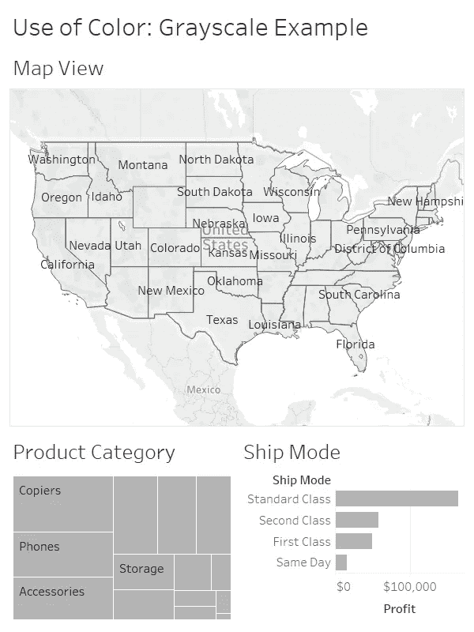

# 数据可视化中的色彩颂歌

> 原文：<https://towardsdatascience.com/an-ode-to-color-in-data-visualizations-3192399f43d0?source=collection_archive---------9----------------------->

数据可视化中颜色的使用在讲述一个故事时起着至关重要的作用。使用尽可能多的颜色使可视化看起来“漂亮”是很诱人的，尤其是作为数据可视化领域的初学者。我的建议是尽量避免在视图中使用太多的颜色。

如果使用颜色作为一种方法，将观众的注意力吸引到你想要在视觉上突出的特定点上，会更有效。

让我们看一个例子→如果我们以一个灰度(没有其他颜色)开始我们的可视化，然后思考我们想要讲述什么故事，我们可以使用颜色来帮助我们讲述这个故事。

下面的灰度仪表盘是起点。

这些图表试图回答的三个问题是:

1.哪些州最赚钱？

2.哪些产品类别利润最高？

3.哪种运输方式最有利可图？

由于这三个问题都与盈利能力有关，我们可以为“盈利能力”指定一种特定的颜色，并在整个仪表板中使用该颜色。

让我们用亮蓝色来显示这些不同属性的盈利水平。

将仪表板上的标题更改为**“跨各种属性的盈利能力”**，并将单词**“盈利能力”**更改为蓝色，有助于突出显示，并减少可能会扰乱视图的彩色图例的需要。它告诉观众，当你看到蓝色时，我们意味着它有更高的盈利能力。

下面是同一个仪表板，有效地使用颜色来讲述一个故事:

谨慎使用颜色非常重要，尤其是当您在仪表板上的多个工作表中使用一种颜色时。人们认为相同的颜色在所有工作表中都是相关的。

这是一个用颜色来讲述故事的小例子。你对色彩的运用有什么想法？下面是该仪表板的前后图像。

