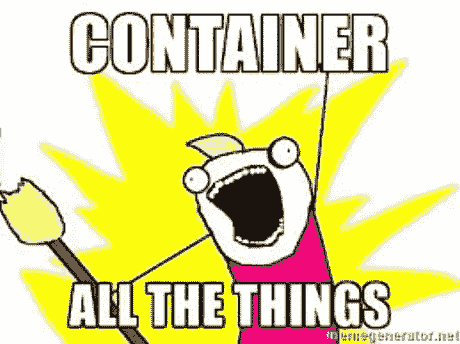

# 一个 R-docker hello world 的例子

> 原文：<https://towardsdatascience.com/an-r-docker-hello-world-example-881e771214e2?source=collection_archive---------3----------------------->


是的，我变成了那种“我们可以用集装箱装这个！”人们。

我保证我不仅仅是一个趋势追随者——容器技术对于我们为自己和客户构建定制分析应用的团队来说有着惊人的前景。

我们使用 R 统计编程语言/环境来构建从机器学习解决方案到报告仪表板的一切。r 对于分析和快速原型开发来说是一个很好的环境，但是它传统上是一个统计脚本环境，并且缺少一些传统编程语言的“生产就绪”特性。

> Docker 为我们提供了一种基于每个应用管理依赖项和库的方法(当在一个服务器上部署多个应用时)。
> 
> 这也意味着在我的机器上工作的东西有很好的机会在生产中工作。就这样，挽救了许多深夜恐慌。

# 关于本教程

这篇文章是我去年为我们公司的博客写的一篇博客的更新版本。它将带您完成构建、运行和连接一个运行 r 的 docker 容器的步骤

*   建立一个档案
*   建造一个容器
*   运行容器以服务于 Rstudio 环境
*   连接到该容器并运行脚本
*   将输出写回到主机上装载的数据文件夹中
*   喝一杯好茶来祝贺我们自己(开个玩笑——你可能自己就知道了)

要在家玩，从[我们的 github](https://github.com/SymbolixAU/r_docker_hello) 库克隆或下载目录。代码已经在 Linux 和 Mac 上测试过——你可能需要在 Windows 上做一些小的改动(请在评论中添加任何额外的提示)。

# 关于 Docker

Docker 是一个使用容器的管理系统/环境。**容器**建立在**主机**之上。它们共享相同的内核和硬件控制器，但可能有不同的 Linux 风格或库集。

我们设置容器**映像**,就像我们想要的容器的快照——所有的库、文件等等。然后我们**运行**容器来建立一个包含所有工作文件的临时实例。

> 完成后，我们**停止**容器，并且**所有数据和任何本地更改都将永远丢失。**

为了保存容器实例的输出，我们必须将数据写回主机或其他永久的地方。

对于这个例子，我假设你正在一台已经安装了 docker 的机器上工作。

# 这个例子

从[https://github.com/SymbolixAU/r_docker_hello](https://github.com/SymbolixAU/r_docker_hello)克隆或下载存储库。

使用您使用的命令行终端导航到您的新目录`R_docker_hello`。

在这个文件夹中，您会发现:

*   `Dockerfile`:它位于顶层目录中，指定了我们的构建选项。
*   分析文件夹:保存一个简单的`hello_world.R`脚本，我们将在我们的容器中运行它
*   数据文件夹:你所见过的最简单的输入数据。我们还将在运行容器时挂载这个文件夹，并将输出写回其中。
*   DockerConfig:每个人都喜欢特定的库，所以我做了一个`requirements.R`，它将在你构建容器时运行。

# **准备好了吗？让我们开始吧…**



# 在 Dockerfile 文件中

Dockerfile 文件包含以下内容:

```
# Base image https://hub.docker.com/u/rocker/ 
FROM rocker/rstudio ## Install extra R packages using requirements.R 
##   Specify requirements as R install commands e.g.  
##   install.packages("<myfavouritepacakge>") or 
## devtools::install("SymbolixAU/googleway") COPY ./DockerConfig/requirements.R /tmp/requirements.R 
RUN Rscript /tmp/requirements.R ## uncomment to include shiny server 
# RUN export ADD=shiny && bash /etc/cont-init.d/add # create an R user 
ENV USER rstudio ## Copy your working files over 
COPY ./Analysis /home/$USER/Analysis 
COPY ./Data /home/$USER/Data
```

docker 文件用于构建容器映像。

我们从基础图像的开始**。然后我们**复制**文件或者**运行**额外的命令或者设置特定的 **ENV** 变量。Dockerfile 位于项目的顶部，应该用大写字母 **D** 来命名 **Dockerfile** 。**

在本例中，我们从来自 [docker hub](https://hub.docker.com/) 的 rocker/rstudio 图像开始。这些是公开的(非官方的),但是它们是可靠的，并且得到了很好的支持。Rocker 也有 r-base (rocker/r-base)的图像和一个地理空间套件(rocker/rstudio-geospatial)。这里安装了所有基本的空间库(sp，sf ),以及所有你需要的 R 之外的东西(比如 GDAL 库)。

为了安装额外的 R 库，我们在`requirements.R`中指定它们。在构建时，该脚本被复制到实例上，并运行以安装库。

最后，构建复制我们的文件到`Analysis`文件夹和`Data`文件夹。我们将它们放在用户的主目录中，名为`rstudio`。

# 建造它

在命令行中键入以下命令。您必须与 docker 文件在同一个目录中。根据您配置服务器的方式，您可能需要在命令前使用`sudo`

```
docker build --rm --force-rm -t rstudio/hello-world .
```

一旦脚本运行或者你注销，这个`--rm --force-rm`就强制容器删除它自己。它只是阻止我们用大量的容器填充服务器，而什么也不做。

一旦这已经建立运行

```
docker image list
```

看到您的图像被添加到列表中。我们称它为`rstudio/hello-world`，但你可以称它为任何东西。

# 运行它

我们希望使用此映像访问 Rstudio，因此我们希望它作为后台服务运行(即在分离模式下)。我们使用标志`-d`来做这件事。如果想访问 bash shell 或其他交互模式，需要指定`-it`。

Rstudio 在容器内的端口 8787 上运行。我们需要用一个`-p <host port>:<container port>`将它映射到主机上一个未使用的端口，我们将使用 28787，但这可以是任何未使用的端口。

我们将称我们的容器为`hello-world`。这是简单的运行命令:

```
sudo docker run -d --rm -p 28787:8787 --name hello-world rstudio/hello-world
```

运行这个命令并通过您在`<yourhostip:28787>`的 web 浏览器访问容器。用户名和密码都是`rstudio`。

在 rstudio 中，键入

```
source("Analysis/hello.world.R")
```

您应该能够看到分析和数据文件夹，但是有两个问题。

1.  写入本地容器当然很好，但是这个**数据不会是永久的**。我们可以通过使用`-v /full/path/to/directory`将主机目录挂载为容器上的卷，将输出写回主机目录。这在开发中也很有用，因为您可以在永久主机文件夹中进行更改，这些更改无需重新构建就可以立即在容器中使用。
2.  为了**写入 Docker 中的文件(通过 rstudio)，您需要拥有正确的用户 id** 。有了这些摇杆图像，您可以通过在 run 命令中指定`-e USERID=$UID`来实现。然后，您可以编写并更改文件，并将它们保存在容器中。

在我们修复问题之前，我们需要停止正在运行的容器(这对我们没有好处):

```
sudo docker stop hello-world
```

现在让我们再试一次。如果您查看`run_docker.sh`，您将看到运行命令的更完整版本:

```
DATA_DIR=${PWD}/Data sudo docker run -d --rm -p 28787:8787 --name hello-world2 -e USERID=$UID -e PASSWORD=SoSecret! -v $DATA_DIR:/home/rstudio/Data rstudio/hello-world
```

注意，在上面我也手动设置了密码——你可以随意设置。

运行上面的命令，登录`<yourhostip:28787>`并尝试获取脚本。

它应该运行并写入数据文件夹。`</yourhostip:28787>`

最后，再次回到命令行。键入`ls Data`，您应该也会在那里看到输出文件。

还有一件事。在 rstudio 窗口中，打开`Analysis/hello.world.R`在底部添加一行命令，保存并运行它。

> 最后一个问题——如果我在命令行上检查`Analysis/hello.world.R`的内容(即回到主机上),它会有你的新行吗？
> 
> 为什么？

# 最后一个挑战:

(先停旧容器)。

现在再次运行它，但是设置它以便您可以在命令行上对`hello_world.R` 进行更改，并立即让它们在 Rstudio 中显示和工作。

*原载于【www.symbolix.com.au】[](https://www.symbolix.com.au/blog-main/r-docker-hello)**。***