# Azure Data Studio 终极指南

> 原文：<https://towardsdatascience.com/an-ultimate-guide-to-azure-data-studio-6bc2b53db93?source=collection_archive---------4----------------------->

Azure Data Studio 是一个**跨平台**的数据库工具:如果你是 MacOS 或 Linux 用户，你可以把它看作是 SQL Server Management Studio (SSMS)的迷你版，是我从虚拟机运行 SQL Server 的救星。

Azure DS 配备了 Intellisense(完全智能)、版本控制集成(Git)以及一个非常酷的 T-SQL 编辑器。它可以将您的结果保存为文本、CSV 或 JSON。

让我们开始吧:

# 装置

## 正在设置 Azure SQL 数据库:

您将需要一个服务器来链接 Azure DS(在我的例子中，我将其链接到 Azure SQL 数据库)。如果你不熟悉如何创建自己的**免费** Azure SQL 数据库，你可以按照[这个我之前创建的](https://jadhosn.github.io/2018/azure-db-installation/)循序渐进的教程。

## 下载并安装 Azure Data Studio:

下载你的 Azure DS，并安装它(Mac 用户，只需双击它:D)

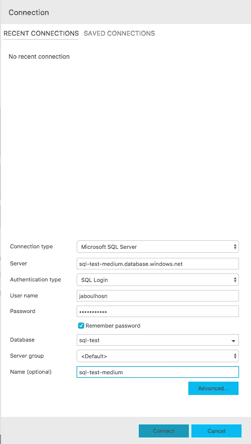

Azure Data Studio Connection prompt

## 设置您与 Azure SQL 数据库的连接:

启动时，Azure DS 会提示您连接到服务器。以下是您将需要的关键输入:

*   **连接类型:**微软 SQL Server
*   **服务器:**你可以从你的 Azure SQL 数据库中获取这段信息(如果你按照[前面提到的教程](https://jadhosn.github.io/2018/azure-db-installation/)，它应该类似于*sql-test-medium-001.database.windows.net*
*   **认证类型:** SQL 登录
*   **用户名:** *您为您的服务器设置的服务器登录* [(教程)](https://jadhosn.github.io/2018/azure-db-installation/)
*   **密码:** *与用于设置您的服务器的密码相同*
*   **数据库:**选择您的数据库名称
*   **名称(可选):**好记的东西

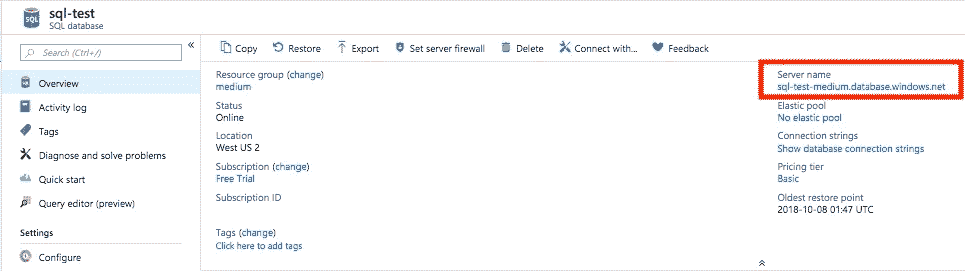

Example of where to find your server name in Azure SQL database

## 测试您的连接:

**停止**:在你继续之前，如果你没有设置你的服务器的防火墙来允许连接，你的连接提示会弹出下面这个表格。添加您的**客户端 IP** 和您的 **Azure 帐户**，您应该可以开始了。

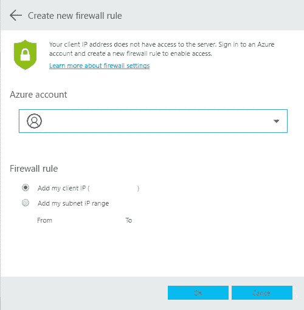

Firewall prompt

您应该看到您的服务器已连接。您可以通过单击左侧窗格中的下拉菜单来展开服务器中的表。

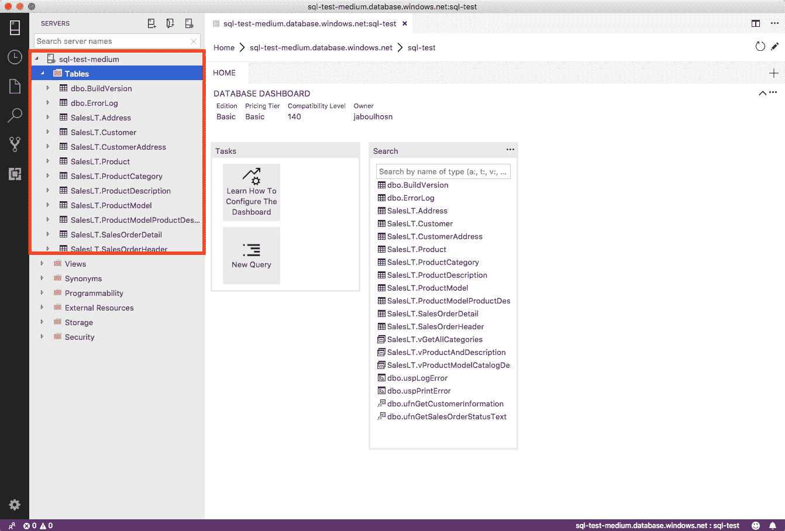

要测试您的连接，请点击**新查询**或点击 **cmd-N** 打开一个新的查询窗口。键入以下 SQL 命令来测试您的连接:
*SELECT * FROM SalesLT。客户；*然后点击**运行**。您应该会看到如下所示的输出。

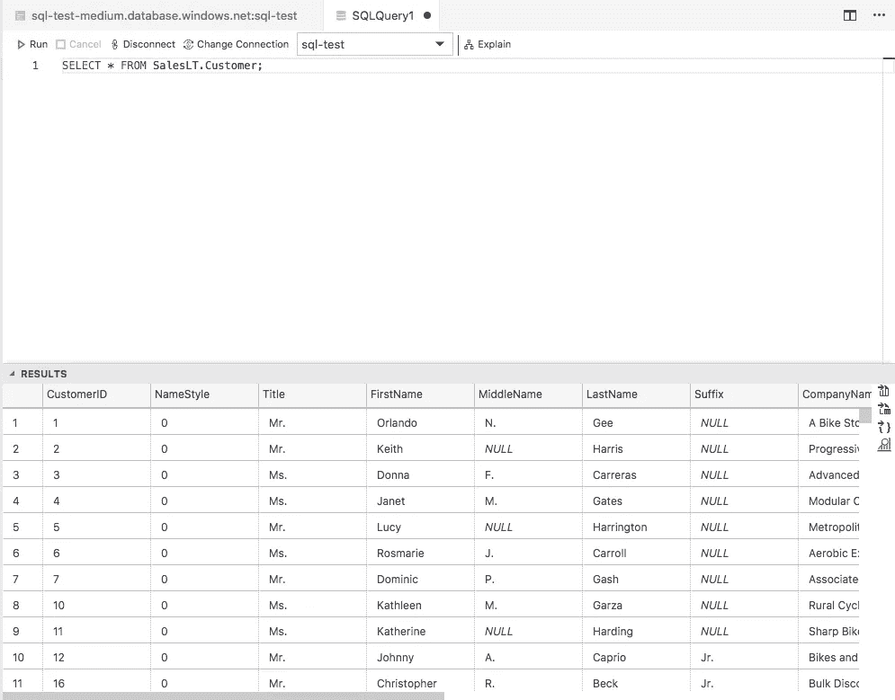

你注意到智能感知在起作用吗？—这真的是我最喜欢的部分！

# 创建存储过程

如果你熟悉 SSMS 的作业调度，这是它的 Azure DS 等价物，只是酷得多！

1.  打开新的查询窗口或点击 **cmd-N**
2.  键入 **sql，**应该会显示一个下拉菜单。选择 **sqlCreateStoredProc**
3.  它将为存储过程创建一个模板。让我们把它分成不同的部分:

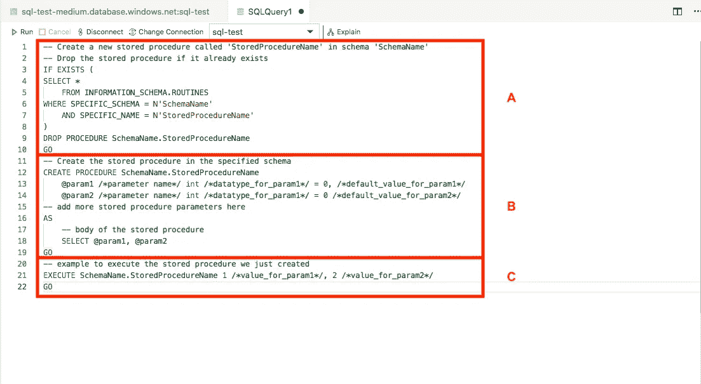

A.检查是否存在任何其他同名的存储过程，删除它并创建这个存储过程

B.创建此存储过程

C.执行此存储过程

4.让我们更新模板以满足我们的需求:

Example for change all occurences

*   **右键单击**上的**stored procedure rename，**单击 **Change All Occurrences** 并将其更改为您想要调用您的过程的名称。我把它命名为 **testProc**
*   同样，**右键单击**模式**上的**，单击**更改所有事件**，并将其更改为您的模式名称(默认情况下，如果您没有设置它，它应该是 **dbo，**因此将其交换为 **dbo** )
*   更新存储过程的函数:

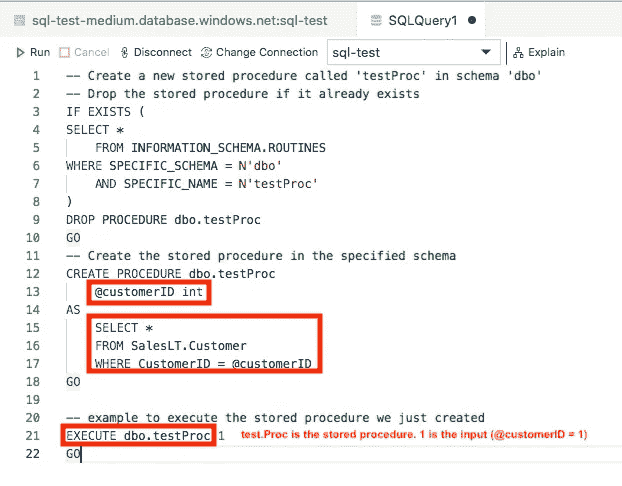

1.  将`@customerID`作为输入
2.  选择与输入具有相同 CustomerID 的所有记录
3.  点击**运行**。这将创建并运行您的存储过程: *EXECUTE dbo.testProc 1* 将在`@customerID` = 1 的情况下运行`testProc`。

# 如何将输出改为 JSON

从我们刚刚使用的存储过程开始，我们将以 JSON 格式输出数据。现在，这可能在不同的场景中派上用场，但在我的情况下:它非常适合带有 javascript 前端的可视化工具。

*提醒:*在这个存储过程中，我们获取任何具有输入客户 id 的客户的所有数据。

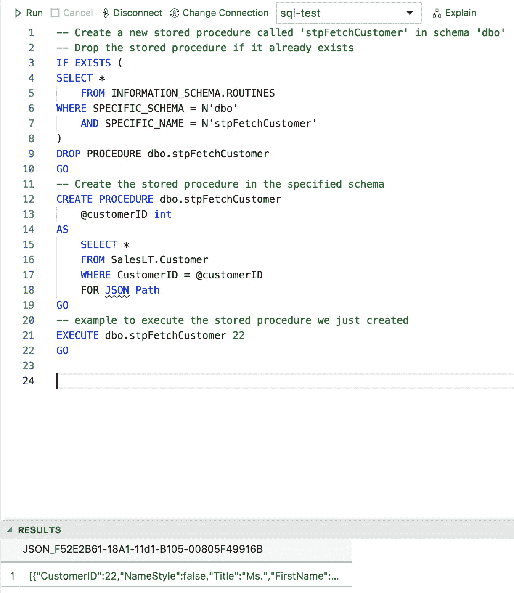

现在，让我们将输出存储在一个 JSON 文件中。您只需在查询后添加这个命令:`FOR JSON PATH` et voilà！

让我们看看下面的输出是什么样子的。您甚至可以在任何查询之后添加这个命令，输出将是 JSON 格式。

*PS:即使命令下面有一条弯弯曲曲的线——它仍然工作，相信我，我试过了:)*

# 如何创建酷的可视化

这是一件大事——我非常兴奋 Azure Data Studio 允许你创建自己的迷你可视化，而不仅仅是一个表格。您甚至可以将它添加到一个不断刷新的仪表板中(在查询性能、PSI 计算或任何其他方面都会变得很方便)。

让我们开始吧！

## 创造洞察力

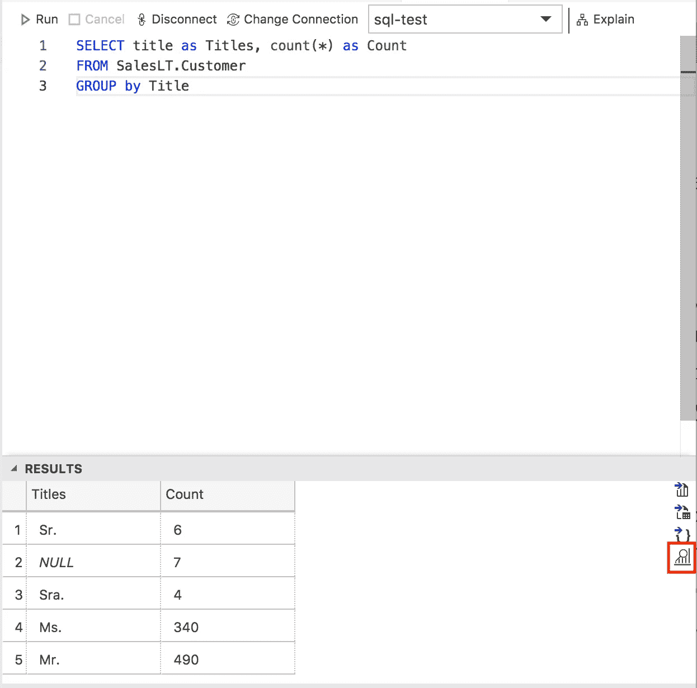

1.  编写一个小查询来验证这一点:
    *SELECT title as Titles，count(*) as Count
    FROM SalesLT。客户
    按标题分组*

该查询将为客户获取所有不同的图书，然后对它们进行分组并返回每个图书的数量。

2.您可以点击右侧的**图**图标，而不是列表结果。

3.这将向您显示一个代表我们数据的条形图。不要忘记在条形图设置中点击**使用第一列作为行标签**。实际的情节是如此之酷，它向您显示了一个清晰的图例和工具提示功能，以检查实际计数。

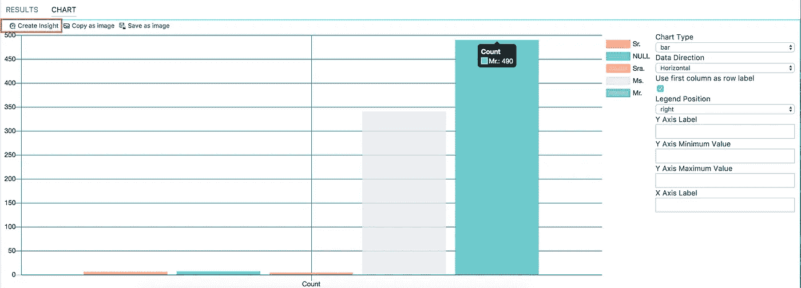

Bar plot instead of tabulated data

## 如何将它变成一个仪表板小部件

1.  点击图左上角的**创建洞察**
2.  这将带你到一个包含一些小工具设置的新文件(查看下图)

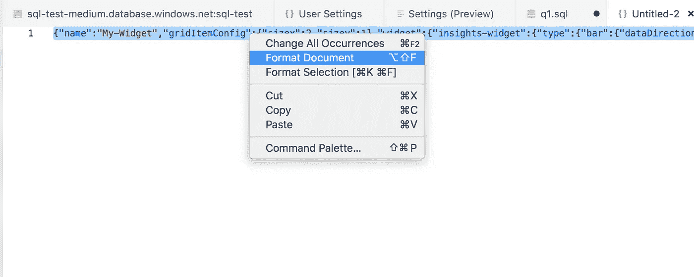

3.**选择所有**widget 设置，点击**右键**，选择**格式文档。**这会帮助你看得更清楚些:)

4.打 CMD+逗号(像这个逗号`,`)。这将打开我们希望小部件所在的仪表板设置。只要看看下面的图片，你已经可以看到我们的部件将位于何处。

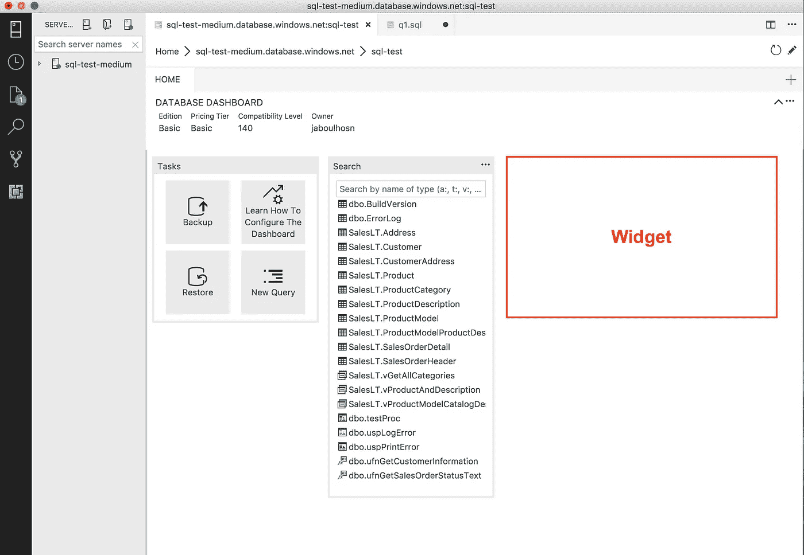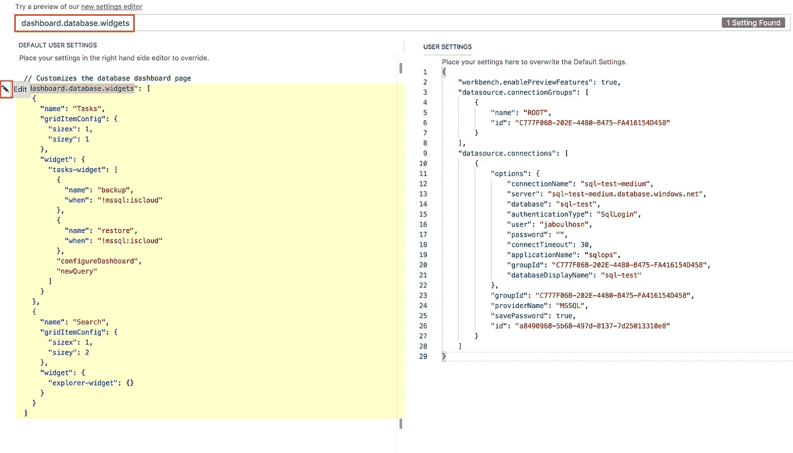

dashboard.database.widgets

5.搜索**dashboard . database . widgets**

6.点击**dashboard . database . widgets**旁边的小铅笔。并选择**复制到设置。**

您可以看到屏幕右侧出现了一个新的黄色部分。

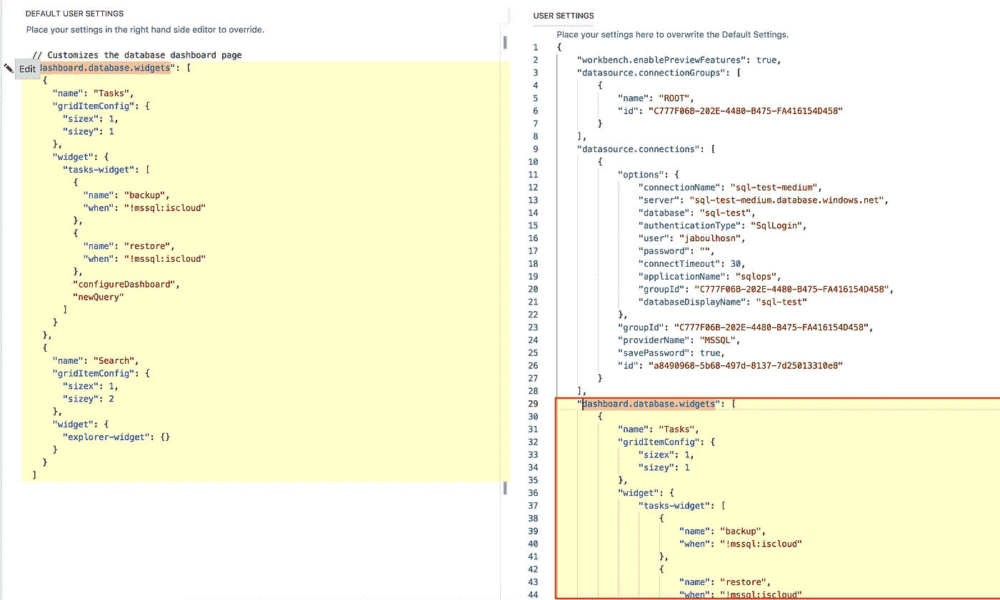

7.现在让我们集中一点:还记得我们之前固定格式的**小部件设置**吗？—在上面的步骤 3 中— **返回并复制那些设置。**

8.贴在哪里？
看*图片看我*下面*。* JSON 是精密科学，你需要重点关注这一项。

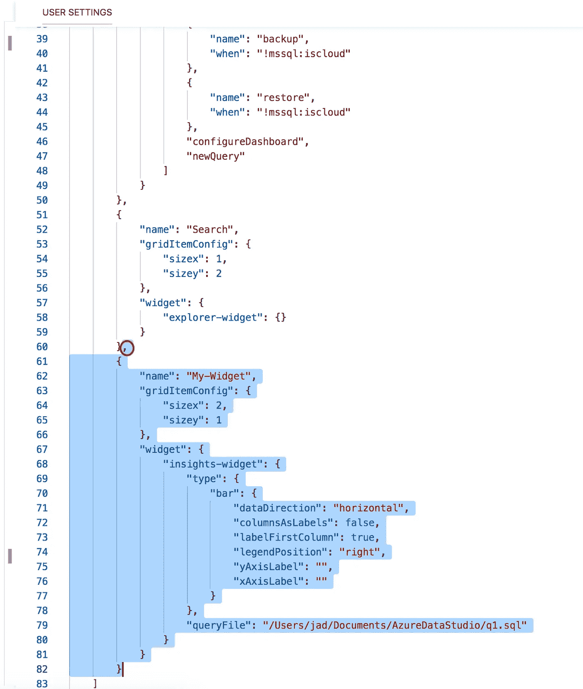

Image Look at Me

9.将您的设置粘贴到`]`之前的最后一个`}`之后。看到那个逗号，别忘了在你粘贴的设置前加上它。

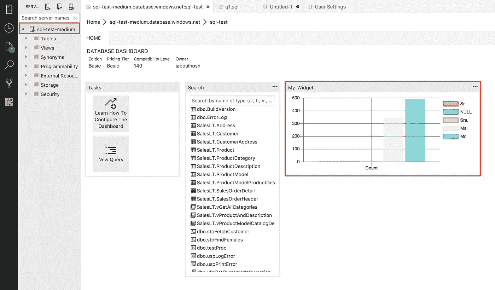

10.我们就快完成了，我保证！
点击**保存**，进入你的服务器主页。

11.**双击 sql-test-medium(或您的服务器名称)上的**。

瞧啊！看，这并不难。我希望你喜欢我对 Azure Data Studio 的快速浏览！