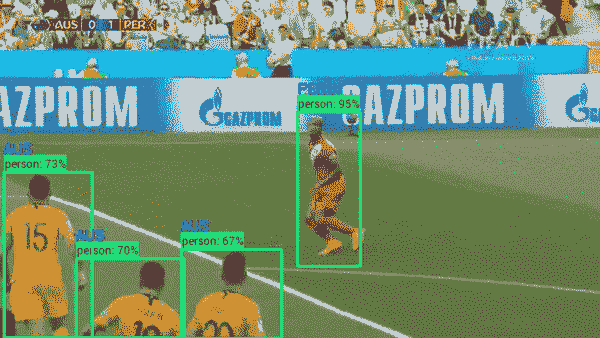
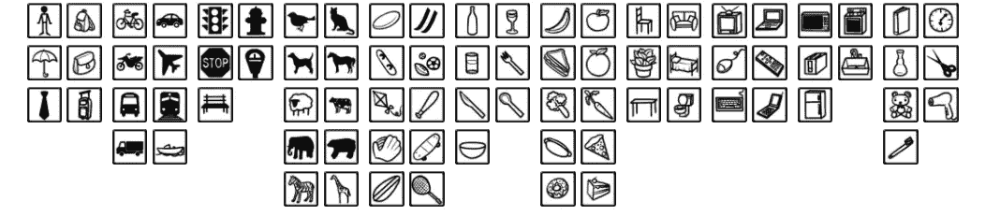
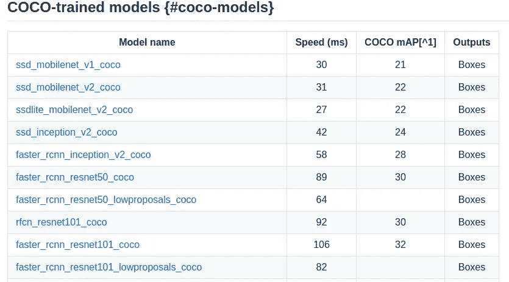
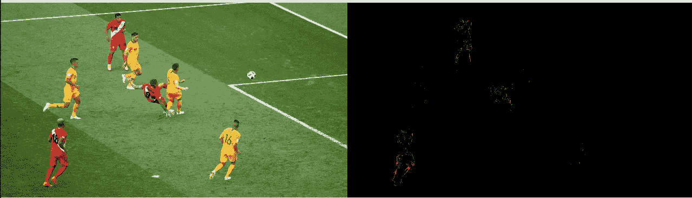

# 使用 Tensorflow 对象检测和 OpenCV 分析一场足球比赛

> 原文：<https://towardsdatascience.com/analyse-a-soccer-game-using-tensorflow-object-detection-and-opencv-e321c230e8f2?source=collection_archive---------2----------------------->

## 用数据做很酷的事情！

## 介绍

世界杯赛季已经开始，并有了一个有趣的开端。谁曾想到卫冕冠军德国队会在小组赛中被淘汰

作为数据科学家，让我们利用这个机会对足球片段进行一些分析。通过使用深度学习和 opencv，我们可以从视频剪辑中提取有趣的见解。请看下面澳大利亚和秘鲁比赛的 gif 示例，我们可以识别所有球员+裁判，足球，还可以根据球员球衣的颜色预测球员属于哪个队。所有这些都可以实时完成。

Player detection and team prediction

你可以找到我在我的 [Github repo](https://github.com/priya-dwivedi/Deep-Learning/blob/master/soccer_team_prediction/soccer_realtime.ipynb) 上使用的代码。

## 步骤概述

Tensorflow 对象检测 API 是用于快速构建对象检测模型的非常强大的资源。如果你对这个 API 不熟悉，请看下面我写的介绍 API 的博客，教你如何使用 API 构建自定义模型。

[tensor flow 对象检测 API 介绍](http://deeplearninganalytics.org/blog/introduction-to-tensorflow-object-detection-api)

[使用 Tensorflow 对象检测 API 构建自定义模型](http://deeplearninganalytics.org/blog/building-toy-detector-with-object-detection-api)

API 提供了预训练的对象检测模型，这些模型已经在 COCO 数据集上进行了训练。COCO 数据集是 90 个常见对象的集合。请参见下图中属于 COCO 数据集的对象。

coco object categories

在这种情况下，我们关心类——人和足球，它们都是 COCO 数据集的一部分。

该 API 还支持大量的模型。请参见下表以供参考。

Small subset of models supported by the API

这些模型在速度和准确性之间进行了权衡。由于我对实时分析感兴趣，我选择了 SSDLite mobilenet v2。

一旦我们使用对象检测 API 识别了球员，为了预测他们属于哪个队，我们可以使用 OpenCV，这是一个强大的图像处理库。如果您不熟悉 OpenCV，请参阅下面的教程:

[OpenCV 教程](http://opencv-python-tutroals.readthedocs.io/en/latest/py_tutorials/py_tutorials.html)

OpenCV 允许我们识别特定颜色的面具，我们可以用它来识别红色玩家和黄色玩家。请参见下面的示例，了解 OpenCV 蒙版如何检测图像中的红色。

Prediction of red areas in an image

## 深入探究主要步骤

现在让我们详细研究代码。

如果你是第一次使用 Tensorflow 物体检测 API，请从这个[链接](https://github.com/tensorflow/models/tree/master/research/object_detection)下载 GitHub。并使用这些[指令](https://github.com/tensorflow/models/blob/master/research/object_detection/g3doc/installation.md)安装所有的依赖项。

如果你没有 OpenCV 设置，请使用这个[教程](https://docs.opencv.org/3.4.1/d2/de6/tutorial_py_setup_in_ubuntu.html)从源代码构建它。

我遵循的主要步骤是(请跟随我的 [Github](https://github.com/priya-dwivedi/Deep-Learning/blob/master/soccer_team_prediction/soccer_realtime.ipynb) 上的 jupyter 笔记本):

*   将 SSDLite mobilenet 模型加载到图中，并加载属于 COCO 数据集的类列表
*   使用 cv2 打开视频。视频捕获(文件名)并逐个读取每一帧
*   对于每一帧，使用加载的图形执行对象检测
*   从 SSDLite 返回的结果是每个已识别的类及其置信度得分和边界框预测。因此，现在识别所有置信度大于 0.6 的人，并将他们剔除。
*   现在你有每个球员提取出来。我们需要阅读他们球衣的颜色来预测他们是澳大利亚球员还是秘鲁球员。这是由代码块检测团队完成的。我们首先定义红色和蓝色的颜色范围。然后我们使用 cv2.inRange 和 cv2.bitwise 来创建该颜色的遮罩。为了检测团队，我计算检测到多少红色像素和黄色像素，以及它们占裁剪图像中像素总数的百分比。
*   最后，将所有代码片段组合起来，同时运行所有代码，并使用 cv2.imshow 显示结果

## 结论和参考文献

太棒了。所以现在你可以看到深度学习和 OpenCV 的简单结合可以产生有趣的结果。现在您有了这些数据，有许多方法可以从中获得更多的见解:

1.  通过澳大利亚球门区的摄像机角度，你可以计算出有多少秘鲁球员在澳大利亚球员的球门区
2.  您可以绘制每个团队足迹的热图，例如秘鲁团队入住率较高的区域有哪些
3.  你可以画出守门员的路线

对象检测 API 还提供了其他更精确但更慢的模型。你也可以试试那些。

给我一个❤️，如果你喜欢这个职位:)希望你拉代码，并尝试自己。

我有自己的深度学习咨询公司，喜欢研究有趣的问题。我已经帮助许多初创公司部署了基于人工智能的创新解决方案。请到 http://deeplearninganalytics.org/来看看我们吧。

你也可以在 https://medium.com/@priya.dwivedi 的[看到我的其他作品](https://medium.com/@priya.dwivedi)

如果你有一个我们可以合作的项目，请通过我的网站或 info@deeplearninganalytics.org 联系我

**参考文献**

*   [Tensorflow 对象检测 API](https://github.com/tensorflow/models/tree/master/research/object_detection)
*   关于使用 OpenCV 检测颜色的好教程