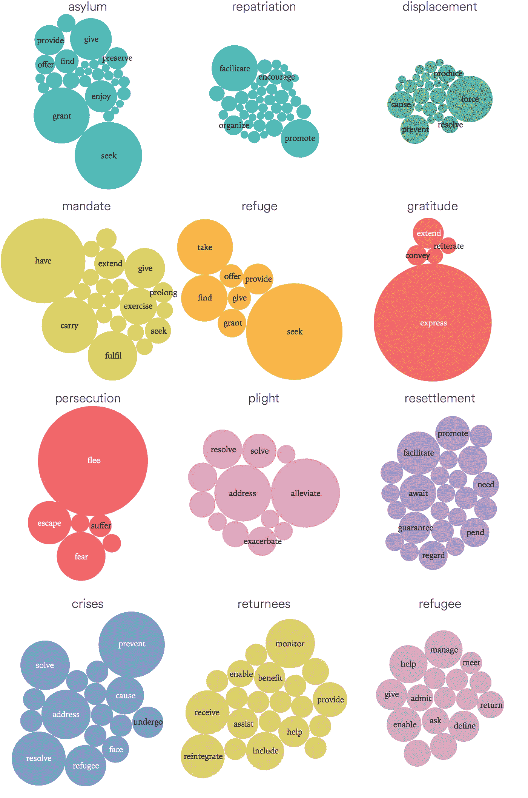
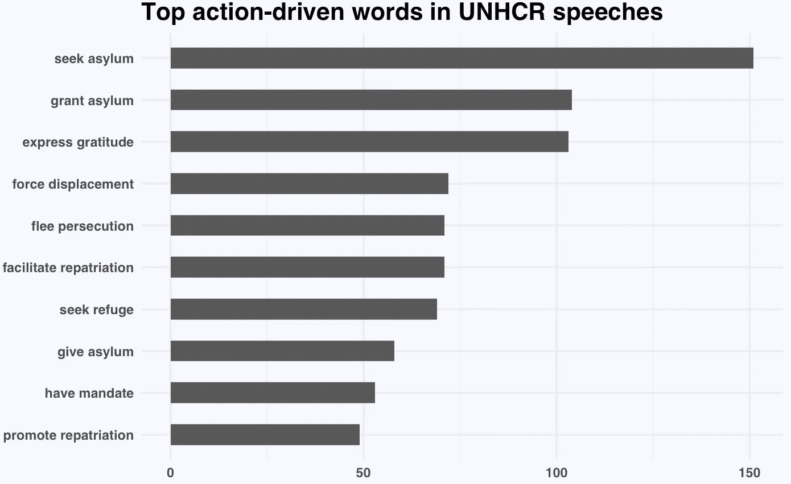
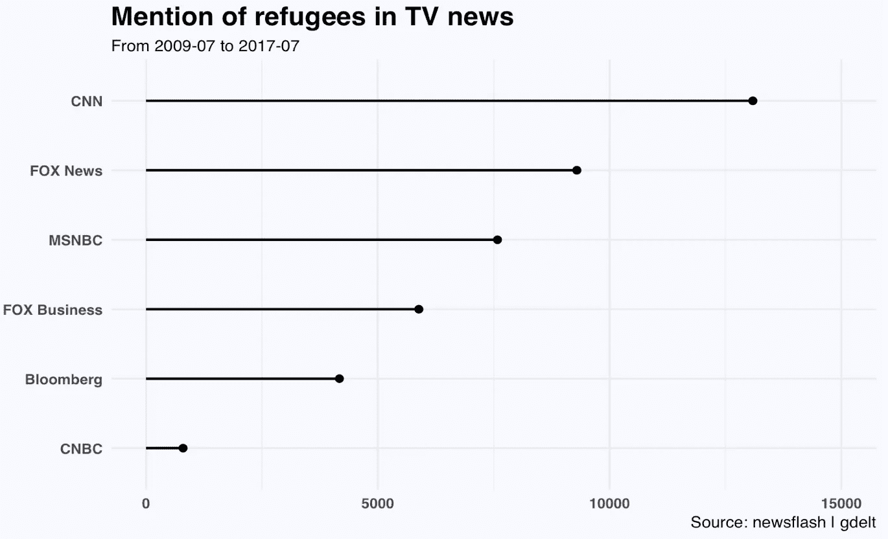
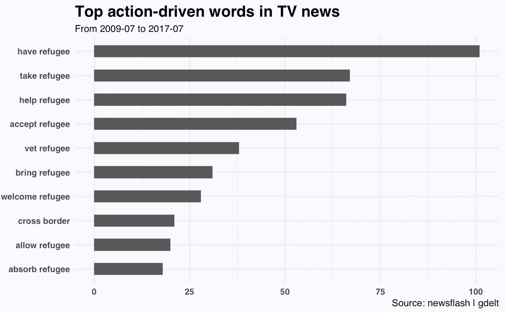

# 用 cleanNLP 分析关于难民的公共话语

> 原文：<https://towardsdatascience.com/analyse-public-discourse-on-refugees-with-cleannlp-9719a29ed898?source=collection_archive---------7----------------------->

继上一篇文章[之后，当联合国谈论难民](https://medium.com/@yanhann10/what-do-un-talks-about-when-it-talks-about-refugee-63140145ee54)时，它谈论什么？我将分析[联合国难民事务高级专员](http://www.unhcr.org/)演讲中的行动驱动词，并使用 r 中的 [cleanNLP](https://arxiv.org/pdf/1703.09570.pdf) 和 [newsflash](https://github.com/hrbrmstr/newsflash) 包触及新闻媒体中的电视报道

**提及政府间组织**

我从注释单词的词性开始，并在目标名词不是很常见的单词时提取直接宾语依赖。

放大顶级名词，我们可以看到*收容*、*遣返*和*流离*经常出现，还有庸人自扰*迫害*、*困境*和*危机*。

至于排名靠前的动名对，“Seek 庇护”是出现频率最高的。

UNHCR speeches

接下来，我将调查新闻报道的内容。与印刷新闻不同，我们可以期待文字稿更加口语化。

**新闻媒体提及**

我利用了非常强大的 GDELT 项目，该项目监控来自世界各国的 100 多种语言的印刷、广播和网络新闻媒体。我在 r 中使用了 *Newflash* 包，它与*GDELT*Television Explorer 配合使用，因此目前只能捕捉美国电视新闻。

我们可以看到 CNN 对这个话题的报道最多，而更关注商业的频道显然报道较少。

在动词名词对方面，与*难民*相关的词比其他名词多，因为电视新闻可能会使用许多不同的方式来描述类似*困境*、*流离失所*和*遣返*的情况，而不是直接使用这些词。提到的顶级名词还包括边境、叙利亚、营地。

**用 R 进行文本处理**

在熟悉了像 *tm* 这样的经典软件包之后，当 *tidytext* 出现时，我开始尝试 NLP，这使得语料库到表格的转换很容易，并且在需要做一些简单的事情时很方便。然后我偶然发现了 *spacyr* ，它惊人地快速和健壮，为命名实体识别提供了简单的语法。今天，我学习了 openNLP(它位于所有其他优秀包的肩膀上)并使用它进行依赖解析。虽然还有很多东西需要探索，但它只会变得更好。

这是我关于数据科学和视觉故事的[# 100 日项目](https://medium.com/@yanhann10)的第 41 天。我的 github 上的全部代码。感谢阅读。欢迎新主题的建议和反馈。