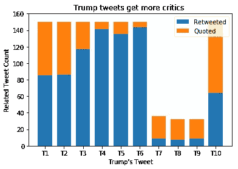
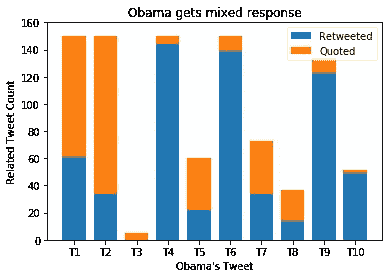
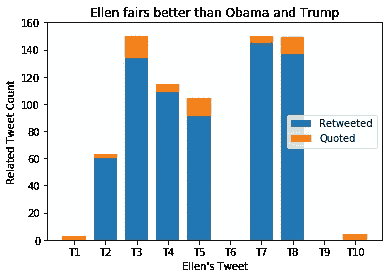
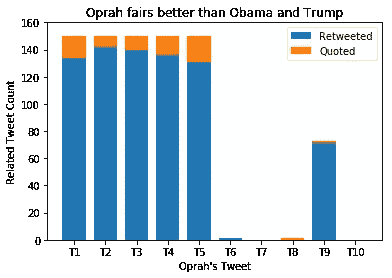
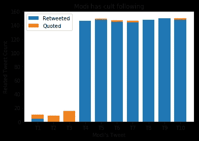
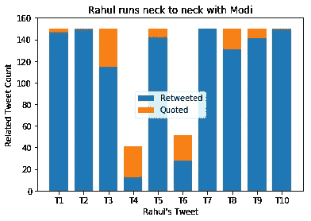

# 分析转发率以确定社会影响力。

> 原文：<https://towardsdatascience.com/analyse-retweet-ratio-to-determine-social-influence-d83bda0559d?source=collection_archive---------20----------------------->

Twitter 支持对任何特定推文的两种回应， [**转发**和**引用推文**](https://developer.twitter.com/en/docs/tweets/data-dictionary/overview/intro-to-tweet-json) 。引用推文很像转发，除了它们包括新的推文消息。

> 有一种普遍的看法， **RTs 不是代言。**相反，转发确实表明倾向于该推文。否则为什么会有人转发？

当前对社会影响力的分析基于引用推文与转发推文的比率。为了更深入地挖掘，引用推文的情绪需要分析，并在下一阶段进行规划。

让我们将这一分析放在几个知名人士最近的推特上，看看他们的表现如何。

> 在最近的 10 条推文中，多达 **150 条相关推文**(转发和引用推文)被用于分析。

*   首先，让我们看看唐纳德·j·特朗普和巴拉克·奥巴马。

*   让我们邀请一些名人，艾伦·德杰尼勒斯和奥普拉·温弗瑞 T20。

*   印度即将举行大选。所以让我们来看看纳伦德拉·莫迪和他最讨厌的拉胡尔·甘地相比如何。

你可以试着通过三个简单的步骤对其他感兴趣的 twitter 账号进行类似的分析。

*   使用 Twitter API 进行身份验证。

注意:要获得证书，你需要[在 Twitter 上注册](https://developer.twitter.com/en/apps/create)。

*   根据知名人物或实体的*最近的推文，获取 ***相关推文*** 。*

*   *绘制可视化堆积条形图。*