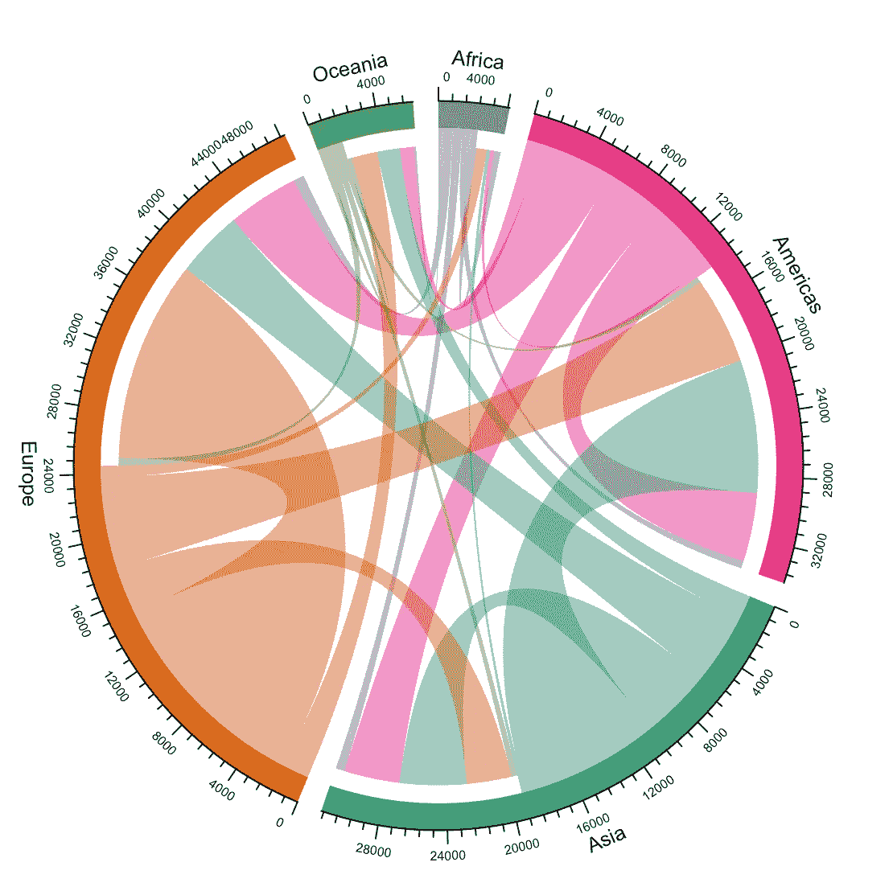
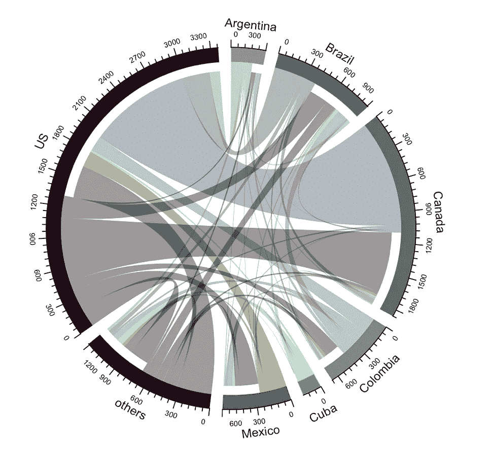
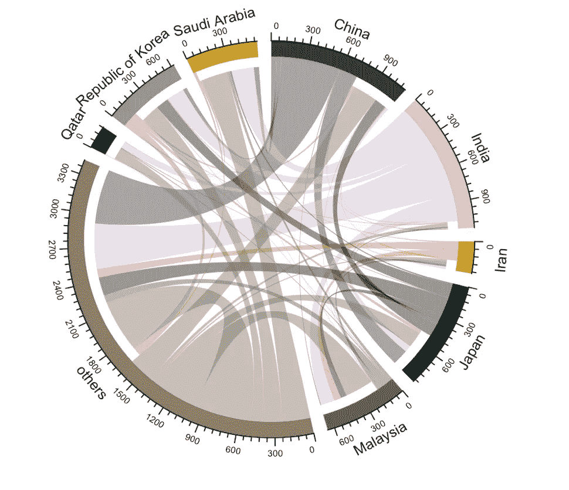
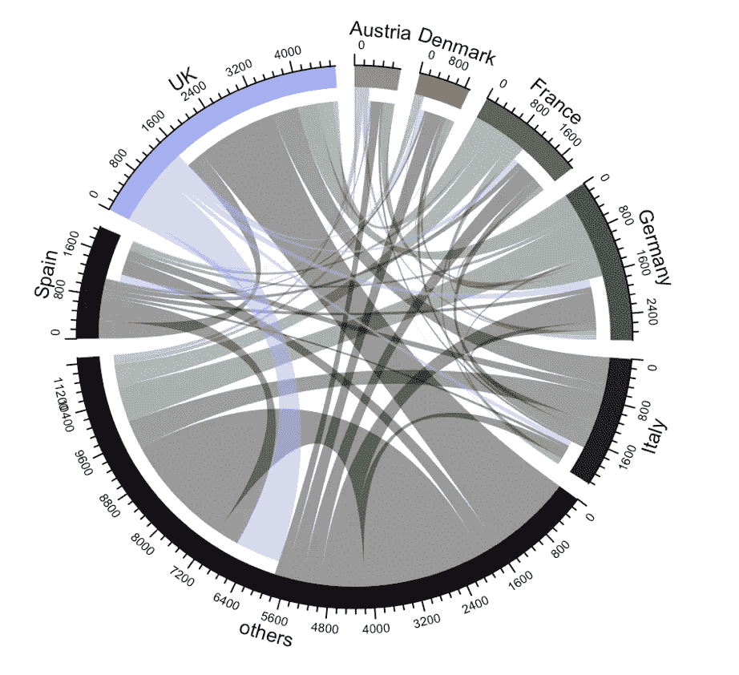
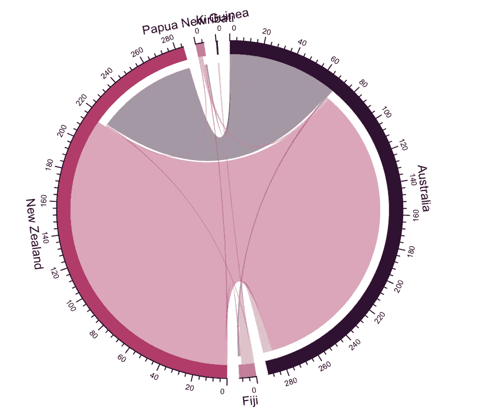
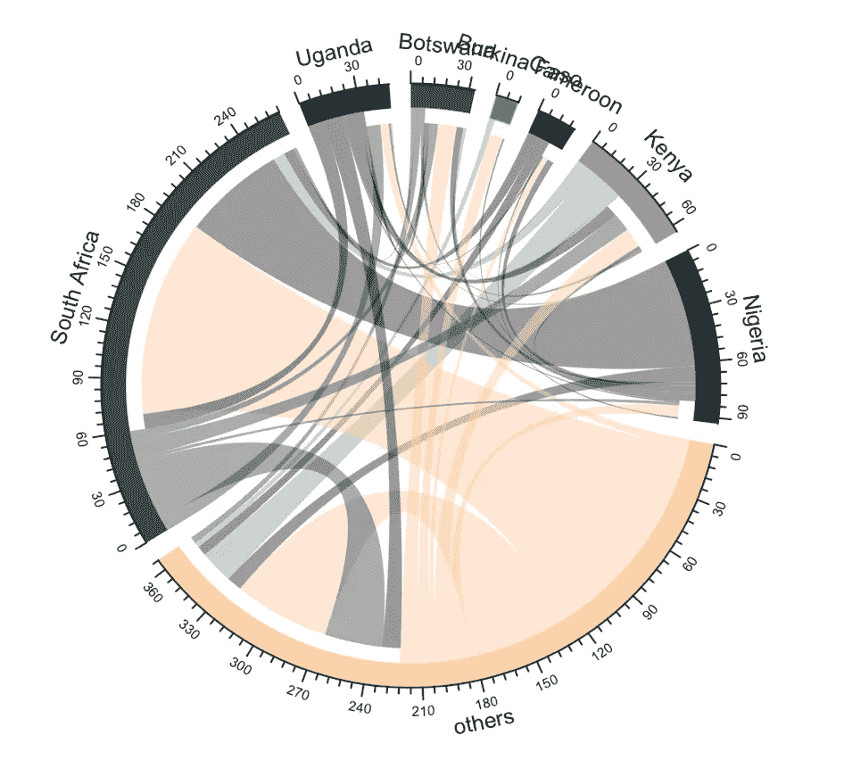
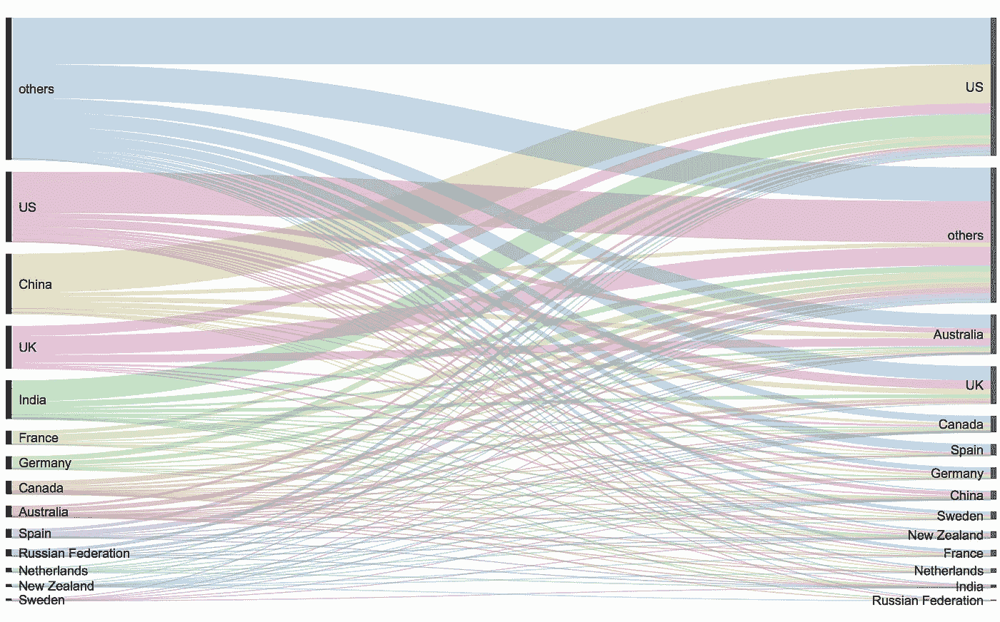
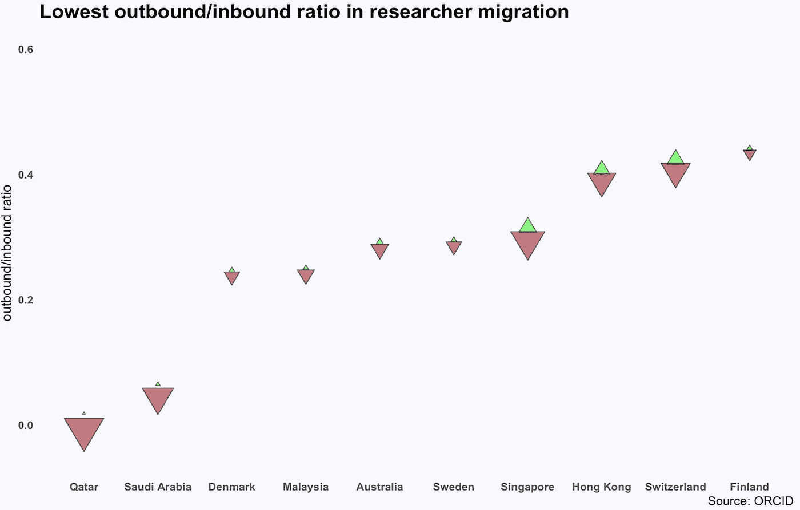
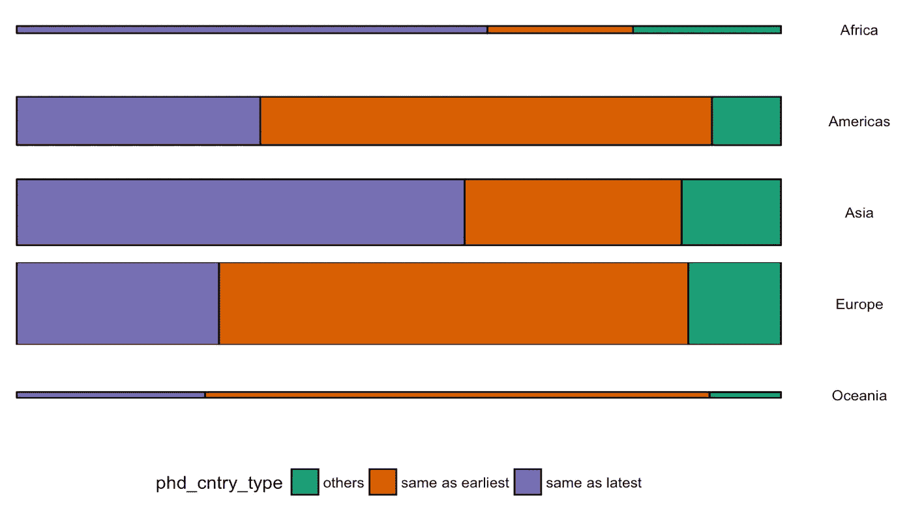

# 分析科研人员的迁移

> 原文：<https://towardsdatascience.com/analyse-the-migration-of-scientific-researchers-5184a9500615?source=collection_archive---------0----------------------->

今天，我根据 [ORCID](https://www.kaggle.com/jboysen/scientist-migrations) (开放研究者和贡献者 ID)数据调查了科学研究人员的洲际和洲际迁移。由于不是每个人都有 ORCID，该数据集最好被视为所有研究人员的定向样本，并跟踪他们最早/最新开展研究活动的国家以及他们的博士国家。

**预处理**

为了清理数据，我过滤了 is_migrated=True 和最早的国家与最新的国家不同。然后，我将国家代码转换为国名和洲名，并缩短了一些国家的名称。

**按大陆移动**

To show directions, the chords without space at the end points to the source and those with space at the end point to the target

我们可以看到:

*   欧洲的流动性很高，有很多区域内的流动。
*   亚洲向外移民较多，主要是美洲，其次是欧洲，然后是大洋洲。
*   美洲有更多来自亚洲、欧洲和同一地区的移民。

**洲内移动**

对于那些移居到同一个洲的另一个国家的人来说，主要的是什么？

在美洲，涌入美国人数最多是加拿大，其次是墨西哥，古巴和哥伦比亚。

在亚洲，印度几乎完全是出境旅游，沙特阿拉伯/卡塔尔几乎完全是入境旅游。马来西亚实际上入境人数多于出境人数。

Oceania (L) Africa (R)

在欧洲，英国、德国、法国、意大利的变化最大。英国以入境游为主，而意大利以出境游为主。

在大洋洲，大多数研究人员从新西兰迁移到澳大利亚。

在非洲，南非吸引了更多来自该地区的研究人员。博茨瓦纳的流入人口也多于流出人口。

**洲际运动**

我们可以看到，这一运动并不局限于发展中国家和发达国家——来自发达国家的研究人员也可能继续在其他国家工作和生活。

**人才流失还是新鲜血液？**

为了理解入境与出境，我计算了这 3 个指标:出境/入境比率，迁出一个国家的所有研究人员的百分比和迁入的所有研究人员的百分比。

我们使用高度来表示移民的出境/入境比率，并使用向上/向下三角形的大小来显示出境/入境人数占所有记录的研究人员的百分比，以便对所有人口流动数高于平均水平的国家的人口影响进行标准化。

除了印度，中国拥有第二高的比率，5X 失去的人才比得到的多。希腊研究人员移居国外的比例最高。

就吸引研究人员而言，卡塔尔和沙特阿拉伯吸引了最多的研究人员流入，而很少有人向外流动。亚洲的新加坡和香港吸引的研究人员也比流失的多 2-3 倍。

**移居国外的研究人员在哪里攻读博士学位**

在迁移的研究人员中，如果我们看看研究人员是在他们最早的附属国家还是在最早的大陆的最新国家获得博士学位，我们可以看到亚洲/非洲的研究人员大多继续在他们获得博士学位的国家进行研究，而美国/欧洲的研究人员在获得博士学位后迁移。

总的来说，49%的移民研究人员在最早的国家获得博士学位，39%在最近的国家，12%在其他地方。

今天我用 [circlize](http://zuguang.de/circlize_book/book/) 包来绘制弦图，并基于分面 ggplot 制作了 marimekko。也体会到了圆图 vs 桑基的独特优势:

*   由于 Sankey 以排序的方式在不同的轴上显示源和目标，因此很容易看到顶级出站和顶级入站
*   圆形图将入站和出站组合在一起，使其更适合查看每个节点的整体移动。

这是我关于数据科学和视觉故事的[# 100 日项目](https://medium.com/@yanhann10)的第 69 天。代码在我的 [github](https://github.com/yanhann10/opendata_viz) 上。感谢阅读。如果喜欢，请分享。欢迎反馈。