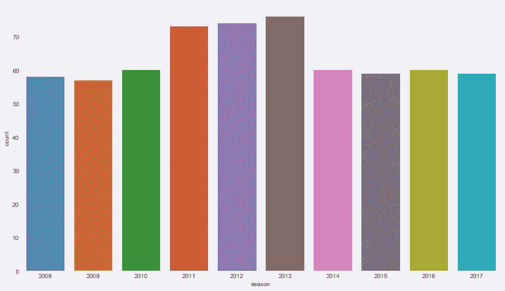
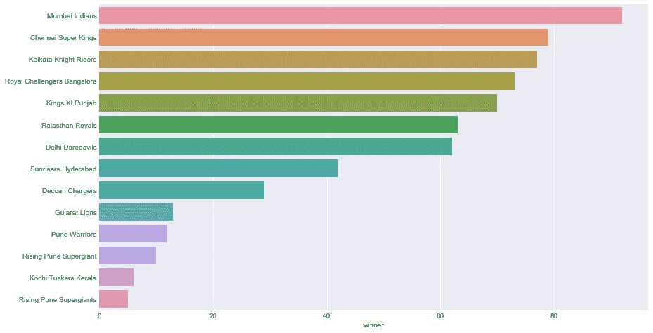
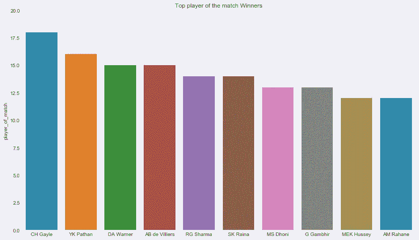
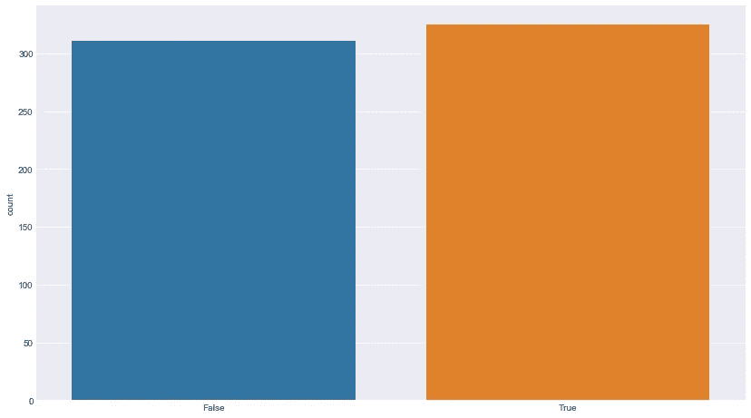

# 分析 IPL 数据，开始使用 Python 进行数据分析

> 原文：<https://towardsdatascience.com/analysing-ipl-data-to-begin-data-analytics-with-python-5d2f610126a?source=collection_archive---------3----------------------->


数据科学/分析就是从给定的数据集中发现有价值的见解。简而言之，找到有助于商业的答案。在本教程中，我们将了解如何开始使用 Python 进行数据分析。我们在这个笔记本中使用的 Python 包有:`numpy`、`pandas`、`matplotlib`和`seaborn`

由于通常这样的教程是基于像`iris`这样的内置数据集，学习者更难与分析联系起来，因此学习变得困难。为了克服这一点，我们在本笔记本中使用的数据集是 IPL(印度超级联赛)数据集，发布在来源于 cricsheet 的 [Kaggle Datasets](https://www.kaggle.com/manasgarg/ipl/data) 上。IPL 是世界上最受欢迎的板球比赛之一，因此我们试图解决的问题和我们试图回答的问题应该为任何了解板球的人所熟悉。

# 问题:

*   数据集中有多少匹配项？
*   数据集中有多少个季节？
*   哪个队因得分最多而获胜？
*   哪个队以最大优势获胜？
*   哪个队以最接近的差距(最少的得分)赢了？
*   哪个队以最少的票数获胜？
*   哪个赛季的比赛次数最多？
*   哪个 IPL 队比较成功？
*   掷硬币赢有助于赢得比赛吗？

# 加载库

让我们从加载上面提到的 Python 模块/包/库开始我们的分析。

```
import numpy as np # numerical computing 
import pandas as pd # data processing, CSV file I/O (e.g. pd.read_csv)
import matplotlib.pyplot as plt #visualization
import seaborn as sns #modern visualization
```

为了让我们的图看起来更好，让我们为 seaborn (sns)图设置一个主题，并定义打印图的大小。

```
sns.set_style("darkgrid")
plt.rcParams['figure.figsize'] = (14, 8)
```

# 读取输入数据集

为了读取输入数据，让我们首先定义输入文件所在的目录/路径。这是为了确保路径首先存储在一个字符串中，然后使用相同的(连接的)文件名通过`pd.read_csv()`函数读取输入 csv。

```
file_path = 'C:\\Users\\something\\Downloads\\'
matches = pd.read_csv(file_path+'matches.csv')
```

# 获取数据的基本信息

首先，让我们检查数据集的基本信息。需要了解的最基本的信息是数据集的维度——行和列——这是我们通过方法`shape`得到的信息。

```
matches.shape
(636, 18)
```

然后，了解给定数据集中不同类型的数据/变量非常重要。

```
matches.info()
RangeIndex: 636 entries, 0 to 635
Data columns (total 18 columns):
id                 636 non-null int64
season             636 non-null int64
city               629 non-null object
date               636 non-null object
team1              636 non-null object
team2              636 non-null object
toss_winner        636 non-null object
toss_decision      636 non-null object
result             636 non-null object
dl_applied         636 non-null int64
winner             633 non-null object
win_by_runs        636 non-null int64
win_by_wickets     636 non-null int64
player_of_match    633 non-null object
venue              636 non-null object
umpire1            635 non-null object
umpire2            635 non-null object
umpire3            0 non-null float64
dtypes: float64(1), int64(5), object(12)
memory usage: 89.5+ KB
```

向上移动一级，让我们使用方法`describe()`执行一个简单的汇总统计。

```
matches.describe()
id
season
dl_applied
win_by_runs
win_by_wickets
umpire3
count
636.000000 636.000000 636.000000 636.000000 636.000000 0.0 
mean
318.500000 2012.490566 0.025157 13.682390 3.372642 NaN 
std
183.741666 2.773026 0.156726 23.908877 3.420338 NaN 
min
1.000000 2008.000000 0.000000 0.000000 0.000000 NaN 
25%
159.750000 2010.000000 0.000000 0.000000 0.000000 NaN 
50%
318.500000 2012.000000 0.000000 0.000000 4.000000 NaN 
75%
477.250000 2015.000000 0.000000 20.000000 7.000000 NaN 
max
636.000000 2017.000000 1.000000 146.000000 10.000000 NaN
```

这个基本信息检索的最后一级是查看输入数据集的几个实际行。

```
matches.head(2)
id
season
city
date
team1
team2
toss_winner
toss_decision
result
dl_applied
winner
win_by_runs
win_by_wickets
player_of_match
venue
umpire1
umpire2
umpire3
0
1 2017 Hyderabad 2017-04-05 Sunrisers Hyderabad Royal Challengers Bangalore Royal Challengers Bangalore field normal 0 Sunrisers Hyderabad 35 0 Yuvraj Singh Rajiv Gandhi International Stadium, Uppal AY Dandekar NJ Llong NaN 
1
2 2017 Pune 2017-04-06 Mumbai Indians Rising Pune Supergiant Rising Pune Supergiant field normal 0 Rising Pune Supergiant 0 7 SPD Smith Maharashtra Cricket Association Stadium A Nand Kishore S Ravi NaN
```

现在，对输入数据集有了基本的了解。我们被提倡用基本的数据分析来回答我们的问题。

# 数据集中有多少匹配项？

正如我们在上面看到的，`id`是一个变量，当每个观察都匹配时，它对数据中的每个观察进行计数。因此，获取数据集中匹配的数量与获取数据集中的行数或变量 id 的最大值是一样的。

```
matches['id'].max()
636
```

我们的数据集中有 636 场 IPL 比赛。

# 数据集中有多少个季节？

IPL 像任何其他体育联盟一样，一年发生一次，因此获得数据集中独特年份的数量将告诉我们数据集中有多少个赛季。

```
matches['season'].unique()
array([2017, 2008, 2009, 2010, 2011, 2012, 2013, 2014, 2015, 2016],
      dtype=int64)
```

这给出了年份的列表，但是为了用所需的答案来回答这个问题，让我们计算在上面的步骤中返回的列表的长度。

```
len(matches['season'].unique())
10
```

# 哪个队因得分最多而获胜？

要回答这个问题，我们可以从逻辑上划分这个问题—首先我们需要找到最大跑垒数，然后我们可以找到拥有最大跑垒数的那一行(获胜的队伍)—这确实是以最大跑垒数获胜的队伍。我想在这里强调的是，将您的问题划分为逻辑子问题或模块，然后为这些子模块构建 Python 表达式/代码，最后将它们添加到所需的代码中，从而得到解决方案，这一点始终很重要。

```
matches.iloc[matches['win_by_runs'].idxmax()]
id                               44
season                         2017
city                          Delhi
date                     2017-05-06
team1                Mumbai Indians
team2              Delhi Daredevils
toss_winner        Delhi Daredevils
toss_decision                 field
result                       normal
dl_applied                        0
winner               Mumbai Indians
win_by_runs                     146
win_by_wickets                    0
player_of_match         LMP Simmons
venue              Feroz Shah Kotla
umpire1                 Nitin Menon
umpire2                   CK Nandan
umpire3                         NaN
Name: 43, dtype: object
```

`idxmax`将返回最大值的 id，该值又被输入到`iloc`中，后者获取一个索引值并返回该行。

如果我们只对那一行中获胜的队伍感兴趣，那么可以按如下方式检索。

```
matches.iloc[matches['win_by_runs'].idxmax()]['winner']
'Mumbai Indians'
```

# 哪个队以最多的三柱门获胜？

和上一个类似，这个问题回答起来应该比较直白。

```
matches.iloc[matches['win_by_wickets'].idxmax()]['winner']
'Kolkata Knight Riders'
```

# 哪个队以(最接近的差距)最少得分获胜？

要知道以最接近的差距获胜的队，我们必须做与上述步骤相反的事情。但是有一个警告。在板球比赛中，如果击球第二的队赢得了比赛(通过追逐)，就会说“第二队通过 x 次击球获胜”，如果保龄球第二队(首先击球)赢得了比赛(通过捍卫他们的得分)，就会说“第一队通过 x 次跑垒获胜”。因此，在锦标赛中，跑垒的最小胜率将总是 0，而三柱门的最小胜率也将总是 0，因为有时追赶队或有时先击球的队可能会赢。为了克服这个警告，我们只需应用一个简单的变通方法，如下所示。

```
matches.iloc[matches[matches['win_by_runs'].ge(1)].win_by_runs.idxmin()]['winner']
'Mumbai Indians'
```

我们不是只获得最低分数(总是为 0)，而是对 win_by_runs 大于或等于 1 的数据进行子集化(通过消除零问题)。

# 哪个队以最少的三柱门获胜？

按照与上述相同的逻辑:

```
matches.iloc[matches[matches['win_by_wickets'].ge(1)].win_by_wickets.idxmin()]
id                                   560
season                              2015
city                             Kolkata
date                          2015-05-09
team1                    Kings XI Punjab
team2              Kolkata Knight Riders
toss_winner              Kings XI Punjab
toss_decision                        bat
result                            normal
dl_applied                             0
winner             Kolkata Knight Riders
win_by_runs                            0
win_by_wickets                         1
player_of_match               AD Russell
venue                       Eden Gardens
umpire1                     AK Chaudhary
umpire2                  HDPK Dharmasena
umpire3                              NaN
Name: 559, dtype: object
```

为了进一步理解 Python 中的数据分析过程，让我们用数据可视化来回答进一步的问题，即通过绘制结果。

# 哪个赛季的比赛次数最多？

我们知道，如果每一行都是匹配的，那么计算每一季的实例/行的数量就可以得到每一季的匹配数。

```
sns.countplot(x='season', data=matches)
plt.show()
```

seaborn 中的函数可以立即完成这项工作(不需要显式的 group_by 和 count)

给出这个:



# 最成功的 IPL 团队

最成功的 IPL 团队是赢得最多次数的团队。这也意味着，回答这个问题和上面的练习一样，除了计算每个赛季的实例数，这里我们要计算每个获胜队的实例数。

```
#sns.countplot(y='winner', data = matches)
#plt.show
data = matches.winner.value_counts()
sns.barplot(y = data.index, x = data, orient='h');
```

给出这个:



虽然用`countplot()`也可以很容易地做到这一点，但是引入另一个`sns plot -barplot()`的变体已经被用来可视化它了。

# 比赛获胜者的最佳球员

```
top_players = matches.player_of_match.value_counts()[:10]
#sns.barplot(x="day", y="total_bill", data=tips)
fig, ax = plt.subplots()
ax.set_ylim([0,20])
ax.set_ylabel("Count")
ax.set_title("Top player of the match Winners")
#top_players.plot.bar()
sns.barplot(x = top_players.index, y = top_players, orient='v'); #palette="Blues");
plt.show()
```

给出这个:



对于那些关注 IPL 的人来说，你现在可能想知道这有多讽刺。克里斯·盖尔，是最成功的 IPL 球员，在第一轮没有被卖掉。

# 掷硬币赢对赢得比赛有帮助吗？

解决了上面这些并不太难的问题后，我们却无法得出一个关键的见解——那就是——掷硬币赢真的有助于赢得比赛吗？

用我们同样的方法把问题分成几个部分——我们可以把这个问题分成两部分——如果两者相同，比赛获胜者和掷硬币获胜者——那么它就是成功的，如果不是，它就是失败的。在想象结果之前，让我们先看看数字是什么样子的。

```
ss = matches['toss_winner'] == matches['winner']
ss.groupby(ss).size()
False    311
True     325
dtype: int64
```

看起来，掷赢实际上有助于赢得比赛——或者从统计学角度来说，我们可以说掷赢和赢得比赛之间存在相关性，因此我们可以假设它有所帮助。

要可视化结果:

```
#sns.countplot(matches['toss_winner'] == matches['winner'])
sns.countplot(ss);
```

给出了这个图:



至此，我们已经到了本教程的结尾，正如你可能已经注意到的，它只用了一行就回答了上面的几乎所有问题。这告诉我们两件事:Python 表达式在语法方面非常简洁；第二件事是，不需要几十行或几百行代码就能产生有价值的见解——只要几行代码就能产生神奇的效果——如果你问的问题正确的话！

希望这篇文章能帮助你开始你的 Python 数据分析之旅。如果你有兴趣了解更多，请查看这个免费的[数据科学课程](https://www.datacamp.com/courses/intro-to-python-for-data-science?tap_a=5644-dce66f&tap_s=210728-e54afe)的 Python 介绍。这里使用的完整代码可以在我的 [github](https://github.com/amrrs/iq18_workshop/tree/master/data_analysis) 上找到。