# 用白板和熊猫分析南非政府的浪费性支出

> 原文：<https://towardsdatascience.com/analysing-sa-govs-wasteful-expenditure-from-tabula-to-pandas-464d06c3bdd9?source=collection_archive---------19----------------------->

关于一些数据分析的第一篇文章，着眼于不规则的政府支出，特别是公共实体对偏差和扩张的合同请求。这些数据可以在网上免费获得，我只是解析、探索和呈现它们。


Image source: [Southern Vines](https://www.southernvines.co.za/2016/06/21/rand-rollercoaster-understanding-south-africas-volatile-currency/)

南非政府负债累累。这主要是由于不规则的支出，可以追溯到偏差和扩大招标。这些招标原本是为特殊情况准备的，但现在却成了常态。

2018 年 6 月，公共实体和部门 [SARS](https://pmg.org.za/committee-meeting/26617/) 、 [SITA](https://pmg.org.za/committee-meeting/26629/) 、[国防部](https://pmg.org.za/committee-meeting/26635/)、[公共工程部](https://pmg.org.za/committee-meeting/26692/)、[水和卫生局& Trans Caledon 隧道管理局](https://pmg.org.za/committee-meeting/26601/)都被提出来解释可疑的偏离和扩大要求。这些包括夸大的 DSTV 订阅合同，价值数百万兰特的视频会议设备，食物和餐饮，等等。所有合同请求由[财政部](http://www.treasury.gov.za/)每季度发布一次。

# 获取数据

与大多数政府记录一样，每个季度的合同都是 PDF 格式的，如下所示:

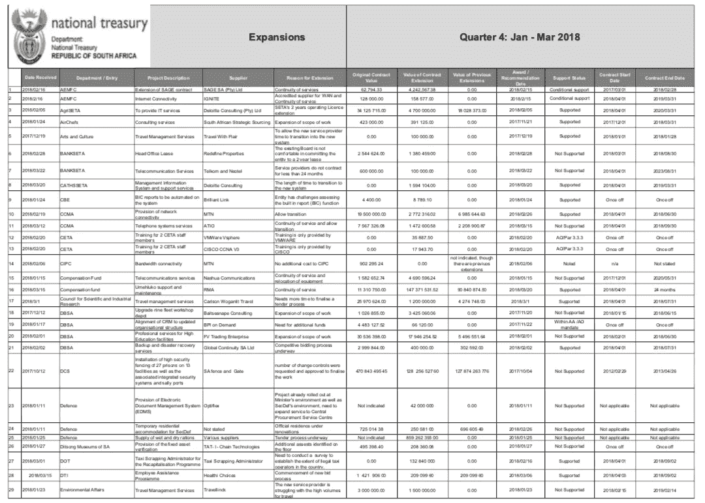

The nemesis of the internet

为了解析数据进行分析，我尝试了[tabula-py](https://github.com/chezou/tabula-py)——tabula-Java 的 Python 包装器，可以读取和提取 pdf 中的表格。这是公认的，也是我在那里能找到的为数不多的好书之一。在将几个文件转换成？csv，我意识到它的解析没有我想要的那么准确。

所以我最终使用 [Tabula GUI](https://tabula.technology/) 手动选择表格以提高精确度，并导入。csv 喜欢熊猫。我分析了财政部网站上目前可用的所有季度——从 2016 年 Q2 到 2018 年第三季度。以下是其中的一些片段:

```
ex1 = pd.read_csv('expansions_q2_2016.csv')
ex7 = pd.read_csv('expansions_q3_2018.csv')ex1.head(5)
```

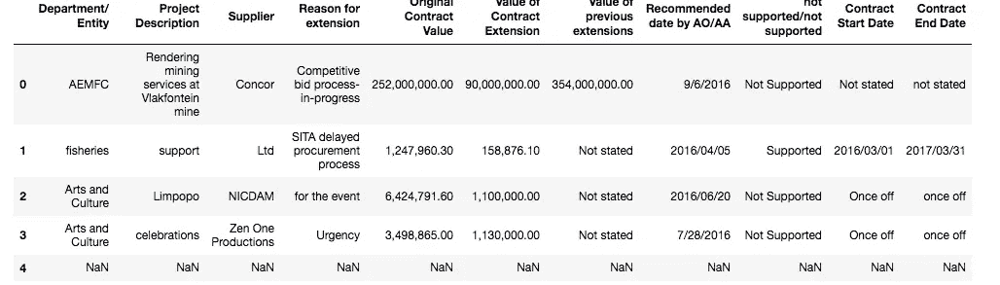

```
ex7.head(5)
```

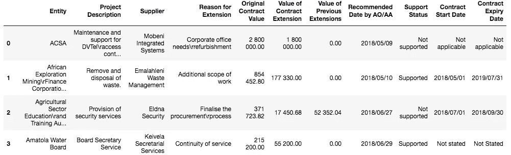

# 清洁

*为了这篇文章和每个人的健康，我大大简化了清洁过程——这比看起来要辛苦得多。*

在上面的“head”示例中，您可能已经注意到桌子需要大量的清理工作。例如，“原始合同价值”列中的值条目在第一次导入时用逗号隔开，在第二次导入时用空格隔开。这是由于两个主要问题:1)财政部的数据输入缺乏一致性，2)缺乏完美的 PDF 解析。

“原始合同价值”栏中的许多条目使用了不同于其他条目的格式，包括:

```
array(['estimated R95 per\rtransaction', 'various', '168 849 638.40 -ABB\r20 961 068.87- Zest\r54 271 707.30 - Actom', 'Not stated')]
```

有些包括外币，如€250，455 和 334，908 美元。这些都从数据集中删除了，使我们的数据集超过 1600 行。

列标题的顺序也不同，标签也不同。在对列重新排序并全部重命名之后，我将所有的表连接起来:

```
ex_all = pd.concat((ex1,
                    ex2,
                    ex3,
                    ex4,
                    ex5,
                    ex6,
                    ex7
                   ), axis=0, ignore_index=True)
df.head(4)
```

给我们这个人:

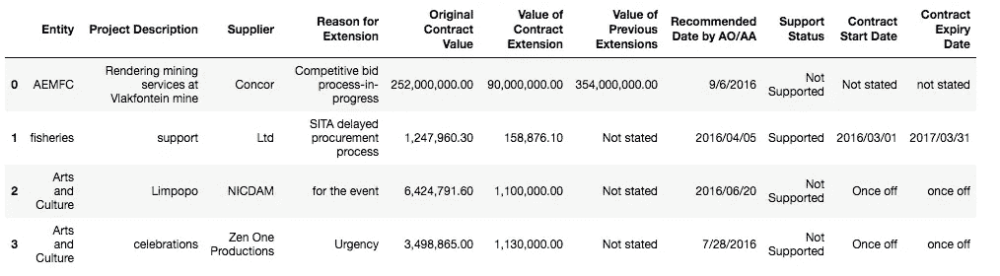

```
df.info()
```

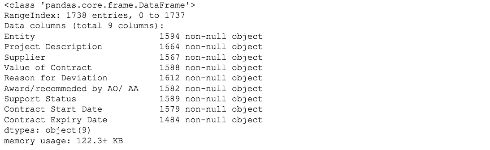

All the objects…

在进一步清理之后，是时候进行一些探索性分析了。

# 探索性分析

```
df.sort_values('Value of Contract', ascending=False)[:6]
```

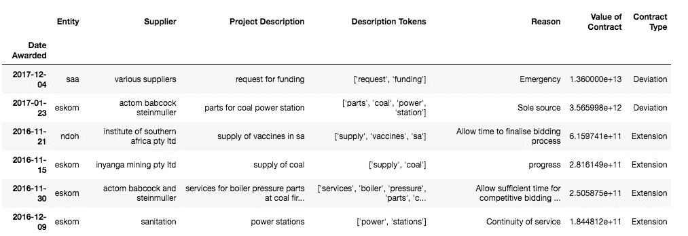

I also tokenised the ‘Project Description’ column, with the aim of doing some text analysis a bit later, but never got around to it.

```
df['Value of Contract'].sum()/1000000000000)[:7]
```

在过去的 10 个季度中，总共需要价值 19.4539 万亿兰特的合同。

一些合同价值看起来很像打字错误，如果有人只是在一个随机的数字上加了一串零，那么我不得不仔细检查许多条目，以确保这不是解析方面的问题。

查看所有合同没有太多意义，也有点脱离上下文，所以让我们只考虑那些被授予或标记为“受支持”的合同。

```
df['Support Status'] = df['Support Status'].str.lower()supported_contracts.head()
```

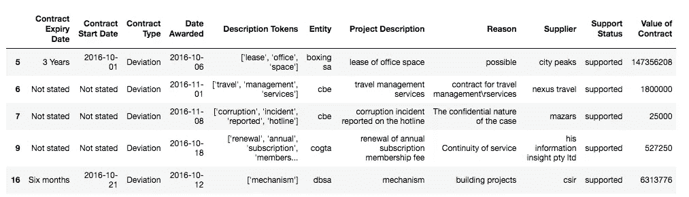

```
supported_contracts.info()
```

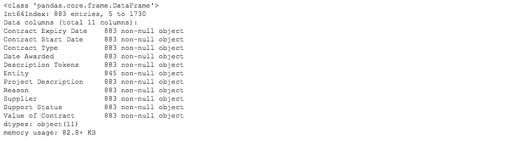

我们所有的条目都是对象，这需要一些重新格式化。我将所有数字条目转换为浮点数，将日期条目转换为 Python 的 date.time。

```
 supported_contracts[‘Value of Contract’] = pd.to_numeric(supported_contracts[‘Value of Contract’], errors=’coerce’)supported_contracts['Date Awarded'] = pd.to_datetime(supported_contracts['Date Awarded'], errors='coerce')supported_contracts['Contract Start Date'] = pd.to_datetime(supported_contracts['Contract Start Date'], errors='coerce')supported_contracts['Contract Expiry Date'] = pd.to_datetime(supported_contracts['Date Awarded'], errors='coerce')
```

现在，只看支持的合同，授予的合同总价值为 9540 亿兰特。

```
(supported_contracts['Value of Contract'].sum() / 1000000000).round()# in billions contracts awarded
```

为了更容易地根据日期调用值，我对“授予日期”列进行了索引:

```
supported_contracts.index = supported_contracts[‘Date Awarded’]del supported_contracts[‘Date Awarded’]supported_contracts.head(2)
```

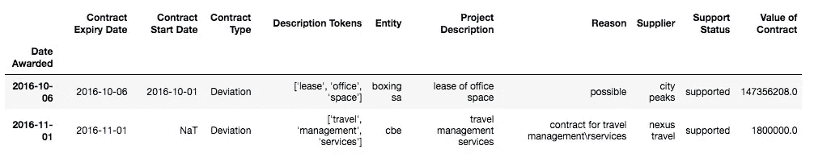

```
(supported_contracts[‘2016’][‘Value of Contract’].sum() / 1000000000).round()# in billions contracts awarded in 2016
```

2016 年授予 3110 亿兰特。

我清理了数据框架，删除了以下各列，使其更具针对性:

```
supported_contracts.drop('Reason', axis=1, inplace=True)supported_contracts.drop('Contract Expiry Date', axis=1, inplace=True)supported_contracts.drop('Contract Start Date', axis=1, inplace=True)supported_contracts.drop('Description Tokens', axis=1, inplace=True)
```

然后我想象了一些我们的发现:

```
support_contracts = support_contracts['2016':'2019']support_contracts.resample('D').sum().plot()
fig = plt.gcf()legend_label = mpatches.Patch(color='blue', label='Total Value of Contracts')plt.legend(handles=[legend_label])plt.suptitle('Contracts Awarded Over Time', fontsize=16)plt.rcParams.update({'font.size': 9})fig.set_size_inches(15, 8)
```

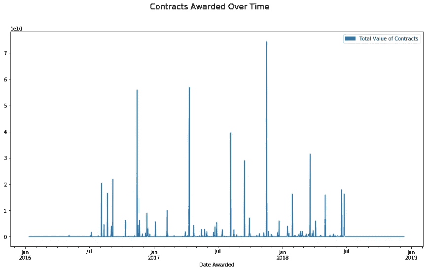

看看这些峰值是什么，我将“合同价值”下的所有条目按降序排列:

```
# top contracts supported ranked in terms of valuesupported_contracts.sort_values('Value of Contract', ascending = False)[:9]
```

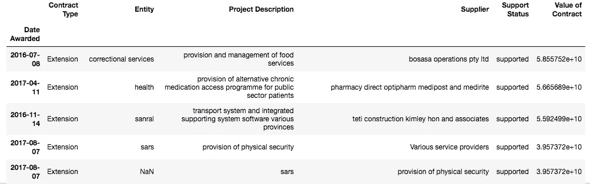

惩教服务和卫生部(或称卫生部)在过去两年中获得支助的最大合同是"提供和管理食品服务"和"为公共部门病人提供替代性慢性药物获取方案"。

为了更好地了解每个实体对总支出的影响，我查看了它们的总合同价值以及与其他实体相关的合同量:

```
def value_percent(entity):

    entity_df = supported_contracts[supported_contracts['Entity'].str.match(entity, na=False)]
    entity_value_total = entity_df['Value of Contract'].sum()
    percentage = (entity_value_total / supported_contracts['Value of Contract'].sum())*100

    return percentage.round(2)def freq_percent(entity):
    try:
        percentage = (df['Entity'].value_counts()[entity]/len(df))*100
        return percentage.round(2)
    except KeyError:
        pass
```

并创建一个新的数据帧:

```
impact_df = {'Entity': supported_contracts['Entity'].str.title(),
             'Frequency of Appearance': supported_contracts['Entity'].apply(freq_percent),
             'Value of Contracts': supported_contracts['Entity'].apply(value_percent)}# only interested in top 10 for nowimpact_df = pd.DataFrame(data=impact_df).drop_duplicates(subset='Entity')
impact_df.sort_values('Value of Contracts', ascending=False)[:9]
```

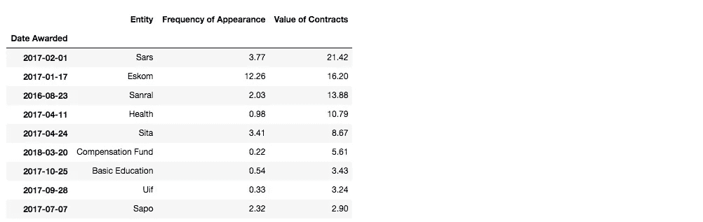

就总“合同价值”而言，南非国家电力公司占 21.42%，南非国家电力公司占 16.20%，南非国家电力公司占 13.88%。

让我们来看看十大最昂贵的实体之间的相互关系:

```
cmap = plt.get_cmap('Spectral')
colors = [cmap(i) for i in np.linspace(0, 1, 9)]impact_value_df.index = impact_value_df['Entity']plot = impact_value_df.plot.pie(y='Value of Contracts',
                               autopct='%.0f%%',
                               figsize=(8, 9),
                               colors=colors)plt.suptitle('Share of Total Contracts by Value', fontsize=16)plt.show()# the chart only shows the total share of the top ten most 'expensive' entities (it excludes the other)
```

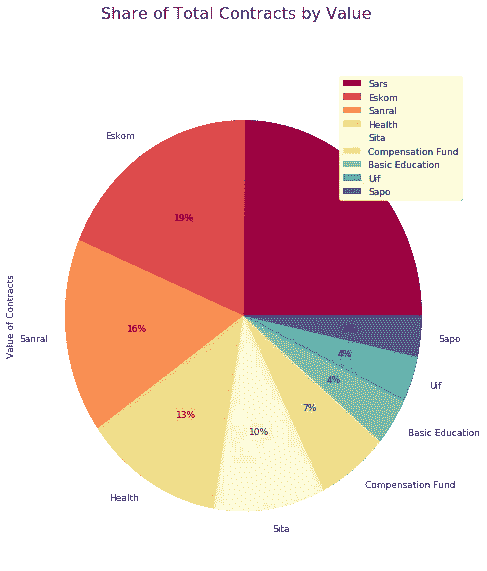

每卷合同份额也是管理不善的一个有趣指标，如下图所示。为了可视化最常见的合同，我使用了一个 Seaborn 图表:

```
impact_freq_df = impact_df.sort_values('Frequency of Appearance', ascending=False)[:9]f, ax = plt.subplots(figsize=(15, 5))
sns.set_color_codes("muted")sns.barplot(x = 'Entity',
            y = 'Frequency of Appearance',
            data = impact_freq_df,
            palette='dark',
            alpha=.6)plt.suptitle('Share of Total Contracts by Volume', fontsize=16)plt.show()
```

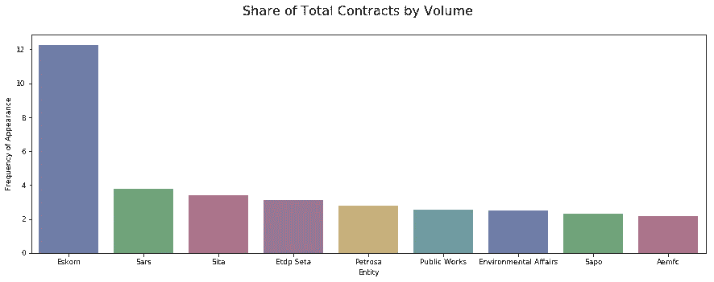

对于这个数据集，还可以做更多的事情，但目前就这些了。其他一些建议是根据合同量和总价值分析顶级供应商，或者测试可以识别可疑请求的不同公式。

我计划一个月至少做两个数据集，最好是在非洲背景下——如果你有任何数据集、评论、想法或建议，请随时分享。