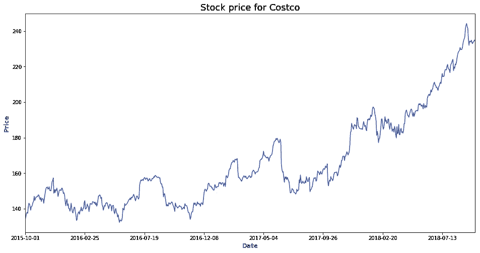
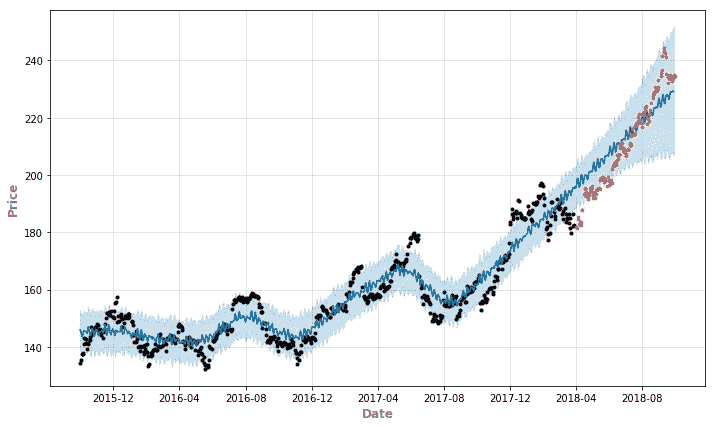
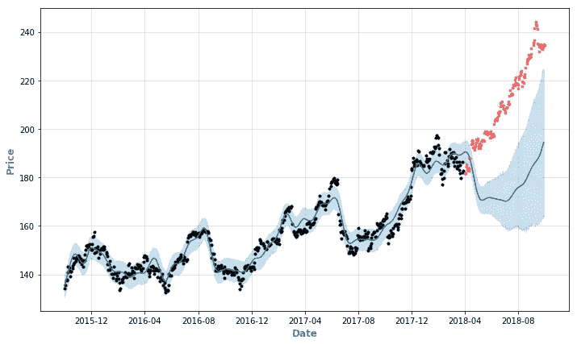
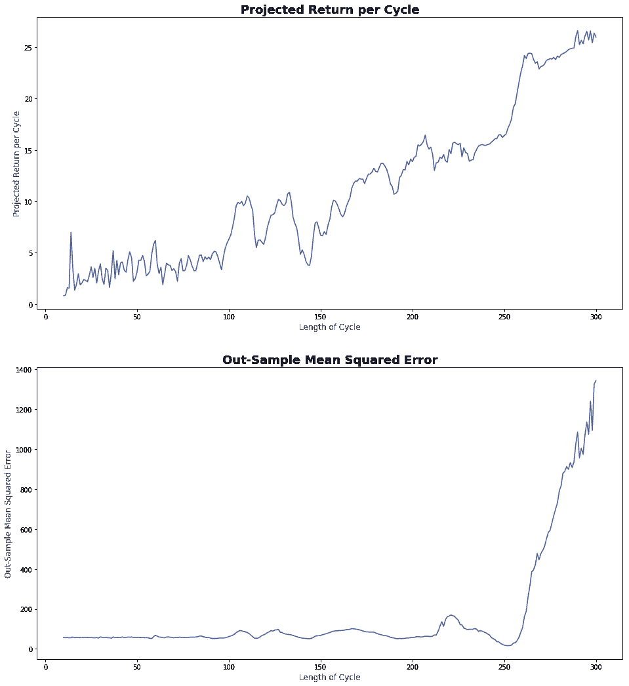
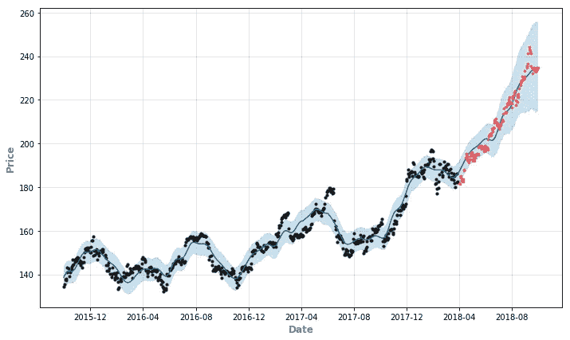
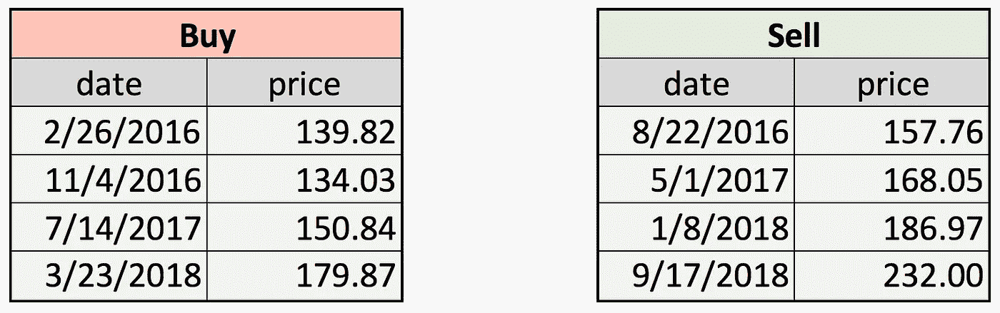
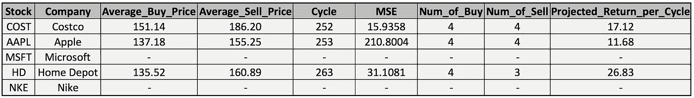

# 用 Python 中的 fbprophet 包分析股市周期

> 原文：<https://towardsdatascience.com/analysis-of-stock-market-cycles-with-fbprophet-package-in-python-7c36db32ecd0?source=collection_archive---------8----------------------->

**重要提示:这不是投资建议。**

股票市场周期是股票市场的长期价格模式，通常与一般的商业周期有关。它们是技术分析的关键，在技术分析中，投资方法是基于周期或重复的价格模式。如果我们对股票市场的周期有更好的理解，我们总是可以在每个周期中以相对低的价格买入，以相对高的价格卖出，我们总是会有正的回报。多么美好的世界啊！当然，股市中没有永远赚钱的优越策略，但 Python 或 R 中的`fbprophet`包可以帮助我们更深入地洞察股市中隐藏的周期。在这个分析中，我们可以看看`fbprophet`如何帮助我们做出投资决策，所有代码都可以从[这里](https://barrypan.github.io/Fbprophet_ANA/Final_Analysis.html)获得。

# fbprophet 简介

bprophet 是脸书发布的开源软件，目的是为大规模的预报提供一些有用的指导。默认情况下，它会将时间序列分为趋势和季节性，可能包含每年、每周和每天。然而，分析师可以定义自己的季节性。为了更好地理解这个包，Prophet 的文档[非常有用。](https://facebook.github.io/prophet/docs/quick_start.html)

包装的特点之一是它的简单性和灵活性。由于我们想要计算的股票市场周期并不局限于每年、每周或每天，我们应该定义自己的周期，并找出哪个更符合数据。此外，我们不应该使用周季节性，因为周末没有交易。我们也可以通过`add_seasonality` 函数定义我们的‘自定义循环’。所有的设置只需要两行代码就可以完成。

# 股票市场周期分析——以好市多为例

我们可以用好市多从 2015/10/1 到 2018/10/1 的接近价格作为例子，来更好地了解我们正在做的事情。用`pandas_datareader`我们可以很容易地获得股票价格。这里的文档是。在图 1 中，我们可以看到，从 2015 年开始，价格呈强劲增长趋势。但是，旅途中还是有很多起起落落，或者说循环往复，这些都是我们要赚钱的。

**Figure 1: Costco stock price from 2015/10/01 to 2018/10/01**

对于预测模型，评估它们的一种方法是样本外均方误差。我们可以使用 2015/10/1 到 2018/3/31 进行训练，并保留最后 6 个月来测试和计算样本外均方误差。在每个周期内，我们可以通过在最低价格买入，在最高价格卖出来优化我们的回报。为了使过程更容易，我们使用自定义函数`cycle_analysis.`。输出是一个列表，包含每个周期的预计回报和样本外均方误差。该功能的输入需要:

*   **数据:**熊猫数据帧带时间索引
*   **拆分日期:**拆分培训和测试数据的日期
*   **周期:**每个周期的周期(天数)
*   **模式:**季节性相加或相乘*(可选，默认相加)*
*   **forecast_plot:** 是否打印预测图*(可选，默认为 False)*
*   **print_ind:** 是否打印每个周期的预计收益和样本外均方误差*(可选，默认为假)*

在图 2 和图 3 中，我们对好事多股票价格应用了两种不同周期长度的函数，分别为 30 和 300，并将 2018 年 4 月 1 日作为训练和测试的拆分日期。正如我们所看到的，如果我们选择的时间太短(例如 30 天)，一个周期内的回报就很小，我们需要频繁地进行交易(图 2；相比之下，如果我们选择一个太长的时间长度(例如 300 天)，就会扭曲我们的预测(图 3)。)

**Figure 2: Prediction with cycle equal to 30 days**

**Figure 3: Prediction with cycle equal to 300 days**

我们可以在我们的`cycle_analysis`函数上应用一个循环来计算不同周期长度的预计回报和样本外均方误差，我们在图 4 中显示了结果。正如我们所看到的，长度越长，每个周期的预计回报和样本外均方误差都会增加。考虑到交易成本，每个周期内的预期收益应该大于 10 美元。在这种约束下，我们可以选择使样本外均方误差最小的周期，它是 252 天。每个周期的预计回报为 17.12 美元，样本外均方误差为 15.936。都挺好的！

**Figure 4: Projected Return and Out-Sample Mean Squared Error for different length of cycle**

**Figure 5: Prediction with cycle equal to 252 days**

为了进一步说明投资策略，我们可以看到 2015/10/1 和 2018/10/1 之间的买入和卖出日期。`Return_Dates`函数可以返回所有买卖日期作为输出，输入:

*   **预测:** fbprophet 预测对象
*   **股票 _ 数据:**带时间指数的熊猫数据框
*   **周期:**周期长度
*   **周期名称:**预测对象中周期列的名称
*   **时间名称:**预测对象中时间列的名称

在 2015/10/1 和 2018/10/1 期间，我们将买入和卖出好市多四次。总的来说，我们会花 604.56 美元购买，当我们在这些特定的日期出售它们时，会得到 744.78 美元的回报。对于一个简化的回报率(不考虑再投资、时间价值等)，3 年是 23.2%。大概不是很吸引人，但至少是正回报。

# 适用于更多股票

当然，这种方法可以适用于尽可能多的股票。我们列出了好市多、苹果、微软、家得宝和耐克在每个周期内的平均买入价格、平均卖出价格、周期长度、样本外均方误差、买入数量、卖出数量和预期回报。

对于微软和耐克，我们找不到任何周期符合我们的要求，每周期超过 10 美元的回报。对于好市多、苹果和家得宝，我们可以找到 250 天左右的周期，并做出良好的预测和体面的回报。

# 摘要

借助 Python 和`fbprophet`包，我们可以对股票市场有更好的了解。以 Costco 为例，我们可以找到一个 252 天的周期，这样它就可以产生足够的回报，并有很好的数据拟合。按照我们找到的周期，3 年可以有 23%左右的回报。也许这种投资策略不能满足你的需要，但是你可以根据你的知识和经验来设定你自己的方法。强大的`fbprophet`软件包可以让你对股市的分析更加深入和简单。