# 2018 年 Crossfit 公开赛分析

> 原文：<https://towardsdatascience.com/analysis-of-the-crossfit-open-2018-jean-michel-d-307cbfb06a13?source=collection_archive---------4----------------------->

Photo by [Victor Freitas](https://unsplash.com/@victorfreitas?utm_source=medium&utm_medium=referral) on [Unsplash](https://unsplash.com?utm_source=medium&utm_medium=referral)

你好，在这篇文章中，我将给出一些关于如何创建网页抓取系统的线索，该系统已被用于从锐步的 [Crossfit 游戏网站收集一些数据。](https://games.crossfit.com/regionals)

# 交叉拟合简介

交叉拟合定义为

`a strength and conditioning program consisting mainly of a mix of aerobic exercise, calisthenics (body weight exercises), and Olympic weightlifting`

这个项目似乎是在 2000 年由 Greg Glassman 和 Lauren Jenai 邀请的，这项运动以 **CrossFit，Inc** 的名义获得许可。

我邀请你看一下 YouTube[Crossfit Inc 频道上的一些视频](https://www.youtube.com/channel/UCtcQ6TPwXAYgZ1Mcl3M1vng)，以便更好地了解在一次训练中应该做些什么。

就我而言，我从 2017 年 8 月开始练习 crossfit，每周三次，我真的很喜欢它，当我开始的时候，我把这项运动看做一些高强度的健身房运动。

更严重的是，我有点担心强度的练习，从我的角度来看，可能会严重伤害人，但这项运动是为每个人都没有必要成为超人来练习交叉健身。

优点是每项锻炼都可以根据你的需要(身体状况、受伤情况)来衡量重量和运动量，但唯一的目标是完成锻炼。永不放弃可能是 crossfit 的座右铭。

世界杯冠军的选拔非常简单，过程分为三个阶段:

*   **公开赛**，每个人都可以参加这个资格赛，分组是按年龄和性别划分的，如果你不在可以验证你表现的附属健身房，你可以拍摄下来发给组织者。
*   **地区赛**，公开赛中的最佳选手将参加**比赛**
*   第十三届奥运会第十四届世界杯

对于本文，数据收集将仅是可以在此[地址](https://games.crossfit.com/open)找到的公开的 2018 年数据。开口定义为:

*   为期 5 周，每周公布一个新的 wod(每日锻炼计划)
*   有 4 天时间来争取在世界上取得最好成绩

所以为什么我想用这个案例来介绍网络抓取:

*   我在 Crossfit 游戏网站的 scraping 上读到了一篇很酷的文章
*   我发现排行榜的展示在比较方面非常有限
*   我想做一个网页抓取练习已经很久了

所以让我们开始吧。

# 网页抓取 101

在这种情况下，我决定删除以下元素:

*   本文的[排行榜页面](https://games.crossfit.com/leaderboard/open/2018?division=1&region=0&scaled=0&sort=0&occupation=0&page=1)我们将致力于 2018 年的结果，但如果您想要上一年的方法，我邀请您查看关于该主题的这篇[文章](/my-first-battle-with-web-scraping-77e15954d13b)
*   [运动员页面](https://games.crossfit.com/athlete/153604)，因为每个运动员都有一个包含一些有趣信息的页面
*   健身房页面包含一些关于健身房位置的细节

为了从这个网站收集数据，我使用了名为 [Beautiful Soup](https://www.crummy.com/software/BeautifulSoup/) 的包，这是 Python 中非常流行的网络抓取工具。在接下来的部分中，将描述收集的数据和相关的代码。

**你可以在这个** [**GitHub 库**](https://github.com/jeanmidevacc/crossfit_webscraping) 中找到本部分解释的所有功能。

# 排行榜

没有必要删除网页，前端使用的 API 可以通过简单的 get 请求直接调用。感谢 [@pedro](https://twitter.com/PedroPuros) 注意到这一点。请求中只需要提到:

*   分部的代码
*   如果排行榜涉及按比例增减的运动员或未按比例增减的运动员
*   api 的页面(可以从第一页的请求中获得)

这是要执行的请求。

# 运动员页面

在这种情况下，运动员页面看起来像下图中的屏幕截图

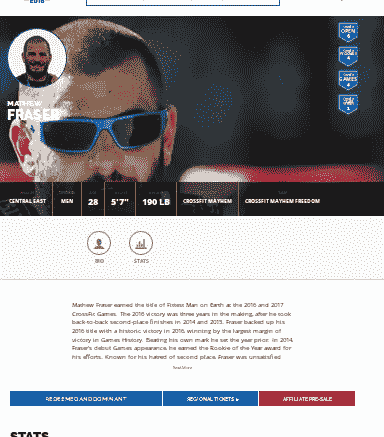

在页面底部，有一些练习的基准。

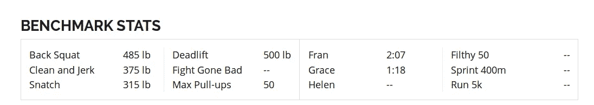

因此，我决定删除过去 5 年中参加公开赛的所有运动员的页面，这代表了超过 700000 页要删除，为了优化收集，我决定并行处理该过程，并使用以下代码获取一页的数据。

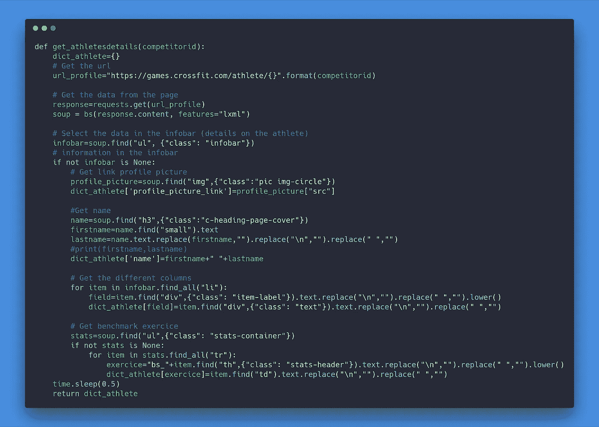

# 体育版

在健身房页面的情况下，收集的信息量没有运动员重要，下图是健身房页面的截图。

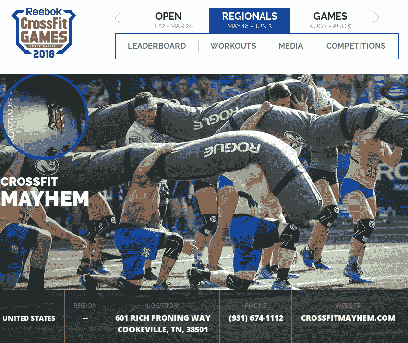

该脚本将重点放在页面标题的细节，这涉及到的位置。在这种情况下，要废弃的页面数量大约为 10000 页，下面的代码用于实现这一点。

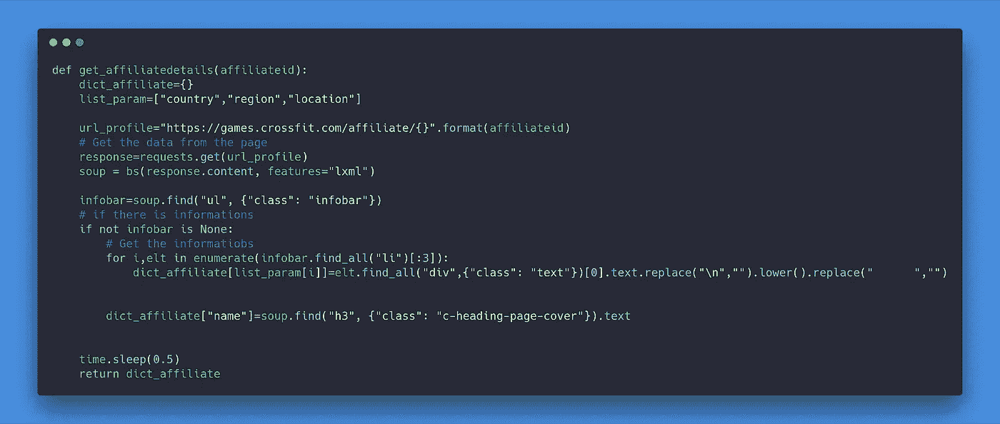

# 过程背后的伦理

如你所知，我的系统收集了大量数据，问题是**这是否合法？**。

如果我指的是普遍的看法，*它在互联网上，所以它是免费的，这很好*如果我指的是[这篇文章](https://benbernardblog.com/web-scraping-and-crawling-are-perfectly-legal-right/)，它似乎比这更复杂，我似乎做了一些非法的事情，因为我不尊重网站的使用条款，所以我决定联系 Crossfit Inc .警告他们我所做的事情，并获得他们的反馈(我通过他们的表格和一些与隐私相关的电子邮件地址等联系了该组织)。

2018 年 4 月 29 日:我没有收到他们关于这个问题的反馈。

从我的角度来看，我认为这是说，直到我没有发布运动员的个人信息和出售数据集，但谁知道呢？

让我们来看看数据集的一些全局见解。

**你可以在本** [**GitHub 库**](https://github.com/jeanmidevacc/crossfit_webscraping) 中找到本部分解释的所有功能。

# 对 2018 年公开赛的见解

在这一部分，它将主要是一个非常一般的开放事件的概述。分析将从性别再分配开始。

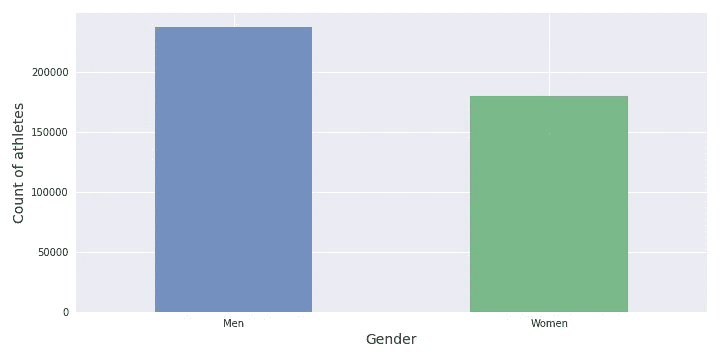

很高兴看到有相当数量的男性(56.8%)和女性(43.2%)(与我在培训期间看到的情况相似)参与公开活动。现在让我们来看看时代的重新划分。

性别之间的年龄分布非常相似，年龄大于 60 岁的运动员被认为是异常值。另一点要注意的是，运动员的平均年龄大于 30 岁，这可能是也许的标志:

*   参加公开赛需要经验(但我不会打赌)
*   成为会员的代价太高了
*   视频分级提升的不是很好

下面的分布图很好地说明了这种年龄划分。

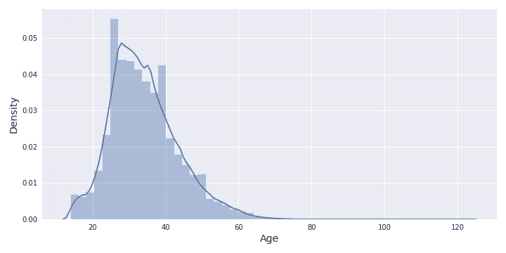

这是与收入相关的年龄划分的例证。现在让我们看看运动员的数据。

# 运动员分析

为此，我使用了运动员页面中的一部分数据，我过滤了不符合[身体质量指数(身体质量指数)](https://goo.gl/images/jJRsXf)的离群数据，这些数据不在 13 到 83 之间，还有一些错误的体重和身高值。有一个形态学的可视化。

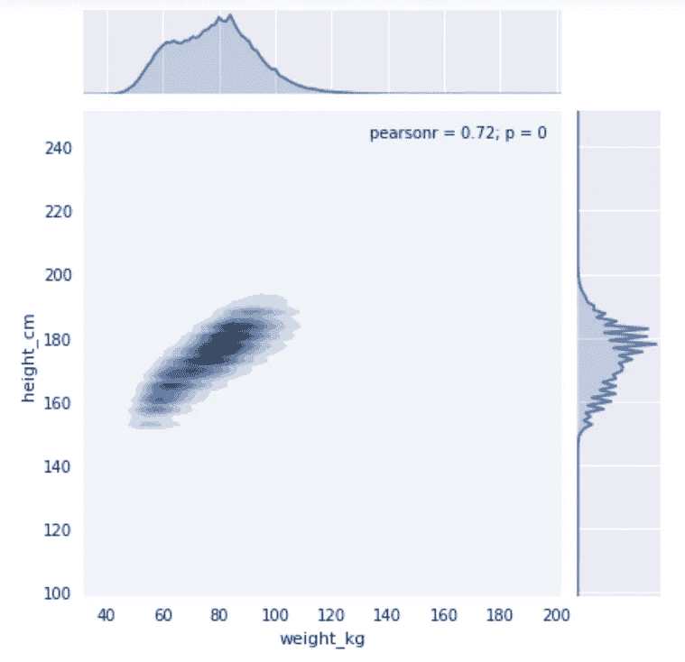

运动员的一般物理似乎是:

*   大约 80 公斤的体重
*   180 厘米左右的身高

在国家再分配方面，美国领先。下图统计了美国和其他前 10 个国家参加该项目的运动员人数。

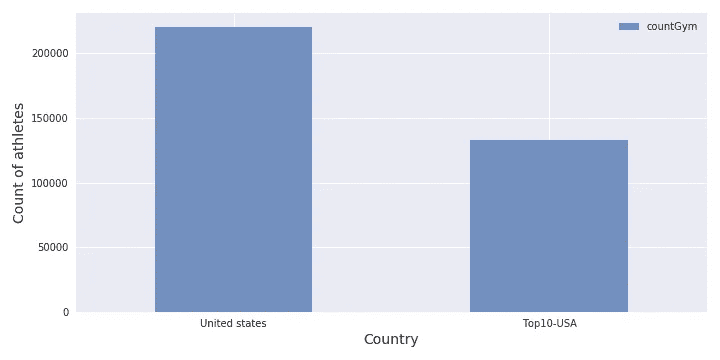

我认为对 crossfit 在美国的流行没有什么可评论的，如果我把更多的注意力放在其他国家，会有一些有趣的见解。在下图中，有更多关于前 10 名国家(就运动员数量而言)的细节，不包括美国。

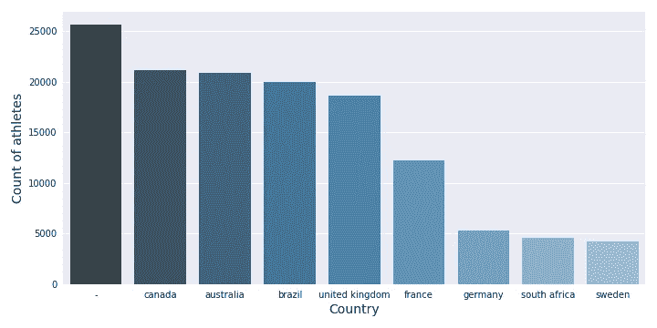

我们可以看到:

*   美国和第二个国家之间有巨大的差距(比如 20 万名运动员)
*   运动员人数第二多的国家，这不是一个国家，而是所有运动员的协会，他们只是在拍摄他们的世界。
*   巴西和部分英联邦国家的运动员对此明显感兴趣
*   在欧洲参赛的运动员人数不那么重要

现在让我们来看看给运动员打分的体育馆的一些细节。

# 健身房/拳击数据分析

所以要明确的是，美国有相当数量的健身房/运动员参与这项活动。下面是美国健身房的数量和其他 9 个健身房较多的国家的健身房数量的比较。

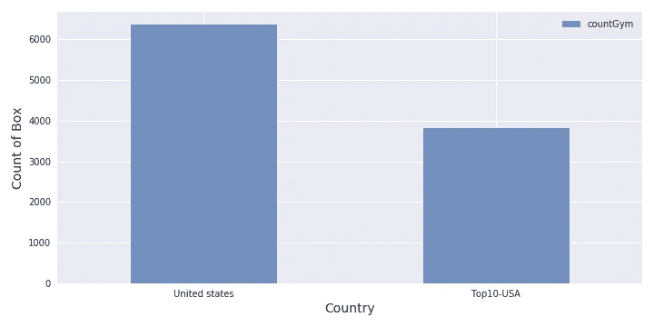

美国正在实实在在地压榨其他国家。下图显示了其他国家健身房的数量。

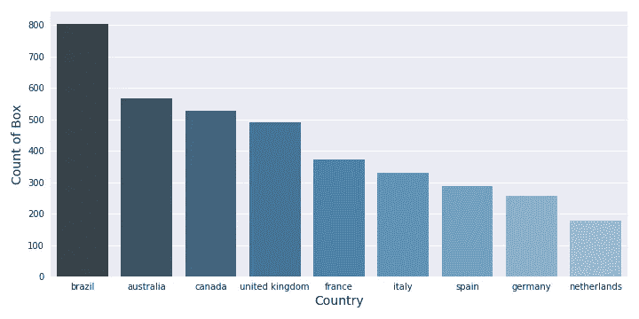

有趣的是看到(运动员号码和体育馆号码之间有很多相似之处，这很正常):

*   巴西有很多健身房
*   英联邦(加拿大、英国、澳大利亚)出席了会议
*   法国在排名中领先欧洲(但意大利很接近)

我可以继续用这些数据制作大量的图表，所以我决定制作一个交互式的仪表板，我可以在任何时候轻松地制作，为此我将使用 [Tableau](https://www.tableau.com/)

# 桌面上的仪表板公共

Tableau Public 是 2003 年由山景城的一家公司基于斯坦福大学(vizQL)的工作开发的一项服务。该公司于 2013 年在纽约证券交易所上市，拥有 2400 名员工(2015 年的数字)。

Tableau 开发了不同的产品，但该工具的目的是通过创建和共享仪表板来促进整个企业的数据信息交换。

我邀请看一看他们的网站上有更多的产品细节，对于这个项目，我使用 Tableau 公共创建以下仪表板。

 [## Tableau 公共

### 编辑描述

public.tableau.com](https://public.tableau.com/shared/M345H9FB7?:display_count=yes) 

最后，我想在数据上更进一步，只关注基准测试，试图找到它们之间的联系。

# 练习之间的关系

为了分析数据，我必须消除异常值，为此我添加了选项:

*   在数据标准化后，使用 dbscan 检测异常值(有效，但将它应用于所有有数据的运动员有点长)
*   使用基于分位数的统计方法，删除低于 5%分位数限制和高于 95%分位数的值

我直观地发现了练习之间的一些关联，如下图所示。

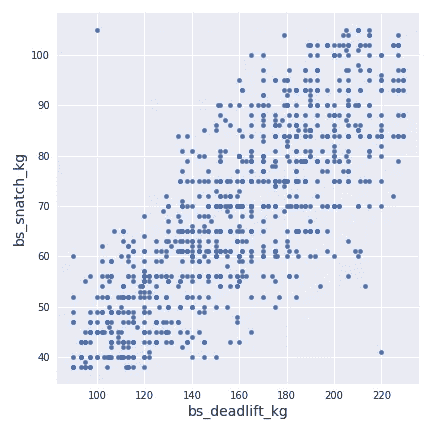

因此，我想将相关性(一种线性关系)的研究应用于所有的练习，我对 1000 名运动员应用了一个线性模型，并对 250 名运动员测试了该模型，以了解该模型是否足够好。我使用 r 分数作为指标来评估模型的效率。

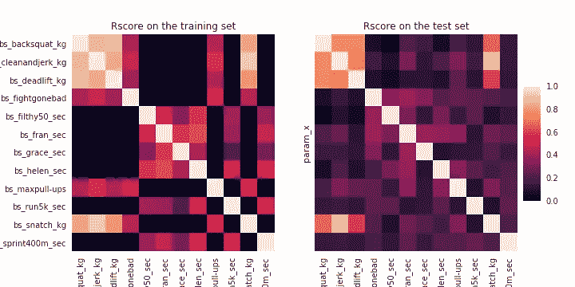

在训练集中，涉及负重的练习彼此高度相关，涉及持续时间的练习显示出不太重要的相关性。当模型应用于测试集时，重量练习的相关性仍然很好，但是随着时间的练习在训练集上绝对是过度拟合的。下图显示了与体重相关的锻炼的线性模型。

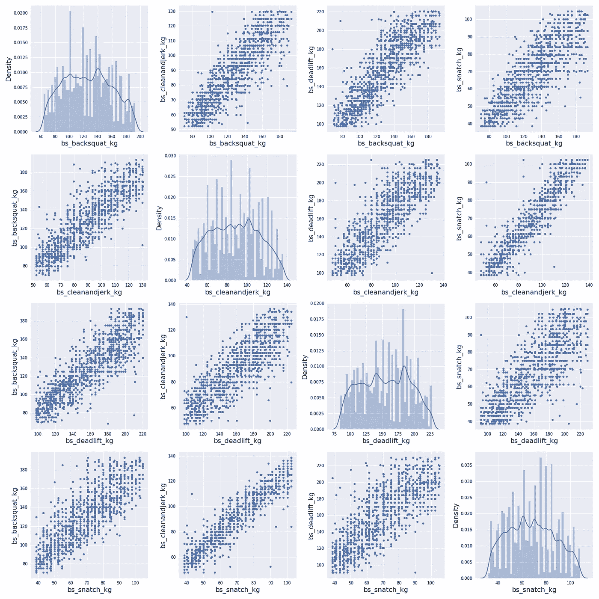

为了更好地了解体重改变对一项运动的影响，我创建了一个表格，将一项运动的体重改变转换为另一项运动的体重改变。

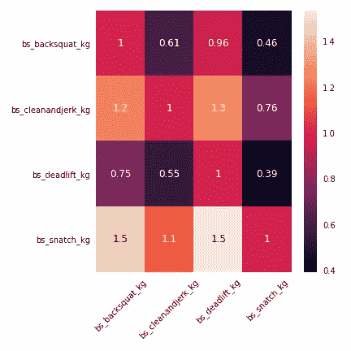

# 结论和下一步措施

这个项目非常有趣，收集网站数据绝对非常实用，从这个数据集中可以获得一些见解(通过快速分析)。

该项目的下一步是:

*   创建一个 Kaggle 数据集(如果锐步可以的话)
*   创建某种 API，使用这些数据给出训练建议
*   根据运动员个人资料上的图片，当年龄和性别正确时，创建一个模型，从某人的面部确定其性别和年龄(年龄范围)
*   在表格上添加更多的历史数据(我收集了过去 5 年的数据，但过去数据的格式有点不同)，可能还会添加地区赛和比赛数据
*   改进和构建其他仪表板

*原载于 2018 年 3 月 30 日*[*【the-odd-dataguy.com】*](http://the-odd-dataguy.com)*。*