# 线性回归的解析解

> 原文：<https://towardsdatascience.com/analytical-solution-of-linear-regression-a0e870b038d5?source=collection_archive---------3----------------------->

# 介绍

我们知道像梯度下降这样的优化方法可以用来最小化线性回归的成本函数。但是对于线性回归，存在一个解析解。这意味着我们可以通过使用正确的公式，在一步计算中获得线性回归的变量。在本帖中，我们将探究线性回归及其衍生的解析解。

# 解析

我们首先给出了线性回归的解析解公式。如果你对导数不感兴趣，你可以用这个公式来计算线性回归变量。解决方案是:

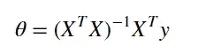

在这个公式中，所有符号都是矢量化的。如果你不熟悉线性代数或者矢量化，可以参考这篇[博客](/vectorization-implementation-in-machine-learning-ca652920c55d)。在这个公式中，X 是一个 m 乘 n 的矩阵，这意味着我们有 m 个样本和 n 个特征。符号 y 是代表目标标签的 m 乘 1 向量，θ是代表每个特征所需的所有系数的 n 乘 1 向量。

# 派生

我们知道线性回归代价函数的矢量化表达式(更多细节请参考[博客](/vectorization-implementation-in-machine-learning-ca652920c55d))可以表示为:

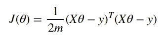

由于 1/(2*m)是一个常数，当我们最小化一个函数时，将成本函数乘以或除以一个非零常数不会影响最小化结果，因此在这种情况下，我们忽略这个常数项。为方便起见，我们的成本函数变为:

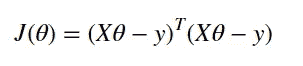

这可以进一步简化为:

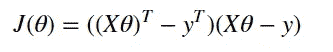

我们将其扩展为:

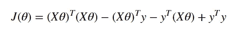

现在第二学期需要一些转变。我们知道 X 是一个 m 乘 n 矩阵，θ是 n 乘 1 矩阵，因此 Xθ的维数为 m 乘 1，其转置矩阵的维数为 1 乘 m，由于 y 是 m 乘 1，因此第二项的维数为 1。换句话说，第二项是标量。我们知道标量的转置等于其自身，因此我们取第二项的转置得到:

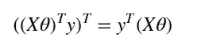

我们将 is 代入成本函数，得到:

此外，我们可以把它写成:

现在我们需要对成本函数求导。为方便起见，列出了常见的矩阵导数公式作为参考:

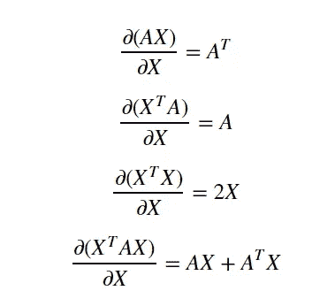

使用上述公式，我们可以推导出关于θ的成本函数:

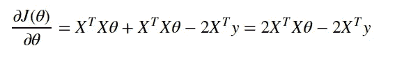

为了求解变量，我们需要使上面的推导等于零，即:

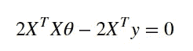

我们可以将其简化为:

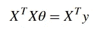

因此，我们可以将θ计算为:

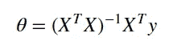

# 结论

在这篇博客中，我们给出了求解线性回归变量的解析解。我们详细介绍了如何从成本函数的推导中得出这个结果的步骤。