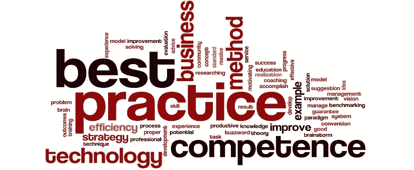
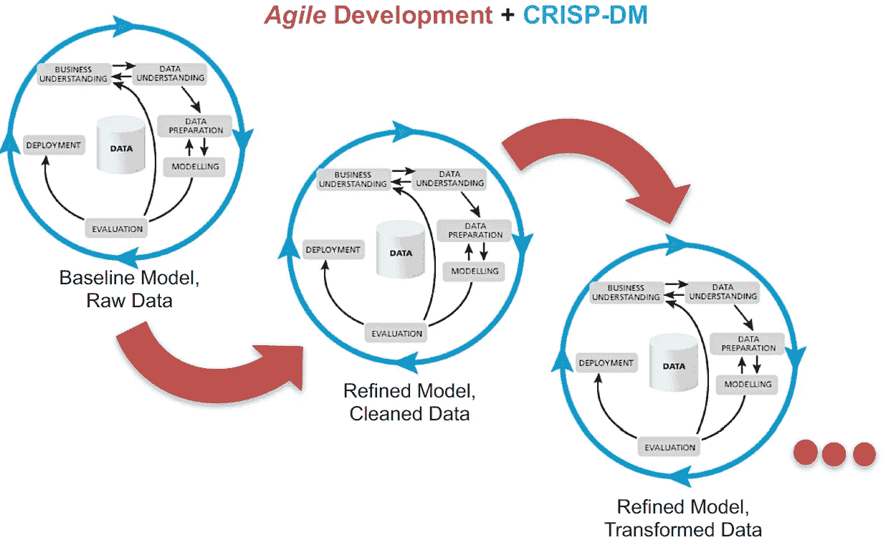

# 分析最佳实践—敏捷数据科学

> 原文：<https://towardsdatascience.com/analytics-best-practices-agile-data-science-46918124b6d9?source=collection_archive---------5----------------------->

*这是数据科学家 Anna Godwin 和 Cory Everington 讨论五种分析最佳实践的系列博客中的第二篇，这五种分析最佳实践对于建立数据驱动的文化和从分析中获得价值至关重要。在这一部分中，Anna 讨论了使用敏捷数据科学作为管理数据科学项目的框架的好处。*

如果你参与过任何项目，你很可能在项目的生命周期中经历了意想不到的变化。正是这些意外会影响您按照最初的设计完成项目的能力，包括团队、可交付成果和/或时间表的变化。在整个项目中，作为个人*和团队*的灵活性使你能够快速响应变化。但是项目受益于结构化。为数据科学项目管理适当平衡的最佳框架是什么？

对于我们的项目工作，Elder Research 采用了[敏捷数据科学](https://www.elderresearch.com/consulting-services/agile-data-science)方法。它结合了敏捷软件开发的最佳实践和数据挖掘的最佳实践，正如数据挖掘的跨行业标准过程(CRISP-DM)所体现的那样。

敏捷数据科学具有以下优势:它:

*   提供灵活的团队组织
*   获得利益相关者的早期认同
*   适应不可预见的环境

# 敏捷数据科学为项目团队带来了组织

虽然单独工作时可以使用敏捷方法，但这种方法是为了帮助团队组织工作而设计的。任何时候团队成员在一个项目的不同方面工作，自然会有混乱，重复工作，或者工作在不关注项目可交付性的任务上。敏捷数据科学有助于缓解这些问题，并通过冲刺规划、每日站立、团队透明度和路障意识创建共同愿景。

敏捷方法的两个主要组成部分控制着项目工作:

Sprint Planning 是一个过程，在这个过程中，项目工作被分解成可以在几个小时或几天内完成的小块工作，并分配给团队成员。它通常在两周的周期内完成，以允许团队成员快速迭代，并在如何完成工作方面提供灵活性。在我们即将发布的关于*任务管理*的博客文章中，我们将更详细地讨论如何计划冲刺。

**每日脱口秀**通过为每个团队成员创建一个论坛，让他们简短(2-3 分钟)地介绍他们在分配任务上的进展以及他们遇到的任何可能影响进度的障碍，从而促进沟通和项目成功。每日站立被设计为少于 15 分钟。它们不是一个进行详细讨论的论坛，相反，它们为团队成员提供了一个了解其他人正在做什么的机会，并为项目领导提供了一个必要的调整过程的机会。

# 敏捷数据科学吸引利益相关者

敏捷方法的迭代性质要求经常与项目涉众进行核对。尽早共享结果，通常可以让项目团队专注于构建快速的解决方案，提供价值并获得最终用户的采用。关注过程早期的部署是 Elder 研究方法的核心。无论交付的是一个完整的软件解决方案还是一个分析算法，从涉众那里获得早期的认同是很重要的——而这是通过在过程的早期获得他们的反馈来实现的。一个解决方案只有在最终用户实施的情况下才是成功的，因此来自关键用户的早期反馈对于形成解决方案的设计是至关重要的。此外，一个很大的附带好处是，关键用户会对该解决方案产生兴趣。

# 敏捷数据科学能够快速适应变化

项目工作中的变化来自四面八方。例如，一个团队成员转到了另一个项目，或者一个新成员加入了团队。能够快速让新团队成员加入是敏捷的核心优势。团队站立和冲刺计划提供频繁的项目更新和介绍性任务，新成员可以快速完成，直到彻底的知识转移发生。

利益相关者群体也可能发生变化。随着利益相关者的改变，分析项目的愿景也可能改变。当感觉项目目标在不断移动时，敏捷方法的适应性对你有利。在敏捷项目生命周期中发生的迭代提供了一个关键的机会，要么坚持到底，要么转向不同的方向。利益相关者做出多个“是”或“否”的决策点决定了项目完成和*成功*项目完成之间的差异。

最后一种意想不到的变化可能以技术障碍的形式出现。例如，为项目选择的初始技术栈可能工作得不好。同样，敏捷数据科学的快速迭代允许“快速失败”的现实，即技术限制在项目生命周期中比其他情况下暴露得更快。这种早期的洞察力允许团队在项目时间线内快速发现可以为项目提供更好解决方案的替代方案。

# 找到适合你的方法

敏捷数据科学的关键词是——你猜对了——敏捷。我们强调了在项目工作中采用灵活结构的好处，最终，每个项目团队都应该采用最适合他们的结构。灵活地设置您的敏捷方法，这样您就可以在项目管理上花费更少的时间，将更多的精力放在完成技术项目工作上，以创建可操作的解决方案，为最终用户提供真正的价值。

[**请求咨询**](https://www.elderresearch.com/request-consultation) **与经验丰富的数据分析顾问交谈。**

# 有关系的

阅读本博客系列的第一部分 [*分析最佳实践—第一部分*](https://www.elderresearch.com/company/blog/analytics-bestpractices)

阅读博客[使用数据科学方法管理不断变化的优先级](https://www.elderresearch.com/company/blog/agile-data-science-manages-project-priorities)

查看《挖掘你自己的业务》一书[了解更多关于如何利用数据科学和预测分析的力量以及避免代价高昂的错误的最佳实践。](https://www.elderresearch.com/company/resource-center/books/mining-your-own-business)

*原载于*[*www.elderresearch.com*](https://www.elderresearch.com/company/blog/benefits-of-agile-data-science)*。*