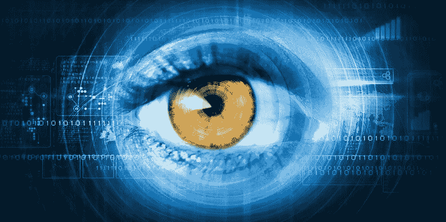

# 分析对福祉的贡献:大数据和自我技术

> 原文：<https://towardsdatascience.com/analytics-contribution-to-well-being-big-data-and-techniques-of-the-self-3584aee9e1d7?source=collection_archive---------4----------------------->

米歇尔·福柯(Michel Foucault)曾指出，衡量技术的唯一可行标准是它是否有助于人类潜能。不久的将来，健康分析可能会为这一愿景提供实质性的证明。到 2020 年，大约 25，000 Pb 的患者数据将可供该行业使用。KPMG 最近对医疗保健专业人士的调查显示，56%的受访者认为这些数据将极大地有助于我们的商业智能实践，而 35%的人认为降低了医疗保健成本，32%的人认为改善了健康结果。[【ii】](#_edn2)随着医疗保健组织大举投资技术和分析以利用这些机会，有抱负的数据科学家有哪些机会？

健康分析涉及从数据的模式和相关性中获得见解，从而在健康和生命科学领域做出更好的决策。根据研究和市场部门最近对“医疗保健分析”的研究，该市场预计将从 2016 年的 73.9 亿美元增长到 2021 年的 245.5 亿美元，CAGR 为 27.1%。[【iii】](#_edn3)这种非凡的市场增长是由多种因素推动的，包括政府加强电子健康记录采用的举措增多、抑制医疗支出的压力增加、对改善患者疗效的需求增加、行业风险投资的增加以及分析和大数据技术的进步。

通常情况下，数据科学家有很多机会利用描述性、预测性和规范性分析。量化自我运动的繁荣正在推动一个细分市场。来自众多互联设备的关于个人身体和精神状态的持续少量数据流捕捉到了我们的正念、锻炼和饮食的质量。量化自我的支持者声称，这些数据可能会改善我们的睡眠质量、工作方式和娱乐方式。Asthmapolis、Quadio 和 Zepher 等小数据的应用对于面临特定健康挑战(过敏、哮喘、心脏疾病等)的人群尤其有前途。)，以及寻找竞争优势的运动员。这种对预防医学的关注不仅会给行业和政府带来好处，也会给全体人民带来好处。

在竞争日益激烈的医疗保健市场，埃森哲采访的 89%的行业高管认为实施大数据分析将是保持市场份额的关键。[【iv】](#_edn4)医疗提供商和制药行业之间的合作伙伴关系，如 DataSphere、HealthConnect 和 PPC/HealthCore，为健康分析的未来提供了框架。包括指令 2011/24/EU 和法国国家医疗卡计划在内的欧洲和国家计划已经提供了大量关于行业成本和人口统计实践的数据。地方尝试以"区域医疗小组"的形式汇集资源，这使得地方从业人员能够分享资源、知识和最佳做法。

有抱负的数据科学家应该更好地了解这个领域及其机遇。[商业分析研究所的 2018 年暑期学校](http://baisummer.com/)将帮助你探索工业格局的演变，以了解当前的挑战和机遇。我们将研究当今可用的小数据和大数据的来源。我们将回顾数据科学的适当方法，以及它们如何应用于这一领域。最后，我们将探索私人和公共组织如何将这些数据转化为行动，以改善我们未来几代人的身心健康。

在巴约纳的[暑期班](http://baisummer.com/)以及欧洲的[大师班](http://baimasterclass.com/)中，我们让分析为您和您的组织服务。该研究所专注于管理者数据科学的五个应用:数字经济学、数据驱动的决策、机器学习、社区管理和视觉通信。改善管理决策会对你未来的工作和职业生涯产生影响。

____________

Lee Schlenker 是 Pau 商学院的教授，也是 http://baieurope.com 商业分析研究所的负责人。他的 LinkedIn 个人资料可以在 www.linkedin.com/in/leeschlenker.[查看](http://www.linkedin.com/in/leeschlenker.)你可以在 https://twitter.com/DSign4Analytics[的 Twitter 上关注我们](https://twitter.com/DSign4Analytics)

[【I】](#_ednref1)Dhamdhere，et。艾尔。，(2016)，[健康医疗大数据](http://scet.berkeley.edu/wp-content/uploads/Big-Data-for-Healthcare-Report-ELPP-2016.pdf)

[【ii】](#_ednref2)t . Walker，(2015)，[只有 10%的医疗保健组织使用数据分析](http://managedhealthcareexecutive.modernmedicine.com/managed-healthcare-executive/news/just-10-healthcare-organizations-using-data-analytics)，管理式医疗保健执行官

[【iii】](#_ednref3)市场和市场(2016 年)，[医疗保健分析/医疗分析应用市场](http://www.marketsandmarkets.com/Market-Reports/healthcare-data-analytics-market-905.html)

[【iv】](#_ednref4)Bresnick，j .(2014)， [89%的高管认为大数据分析是市场份额的关键](https://healthitanalytics.com/news/89-of-execs-say-big-data-analytics-is-key-to-market-share)，HealthIT Analytics