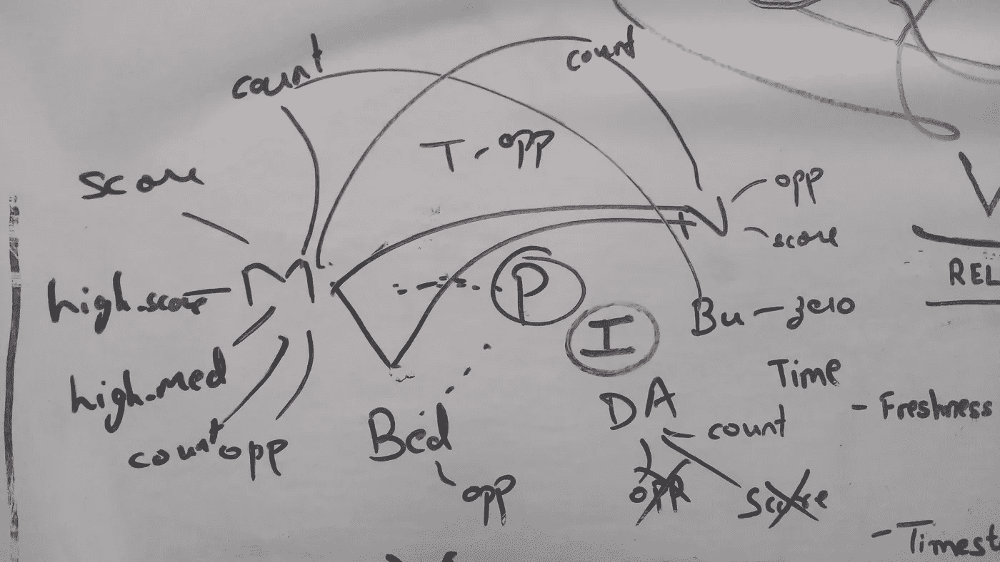
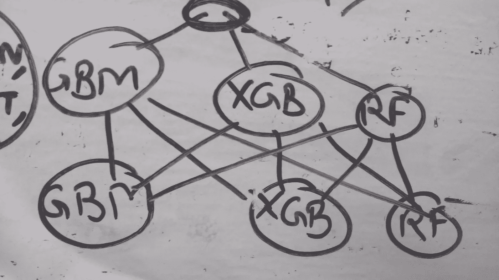

# 纽约租赁市场分析| ka ggle 排名前 15%的网站！

> 原文：<https://towardsdatascience.com/analytics-on-the-new-york-rental-market-top-17-on-kaggle-91bb139d8f4b?source=collection_archive---------2----------------------->

这是我第一次认真参与 Kaggle 竞赛的文档资料——rent hop 租赁咨询。两个半月， [146 git 提交](https://github.com/shubh24/renthop)和 [87 提交](https://kaggle.com/shubh24)之后，我站在排行榜的[前 15%](https://kaggle.com/shubh24) 之内——一个我引以为豪的位置！

Kaggle 比赛是由 Renthop 组织的，rent hop 是一家专门针对纽约市场的租赁网站。给定各种列表参数，如价格、位置、经理(经纪人)、建筑、图像，我们必须预测每个租赁列表将获得的兴趣(互联网流量)。“兴趣列表”是一个离散变量，分为“高”、“中”和“低”。

这个竞赛的领域引起了我相当大的兴趣——就在 4 个月前，我还在班加罗尔混乱的房地产市场中沮丧地寻找一个像样的地方！再加上竞争激烈的纽约市场，我们有一个现实世界的问题等待解决。

**我的旅程** —对我来说，这场比赛真是过山车——我的情绪和我的排行榜位置之间绝对存在正相关关系！不过，我学到了很多，从疯狂的功能工程到实现新算法，从修复验证漏洞到构建我的定制 stacker-ensemble——这种学习为未来的竞争提供了一个很好的跳板。

*也就是说，这篇博客有点技术性。可以的话就离开；)*

到目前为止，我构建预测模型的标准方法是在标准变量上构建一个随机森林。没有太多的探索或特性工程——这种方法没有给我带来好处。在这次比赛中，我花了前两个月的时间来理解这些特性，并尝试它们的组合。

**特征工程**

*价格* —最明显的特征之一是租赁列表的价格(价格的对数)，这导致了一个更好的衡量标准——每间客房的价格。当与邻里或街道等其他变量相结合时，价格可以很好地代表“这是 21 街上最好的公寓吗？”。不过，对于一室公寓来说，这个功能有点棘手，因为根据定义，一室公寓没有卧室。

经理人 —纽约市场将经理人(或经纪人)视为高度可信的来源，这一点从经纪人代理机构的关系中可以看出。由于 manager_id 是一个高度分类的变量，kagglers 的同事们想出了一个巧妙的特性——“manager _ score”！它基本上是该经理的“高兴趣”列表和“中等兴趣”列表的百分比的组合。这是我几乎所有模型中最重要的特征。

我提出了“经理机会”的概念，它表明一个经理的列表相对于通过同一经理的其他列表有多好。基本上，将租金价格与经理的中值价格进行对比——“布朗先生，你有更便宜的 2BHK 公寓吗？”

建筑物——这个特征应该是致命的，因为这是我们在谈论地点时所能得到的最狭窄的范围。我试着映射像“建筑分数”、“建筑机会”、“建筑数量”这样的特征，但是它们都抛弃了我的简历分数。许多 Kagglers 也经历了同样的情况，最可能的原因似乎是坏的数据点-16.8%的建筑物具有 building _ id“0”，尽管它们具有不同的坐标。然而，对建筑物的一个积极认识是，90%的“零建筑物标识”的建筑物是“低兴趣”的，至关重要！

*邻域* —普通的旧纬度和经度被证明是相当重要的特征，但我们并没有就此止步:)一个包含 60 个聚类的简单 k-means 给了我广泛的邻域，从而产生了诸如“neighborhood_score”和“neighborhood_opportunity”等特征。最初，我使用 Google API 将坐标映射到广阔的区域(正如 Renthop 网站上提到的)。

随着我构建越来越多的功能，我注意到一个共同的主题——价格和兴趣是核心部分，而“经理”、“邻居”、“建筑”、“街道地址”、“邮寄时间”是外围部分。当外围部分通过中间部分(或计数，或某种一般化)与中心部分整合时，会产生显著的改进。这张图是我接下来几天的必看之物:)

*街道/显示地址* —提供了两种地址，街道地址和显示地址，这是街道地址的一种精简形式。我尝试了像“公寓 _ 计数 _ 街道”这样的功能(这条街道的出租有多受欢迎？)和通用的“street_opportunity”。

我对街道地址的另一个想法是，它们是否包含“街道号码”，这应该有助于“地址的准确性”(Renthop 关心的一个变量！).结果没什么帮助。

一个从 kaggler 同事那里借来的想法——String Difference b/w the street _ address 和 display_addres。这是一个相当大的差异，在“高利息”，而不是一个清晰的想法为什么！

*发布时间* —当然，作为季节性业务，基于时间的功能派上了用场(mday，wday，hour，minutes)。我们无法探究年度季节性，因为数据集夹在 2016 年 4 月和 2016 年 6 月之间。

据报道，Renthop 上的一个房源停留时间为 5-6 分钟，竞争非常激烈！这促使我查看哪些房源是在同一小时内发布的，结果是“hour_opportunity”(在过去的 30 分钟内是否有更便宜的公寓发布？").这个特性并没有带来改进，尽管一个类似的特性很有用——“hour _ frequency”(那个小时发布的列表数量)。这可能会影响到一天中特定时段的在线消费者数量。

*Listing_Id* —这只是一个普通的序列号，至少我是这么认为的！结果证明这是一个非常重要的特性，因为它与“创建的”变量惊人地相关。此外，还有一些离群的列表，它们的 listing_id 比同一天发布的租赁的 listing_id 中值要高。而这些离群值中有很大一部分是“低兴趣”，陪审团对为什么会有分歧！

无论如何，这是一个令人难以置信的洞察力——有时，序列 id 可能与其他变量有很大关系！

*描述*——这应该是关于公寓的微小细节的宝藏，比如“允许携带宠物”、“门卫”、“电梯”等等。许多人尝试了著名的 tfidf 算法，但无济于事——我的假设是，人们最初是根据价格、位置和经理表现出兴趣的。细节在租赁后期考虑(就在最终确定之前？).

我想到的几个功能与识别描述中的垃圾邮件有关——可能，我是第一个公开这些内容的竞争者:)计算了大写字母的百分比和感叹号的数量——“啊！！你喜欢这个描述吗？！!"

我还尝试将电话号码或电子邮件地址作为一个因素变量。虽然没帮上什么忙。

Renthop 评分——在试图提取租户的使用模式时，我发现了一些见解。他们中的大多数人受到了 Renthop 分数的启发(Renthop 根据这个内部计算的分数对列表进行排名)。我也尝试了一些基于主要特征的经验公式，但是几乎总是增加我的对数损失。一个重要的学习——总是组合单调的特征，随机分割或对数不起作用。

*高基数特性的基数*—Branden Murray 的内核向我们 kagglers 介绍了一个漂亮的特性，用于计算经理的高分、中分或其他分类变量。

让我解释一下。经理 M 有“n”个列表，假设有“M”个经理。如果经理 M 的列表通常具有“高兴趣”,我们想要奖励他。我们如何对此进行量化？经理 X 可能只有两个都是“高兴趣”(100%命中率)的列表，但是经理 Y 可能有 100 个列表，其中 60 个是“高兴趣”(60%命中率)。我们应该倾向于经理 Y，因为他的一致性，而不是经理 X(成功，但短暂的职业生涯)。

要对此进行量化，请计算一个全局高比率(整体高利息百分比)并计算经理的高利息百分比。用λ将它们合并，λ与他的计数的负对数成反比。

经理高分=(经理高百分比)(lambda) +(全局高百分比)(1 — lambda)，其中 lambda = 1/(c + e^(-count/d)，c 和 d 为经验常数

基本上，当经理的(发布的列表)计数达到最高时，我们看重他的百分比，反之，我们看重他的全球百分比。

**主要学习—验证漏洞**

在建立我的验证渠道时，我观察到我的本地简历分数一直比我的公开简历分数好。当我往下钻的时候，泄漏的源头让我大吃一惊，那是我的第一手经验；)显然，在计算 manager_score 时，我必须计算高兴趣、中等兴趣和低兴趣列表的百分比。我对整个训练集进行计算，然后对该训练集本身的子集计算 logloss，因此引入了泄漏。后来我做了一个函数，它根据给定的训练集、验证集和测试集分别计算这些百分比。

**另一种学习——分层拆分**

就兴趣水平而言，数据集非常不平衡——只有 7.8%的列表是“高兴趣”，22.8%是“中等兴趣”。因此，当为了验证而进行分割时，我特意做了分层分割，以保持平衡。

**成功的模型**

*   H2O . GBM——我在整个锦标赛中的主要工作。我已经手动调到接近最佳状态，我希望；)
*   XGBoost — XgBoost 是爱。XgBoost 就是生活！在性能方面与 gbm 相当
*   H2O . RF——一种易于设置的算法，但结果不如 gbm 和 xgboost。

总的来说，我应该自动调整我的算法。目前是一个非常手动和缓慢的过程。此外，我意识到模型种子相当重要，多次运行平均(用不同的种子)是有益的。虽然放弃了，时间限制:(

**不起作用的模型**

*   H2O.deeplearning 没有给出一个好的结果，可能是一个糟糕的超参数选择的结果。还是那句话，不擅长调音。
*   extra trees——一个随机化的随机森林，让它工作了，但是我的系统没有足够好的 ram 来进行适当的测试
*   SVM、KNN、Logreg——所有更简单的 ML 模型都存在空值问题，并且没有给出好的结果。

**堆叠**

这是我第一次学习 stackers，阅读了 MLWave 的[不可思议的解释者博客](https://mlwave.com/kaggle-ensembling-guide/)，并着手实施我自己的！最初我失败得很惨，又看了一遍博客，终于明白了堆叠的本质。慢慢；)

所以，我有一个 3 层堆垛机，但没有太多的多样性。前两层由我的 3 个工作模型组成——XGBoost、GBM 和 RF。第三层是第二层模型的简单集合。或许，更关注简单的模型会给我带来更多的多样性——尽管如此，我还是获得了相当不错的 0.01 的跳跃:)

*注意:对于我的最终提交，我用一个* [*出色的公共脚本*](https://www.kaggle.com/brandenkmurray/two-sigma-connect-rental-listing-inquiries/it-is-lit/) *对我的提交进行了平均。可能每个人都在这么做。)*

**魔法特性**

在比赛的最后一周，Kaggle 上一位非常慷慨的大师 KazAnova 发布了一个非常强大的漏洞——图像文件夹的时间戳。仅仅插入时间戳就给了大多数人 0.01 的跳跃。我试着挖掘时间戳，它与“创建”变量的关系等等——这很可能是一个内部原因。

一个类似的神奇特性是包含在图像 URL 中的 listing_id——大多数与原始的 listing _ id 相同。那些不同的列表可能是同一套公寓的转贴，这表明它还没有被出售→“低利息”

**结论**

我从比赛中获得的主要收获是:

*   探索每一个变量。他们每一个人。查看数值的平均值、中值、最大值、异常值，以及类别的分布
*   把大部分时间花在特色上。当你认为你已经拥有了一切，再从头开始。
*   建立一个系统的管道。很容易引入漏洞
*   快速构建和测试。拥有高效、快速、易于调整的算法进行测试。
*   搭建一个模型测试平台，堆叠变得容易。
*   花大量时间在 Kaggle 内核和讨论上。他们太酷了:)

总的来说，这是有趣的几个月！学到了很多，这只是未来比赛的起点。很快就会达到前 10%:)

*此文最初发布在我的* [*博客*](https://shubh24.github.io) *上。每周一篇博客*