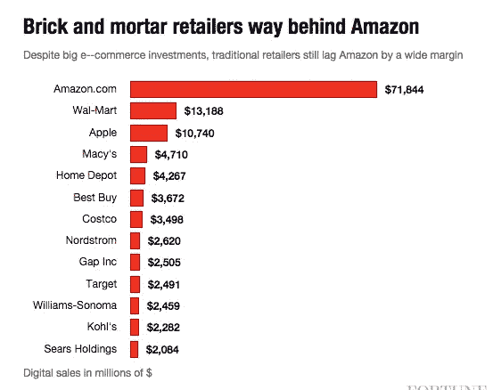
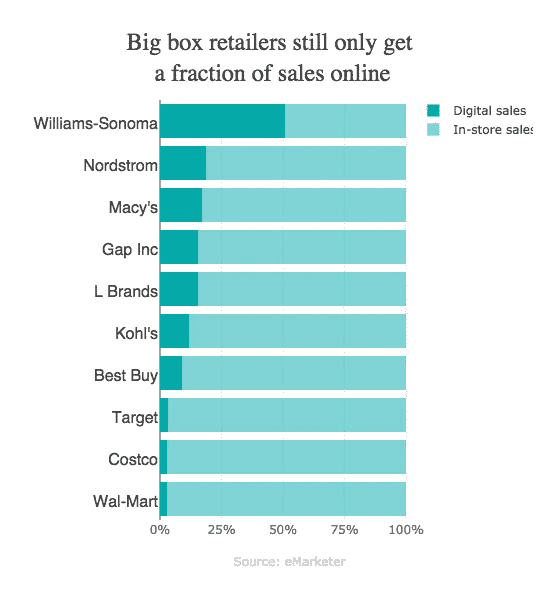
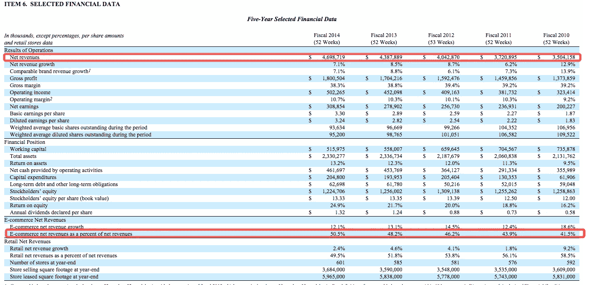
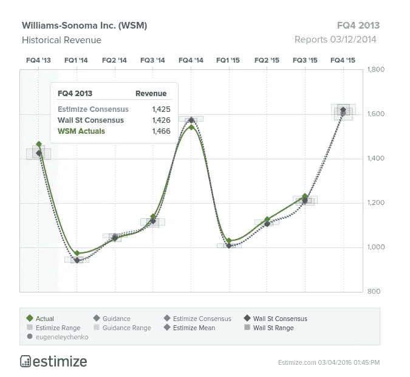

# 分析——内部人员

> 原文：<https://towardsdatascience.com/analytics-the-inside-man-a1fc67737a1a?source=collection_archive---------4----------------------->

如果有一种方法可以让一家公司(姑且称之为这家公司， [Hooli](http://www.hooli.xyz/) )通过在 SaaS 上市为其他上市公司提供种子，这将提供深刻的见解。上市公司会很乐意接受，因为他们可以更好地了解自己的用户群、交易历史，甚至可以利用这些数据为未来目标制定可行的计划。但是，如果胡利决定创建一个基金，并根据收集到的数据进行交易，会怎么样呢？这算不算内幕交易？

## 分析的历史

1996 — HIT COUNTERS

1996 年，第一个广泛使用的托管点击计数器服务 Web-Counter 诞生了，引发了在每个网站登陆时显示里程表式点击计数器的趋势。在 2004 年，Web analytics 作为 Web 优化的重要工具得到了广泛的认可，它提供了越来越复杂的解决方案，报告了大量的数据。2005 年，谷歌分析收购了海胆，并迅速成为最广泛使用的网络分析服务。它非常注重定量分析，直接与谷歌合作。

## 今天

在互联网上访问量最大的 10，000 个网站中，谷歌分析服务了其中的 [67%](http://trends.builtwith.com/analytics/Google-Analytics) 。

[2015 Annual e-commerce Revenues](http://fortune.com/2015/11/17/walmart-ecommerce/)

[http://fortune.com/2015/11/06/amazon-retailers-ecommerce/](http://fortune.com/2015/11/06/amazon-retailers-ecommerce/)

最大的电子商务零售商亚马逊的网上销售额占其总销售额的 100%。因此，很容易看出一只基金是否可以在下一个报告季度访问他们的分析/转换指标，这将是一个巨大的优势。但是亚马逊是一个例外。

大部分大盒子店严重缺乏线上销售部门。全球最大的零售商沃尔玛(Walmart)认为，网上销售额仅占其总销售额的 2.9%。更糟糕的是，他们的在线销售增长正在放缓。2015 年第三季度，同比仅增长 10%。

Williams Sonoma (WSM)是一家有 60 年历史的厨具和家居用品供应商，其在线销售额占总销售额的比例最大。Williams Sonoma 在 2015 年刚刚突破了 50%的在线销售额——25 亿美元

如果你有 Williams Sonoma 的分析，你如何赚钱？

[Williams Sonoma 2015 10-k](http://hsprod.investis.com/shared/v2/irwizard/sec_item_new.jsp?epic=williams_sonoma&cik=&ipage=10190966&DSEQ=&SEQ=&SQDESC=)

## 策划这场闹剧

WSM’s Quarterly Revenues

股票市场中的钱是基于:

1.  与指导相比，股票的表现如何
2.  未来指南看起来有多好。

让我们假设你已经覆盖了#2。你知道，WSM 和大多数零售商一样，是季节性零售商，其大部分收入来自第四季度。通过交叉引用:

*   平均回报率%
*   独立访问者的数量
*   买家的独立访客百分比
*   结帐时平均$篮子大小
*   *线下促销*
*   *与前几年相比的总体经济情绪*

你大概知道实际收入数字与指导相比会下降到什么程度。*斜体表示如何测量离线分量。*

然后你买入多头/空头头寸，坐下来等着看你的侦察有多准确。

“Hooli 作为一家对冲基金”的好处在于，它不必去追逐 WSM，而是任何规模的使用他们的转化跟踪和分析工具的上市零售商。通过以最低的成本向公司提供一些真正有用的东西，为创造者提供了大量的知识，这些知识可以用来做好事或者仅仅是赚钱。

**如果你喜欢这篇文章，你可能也会喜欢:**

 [## 重新平衡——让大公司保持竞争力

### 调整资金组合

—对于保持竞争力的大公司来说，Rebalancingmedium.com](https://medium.com/p/a76b02f4aa01)  [## 谈判——替代金钱

### 我们听说人们在构建交易时“跳出框框思考”的故事。当使用一种媒介谈判时(即…

medium.com](https://medium.com/p/127e05e2ad90)  [## 理解事物的真正价值

### 公司

medium.com](https://medium.com/p/fcfc5e9a6d90)  [## 销售策略:吓唬你的潜在客户购买(谷歌和人工智能)

### 去吧 AI

medium.com](https://medium.com/p/16d347e833fe) 

*如果你喜欢这篇文章的整体信息，请随时与我们联系。我们做演讲约会——*