# 分析 1996-2018 年自由骑行世界巡回赛中的极限滑雪和单板滑雪

> 原文：<https://towardsdatascience.com/analyzing-extreme-skiing-and-snowboarding-in-r-freeride-world-tour-1996-2018-ffde401fb3ae?source=collection_archive---------18----------------------->

自 1996 年以来， [**自由骑行世界巡回赛** (FWT)](https://www.freerideworldtour.com/) 一直举办极限滑雪&单板滑雪赛事。在 3 月份刚刚结束 2018 赛季后，我用 r

如果你还没有听说过 FWT，这是一项令人兴奋的运动，骑手们选择崎岖不平的路线穿过悬崖、飞檐和肮脏的峡谷([就像这条路线](https://www.freerideworldtour.com/videos#fwt-media/243479/24082))。没有人工跳跃或半管道，只有一个在顶部和底部的门。裁判使用五个标准(线的难度、控制、流畅性、跳跃和技术)从 0 到 100 打分。

我做这个项目的愿望主要是练习一些网络抓取，访问 Twitter API 并加强我自己对其中应用的概念的理解。当谈到体育分析时，滑雪和单板滑雪被遗忘了——我的意思是甚至网球也有一个 R 包——所以我认为这将是一个很酷的项目。

# Twitter 上的#FWT18

首先，我使用 Twitter 包从 Twitter API 收集数据。为了做到这一点，我需要设置一个开发者帐户来认证来自 R 的连接(关于如何做的一个很好的教程是这里的)。

```
library(twitteR)# set objects
api_key <- "your api key"
api_secret <- "your api secret"
access_token <- "your access token"
access_token_secret <- "your access token secret"# authenticate
setup_twitter_oauth(api_key, api_secret, access_token, access_token_secret)
```

# 快速可视化提及#FWT18 的推文频率

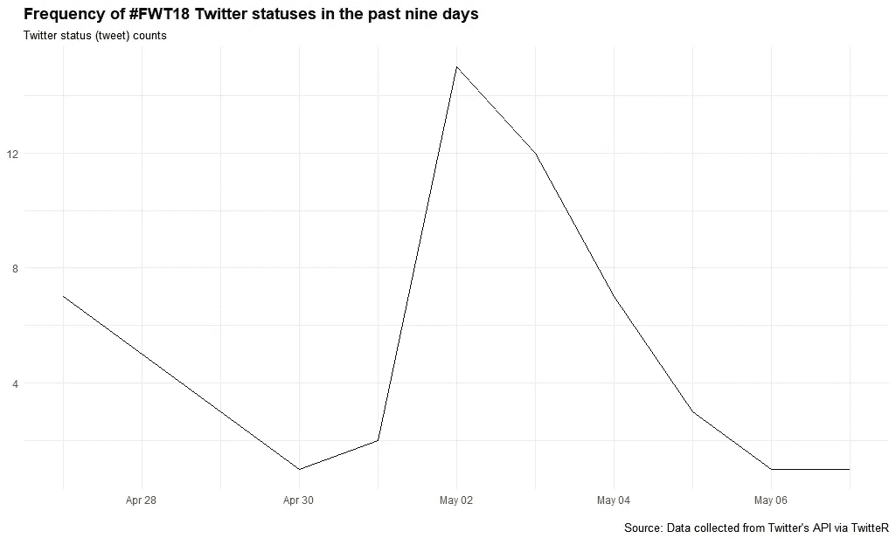

我得到一个警告，说我向 Twitter API 请求了最多 1，000 条推文，但它只返回了过去 9 天中的 58 条。

如果能有更长的历史记录就好了，但是 twitter API 只能索引几天的 tweets，不允许历史查询(有一个[Python 包可以]([https://github.com/Jefferson-Henrique/GetOldTweets-python](https://github.com/Jefferson-Henrique/GetOldTweets-python))，但是我还没有试过。

# 世界上哪里的人在讨论#FWT18？

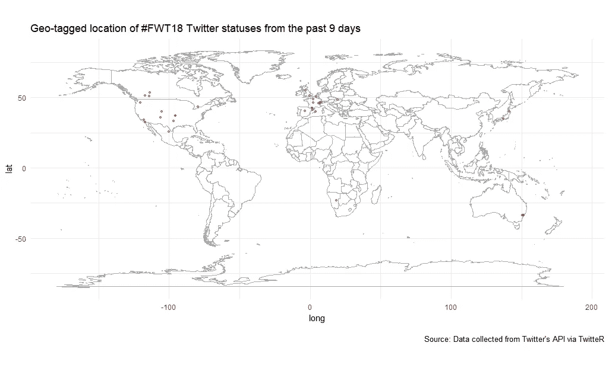

看起来大多数推文来自欧洲和北美，尽管我们看到一些来自日本、澳大利亚和非洲的推文。

*请注意，地理标签推文只对那些在设置中选择了这一点的人可用，这仅占 Twitter 用户的 3%。*

# 关于#FWT18，推特上出现的热门词汇有哪些？

这一次，我通过使用一个查找提及和散列标签的功能，将 [@FreerideWTour](http://twitter.com/FreerideWTour) 和几个骑手的 Twitter 句柄包括在内，然后为 **#FWT18** 标签中提到的最受欢迎的事物创建一个词云。


看来**撞车**和**周末**经常用。

# 探索 FWT18 排名

因为数据不能作为**获得。txt** 或 a **。网站上的 csv** 文件，他们也没有提供我需要抓取的 API。

值得一提的是，管理员可能出于多种原因[想要保护其网站的某些部分](http://www.robotstxt.org/norobots-rfc.txt)，“例如对未经宣布的网站进行索引、遍历需要大量服务器资源的网站部分、递归遍历无限的 URL 空间等。”

因此，应该经常检查他们是否有许可。一种方法是使用 [**robotstxt** 包](https://cran.r-project.org/web/packages/robotstxt/vignettes/using_robotstxt.html)来检查你的网络机器人是否有权限访问网页的某些部分(感谢[malle Salmon](https://twitter.com/ma_salmon)的提示)。

```
library(robotstxt)
paths_allowed("[https://www.freerideworldtour.com/rider/](https://www.freerideworldtour.com/rider/)")[1] TRUE
```

好的，看起来我们得到许可了。

不幸的是， [FWT 2018 排名页面](https://www.freerideworldtour.com/rankings-detailed?season=165&competition=2&discipline=38)的代码是“花哨”的，这意味着你需要点击下拉箭头来获得每个事件的骑手分数。

我认为数据是用 JavaScript 加载的，这意味着我需要使用一个可以通过编程点击按钮的程序。我听说 **splashr** 或**硒酸盐**可以完成这个任务。但是，我是网络搜集的新手，只熟悉 **rvest** 所以我想出了一个(*相对*)快速解决办法。

我将 2018 年花名册中的名字放入一个 [datase](https://www.freerideworldtour.com/riders) [t](https://www.freerideworldtour.com/riders) 中，并将其作为一个对象加载。我可以通过将这些名字输入到 **rvest** 来自动抓取每个骑手，并使用 **for** 循环到[https://www.freerideworldtour.com/rider/](https://www.freerideworldtour.com/rider/)的结尾

```
# read in the names from 2018 roster
roster <- read_csv("[https://ndownloader.figshare.com/files/11173433](https://ndownloader.figshare.com/files/11173433)")# create a url prefix
url_base <- "[https://www.freerideworldtour.com/rider/](https://www.freerideworldtour.com/rider/)"
riders <- roster$name# Assemble the dataset
output <- data_frame()
for (i in riders) { 
  temp <- read_html(paste0(url_base, i)) %>% 
    html_node("div") %>% 
    html_text() %>% 
    gsub("\\s*\\n+\\s*", ";", .) %>% 
    gsub("pts.", "\n", .) %>% 
    read.table(text = ., fill = T, sep = ";", row.names = NULL, 
               col.names = c("Drop", "Ranking", "FWT", "Events", "Points")) %>%
    subset(select = 2:5) %>% 
    dplyr::filter(
      !is.na(as.numeric(as.character(Ranking))) & 
        as.character(Points) != ""
    ) %>%
    dplyr::mutate(name = i)
  output <- bind_rows(output, temp)
}
```

我打算看看每个类别(滑雪和单板滑雪)的总排名，按运动员在 2018 年每场 FWT 赛事中获得的分数划分；然而，我注意到有些奇怪的事情正在发生。

```
# How many riders in the roster?
unique(roster)# A tibble: 56 x 3
   name           sport sex  
   <chr>          <chr> <chr>
 1 aymar-navarro  ski   male 
 2 berkeley-patt~ ski   male 
 3 carl-regner-e~ ski   male 
 4 conor-pelton   ski   male 
 5 craig-murray   ski   male 
 6 drew-tabke     ski   male 
 7 fabio-studer   ski   male 
 8 felix-wiemers  ski   male 
 9 george-rodney  ski   male 
10 grifen-moller  ski   male 
# ... with 46 more rows# How many names in the output object?
unique(output$name)[1] "aymar-navarro"       
 [2] "berkeley-patterson"  
 [3] "carl-regner-eriksson"
 [4] "conor-pelton"        
 [5] "craig-murray"        
 [6] "drew-tabke"          
 [7] "fabio-studer"        
 [8] "felix-wiemers"       
 [9] "george-rodney"       
[10] "grifen-moller"       
[11] "ivan-malakhov"       
[12] "kristofer-turdell"   
[13] "leo-slemett"         
[14] "logan-pehota"        
[15] "loic-collomb-patton" 
[16] "markus-eder"         
[17] "mickael-bimboes"     
[18] "reine-barkered"      
[19] "ryan-faye"           
[20] "sam-lee"             
[21] "stefan-hausl"        
[22] "taisuke-kusunoki"    
[23] "thomas-rich"         
[24] "trace-cooke"         
[25] "yann-rausis"         
[26] "arianna-tricomi"     
[27] "elisabeth-gerritzen" 
[28] "eva-walkner"         
[29] "hazel-birnbaum"      
[30] "jaclyn-paaso"        
[31] "kylie-sivell"        
[32] "lorraine-huber"      
[33] "rachel-croft"        
[34] "blake-hamm"          
[35] "christoffer-granbom" 
[36] "clement-bochatay"    
[37] "davey-baird"
```

原来第 40 行的名字`elias-elhardt`产生了一个问题。我不确定这是为什么，但是因为 Elias 只参加了资格赛，所以让我们简单地把他去掉，然后重新运行上面的代码。

```
# Remove Elias Elhardt
roster <- roster[-40,]
riders <- roster$name
```

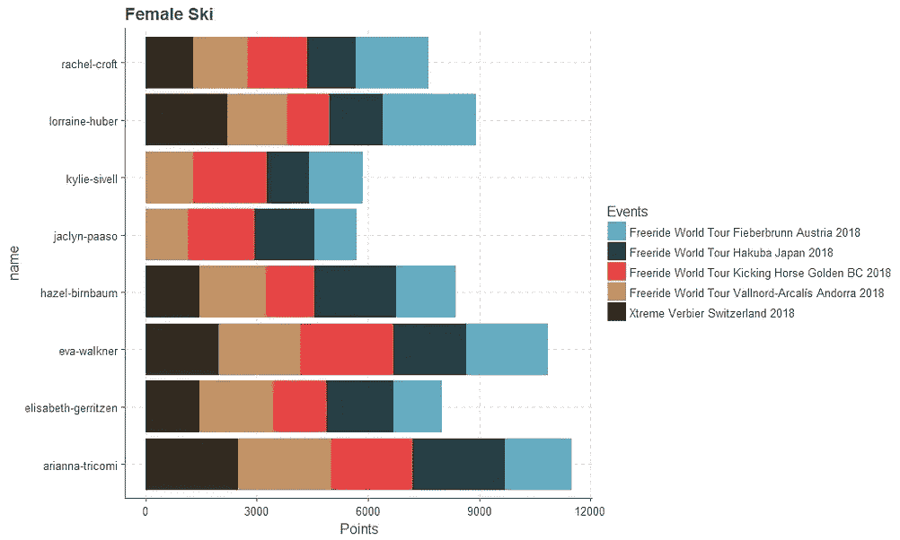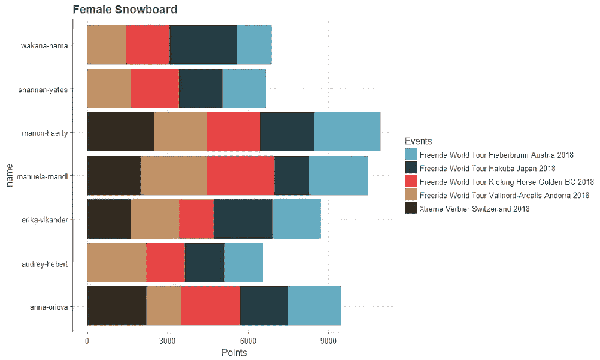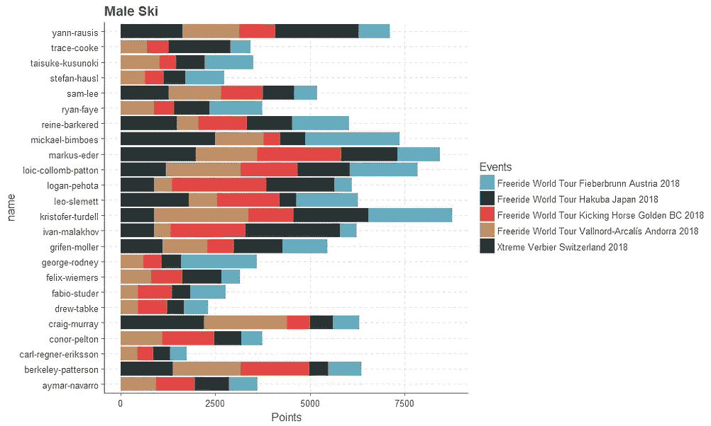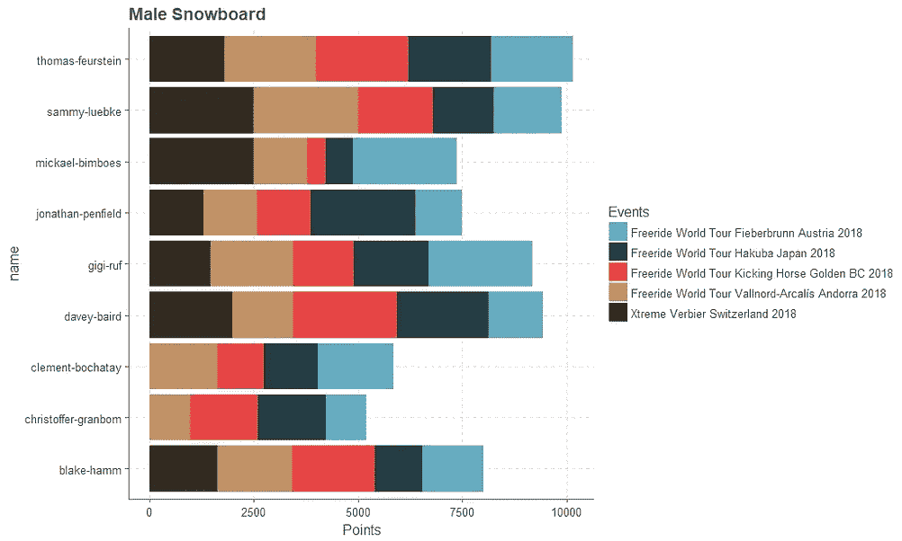

# 历史上的 FWT 获奖者

FWT 在他们的网站上列出了往届比赛的获胜者。我收集了 1996 年至 2018 年间 23 场巡回赛的所有获胜者的数据，并从网站或快速网络搜索中包括了他们的年龄。数据集可以在 figshare 上找到。

```
# load the data
df <- read_csv("[https://ndownloader.figshare.com/files/11300864](https://ndownloader.figshare.com/files/11300864)")# Get summary statistics on age of winners
df %>% 
  summarize(mean_age = median(age, na.rm = TRUE),
            max_age = max(age, na.rm = TRUE),
            min_age = min(age, na.rm = TRUE)) mean_age max_age min_age
1       29      43      15# Find minimum age of winner by sex and sport
df %>%
  group_by(sex, sport) %>% 
  slice(which.min(age)) %>% 
  dplyr::select(name, sex, sport, age)# A tibble: 4 x 4
# Groups:   sex, sport [4]
  name            sex    sport       age
  <chr>           <chr>  <chr>     <int>
1 Arianna Tricomi female ski          23
2 Michelle Gmitro female snowboard    16
3 George Rodney   male   ski          21
4 Cyril Neri      male   snowboard    15 
```

# 骑手们赢得过多少次 FWT 赛事？

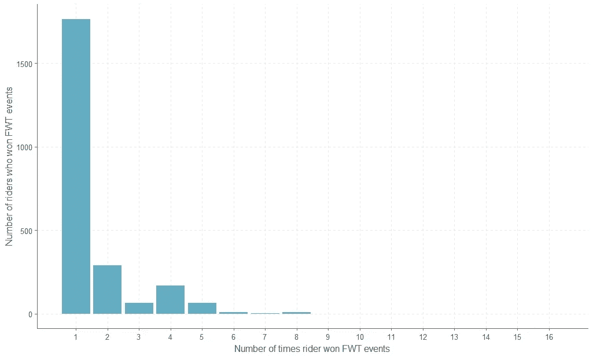

赢得至少一项 FWT 赛事的众多骑手让那些赢得大量赛事的独特运动员相形见绌。

我们可以再看一下表格中的数据。

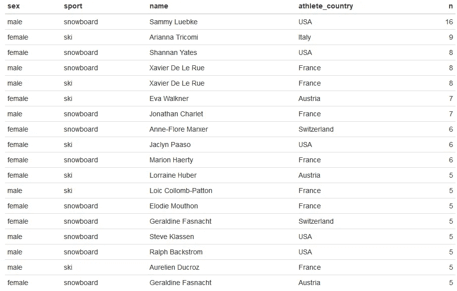

Xavier De Le Rue 以 8 分接近最高，出现在滑雪和单板滑雪两个类别中？太奇怪了。我们可以这样替换数据集中的错误。

```
df$sport[df$name == "Xavier De Le Rue"] <- "snowboard"
```

# 哪些国家的赢家最多？

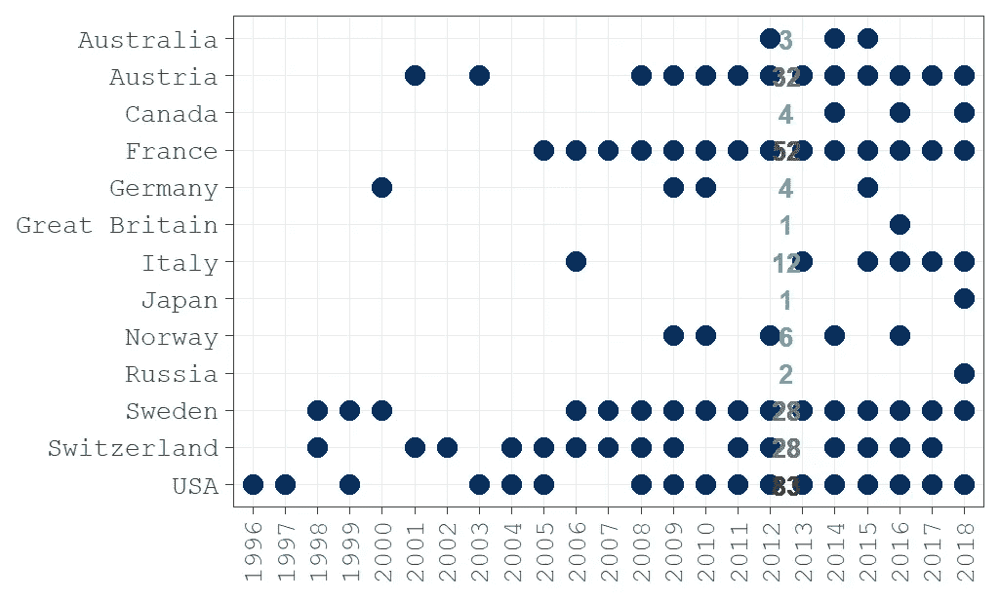

看起来美国、法国和奥地利产生了一些最好的免费搭车者。

# 每个国家的获胜者有多大？

我们可以用箱线图来了解每个国家的年龄分布情况。

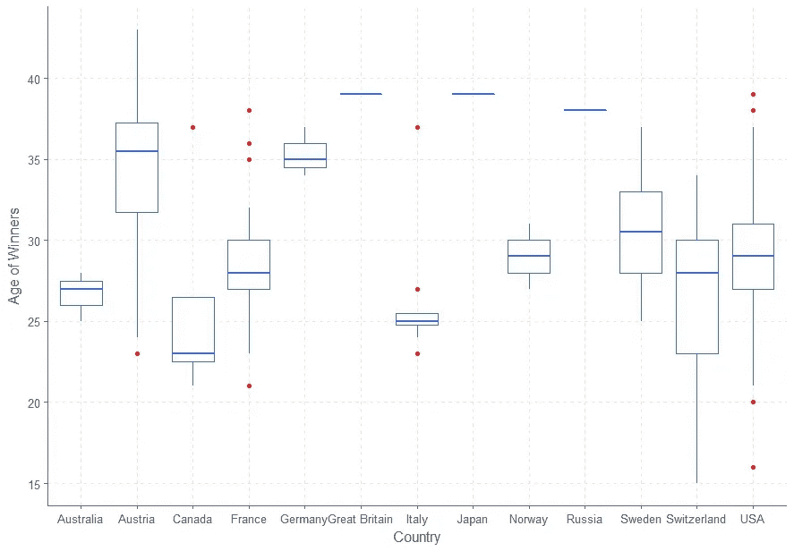

然而，一个更好的方法是用雨云图来直观地了解分布情况。因为一些国家只有一个竞争对手，所以让我们把他们去掉。

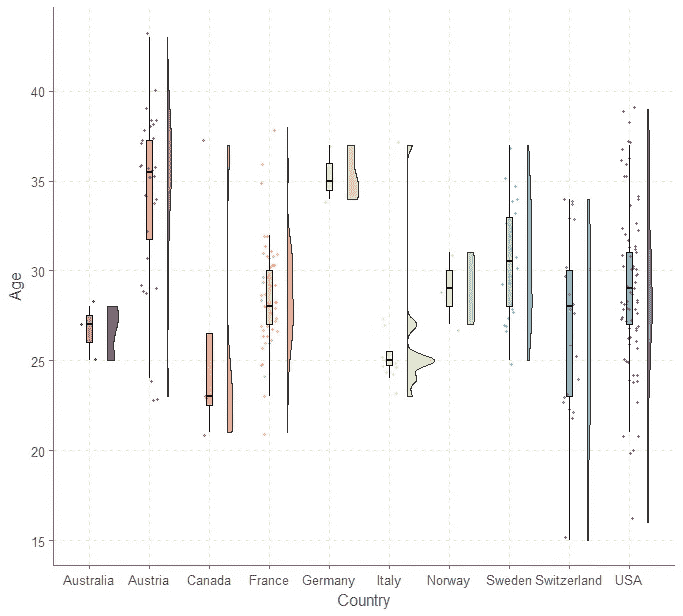

问一问获胜者的年龄在比赛的历史上是如何变化的也是很有趣的。

# FWT 获奖者越来越年轻了吗？

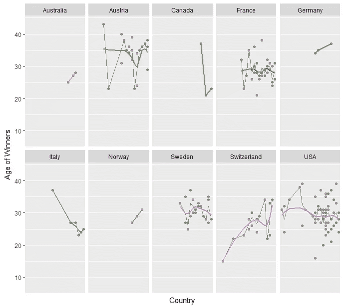

随着时间的推移，年龄和赢得 FWT 赛事似乎没有任何趋势。

这将是很好的发挥周围的数据，法官如何评分每个骑手从 0 到 100 的每一个项目的五个类别，但它看起来不像这样的信息是可用于公众在这个时候。

[此分析的完整代码可在 Github 上找到。](https://moldach.github.io/freerideR/)