# Python 中具有中等故事统计的数据科学

> 原文：<https://towardsdatascience.com/analyzing-medium-story-stats-with-python-24c6491a8ff0?source=collection_archive---------15----------------------->


## 一个用于数据科学的 Python 工具包，具有中等文章统计

Medium 是一个写作的好地方:没有分散注意力的功能，拥有庞大但文明的读者群，最棒的是，没有广告。然而，它不足的一个方面是你可以在你的文章中看到的统计数据。当然，你可以进入统计页面，但是你看到的只是一些普通的数字和一个绿色的条形图。没有任何形式的*深度分析*，也没有办法理解你的文章产生的数据。

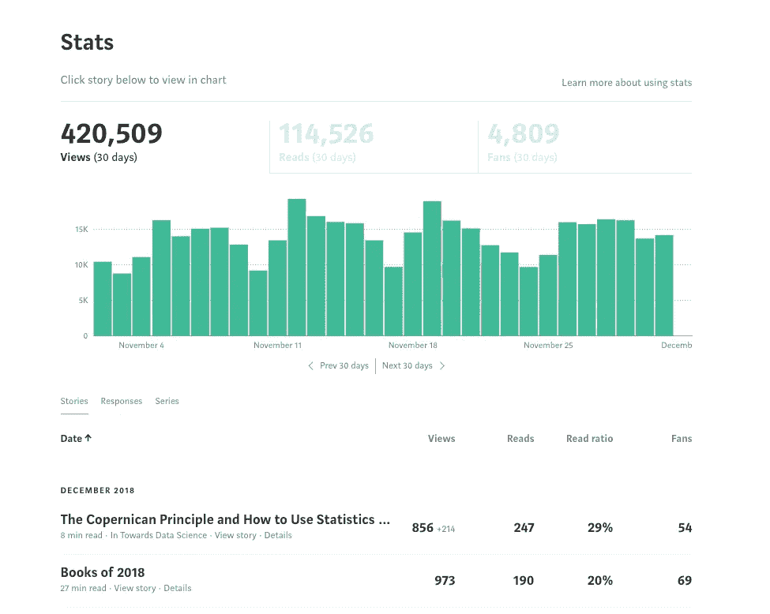

It’s nice when you reach the point where it’s more than your mom reading your articles.

这就好像 Medium 说的:“让我们建立一个伟大的博客平台，但让作者尽可能难以从他们的统计数据中获得洞察力。”虽然我不在乎使用统计数据来最大化浏览量(如果我想获得最多的浏览量，我所有的文章都是 3 分钟的列表)，但作为一名数据科学家，我不能忍受数据未经检查的想法。

我决定对此做些什么，而不是仅仅抱怨媒体统计的糟糕状态，并编写了一个 Python 工具包，允许任何人快速检索、分析、解释和制作他们的媒体统计的漂亮、交互式图表。在本文中，我将展示如何使用这些工具，讨论它们是如何工作的，并且我们将从我的媒体故事统计中探索一些见解。

GitHub 上有完整的工具包供您使用。你可以在 GitHub [这里](https://github.com/WillKoehrsen/Data-Analysis/blob/master/medium/Medium%20Stats%20Analysis.ipynb)看到一个使用 Jupyter 的笔记本(不幸的是互动情节在 GitHub 的笔记本浏览器上不起作用)或者在 [NBviewer 这里](https://nbviewer.jupyter.org/github/WillKoehrsen/Data-Analysis/blob/master/medium/Medium%20Stats%20Analysis.ipynb)看到完整的互动荣耀。欢迎对这个工具包做出贡献！

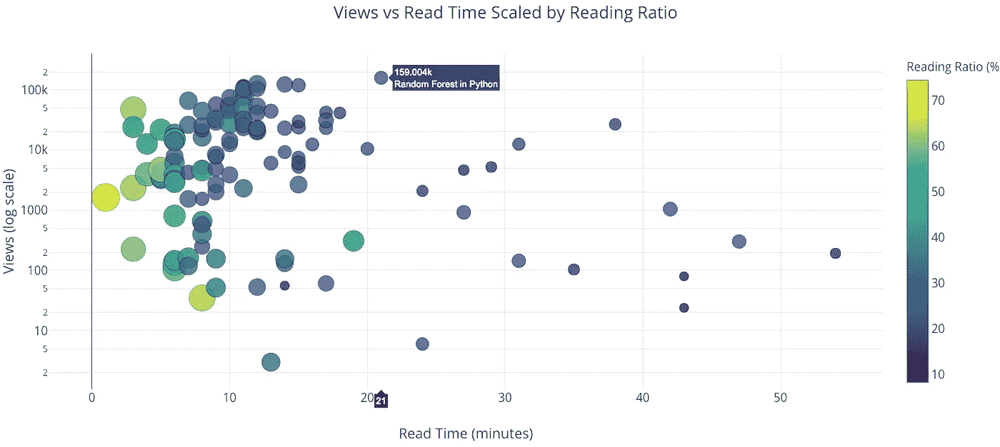

Example plot from Python toolkit for analyzing Medium articles

# 1 分钟后开始

首先，我们需要检索一些统计数据。在编写工具包时，我花了 2 个小时试图找出如何在 Python 中自动登录到 Medium，然后决定采用下面列出的 15 秒解决方案。如果您想使用[我的数据](https://github.com/WillKoehrsen/Data-Analysis/tree/master/medium/data)，它已经包含在工具包中，否则，请按照以下步骤使用您的数据:

1.  进入你的[中型统计页面](https://medium.com/me/stats)。
2.  向下滚动到底部，以便显示所有故事的统计数据。
3.  右键单击并将页面保存为工具包`data/`目录中的`stats.html`

下面的视频演示了这一点:

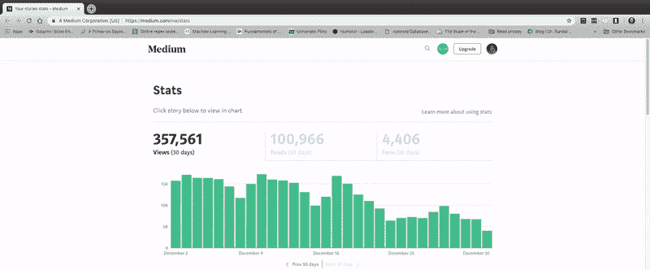

Sometimes the best solution is manual!

接下来，在工具箱的`medium/`目录中打开一个 Jupyter 笔记本或者 Python 终端，运行(同样，你可以使用我包含的数据):

```
from retrieval import get_datadf = get_data(fname='stats.html')
```

这不仅会解析`stats.html`文件并提取所有信息，还会访问每篇文章，检索整篇文章和元数据，并将结果存储在 dataframe 中。我的 121 篇，这个过程大概用了 5 秒钟！现在，我们有了一个数据框架，其中包含关于我们产品的完整信息:


Sample of dataframe with medium article statistics

(为了显示，我已经截掉了数据帧，所以数据比显示的还要多。)一旦我们有了这些信息，我们可以使用任何我们知道的数据科学方法来分析它，或者我们可以使用代码中的工具。Python 工具包中包括制作交互式图表、用机器学习拟合数据、解释关系和生成未来预测的方法。

举个简单的例子，我们可以制作一个数据相关性的热图:

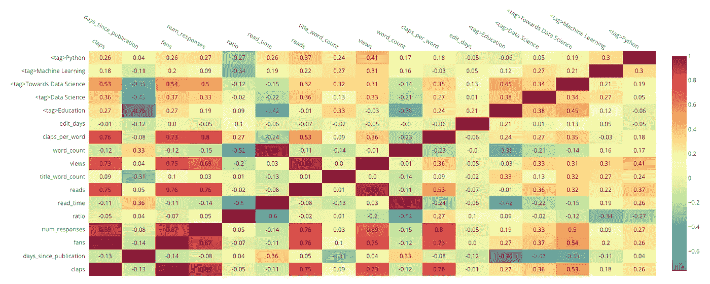

Heatmap of correlations

`<tag>`列表示文章是否有特定的标签。我们可以看到标签“走向数据科学”与“粉丝”的数量有 0.54 的相关性，这表明将这个标签附加到一个故事上与粉丝的数量(以及鼓掌的数量)正相关*。这些关系大多是显而易见的(掌声与粉丝正相关)，但如果你想最大化故事浏览量，你也许能在这里找到一些提示。*

我们可以在单行代码中制作的另一个图是由出版物着色的[散点图矩阵](https://ncss-wpengine.netdna-ssl.com/wp-content/themes/ncss/pdf/Procedures/NCSS/Scatter_Plot_Matrix.pdf)(也亲切地称为“splom”):

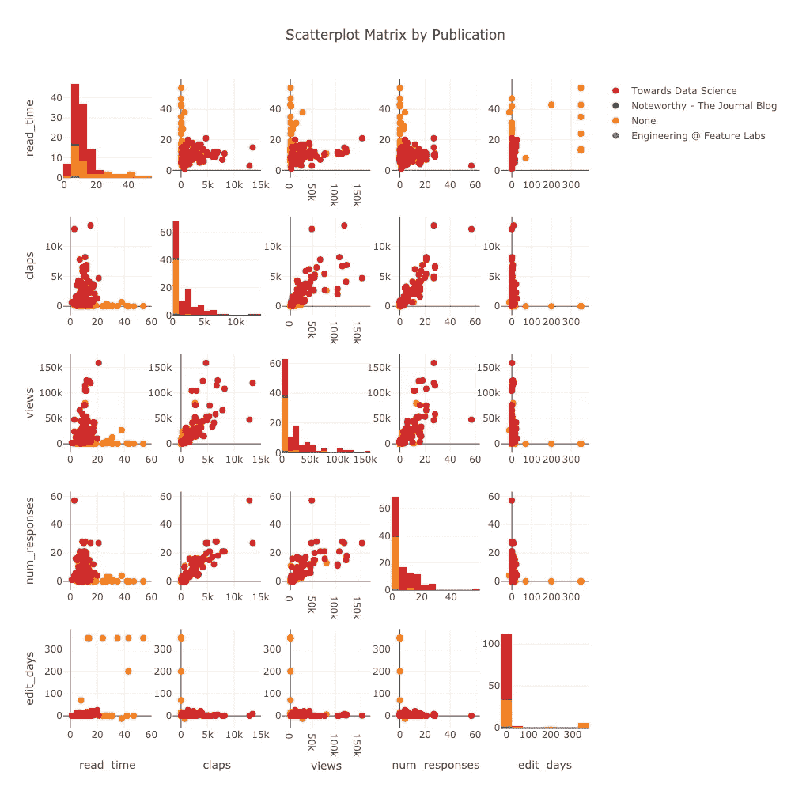

Scatterplot matrix of article stats

(这些图是交互式的，可以在 NBviewer 中的[处](https://nbviewer.jupyter.org/github/WillKoehrsen/Data-Analysis/blob/master/medium/Medium%20Stats%20Analysis.ipynb)看到)。

# 它是如何工作的

在我们回到分析之前(还有更多的图值得期待)，有必要简要讨论一下这些 Python 工具是如何获取和显示所有数据的。代码的主力是 [BeautifulSoup](https://www.crummy.com/software/BeautifulSoup/doc) 、 [requests](http://docs.python-requests.org/en/master/) 和 [plotly](https://plot.ly/python/) ，在我看来，它们对于数据科学的重要性不亚于众所周知的 pandas + numpy + matplotlib 三重奏(正如我们将看到的，是时候让 matplotlib 退休了*)。*

## 资料检索

从第一眼看中型统计页面，它似乎不是很结构化。

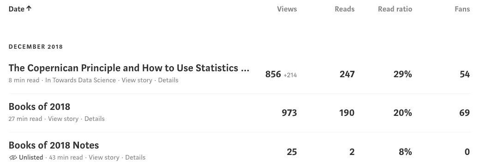

然而，隐藏在互联网每一页下面的是[超文本标记语言(HTML)](https://en.wikipedia.org/wiki/HTML) ，一种呈现网页的结构化语言。如果没有 Python，我们可能会被迫打开 excel 并开始键入这些数字(当我在空军时，不是开玩笑，这将是公认的方法)，但是，多亏了`BeautifulSoup`库，我们可以利用该结构来提取数据。例如，为了在下载的`stats.html`中找到上表，我们使用:

一旦我们有了一个`soup`对象，我们就遍历它，在每一点上获得我们需要的数据(HTML 有一个[层次树结构，称为文档对象模型](https://www.w3.org/TR/WD-DOM/introduction.html) — DOM)。从`table`中，我们取出一个单独的行——代表一篇文章——并提取一些数据，如下所示:

这可能看起来很乏味，当你不得不用手来做的时候。这涉及到使用谷歌 Chrome 中的[开发工具在 HTML 中寻找你想要的信息。幸运的是，Python Medium stats 工具包在幕后为您完成了所有这些工作。你只需要输入两行代码！](https://developers.google.com/web/tools/chrome-devtools/)

从 stats 页面，代码提取每篇文章的元数据，以及文章链接。然后，它使用`requests`库获取*文章本身*(不仅仅是统计数据)，并解析*文章*中的任何相关数据，同样使用`BeautifulSoup`。所有这些都在工具包中自动完成，但是值得看一看代码。一旦你熟悉了这些 Python 库，你就会开始意识到网络上有多少数据等着你去获取。

顺便说一句，整个代码需要大约 2 分钟的时间来连续运行，但是因为等待是无益的，所以我编写它来使用[多处理](https://docs.python.org/2/library/multiprocessing.html)，并将运行时间减少到大约 10 秒。数据检索的源代码这里是[这里是](https://github.com/WillKoehrsen/Data-Analysis/blob/master/medium/retrieval.py)。

## 绘图和分析

这是一个非常不科学的图表，显示了我对 Python 情节的喜爱程度:

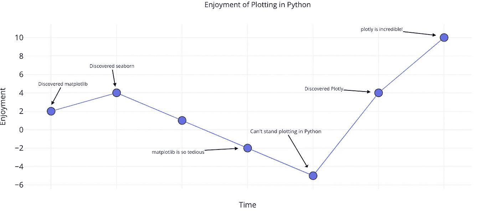

Python plotting enjoyment over time.

plotly 库(带有[袖扣包装)](https://plot.ly/ipython-notebooks/cufflinks/)让用 Python 绘图再次变得有趣！它支持单行代码的完全交互式图表，制作起来非常容易，我发誓*再也不写另一行 matplotlib 了*。对比下面两个都是用一行代码绘制的图:

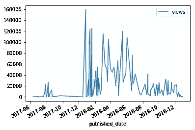

Matplotlib and plotly charts made in one line of code.

左边是`matplotlib's`努力——一个静态的、枯燥的图表——而右边是`plotly's`工作——一个漂亮的交互式图表，关键是，它能让你快速理解你的数据。

工具包中的所有绘图都是用 plotly 完成的，这意味着用更少的代码就能得到更好的图表。此外，笔记本中的绘图可以在[在线绘图图表编辑器](https://plot.ly/create/)中打开，因此您可以添加自己的修改，如注释和最终编辑以供发布:

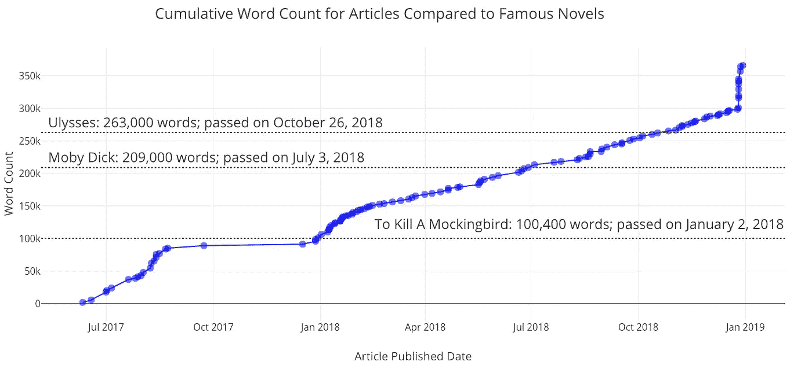

Plot from the toolkit touched up in the online editor

分析代码实现一元线性回归、一元多项式回归、多元线性回归和预测。这是通过标准的数据科学工具完成的:`numpy`、`statsmodels`、`scipy`和`sklearn`。有关完整的可视化和分析代码，请参见[该脚本](https://github.com/WillKoehrsen/Data-Analysis/blob/master/medium/visuals.py)。

# 分析媒体文章

回到分析！我通常喜欢从单变量分布开始。为此，我们可以使用下面的代码:

```
from plotly.offline import iplot
from visuals import make_histiplot(make_hist(df, x='views', category='publication'))
```

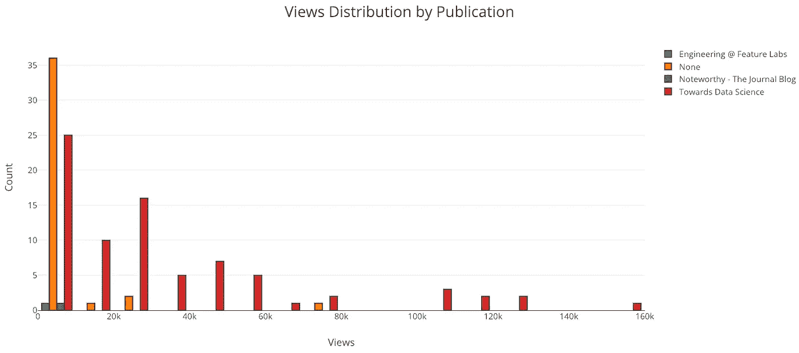

显然，我应该继续在“走向数据科学”中发表文章！我的大多数文章没有在任何出版物上发表，这意味着它们只有在你有链接的情况下才能被浏览(为此你需要在 Twitter 上关注我)。

因为所有数据都是基于时间的，所以也有一种方法可以制作累积图，显示您的统计数据随时间的累积情况:

```
from visuals import make_cum_plotiplot(make_cum_plot(df, y=['word_count', 'views']))
```

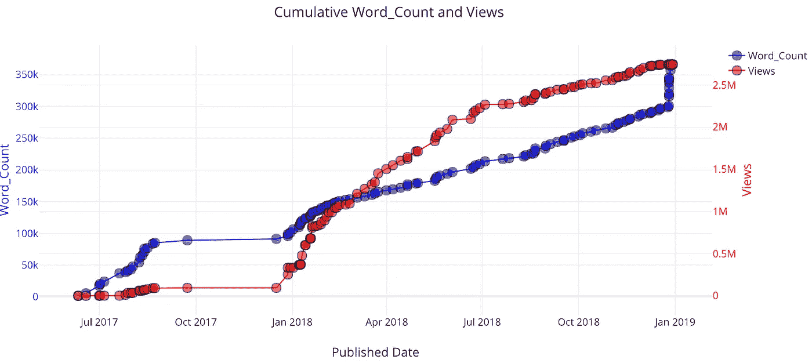

最近，我的字数激增，因为我发布了一堆我已经写了一段时间的文章。当我发表第一篇关于走向数据科学的文章时，我的观点开始流行起来。

(注意，这些视图并不完全正确，因为这是假设一篇给定文章的所有视图都出现在该文章发表的某个时间点。然而，这作为第一近似值是很好的)。

## 解释变量之间的关系

散点图是一种简单而有效的方法，用于可视化两个变量之间的关系。我们可能想问的一个基本问题是:阅读一篇文章的人的百分比是否随着文章长度的增加而减少？直截了当的答案是肯定的:

```
from visuals import make_scatter_plotiplot(make_scatter_plot(df, x='read_time', y='ratio'))
```

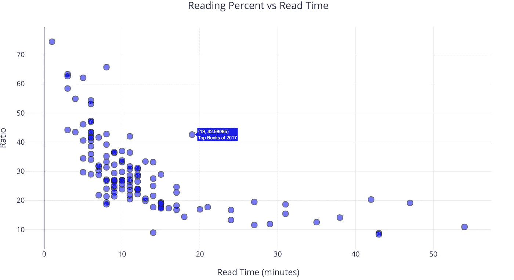

随着文章长度——阅读时间——的增加，阅读文章的人数明显减少，然后趋于平稳。

有了散点图，我们可以使任一轴为对数刻度，并通过根据数字或类别调整点的大小或给点着色，在图上包含第三个变量。这也是通过一行代码完成的:

```
iplot(make_scatter_plot(df, x='read_time', y='views', ylog=True,                                   
                        scale='ratio'))
```

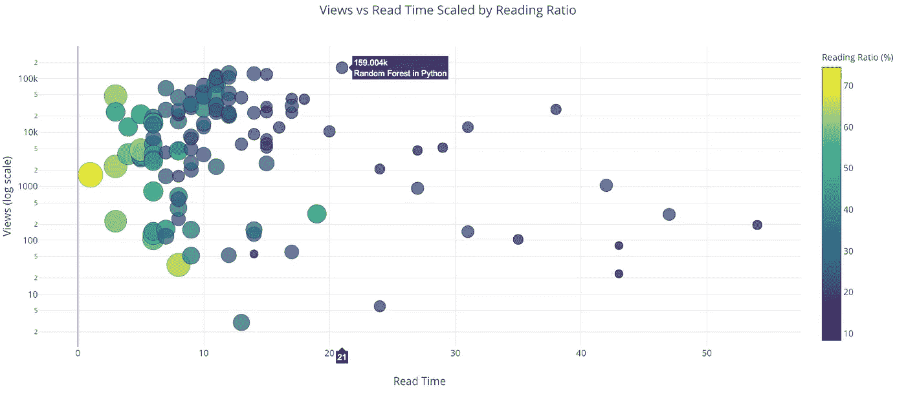

[“Python 中的随机森林”](/random-forest-in-python-24d0893d51c0)这篇文章在很多方面都是一个异数。它是我所有文章中浏览量最多的，然而却花了 21 分钟才读完！

## 浏览量会随着文章长度减少吗？

虽然阅读率随着文章长度的增加而降低，但阅读或浏览文章的人数是否也是如此呢？虽然我们的直接答案是肯定的，但仔细分析后，似乎浏览次数*不会随着阅读时间的增加而减少。*为了确定这一点，我们可以使用工具的拟合功能。

在这个分析中，我将数据限制在我发表在《走向数据科学》杂志上的文章[中，这些文章少于 5000 字，并对观点(因变量)和字数(自变量)进行了线性回归。因为视图永远不会是负数，所以截距设置为 0:](https://towardsdatascience.com)

```
from visuals import make_linear_regressionfigure, summary = make_linear_regression(tds_clean, x='word_count', 
                                     y='views', intercept_0=True)
iplot(figure)
```

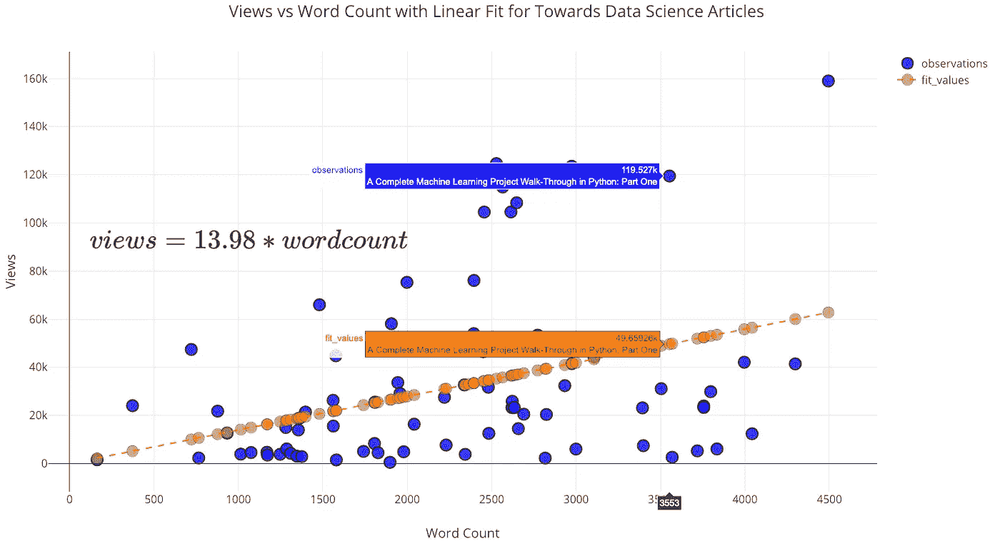

与你所想的相反，*随着字数的增加(达到 5000)，浏览量也会增加*！该拟合的总结显示了正线性关系，并且斜率具有统计学意义:

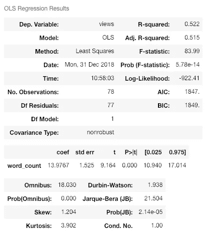

Summary statistics for linear regression.

有一次，一位非常好的女士在我的一篇文章上留下了一张私人纸条，上面写道:“你的文章写得很好，但是太长了。你应该用要点写更短的文章，而不是完整的句子。”

现在，作为一个经验法则，我假设我的读者是聪明的，能够处理完整的句子。因此，我礼貌地回复这位女士(用要点)说我会继续写非常长的文章。基于这种分析，没有理由缩短文章(即使我的目标是最大化视图)，特别是对于关注数据科学的读者。事实上，我添加的每一个单词都会导致 14 次以上的浏览！

## 超越一元线性回归

我们不限于以线性方式将一个变量回归到另一个变量上。我们可以使用的另一种方法是[多项式回归](https://www.statsdirect.com/help/regression_and_correlation/polynomial.htm)，在拟合中我们允许自变量的更高次。然而，我们要小心，因为增加的灵活性会导致[过度拟合](https://machinelearningmastery.com/overfitting-and-underfitting-with-machine-learning-algorithms/)，尤其是在数据有限的情况下。要记住的一点是:当我们有一个灵活的模型时，更接近数据并不意味着对现实的准确描述！

```
from visuals import make_poly_fitfigure, fit_stats = make_poly_fits(tds_clean, x='word_count',               
                                   y='reads', degree=6)
iplot(figure)
```

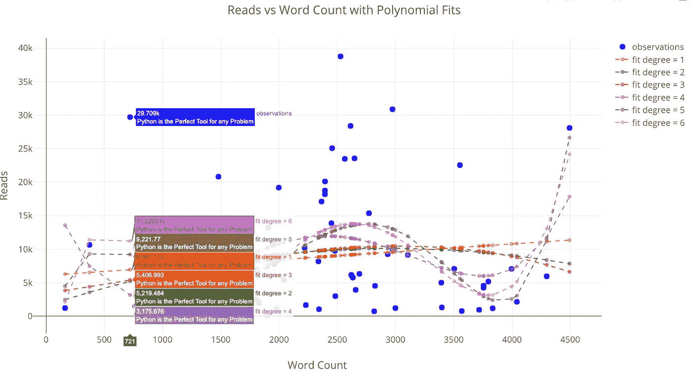

Reads versus the word count with polynomial fits.

使用任何更高程度的拟合来推断这里看到的数据是不可取的，因为预测可能是无意义的(负值或非常大)。

如果我们查看拟合的统计数据，我们可以看到均方根误差随着多项式次数的增加而减小:

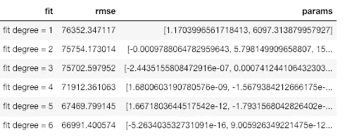

较低的误差意味着我们更好地拟合*现有数据*，但这*并不意味着我们将能够准确地推广到新的观察结果*(这一点我们稍后会看到)。在数据科学中，我们想要[简约模型](https://stats.stackexchange.com/questions/17565/choosing-the-best-model-from-among-different-best-models)，即能够解释数据的最简单模型。

我们也可以在线性拟合中包含多个变量。这就是所谓的多元回归，因为有多个独立变量。

```
list_of_columns = ['read_time', 'edit_days', 'title_word_count',
 '<tag>Education', '<tag>Data Science', '<tag>Towards Data Science',
 '<tag>Machine Learning', '<tag>Python']figure, summary = make_linear_regression(tds, x=list_of_columns,                       
                                    y='fans', intercept_0=False)iplot(figure)
```

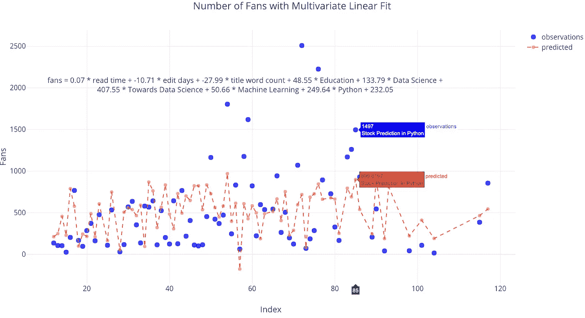

有一些独立变量，如标签 Python 和走向数据科学，有助于增加粉丝，而其他变量，如编辑花费的天数，导致粉丝数量减少(至少根据模型)。如果你想知道如何获得最多的粉丝，你可以使用这个拟合，并尝试用自由参数最大化它。

# 未来推断

我们工具包中的最后一个工具也是我最喜欢的:对未来的浏览量、粉丝数、阅读量或字数的外推。这可能完全是胡说八道，但这并不意味着它不令人愉快！它还强调了一点，即更灵活的拟合(更高的多项式次数)不会导致新数据更准确的概括。

```
from visuals import make_extrapolationfigure, future_df = make_extrapolation(df, y='word_count',                   
                                         years=2.5, degree=3)
iplot(figure)
```

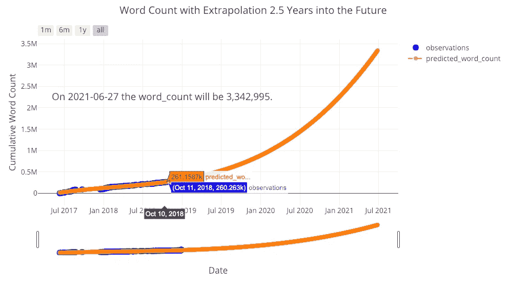

看来为了达到预期的预测，我还有很多工作要做！(底部的滑块允许您放大图表上的不同位置。你可以在全互动笔记本里玩这个)。获得合理的估计需要调整多项式拟合的次数。然而，由于数据有限，任何估计都可能在未来很长时间内失效。

让我们再做一次推断，看看我能期待多少次读取:

```
figure, future_df = make_extrapolation(tds, y='reads', years=1.5, 
                                       degree=3)
iplot(figure)
```

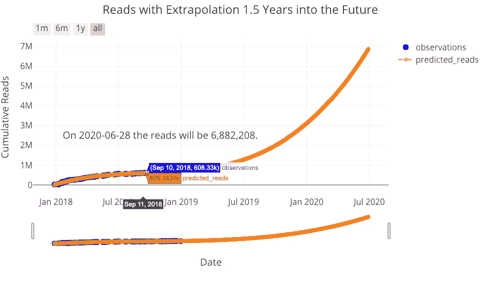

我的读者，你也有你的工作要做！我不认为这些推断是那么有用，但它们说明了数据科学中的重要观点:使模型更加灵活并不意味着它能够更好地预测未来，[所有模型都是基于现有数据的近似值](https://stats.stackexchange.com/questions/57407/what-is-the-meaning-of-all-models-are-wrong-but-some-are-useful)。

# 结论

[Medium stats Python toolkit](https://github.com/WillKoehrsen/Data-Analysis/tree/master/medium) 是一套开发工具，允许任何人快速分析他们自己的 Medium 文章统计数据。尽管 Medium 本身不能提供对你的统计数据的深刻见解[，但这并不妨碍你用正确的工具进行自己的分析！对我来说，没有什么比从数据中获取意义更令人满意的了——这也是我成为数据科学家的原因——尤其是当这些数据是个人的和/或有用的时候。我不确定这项工作有什么重要的收获——除了继续为数据科学写作——但是使用这些工具可以展示一些重要的数据科学原则。](https://medium.com/me/stats)

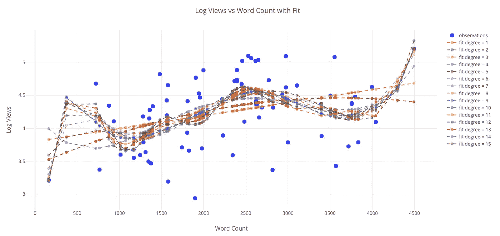

Overfitting just a little with a 15-degree fit. Remember, all models are approximations based on existing data.

开发这些工具是令人愉快的，我正在努力使它们变得更好。我将感谢任何贡献(老实说，即使这是一个 Jupyter 笔记本中的拼写错误，它会有所帮助)所以[检查代码](https://github.com/WillKoehrsen/Data-Analysis/tree/master/medium)如果你想有所帮助。因为这是我今年的最后一篇文章，我想说感谢您的阅读——不管您贡献了多少统计数据，没有您我不可能完成这个分析！进入新的一年，继续阅读，继续写代码，继续做数据科学，[继续让世界变得更好。](https://medium.com/@williamkoehrsen/what-i-learned-in-2018-30e2b5481c01)

一如既往，我欢迎反馈和讨论。可以在推特上找到我。