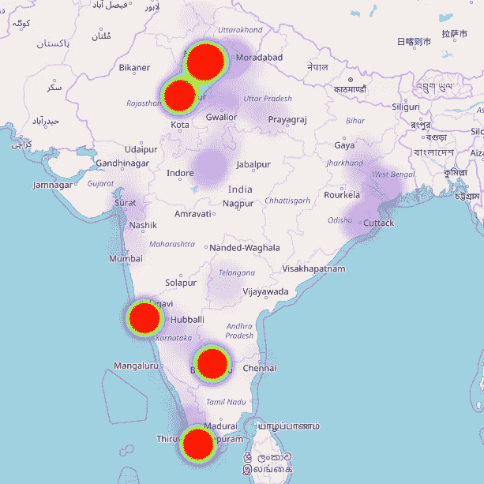
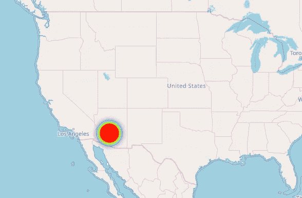
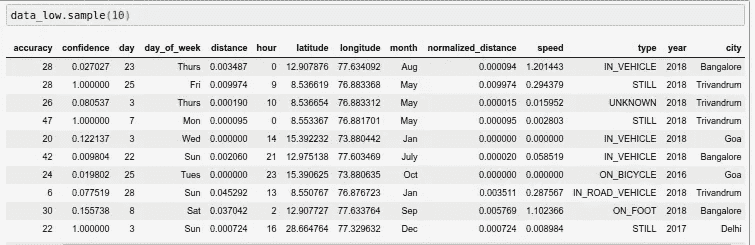
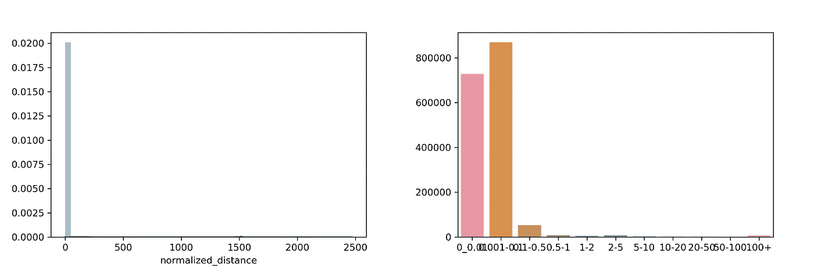
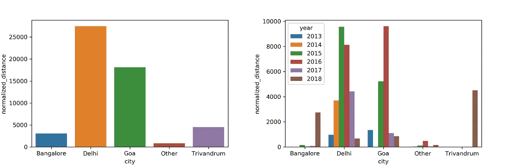
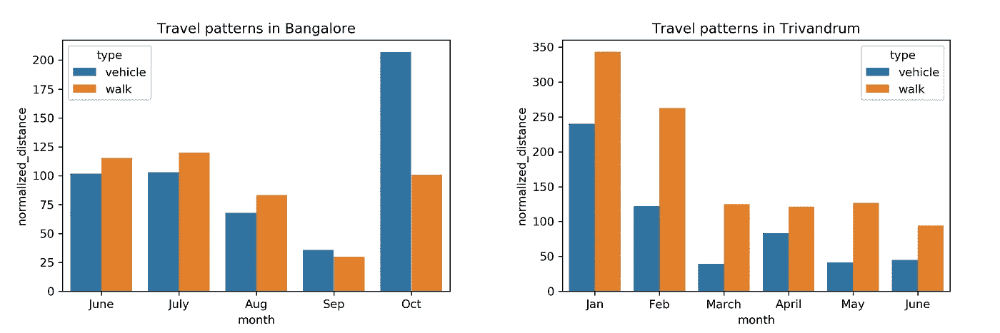
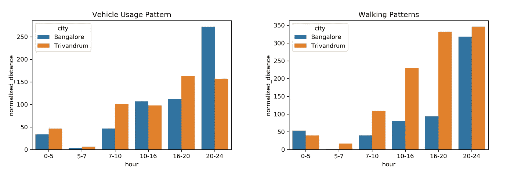

# 分析我的谷歌位置历史

> 原文：<https://towardsdatascience.com/analyzing-my-google-location-history-d3a5c56c7b70?source=collection_archive---------10----------------------->

我最近读了这篇关于如何从你的谷歌位置历史数据创建热图的文章。我自己尝试了一下，得到了一些惊人的结果:



红色的大圆圈代表我待过很长时间的城市。不同地方的紫色阴影代表我坐火车旅行时去过或经过的地方。

我以前的手机有一些 GPS 问题，这导致我的位置显示在美国亚利桑那州！。出人意料(还是没有？)它甚至给出了一个证明！



这一切看起来真的很酷，但我真的想深入了解这些年来我的旅行模式。

# 数据预处理

像大多数数据科学问题一样，数据预处理绝对是难点。数据是 JSON 格式的，不同属性的含义不是很清楚。

> 数据析取

```
{'timestampMs': '1541235389345',
  'latitudeE7': 286648226,
  'longitudeE7': 773296344,
  'accuracy': 22,
  'activity': [{'timestampMs': '1541235388609',
    'activity': [{'type': 'ON_FOOT', 'confidence': 52},
     {'type': 'WALKING', 'confidence': 52},
     {'type': 'UNKNOWN', 'confidence': 21},
     {'type': 'STILL', 'confidence': 7},
     {'type': 'RUNNING', 'confidence': 6},
     {'type': 'IN_VEHICLE', 'confidence': 5},
     {'type': 'ON_BICYCLE', 'confidence': 5},
     {'type': 'IN_ROAD_VEHICLE', 'confidence': 5},
     {'type': 'IN_RAIL_VEHICLE', 'confidence': 5},
     {'type': 'IN_TWO_WHEELER_VEHICLE', 'confidence': 3},
     {'type': 'IN_FOUR_WHEELER_VEHICLE', 'confidence': 3}]}]},
 {'timestampMs': '1541235268590',
  'latitudeE7': 286648329,
  'longitudeE7': 773296322,
  'accuracy': 23,
  'activity': [{'timestampMs': '1541235298515',
    'activity': [{'type': 'TILTING', 'confidence': 100}]}]
```

稍微研究了一下，偶然发现了[这篇文章](https://www.chipoglesby.com/2018/03/2018-analyzing-google-location-historyII/)，理清了很多东西。然而，有些问题仍然没有答案

*   活动类型`tilting`是什么意思？
*   我假设信心是每个任务的概率。然而，它们加起来往往不到 100。如果它们不代表概率，它们代表什么？
*   活动类型`walking`和`on foot`有什么区别？
*   谷歌怎么可能预测`IN_TWO_WHEELER_VEHICLE`和`IN_FOUR_WHEELER_VEHICLE`之间的活动类型？！

如果有人能够解决这个问题，请在评论中告诉我。

编辑:在[这个帖子](https://news.ycombinator.com/item?id=18513240)中已经有一些关于这些话题的讨论。一篇关于使用智能手机数据进行人类活动识别的论文可以在[这里](https://github.com/guillaume-chevalier/LSTM-Human-Activity-Recognition)找到。

> 假设

随着我继续构建我的预处理管道，我意识到我将不得不采取一些假设来考虑数据的所有属性。

*   GPS 总是开着的(这是一个很强的假设，以后会考虑到)。
*   置信区间是活动类型的概率。这种假设有助于我们考虑给定实例的各种可能的活动类型，而不会低估或高估任何特定的活动类型。
*   每个日志有两种类型的时间戳。(I)对应于位置纬度和经度。㈡与活动相对应。因为两个时间戳之间的差异通常非常小(< 30 秒)，所以我在分析中安全地使用了与纬度和经度相对应的时间戳

> 数据清理

记得我说过我的全球定位系统给出了美国亚利桑那州的位置吗？我不希望这些数据点对结果产生重大影响。利用印度的纵向边界，我过滤掉了只与印度相关的数据点。

```
def remove_wrong_data(data):
    degrees_to_radians = np.pi/180.0
    data_new = list()
    for index in range(len(data)):
        longitude = data[index]['longitudeE7']/float(1e7)
        if longitude > 68 and longitude < 93:
            data_new.append(data[index])
    return data_new
```

# 特征工程

> 每个数据点的城市

我想获得每个给定纬度和经度对应的城市。一个简单的谷歌搜索让我得到了我曾居住过的主要城市的坐标，即德里、果阿、特里凡得琅和班加罗尔。

```
def get_city(latitude):
    latitude = int(latitude)
    if latitude == 15:
        return 'Goa'
    elif latitude in [12,13]:
        return 'Bangalore'
    elif latitude == 8:
        return 'Trivandrum'
    elif latitude > 27.5 and latitude < 29:
        return 'Delhi'
    else:
        return 'Other'data_low['city'] = data.latitude.apply(lambda x:get_city(x))
```

> 距离

日志由纬度和经度组成。为了计算测井记录之间的距离，必须将这些值转换成可用于距离相关计算的格式。

```
from geopy.distance import vincenty
coord_1 = (latitude_1,longitude_1)
corrd_2 = (longitude_2, longitude_2)
distance = vincenty(coord_1,coord_2)
```

> 正常距

每个日志由活动组成。每个活动由一个或多个活动类型以及置信度(称为概率)组成。为了考虑测量的置信度，我设计了一个新的度量标准，叫做归一化距离，简单来说就是距离*置信度

# 数据分析

现在有趣的部分来了！在深入了解之前，让我简单介绍一些数据属性:-



*   `accuracy:`估计数据的准确程度。小于 800 的精度通常被认为是高的。因此，我们删除了精度大于 1000 的列
*   `day:`代表一个月中的某一天
*   `day_of_week:`代表一周中的某一天
*   `month:`代表月份
*   `year:`代表年份
*   `distance:`总行驶距离
*   `city:`数据点对应的城市

> 离群点检测



总共有 1158736 个数据点。99%的点覆盖不到 1 英里的距离。其余 1%是由于接收/飞行模式不佳而产生的异常。

为了避免 1%的数据导致我们的观察结果发生重大变化，我们将根据归一化距离将数据一分为二。

这也确保了我们删除了不符合我们在分析中所做的假设#1 的点

```
data_low = data[data.normalized_distance < 1]
data_large = data[data.normalized_distance > 1]
```

> 相对于城市的行驶距离



2018 年的数据正确地代表了大部分时间是在班加罗尔和特里凡得琅度过的。

我想知道在德里(我的家乡)旅行的距离怎么会超过我毕业的地方果阿。然后我突然意识到，在我大学生活的大部分时间里，我都没有移动互联网连接。

> 班加罗尔和特里凡得琅的旅行模式

2018 年 6 月，我完成了在原公司(Trivandrum)的实习，并加入了尼尼微公司(Bangalore)。我想知道在从一个城市过渡到另一个城市时，我的习惯是如何改变的。我对观察我的模式特别感兴趣，原因有二:

*   由于我在这些城市居住期间一直拥有移动互联网，我期望这种表现能够准确地反映现实。
*   我在两个城市呆的时间大致相同，因此数据不会偏向任何一个特定的城市。



Month vs Distance travelled while in Bangalore and Trivandrum

*   10 月份，多位朋友和家人访问班加罗尔，导致车辆行驶距离大幅飙升。
*   最初，我在探索特里凡得琅。然而，随着我的注意力转向获取一个全职的数据科学机会，从 1 月到 2 月到 3 月的路程大幅缩短。



*   班加罗尔的车辆使用率在 20:00–00:00 之间要高得多。我想我以后会离开班加罗尔的办公室。
*   我在特里凡得琅走得更多！从 10:00 到 20:00 的步行距离差异表明，我是如何在办公室每隔一两个小时散步一次，从而过上更健康的生活的。

# 结论

有更多(像[这个](https://nvbn.github.io/2018/05/01/commute/)和[这个](https://blog.rakam.io/rakam-google-takeout-importer-analyze-your-google-search-and-location-history-data-ba45e4c66b1c/))与您的位置历史有关。您也可以探索您的推特/脸书/铬数据。尝试浏览数据集时的一些便捷技巧:

*   花大量时间预处理您的数据。这很痛苦，但值得。
*   当处理大量数据时，预处理的计算量很大。不要每次都重新运行 Jupyter Cells，而是将预处理后的数据转储到一个 pickle 文件中，并在您再次启动时简单地导入数据。
*   最初，你可能很惨(像我一样)找不到任何模式。列出您的观察结果，并继续从不同角度探索数据集。如果您曾经想知道是否存在任何模式，请问自己三个问题: *(i)我是否对数据的各种属性有透彻的理解？(ii)我能做些什么来改进我的预处理步骤吗？(iii)我是否使用了所有可能的可视化/统计工具探索了所有属性之间的关系？*

开始时，您可以在这里使用我的 Jupyter 笔记本[。](https://github.com/Kshitij68/Google-Location-History)

如果你有任何问题/建议，请随意发表评论。

你可以在 LinkedIn 上联系我，或者发邮件到 k.mathur68@gmail.com 找我。