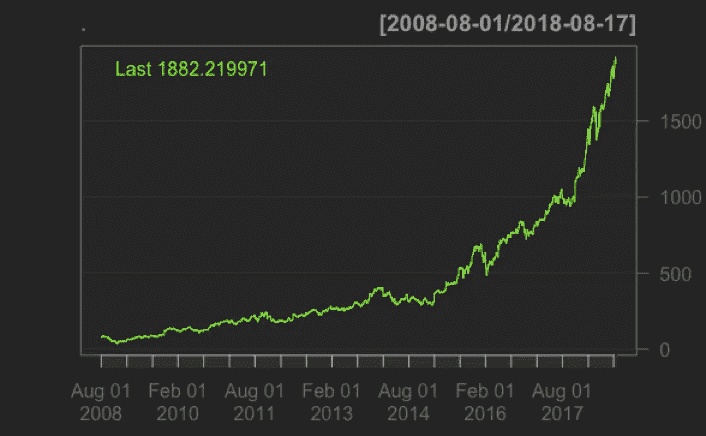
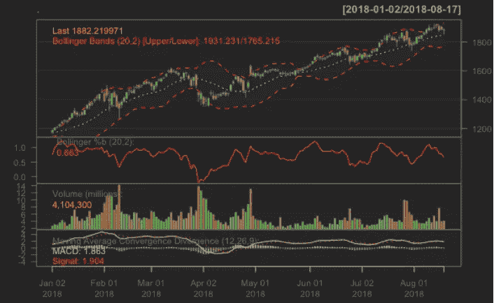
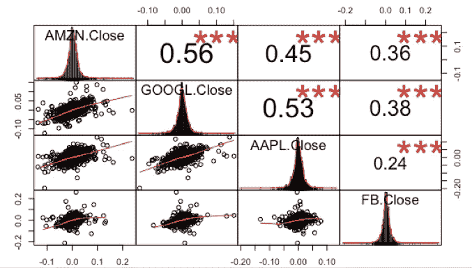
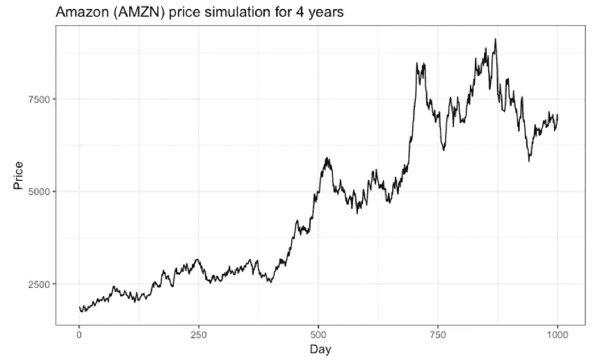
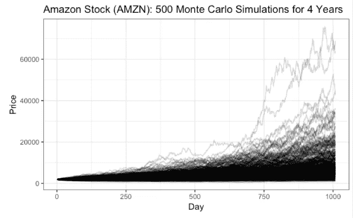
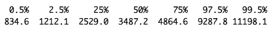

# 使用 R 分析股票

> 原文：<https://towardsdatascience.com/analyzing-stocks-using-r-550be7f5f20d?source=collection_archive---------4----------------------->

## 对亚马逊(Amazon)股票的一般和技术分析，以及使用随机漫步和蒙特卡罗方法的价格模拟。用 plotly 和 ggplot 完成的可视化。

亚马逊(Amazon)的股票在过去一年上涨了 95.6%(918.93 美元)，这使得亚马逊成为许多投资者的理想选择。许多分析师还认为，亚马逊(Amazon)的价值将在未来几年继续增长。虽然购买股票听起来很诱人，但应该进行详细的深入分析，以避免基于投机购买股票。

我落实了我在统计学和 R 技能方面的知识，从技术面分析它的表现，预测它未来的价格。我非常依赖量化金融中常用的软件包，如 quant mod 和 xts 来实现我的目标。

以下是我使用的软件包的完整列表:

```
library(quantmod)
library(xts)
library(rvest)
library(tidyverse)
library(stringr)
library(forcats)
library(lubridate)
library(plotly)
library(dplyr)
library(PerformanceAnalytics)
```

我从获得亚马逊股票从 2008 年 8 月 1 日到 2018 年 8 月 17 日的日志回报开始分析:

```
getSymbols("AMZN",from="2008-08-01",to="2018-08-17")AMZN_log_returns<-AMZN%>%Ad()%>%dailyReturn(type='log')
```

日志返回在这个阶段没有意义，但它实际上是我分析的基础。我稍后会解释。

# 技术分析

我首先对亚马逊的股票进行了技术分析:

```
AMZN%>%Ad()%>%chartSeries()AMZN%>%chartSeries(TA='addBBands();addVo();addMACD()',subset='2018')
```

第一个图表系列图很简单，因为它显示了亚马逊的价格图表:



Price Chart

第二个图表系列显示了仅在 2018 年的布林线图、布林线百分比变化、成交量和移动平均线收敛趋势:



Technical Analysis

均线对于理解亚马逊(Amazon)的技术图表非常重要。它通过平均股票价格来平滑每日价格波动，并有效地识别潜在趋势。

布林线图表绘制了两个远离移动平均线的标准偏差，用于衡量股票的波动性。成交量图显示了其股票每天的交易情况。均线收敛背离给技术分析师买入/卖出信号。经验法则是:如果跌破该线，就该卖出了。如果它上升到线以上，它正在经历一个上升的势头。

上面的图表通常用来决定是否买/卖股票。由于我不是一个认证的金融分析师，我决定做额外的研究来说服自己。

# 比较

我实现了公开比较的基本原则。我想看看亚马逊(Amazon)与其他热门科技股如脸书(Alibaba)、谷歌(Google)和苹果(Apple)相比表现如何。

我首先比较了每只股票的风险/回报率。我取了对数回报的平均值和对数回报的标准差。均值被认为是一致的回报率，而标准差是购买股票带来的风险。我用 plotly，一个交互式可视化工具，来说明我的发现。

Risk vs Reward chart

谷歌(GOOGL)股票风险最低，回报也最低。脸书(Alibaba)和亚马逊(Amazon)的风险一样大，但后者的回报更高。如果你喜欢冒险，特斯拉(TSLA)是一个很好的投资，因为它有高风险和高回报。但如果你像我一样厌恶风险，苹果(AAPL)是最好的选择。

一个流行的投资原则是分散投资:不要把所有的鸡蛋放在一个篮子里。购买股票时，你应该尽量购买相关性小的股票，因为你想最大化总回报率。

```
library(PerformanceAnalytics)data<-cbind(diff(log(Cl(AMZN))),diff(log(Cl(GOOGL))),diff(log(Cl(AAPL))),diff(log(Cl(FB))))chart.Correlation(data)
```



Correlation Chart

脸书(FB)和苹果(AAPL)的相关性最小，为 0.24，而亚马逊(Amazon)和谷歌(Google)的相关性最高，为 0.56。每只股票之间的相关性很高，因为它们都是科技股。最好购买不同行业的股票，以真正实现风险最小化和回报率最大化。

# 价格预测

我接着预测了亚马逊(Amazon)股票的价格。我通过随机漫步理论和蒙特卡罗方法实现了这一点。

随机游走理论适合于股票的价格预测，因为它植根于这样一种信念，即过去的表现不是未来结果的指标，价格波动无法准确预测。

我模拟了亚马逊(Amazon)股票 252*4 个交易日的价格(因为一年有大约 252 个交易日)。这是 4 年的交易价值！

我使用我之前从对数收益中获得的数据生成价格，并使用指数增长率来预测股票每天将增长多少。增长率是随机生成的，取决于 mu 和 sigma 的输入值。

```
mu<-AMZN_mean_log # mean of log returns
sig<-AMZN_sd_log # sd of log returns price<-rep(NA,252*4)#start simulating pricesfor(i in 2:length(testsim)){
  price[i]<-price[i-1]*exp(rnorm(1,mu,sig))
}random_data<-cbind(price,1:(252*4))
colnames(random_data)<-c("Price","Day")
random_data<-as.data.frame(random_data)random_data%>%ggplot(aes(Day,Price))+geom_line()+labs(title="Amazon (AMZN) price simulation for 4 years")+theme_bw()
```



Price Preidction with Random Walk

上图显示了大约 1000 个交易日的模拟价格。如果你注意我的代码，我没有包含 set.seed()。模拟价格将会改变，并取决于我的种子。为了得出稳定的预测，价格模拟需要使用蒙特卡罗方法，在这种方法中，价格被重复模拟以确保准确性。

```
N<-500
mc_matrix<-matrix(nrow=252*4,ncol=N)
mc_matrix[1,1]<-as.numeric(AMZN$AMZN.Adjusted[length(AMZN$AMZN.Adjusted),])for(j in 1:ncol(mc_matrix)){
  mc_matrix[1,j]<-as.numeric(AMZN$AMZN.Adjusted[length(AMZN$AMZN.Adjusted),])
for(i in 2:nrow(mc_matrix)){
  mc_matrix[i,j]<-mc_matrix[i-1,j]*exp(rnorm(1,mu,sig))
}
}name<-str_c("Sim ",seq(1,500))
name<-c("Day",name)final_mat<-cbind(1:(252*4),mc_matrix)
final_mat<-as.tibble(final_mat)
colnames(final_mat)<-namedim(final_mat) #1008 501final_mat%>%gather("Simulation","Price",2:501)%>%ggplot(aes(x=Day,y=Price,Group=Simulation))+geom_line(alpha=0.2)+labs(title="Amazon Stock (AMZN): 500 Monte Carlo Simulations for 4 Years")+theme_bw()
```



Price Prediction with Monte Carlo

上面的图表并不直观，所以我在四年后用亚马逊(Amazon)的价格百分比最终确定了我的发现。

```
final_mat[500,-1]%>%as.numeric()%>%quantile(probs=probs)
```



不要相信我的话，但从我的模拟结果来看，亚马逊(Amazon)的股票可能会在四年内达到 11198.10 美元的价格，或者跌至 834.60 美元的低点。你可以将我的发现与亚马逊(Amazon)的 CAGR 进行比较，看看我的发现是否有意义。但是如果有机会，我会马上买下这只股票！

感谢阅读！如果你有任何反馈/想聊天，请告诉我。你可以打电话给我

推特:@joygraceeya

电子邮件:joygh174@gmail.com

你可以在这里看我的完整代码和参考文献[。](https://github.com/joygraciacia/mcmc-stock)