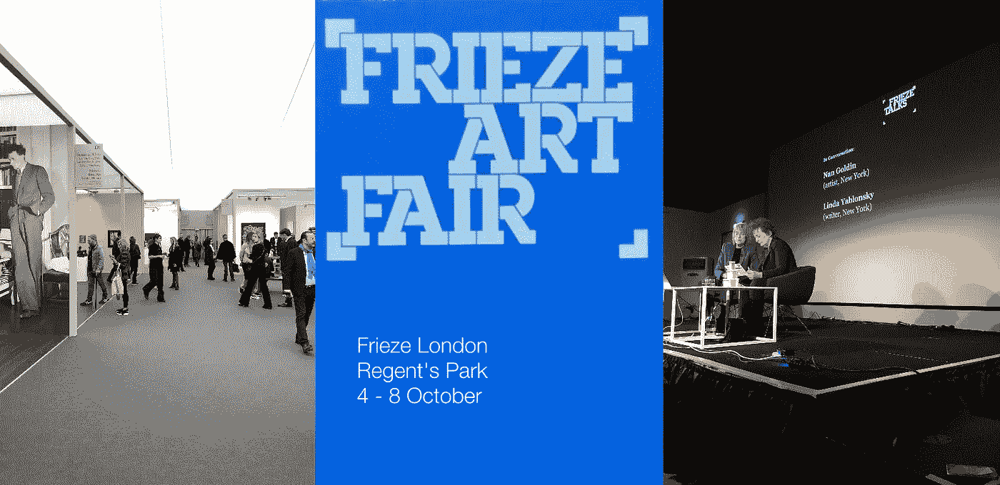
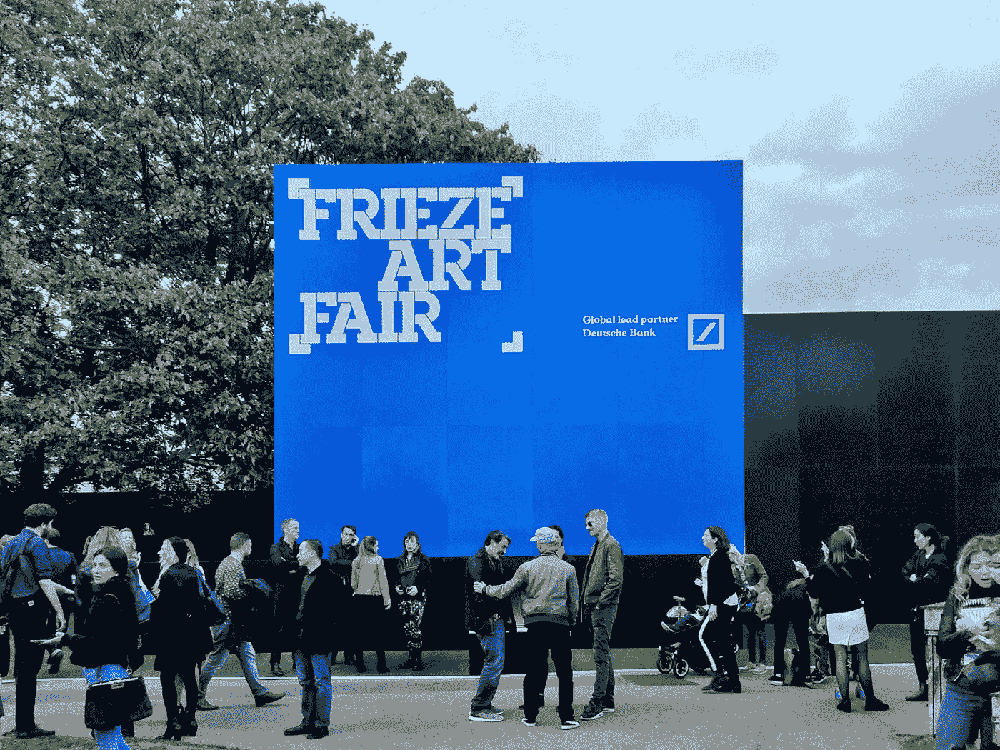
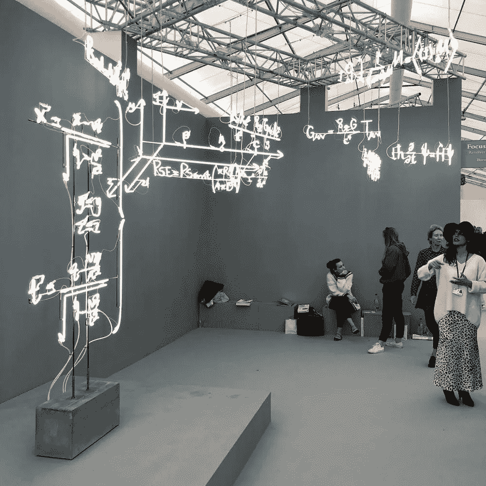

# 解析伦敦 2018 艺术博览会，第一部分

> 原文：<https://towardsdatascience.com/analyzing-the-frieze-london-2018-art-fair-part-1-f1563d066a6f?source=collection_archive---------19----------------------->

## 第一部分:5.6k Instagram 和 3.2k Twitter 帖子的探索性数据分析

Frieze Masters Art Fair on the left and Nan Golding on the right

Frieze 是一家国际艺术商业特许经营公司，1991 年以杂志起家，但后来发展成为一家组织一些年度日历上最重要的艺术博览会和活动的机构。

自 2003 年以来，每年 10 月，Frieze 都会在伦敦摄政公园的中央组织一次大型当代艺术展，吸引成千上万的人。来自 20 多个国家的 150 多家画廊通常会参加盈利性艺术博览会。

然而，Frieze 现在已经不仅仅是一个艺术博览会。
“楣周”已经成为一个文化娱乐周，人们纯粹是为了观赏而参加，这里有一个雕塑公园，甚至主要的拍卖行也举办他们的中期当代拍卖会，以配合楣周。

Imaged taken from [bulanlifestyleblog](https://bulanlifestyle.wordpress.com/2018/10/06/frieze-art-fair-london-2018/)

本文的目的是通过分析 5.6k Instagram 和 3.2k Twitter 帖子，展示一些关于艺术博览会的社交媒体数据的**探索性数据分析**，从而更好地了解 Frieze London 2018。请向下滚动，通过交互式数据可视化查看我的分析！

## 数据和方法

在节日期间，我使用 Twitter API 收集了 3200 条推文，使用 Instagram API 收集了 5600 条包含标签 *#frieze* 的 Instagram 帖子。值得注意的是，我只收集了包含标签 *#frieze* 的帖子；当然，有许多关于 Frieze London 2018 的推文不包含这个标签。

在我收集了数据之后，我在一个 python 笔记本中对这些推文进行了预处理和分析。你可以在这里查看我的 Kaggle 内核[对这篇文章的分析。](https://www.kaggle.com/vishalkumarlondon/frieze-london-2018-eda?scriptVersionId=6903666)

【本文不解释如何获取数据；这是我的发现的介绍。关于如何使用 API 从 Twitter 获取数据的更多信息，请阅读[这篇文章](https://medium.com/@GalarnykMichael/accessing-data-from-twitter-api-using-r-part1-b387a1c7d3e)作者 [Michael Galarnyk](https://medium.com/u/c07aac64b6e1?source=post_page-----f1563d066a6f--------------------------------)

Photo I took at Frieze London 2018

## 分析推文和 Instagram 帖子

我分析的主要内容来自我通过 Twitter 和 Instagram APIs 收集的 9000 条帖子。下面，我报告对以下三个指标的一些初步分析:

1.  每天的帖子数量；
2.  每小时的帖子数量(四天的平均值)；
3.  Tweeters 和 Instagrammers 前 10 名(按发帖频率)。

## 每天的帖子数量

下面的条形图显示，2018 年伦敦 Frieze 最受欢迎的一天是第一天，即 10 月 4 日星期四，使用 *#frieze* 在两个平台上发布了 1786 条帖子。然后从周四到周一逐渐下降。

Figure 1: Bar chart showing the number of posts by day during Frieze London 2018

然而，如果我们将这些数字按平台分开，我们会发现 Instagram 主导了大部分在线活动，平均占 *#frieze* 一周内*所有每日帖子的 72%。*事实上，随着“Frieze Week”的发展，更多的在线用户开始在 Instagram 上用#frieze 发帖，而不是在 Twitter 上。

这完全有意义，因为 Instagram 是一个非常视觉化的内容平台，使其完全符合 Frieze art fair，人们通常在那里发布艺术品的图像。在第 3 部分中，我将更详细地看看这些图片。

Figure 2: Bar chart showing the % of posts by platform per day

## 按小时计算的帖子数量

早在早上 6 点(格林威治时间)就有活动，而且活动迅速加快。上午 11 时和下午 3 时最繁忙，分别有 541 个和 542 个职位；然而，在上午 9 点到下午 5 点之间有非常高且稳定的活动。

Figure 3: Bar chart showing the average tweets per hour

同样，如果我们按平台划分每小时的帖子，我们可以清楚地看到 Instagram 的优势，平均占所有每小时帖子的 71%。

Figure 4: Bar chart showing the % of posts by platform per hour

## 前 10 名 Instagrammers 和 Tweeters

下面的条形图显示了按帖子数量排名的前 10 名 Instagrammers 和 Tweeters，分别是左图和右图。

在 Instagram 上， **gusgracey** 使用 *#frieze* 总共发布了 56 条帖子，而 **aservais1** 在 Twitter 上发布了 59 条帖子。只有一个用户(使用相同的手柄)在两个平台上都进入了前 10 名: **cordy_86** 。

Figure 5: Top 10 Instagrammers and Tweeters by the frequency of posts

## 结论

所以你有它！我在 11000 条关于伦敦设计节 2018 的推文中展示了一些 EDA。如果你有任何想法或建议，请在下面留下你的评论，或者在我的 [Kaggle 内核](https://www.kaggle.com/vishalkumarlondon/frieze-london-2018-eda?scriptVersionId=6903666)上留下你的评论——如果能在 Kaggle 上投上一票，我将不胜感激:)。

Photo I took at Frieze London 2018

## 下次…

在我的下一篇文章(第 2 部分)中，我将展示我的自然语言处理(NLP)分析的发现。期待看到推文的文本分析和情感分析。敬请关注。

感谢阅读！

Vishal

# 在你离开之前…

如果你觉得这篇文章有帮助或有趣，请按住👏请在推特、脸书或 LinkedIn 上分享这篇文章，这样每个人都能从中受益。

Vishal 是一名文化数据科学家，也是伦敦 UCL 学院**的研究生。他对城市文化的经济和社会影响感兴趣。你可以在*[*Twitter*](https://twitter.com/vishalkumarldn)*或者*[*LinkedIn*](https://www.linkedin.com/in/vishalkumarlondon/)*上与他取得联系。在*[*insta gram*](https://www.instagram.com/vishalkumar.london/)*或他的* [*网站*](https://vishalkumar.london/) *上看到更多 Vishal 的作品。**