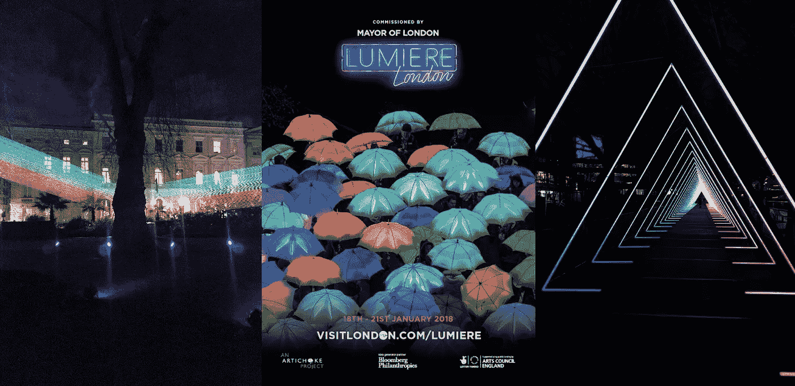
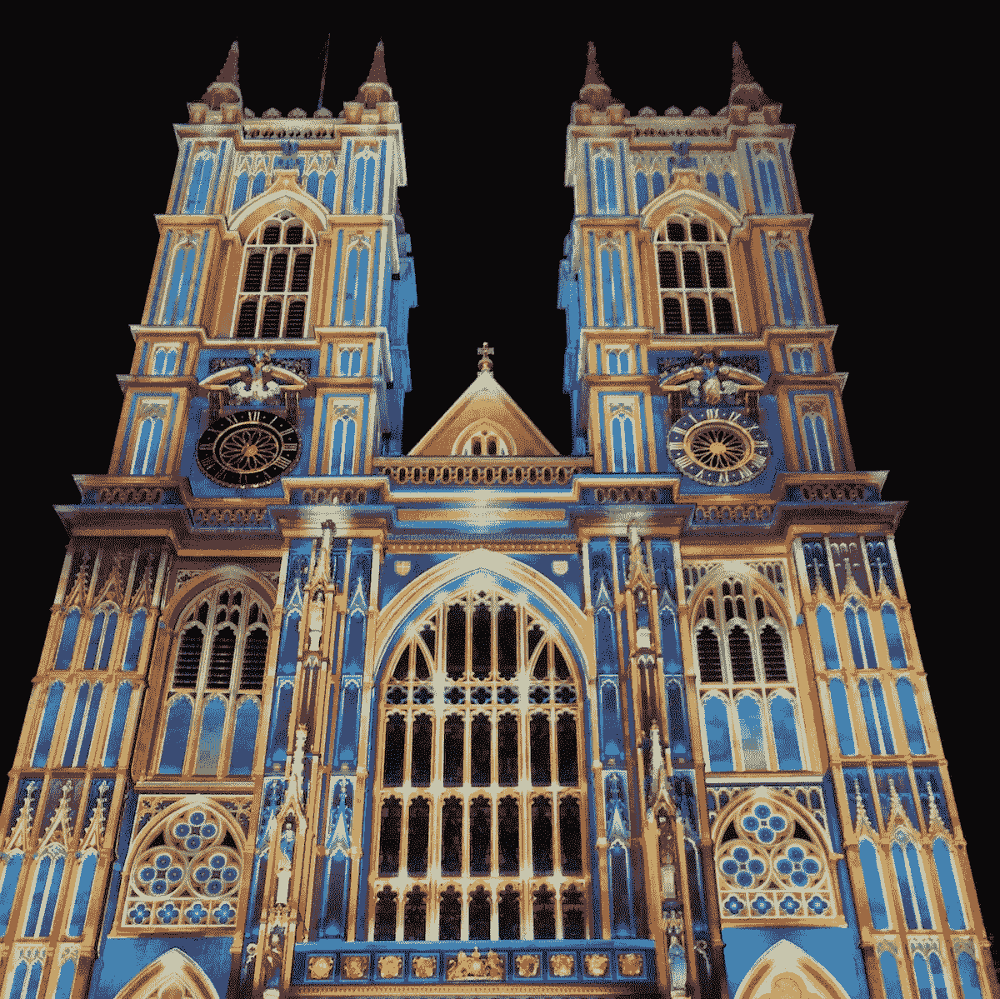
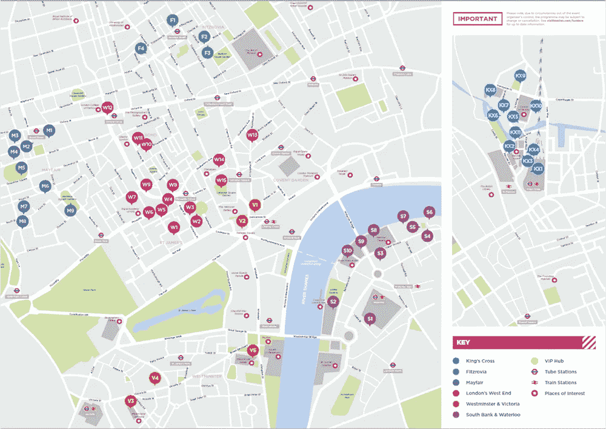
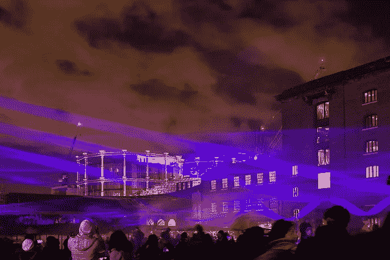
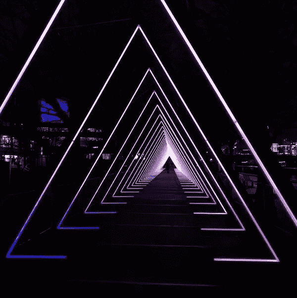

# 琉米爱尔伦敦 2018:探索性数据分析(第一部分)

> 原文：<https://towardsdatascience.com/analyzing-the-lumiere-london-2018-light-festival-part-1-eb0284d317c7?source=collection_archive---------21----------------------->

## 第 1 部分:对 11，000 条推文的探索性数据分析

## 介绍

琉米爱尔伦敦 2018 是今年早些时候在伦敦举行的大型灯光节。从 1 月 18 日(星期四)到 1 月 21 日(星期日)的四天时间里，53 位艺术家的 50 多件公共艺术品在伦敦的六个区展出，超过 100 万人参加了此次艺术节！

琉米爱尔 2018 是协调和交付的史诗般的例子，向伦敦市民公开展示艺术和文化。它是免费参加的，受伦敦市长的委托，由艺术慈善机构[朝鲜蓟信托](https://www.artichoke.uk.com/)策划、制作和策划。节日期间，威斯敏斯特教堂、伦敦眼等建筑都会被点亮。

你可以在这里阅读更多关于琉米爱尔及其创始伙伴[的信息。](https://www.visitlondon.com/lumiere)

Westminster Abbey in London illuminated by Patrice Warrener with his work The Light of the Spirit.

本文的目的是通过分析 11，000 条推文，展示一些关于 2018 年琉米爱尔伦敦奥运会社交媒体数据的探索性数据分析。请向下滚动，通过交互式数据可视化查看我的分析！

## 数据和方法

组织者推广的官方标签是#LumiereLDN。在节日期间，我使用 [Twitter API](https://developer.twitter.com/en/docs/developer-utilities/twitter-libraries.html) 收集了 11000 条包含这个标签的推文。需要注意的是，我只收集了包含# LumiereLDN 的推文。当然，有许多关于琉米爱尔伦敦 2018 的推文没有包含这个标签。

在我收集了数据之后，我在一个 python 笔记本中对这些推文进行了预处理和分析。你可以点击查看[我的 Kaggle 内核，了解这篇文章的分析。](https://www.kaggle.com/vishalkumarlondon/lumiere-london-eda?scriptVersionId=6502190)

【本文不解释如何获取数据；这是我的发现的介绍。有关如何使用 API 从 Twitter 获取数据的更多信息，您可以阅读迈克尔·加拉内克的文章

## 装置的位置

总共有 54 个公共艺术装置，分布在伦敦市中心的六个不同区域——国王十字车站、菲茨罗维亚、梅菲尔、西区、维多利亚和威斯敏斯特以及南岸和滑铁卢。下图显示了这些装置是如何分布在各个地区的:

This map was taken from the official Lumiere London leaflet.

下面的饼状图按位置显示了公共艺术装置的频率——它是交互式的，就像所有其他图表一样，所以请悬停并点击它！

伦敦西区是人口最多的地区，有 15 个公共艺术装置——这是有道理的，因为伦敦西区历史上是一个旅游区——有趣的是，国王十字车站以 11 个装置位居第二。

Figure 1: Pie chart showing the number of public art installations by location

仔细查看[官方合作伙伴页面](https://www.visitlondon.com/lumiere/about/sponsors?ref=nav)将[西区](https://westendpartnership.london/)和[国王十字](https://www.kingscross.co.uk/)商圈列为“主要合作伙伴”。

Waterlicht by Daan Roosegaarde at King’s Cross - taken by Ian Woodhead and [downloaded from Flickr](https://www.flickr.com/photos/133461395@N08/38924124115/in/photolist-22iAj1c-23F9fWp-23DrJqa-23DrGf8-23F9cVK-FzwaJh-E3ufk8-E6984g-23KiuDn-23F1Wgx-23F1Rmn-23ECcyd-KhkJTr-22As7sW-Fxf5Bh-FwKMK7-JLzqa6-22iHYMB-JGzGAX-JGA16g-Fuv2rC-FwtXFb-22As6Zw-23Cm8td-JFa7ix-DYvZnn-JQxbQk-23CuBSk-JZcPo6-E1wKg2-DZsHi8-E3uh98-22DzJzU-22iHSV6-23DqT8T-22ie1M6-JHKQcH-23EpRcK-DZsHza-23BPw2S-FwFfhf-22gZ6bk-JGwqee-22yCctj-FwqkPY-Fwqmks-23ABFiY-22gY2sk-22gZZ7e-22Rmyt5)

## 分析推文

我分析的主要内容来自我通过 Twitter API 收集的 11000 条推文。下面，我报告对以下三个指标的一些初步分析:

1.  每天的推文数量；
2.  每小时的推文数量(四天的平均值)；
3.  前 10 名推特用户(按关注人数)。

## 每天的推文数量

下面的条形图显示，2018 年伦敦琉米爱尔最受欢迎的一天是 1 月 19 日*星期五*，有**2449 条推文**包含标签#LumiereLDN。令人惊讶的是，*周四 18+周五 19*比周末，*周六 20+周日 21*更受欢迎。

Figure 2: Bar chart showing the number of tweets by day during the festival

## 每小时的推文数量

一天中最繁忙的时间(整个节日的所有日子)是在晚上 6 点到 10 点之间——晚上 9 点是最繁忙的时间，总共有 769 条推文。据推测，人们在晚上下班和放学后参观这个节日。该事件也是针对夜间事件的

Figure 3: Bar chart showing the average tweets per hour

## 前 10 名推特用户

在节日期间，超过 6000 名不同的人使用#LumiereLDN 发推文，但一些有趣的人物突然出现。下表显示了根据粉丝数量排名的前 10 名推特用户。

像 [BBC 新闻实验室](https://medium.com/u/c0fb04ee607d?source=post_page-----eb0284d317c7--------------------------------)、[商业内幕](https://medium.com/u/ddfcd05c5bce?source=post_page-----eb0284d317c7--------------------------------)、[推特视频](https://twitter.com/TwitterVideo)和[超时](https://www.timeout.com/london)这样的媒体果然出现在名单中，但是像[迈克·彭博](https://medium.com/u/573f753329b7?source=post_page-----eb0284d317c7--------------------------------)、[戈登·拉姆齐](https://twitter.com/GordonRamsay)和[戴维娜·迈克考](https://twitter.com/ThisisDavina)这样的名人也在推特上发了关于这个事件的消息！

Table 1: Top 10 tweets by the number of followers

The Wave by Vertigo at Southbank in London

## 结论

所以你有它！我在 11，000 条关于琉米爱尔伦敦 2018 灯光节的推文中展示了一些 EDA。如果你有任何想法或建议，请在下面留下你的评论，或者在我的 [Kaggle 内核](https://www.kaggle.com/vishalkumarlondon/lumiere-london-eda?scriptVersionId=6425800)上留下你的评论——如果能给 Kaggle 投上一票，我将不胜感激:)。

## 下次…

在我的下一篇文章(第 2 部分)中，我将展示我的自然语言处理(NLP)分析的发现。期待看到推文的文本分析和情感分析。敬请关注。

感谢阅读！

Vishal

# 在你离开之前…

如果你觉得这篇文章有帮助或有趣，请按住👏请在推特、脸书或 LinkedIn 上分享这篇文章，这样每个人都能从中受益。

Vishal 是一名文化数据科学家，也是伦敦 UCL 学院**的研究生。他对城市文化的经济和社会影响感兴趣。你可以在*[*Twitter*](https://twitter.com/vishalkumarldn)*或者*[*LinkedIn*](https://www.linkedin.com/in/vishalkumarlondon/)*上与他取得联系。在*[*insta gram*](https://www.instagram.com/vishalkumar.london/)*或他的* [*网站*](https://vishalkumar.london/) *上看到更多 Vishal 的作品。**