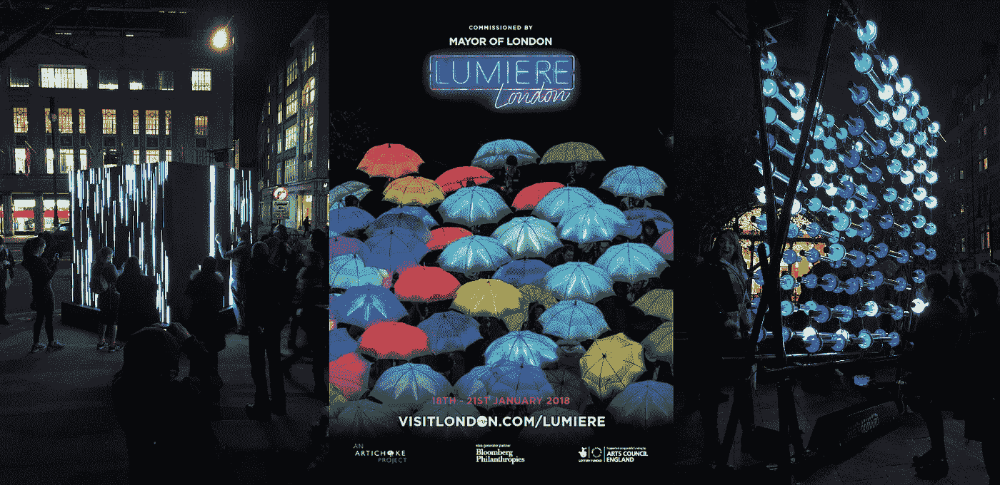
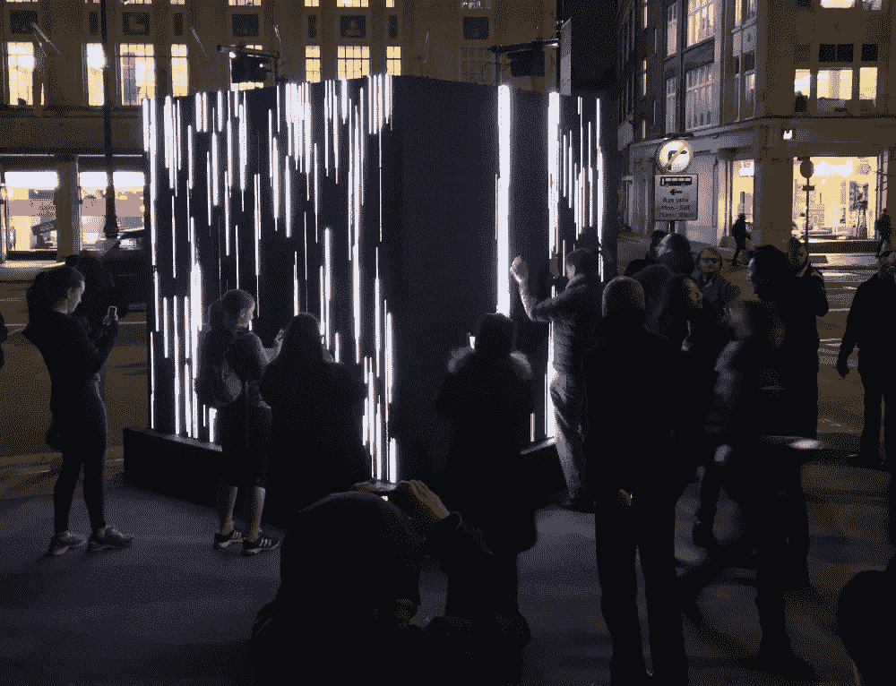
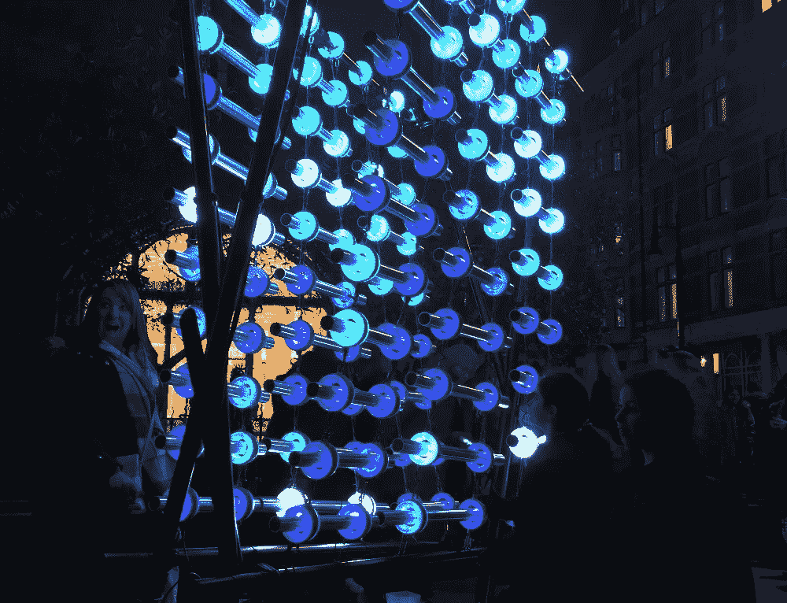
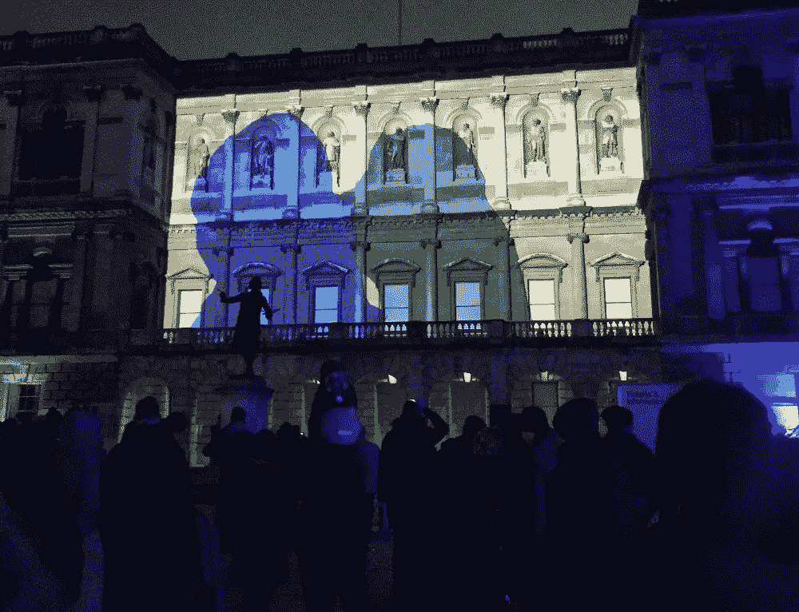

# 解析琉米爱尔伦敦 2018 灯光节(下)

> 原文：<https://towardsdatascience.com/analyzing-the-lumiere-london-2018-light-festival-part-2-98eb3769e267?source=collection_archive---------28----------------------->

## 第二部分:11，000 条推文的自然语言处理

## 介绍

在本系列的第 1 部分中，我展示了一份关于琉米爱尔伦敦 2018 的 11，000 条推文的探索性数据分析，这是今年 1 月早些时候在伦敦举行的一个大型灯光节。

从 1 月 18 日(星期四)到 1 月 21 日(星期日)的四天时间里，53 位艺术家的 50 多件公共艺术品在伦敦的六个区展出，超过 100 万人参加了此次艺术节！

本文的目的是展示我的**自然语言处理分析**对这 11，000 条推文的研究结果，以了解人们对 2018 年琉米爱尔伦敦奥运会的看法。

请向下滚动，通过交互式数据可视化查看我的分析！

Control No Control by Daniel Iregul at Whitfield Gardens in Fitzrovia — my photo

## 数据和方法

这一事件的官方标签是#LumiereLDN。在通过 Twitter API 在[事件发生时收集了 11000 条包含这个标签的推文之后，我首先在 Python 笔记本中预处理和清理了文本数据。](/access-data-from-twitter-api-using-r-and-or-python-b8ac342d3efe)

然后，我使用谷歌的 [*langdetect 库*](https://code.google.com/archive/p/language-detection/) 过滤掉非英语推文，并从 NLP 分析中删除所有转发，这样就不会出现重复。经过这些步骤，我剩下了 4600 条独特的推文。接下来，我使用[谷歌云自然语言 API](https://cloud.google.com/natural-language/) 来获取每条推文的情感。

最后，我使用 [gensim 库的 Word2Vec 模型](https://radimrehurek.com/gensim/models/word2vec.html)来获取整个 tweets 语料库中与单词“LumiereLDN”相关的每个单词的单词嵌入向量。Word2Vec 用于从大型文本语料库中计算单词之间的相似度— [Kavita Ganesan](https://medium.com/u/cd869a6dee38?source=post_page-----98eb3769e267--------------------------------) 的[文章](https://medium.freecodecamp.org/how-to-get-started-with-word2vec-and-then-how-to-make-it-work-d0a2fca9dad3)是一个很好的解释。

一旦我有了每个单词的向量，我就使用 [scikitlearn 库](https://scikit-learn.org/stable/modules/generated/sklearn.decomposition.PCA.html)来执行主成分分析(PCA)以进行降维，并绘制出与“LumiereLDN”最相似的单词(最近邻)。

你可以在这里查看[我的 Kaggle 内核对这篇文章的所有分析。](https://www.kaggle.com/vishalkumarlondon/lumiere-london-2018-nlp-analysis?scriptVersionId=7535520)

## 分析

在这一节中，我将展示我的自然语言处理(NLP)分析的发现。下面，我报告以下三个指标:

1.  每日推文的情感分析；
2.  词频和标签频率分析；
3.  Word2Vec 模型的输出:主成分分析(PCA)和最近邻分析。

A lady looking very happy at Lumiere London! Illumaphonium by Michael David, at Mount Street in Mayfair

## 情感分析

每条推文的情绪是使用谷歌的云 NLP API 计算的。下面的条形图显示了每天推文的平均情绪，其中-1 表示非常消极的情绪，+1 表示非常积极的情绪。

我们看到，琉米爱尔伦敦 2018 年奥运会开始时情绪相对较高，然后在 1 月 17 日星期三下降，直到再次达到良好的情绪；我将不得不检查推文进一步了解下降。总体而言，琉米爱尔全天的平均情绪为 0.47。

Figure 1: Line chart showing the average sentiment of the tweets per day

下表显示了按情感分类的前五条(绿色)和后五条(红色)推文。你可以通过左边的推文清楚地看到，积极的语言被云 NLP API 检测到，类似地，负面的推文在右边。

一些人表示灯光“不太优雅”，而另一些人则认为它们是“灯光和声音的有力庆祝”，并将其描述为“辉煌”和“令人印象深刻”。云 NLP API 做的很好！

Table 1: Tabel showing the top five (left) and bottom five (right) tweets by sentiment score

## 文本频率分析

下面的条形图显示了一个词出现的次数，还有一个标签出现在所有推文中，分别在左边和右边。不出所料，“卢米埃尔登”出现的次数最多。

然而，这些结果在告诉我们人们对事件的真实想法方面并不十分有用，因为标签的频率显然是单词频率的一个[混淆变量](https://en.wikipedia.org/wiki/Confounding)。在未来的分析中，我将尝试从文本频率分析中删除 hashtag word。

Figure 2: Bar graphs showing the count of words and hashtags appearing in all the tweets

## 最近的邻居

[Word2Vec](https://en.wikipedia.org/wiki/Word2vec) 是一个神经语言机器学习模型。它将大量文本(在本例中，来自 11，000 条推文的文本)作为输入，并产生一个向量空间，通常有数百个维度，每个唯一的单词对应于空间中的一个向量——单词嵌入。

重要的是，它用于计算和捕捉 11，000 条推文中单词之间的相似性和关系。具体来说，空间中距离较近的物体意味着它们是相似的——被称为最近邻。我的目标是找到所有与“ *LumiereLDN* ”紧密相关的单词。

主成分分析用于将 Word2Vec 空间的维度降低到 *x* 和 *y* 坐标，其输出显示在下面的散点图中。似乎有一些聚类，但是，很乱，很难找到与“ *LumiereLDN* ”紧密相关的词。

Figure 3: PCA output of the words embedding vector space from the Word2Vec model

我们需要进一步放大。

最近邻是来自 Word2Vec 模型的少数几个基于余弦度量相似性得分与“ *LumiereLDN* ”最相似的单词。下面的散点图显示了“ *LumiereLDN* ”的最近邻居。

拉近镜头，我们发现伦敦的区域——“*维多利亚*”、“*梅菲尔*”、“*菲茨罗维亚*”、*国王十字*”——这些艺术品被安装的地方，似乎就在附近。

但重要的是，“*神奇的*”、“*奇妙的*”和“*好玩的*”这些词也近在咫尺。一个非常积极的结果！统计表明，这些词最能代表人们在推特上谈论琉米爱尔伦敦 2018 时的感受。

Figure 4: PCA output of the nearest neighbours of #LumiereLDN from the Word2Vec model

Love Motion by Rhys Coren at The Royal Academy in the West End— my photo

## 结论

所以你有它！我已经在 11000 条关于琉米爱尔伦敦 2018 灯光节的推文中展示了我的 NLP 的发现。尽管有一些关于琉米爱尔伦敦的负面推文和情绪，但 Word2Vec 模型的输出显示人们对该活动持积极态度。

如果你有任何想法或建议，请在下面或在我的 Kaggle 内核上留下评论——非常感谢你对 Kaggle 的支持:)

有这么多 NLP 库，很可能以后我会用 [GloVe](https://nlp.stanford.edu/projects/glove/) 、 [Tensorflow](https://www.tensorflow.org/tutorials/representation/word2vec) 或者 [Bert](https://ai.googleblog.com/2018/11/open-sourcing-bert-state-of-art-pre.html) 重新审视这个分析。

## 下次…

在我的下一篇文章(第 3 部分)中，我将展示我的计算机视觉分析的发现。期待看到哪些艺术品出现的次数最多。敬请关注。

感谢阅读！

Vishal

Vishal 是一名文化数据科学家，也是伦敦 UCL 学院**的研究生。他对城市文化的经济和社会影响感兴趣。**