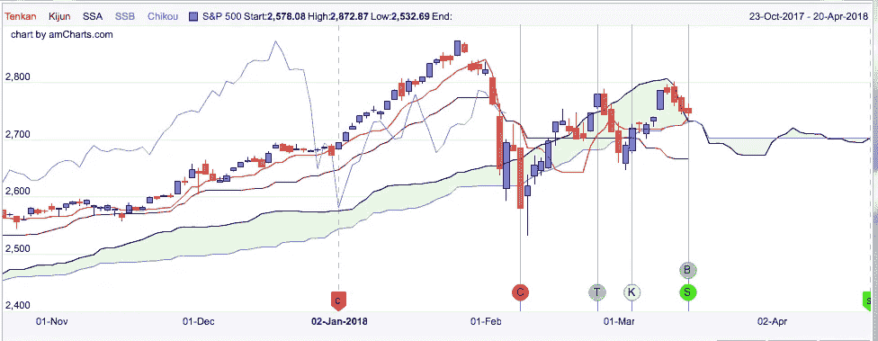
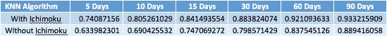

# 一目分析的效用分析

> 原文：<https://towardsdatascience.com/analyzing-the-utility-of-ichimoku-analysis-9af678e7c7f9?source=collection_archive---------0----------------------->

Ichimoku trading 是一种理解和开发感兴趣股票的买卖信号的有趣方式，也是我试图在自己的股票分析中融入的一种方式。在这篇文章中，我想解释我是如何发现这些分析的，以及我是如何将这些信号整合到我自己的预测分析中的。

那么市目是什么呢？“Ichimoku Kinko Hyo”是对股票动力、阻力和支撑的分析，根据最近的表现产生交易信号。有五条绘制的线构成了分析的基础:

**Tenkan-sen(转换线):**9 日最高价和最低价的平均值

**Kijun-sen(基线):**26 天最高价和最低价的平均值

**森口跨度 A(领先跨度 A):** 换算与基线的平均值

**森口跨度 B(领先跨度 B):**52 天高低点平均值

**迟口跨度(滞后跨度):**26 天前的收盘价

这两个寇森跨越了所谓的“库莫云”的界限，即价格高于、低于或低于我。下面是标准普尔 500 的 Ichimoku 分析图像(来自 ichimokutrader.com)。

绿色和红色的区域代表 Kumo，而线条代表前面提到的每个跨度和线条。线交叉产生的信号有几种类型。其中包括:

**天坎/基君十字:**

Tenkan 从 Kijun 下方到上方时的看涨信号(Kumo 云下方时弱，内侧时中性，上方时强)。

Tenkan 从 Kijun 上方到 belw 时的看跌信号(Kumo 云上方时弱，内部时中性，下方时强)。

**价格交叉 Kijun 森:**

当价格从下方上涨到上方时，是看涨信号(当价格低于 Kumo 时是弱势，当价格在内部时是中性，当价格在上方时是强势)。

当价格从上方下跌到下方时，熊市信号(当价格在 Kumo 上方时是弱势，当价格在内部时是中性，当价格在下方时是强势)。

**库莫突围:**

当价格脱离库莫云顶部时，是看涨信号。

当价格脱离库莫云底部时，是看跌信号。

**寇森跨越:**

森口跨度 A 从下方移动到森口跨度 B 上方时的看涨信号(库莫下方时弱，内侧时中性，上方时强)。

当森口跨度 A 从上方移动到森口跨度 B 下方时的看跌信号(Kumo 上方时弱，内侧时中性，下方时强)。

**池口跨度穿越价格:**

当 Chikou Span 从价格下方移动到价格上方时的看涨信号(当低于 Kumo 时为弱，当在内部时为中性，当在上方时为强)。

当 Chikou Span 从价格上方移动到价格下方时，是看跌信号(Kumo 上方是弱信号，Kumo 内部是中性信号，Kumo 下方是强信号)。

整合这种分析的下一步是对信号进行编码。有两种选择:

1.  使用图像处理来识别出现的信号。
2.  手动对线进行编码，并通过识别线何时从大于彼此变为小于彼此来找到交叉点。

因为对图像识别不太熟悉，所以选择了后者。这导致我使用 if-then 语句寻找交叉点的许多繁琐而全面的代码序列，但这最终是可行的。我给信号赋值，范围从-3(强烈看跌信号)到 0(没有信号)到 3(强烈看涨信号)。每一个都将成为我的算法中的数据点(在介绍文章中描述)，最终提高准确性。下表说明了这些影响:

Accuracy Analysis of KNN Algorithm Predicting S&P 500 Stock Price Direction

这里我们可以看到 Ichimoku 信号提高了整体算法的精度。5 天和 10 天的预测准确率提高了不到 11%，而 15 天、30 天和 60 天的预测准确率提高了约 9%。随着我们进入 90 天的时间框架，这些准确性的增加似乎会减少，甚至可能超过 90 天，这可能说明信号在短期内的效用。

总的来说，我想确定信号在创建更准确的预测算法中的效用，我觉得我在这方面是成功的。虽然我不能说信号的有效性是做交易决定的唯一因素，但很明显，在预测分析中包含信号会使分析更有效。

***注来自《走向数据科学》的编辑:*** *虽然我们允许独立作者根据我们的* [*规则和指导方针*](/questions-96667b06af5) *发表文章，但我们不认可每个作者的贡献。你不应该在没有寻求专业建议的情况下依赖一个作者的作品。详见我们的* [*读者术语*](/readers-terms-b5d780a700a4) *。*