# 分析熊猫的时间序列数据

> 原文：<https://towardsdatascience.com/analyzing-time-series-data-in-pandas-be3887fdd621?source=collection_archive---------3----------------------->

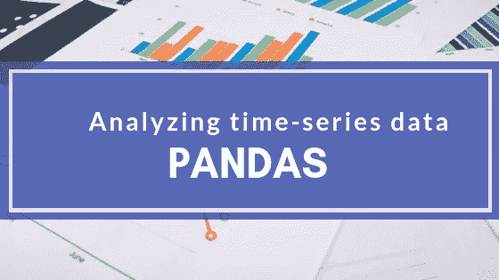

在我之前的教程中，我们考虑过数据准备和可视化工具，如 [Numpy](/lets-talk-about-numpy-for-datascience-beginners-b8088722309f) 、 [Pandas](/quick-dive-into-pandas-for-data-science-cc1c1a80d9c4) 、Matplotlib 和 Seaborn。在本教程中，我们将学习时间序列，为什么它很重要，我们需要应用时间序列的情况，更具体地说，我们将学习如何使用 Pandas 分析时间序列数据。

## **什么是时间序列**

时间序列是在特定时间通常以相等的间隔(例如每小时、每天、每周、每季度、每年等)获取的一组数据点或观察值。时间序列通常用于根据以前观察到的事件或值来预测未来的事件。预测明天股票市场将会发生什么，在接下来的一周将会售出的货物量，一个项目的价格是否会在 12 月暴涨，一段时间内优步乘坐的次数等；是我们可以用时间序列分析做的一些事情。

## **为什么我们需要时间序列**

时间序列有助于我们理解过去的趋势，因此我们可以预测和规划未来。例如，你拥有一家咖啡店，你可能看到的是你每天或每月销售多少咖啡，当你想看到你的店在过去六个月的表现时，你可能会添加所有六个月的销售额。现在，如果您希望能够预测未来六个月或一年的销售额，该怎么办呢？在这种情况下，您唯一知道的变量是时间(秒、分、天、月、年等)，因此您需要时间序列分析来预测其他未知变量，如趋势、季节性等。

> 因此，重要的是要注意，在时间序列分析中，唯一已知的变量是— **时间**。

## **为什么 pandas 使处理时间序列变得容易**

事实证明，Pandas 作为处理时间序列数据的工具非常成功。这是因为 Pandas 有一些内置的`datetime`函数，这使得处理时间序列分析变得很容易，并且由于**时间**是我们在这里处理的最重要的变量，这使得 Pandas 成为执行这种分析的非常合适的工具。

## **时间序列的组成部分**

一般来说，包括金融领域之外的时间序列通常包含以下特征:

1.  趋势:这是指一个序列在一个长时期内相对较高或较低的值的移动。例如，当时间序列分析显示一个向上的模式时，我们称之为上升趋势，当模式向下时，我们称之为下降趋势，如果根本没有趋势，我们称之为水平或静止趋势。需要注意的一点是，趋势通常会持续一段时间，然后消失。
2.  季节性:这是指在一个固定的时间段内重复的模式。虽然这些模式也可以向上或向下摆动，但是，这与趋势有很大的不同，因为趋势会持续一段时间，然后消失。然而，季节性在固定的时间段内持续发生。例如，当圣诞节时，你会发现卖了更多的糖果和巧克力，这种情况每年都会发生。
3.  不规则性:这也叫噪音。不规则性发生的时间很短，而且不会耗尽。一个很好的例子是埃博拉病毒。在那段时期，洗手液的需求量很大，但这种需求是不稳定的/系统的，没有人能预测到，因此没有人能知道销售了多少，也不知道下一次会有什么爆发。
4.  周期性的:这是当一系列重复向上和向下运动时。它通常没有固定的模式。它可能发生在 6 个月后，然后两年后，然后 4 年，然后 1 年后。这种模式很难预测。

## **何时不应用 TS**

还记得我们说过这里的主要变量是时间吗？同样，必须指出的是，在以下情况下，我们不能对数据集进行时间序列分析:

1.  变量/值是常量。例如，去年圣诞节和前年圣诞节售出了 5000 盒糖果。因为两个值相同，所以我们不能应用时间序列来预测今年圣诞节的销售额。

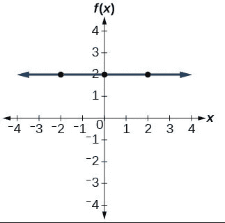

2.函数形式的值:当您可以简单地使用公式或函数来计算值时，对数据集应用时间序列分析是没有意义的。

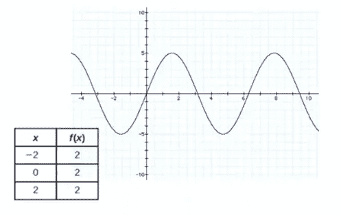

现在我们对时间序列有了基本的了解，让我们继续做一个例子来完全掌握如何分析时间序列数据。

## 预测航空旅行公司的未来

在这个例子中，我们被要求建立一个模型来预测特定航空公司的机票需求。我们将使用[国际航空公司的乘客数据集](https://datamarket.com/data/set/22u3/international-airline-passengers-monthly-totals-in-thousands--jan-49-dec-60#!ds=22u3&display=line)。你也可以从 kaggle [这里](https://www.kaggle.com/andreazzini/international-airline-passengers)下载。

**导入包和数据**

首先，我们需要做的第一件事是导入我们将用来执行分析的包:在这种情况下，我们将利用`pandas`来准备我们的数据，并访问`datetime`函数和`matplotlib`来创建我们的可视化:

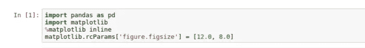

现在，让我们读取数据集，看看我们有什么样的数据。如我们所见，数据集被分为两列；月和每月旅客人数。

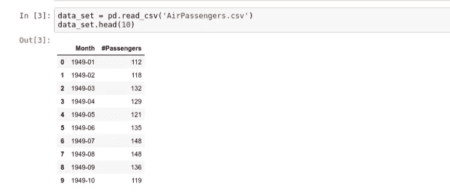

我通常喜欢获取数据集的摘要，以防有一行的值为空。让我们继续执行以下操作进行检查:

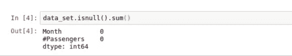

正如我们所看到的，我们的数据集中没有任何空值，所以我们可以自由地继续我们的分析。现在，我们要做的是确认`Month`列是`datetime`格式，而不是字符串。熊猫`.dtypes`功能让这一切成为可能:

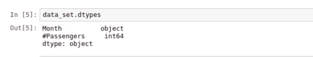

我们可以看到`Month`列是一个通用的对象类型，可能是一个字符串。因为我们想要对这些数据执行与时间相关的操作，所以我们需要将它转换成一种`datetime`格式，然后它才能对我们有用。让我们继续使用`to_datetime()`助手函数来完成这项工作，让我们将月份列转换为一个`datetime`对象，而不是一个通用对象:

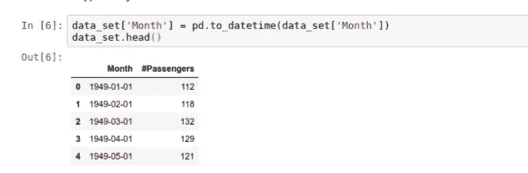

请注意，我们现在已经生成了作为月份列一部分的`date`字段。默认情况下,“日期”字段假定每月的第一天来填写未提供的日期值。现在，如果我们返回并确认类型，我们可以看到它现在的类型是`datetime`:

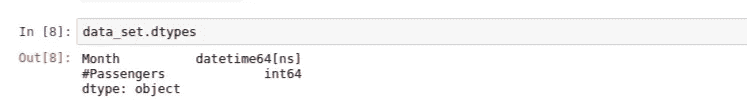

现在，我们需要将`datetime`对象设置为 dataframe 的索引，以允许我们真正探索我们的数据。让我们使用`.set_index()`方法来完成:

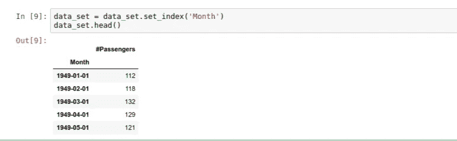

我们现在可以看到,`Month`列是我们的数据帧的索引。让我们继续创建我们的图，看看我们的数据看起来像什么:


> 注意，在时间序列图中，时间通常绘制在`x-axis`上，而`y-axis`通常是数据的大小。

请注意`Month`列是如何被用作`x-axis`的，因为我们之前已经将`Month`列转换为`datetime`，所以`year`被专门用于绘制图形。

现在，你应该注意到一个上升的趋势，表明随着时间的推移，航空公司将有更多的乘客。虽然在每个时间点都有起伏，但通常我们可以观察到趋势是增加的。我们还可以注意到起伏似乎有点规律，这意味着我们可能也在观察一种季节性模式。让我们通过观察某年的数据来仔细了解一下:

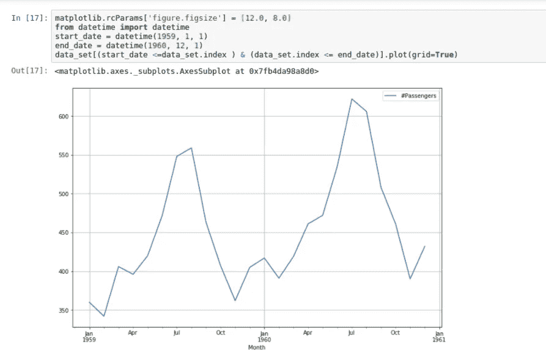

正如我们在图中看到的，通常在 7 月和 9 月之间有一个高峰，到 10 月开始下降，这意味着更多的人在 7 月和 9 月之间旅行，可能从 10 月开始旅行减少。

还记得我们提到过在我们的观察中有一个上升趋势和一个季节性模式吗？在大多数时间序列分析中，通常有许多组成部分[向上滚动查看时间序列组成部分的解释]。因此，我们现在需要做的是使用分解技术将我们的观察解构为几个组件，每个组件代表一个基本的模式类别。

**时间序列的分解**

在时间序列数据的分解过程中，有几个模型需要考虑。
1。加法模型:当趋势的变化不随时间序列水平而变化时，使用这种模型。这里，时间序列的组成部分简单地用公式相加:
`y(t) = Level(t) + Trend(t) + Seasonality(t) + Noise(t)`
2。乘法模型:如果趋势与时间序列的级别成比例，则使用乘法模型。这里，时间序列的组成部分简单地用公式相乘:
`y(t) = Level(t) * Trend(t) * Seasonality(t) *Noise(t)`

出于本教程的目的，我们将使用加法模型，因为它开发速度快，训练速度快，并且提供可解释的模式。我们还需要导入`[statsmodels](https://www.statsmodels.org/stable/index.html)`，它有一个`tsa`(时间序列分析)包以及我们需要的`seasonal_decompose()`功能:

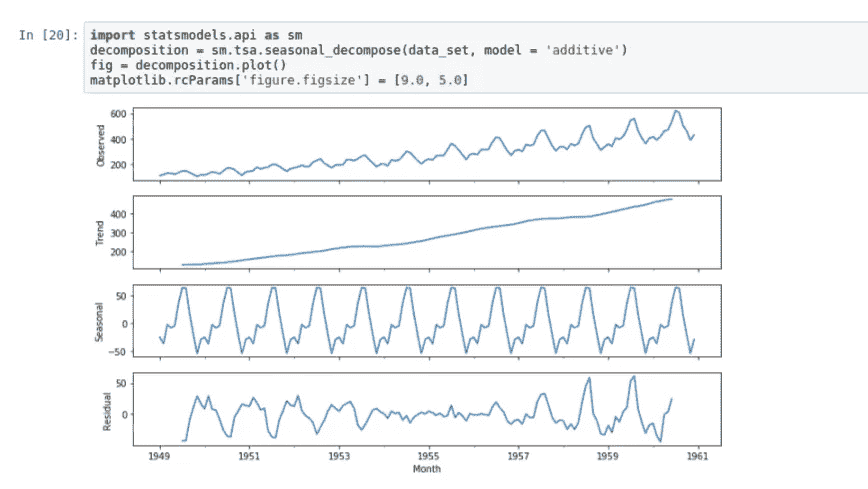

现在我们有了一个更清晰的图表，显示趋势在上升，季节性遵循一个规律。

我们要做的最后一件事是绘制观察到的时间序列的趋势图。为此，我们将使用 Matplotlib 的`.YearLocator()`函数将每个`year`设置为从一月`month=1`开始，并将`month`设置为每 3 个月`(intervals=3)`显示一次刻度的次要定位器。然后，我们使用数据帧的索引`x-axis`和`y-axis`的乘客数量来绘制数据集(并赋予其蓝色)。
我们对趋势观察做了同样的处理，用红色绘制。

```
import matplotlib.pyplot as plt
import matplotlib.dates as mdatesfig, ax = plt.subplots()
ax.grid(True)year = mdates.YearLocator(month=1)
month = mdates.MonthLocator(interval=3)
year_format = mdates.DateFormatter('%Y')
month_format = mdates.DateFormatter('%m')ax.xaxis.set_minor_locator(month)ax.xaxis.grid(True, which = 'minor')
ax.xaxis.set_major_locator(year)
ax.xaxis.set_major_formatter(year_format)plt.plot(data_set.index, data_set['#Passengers'], c='blue')
plt.plot(decomposition.trend.index, decomposition.trend, c='red')
```

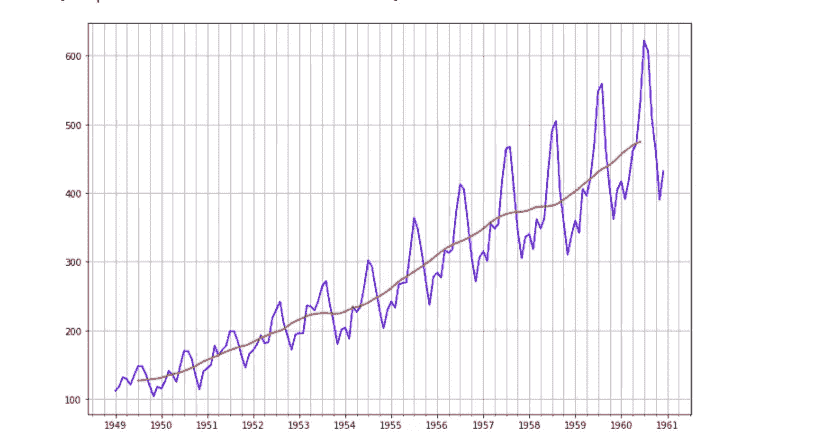

同样，我们可以看到趋势与个别观察结果相反。

## 结论

我希望这篇教程能帮助你理解什么是时间序列，以及如何开始分析时间序列数据。