# 分析和可视化巴基斯坦和印度的恐怖袭击(2002–2015)

> 原文：<https://towardsdatascience.com/analyzing-visualizing-terrorist-attacks-in-pakistan-india-2002-2015-24a03424f5e3?source=collection_archive---------2----------------------->

我目前正在学习数据科学，所以最好的学习方法是实时学习，作为一名巴基斯坦人，我会查看来自我自己国家的数据进行分析和可视化，不幸的是，我脑海中闪现的第一件事是巴基斯坦的恐怖袭击。

所以，我开始寻找巴基斯坦恐怖袭击的数据库，我在马里兰大学的[全球恐怖主义数据库](https://www.start.umd.edu/gtd/)找到了一个。

在讨论数据之前，我想强调一下数据中我认为缺失的一个重要元素。GTD 使用了城市的坐标，而不是事件发生的实际地点，这使得它在分析数据时效率较低。如果我们有事件发生地点的实际坐标，至少我们将能够分析城市的哪个部分更容易受到攻击，以及可能的原因，我们还可以通过运行预测分析模型或在机器学习的帮助下了解即将到来的攻击。

在我们继续之前，最后一件事，我不是数据分析或可视化方面的专家。所以，原谅我，如果它可以更好，或者我的分析是薄弱的。

我分析了巴基斯坦和印度。为什么是印度？因为我们是爱情鸟，我们一直都这样。我这么做的原因和这个印度人试图在[ka ggle](https://www.kaggle.com/anshulchndra/terror-in-kashmir-and-pakistan-s-involvement)找到**“克什米尔的恐怖事件和巴基斯坦的牵连”**一样。

我有几句话要对 Anshul 先生说:你可以更好地为你的国家和这个社区服务，提出印度的真正问题，而不是把时间浪费在最不重要的事情上。

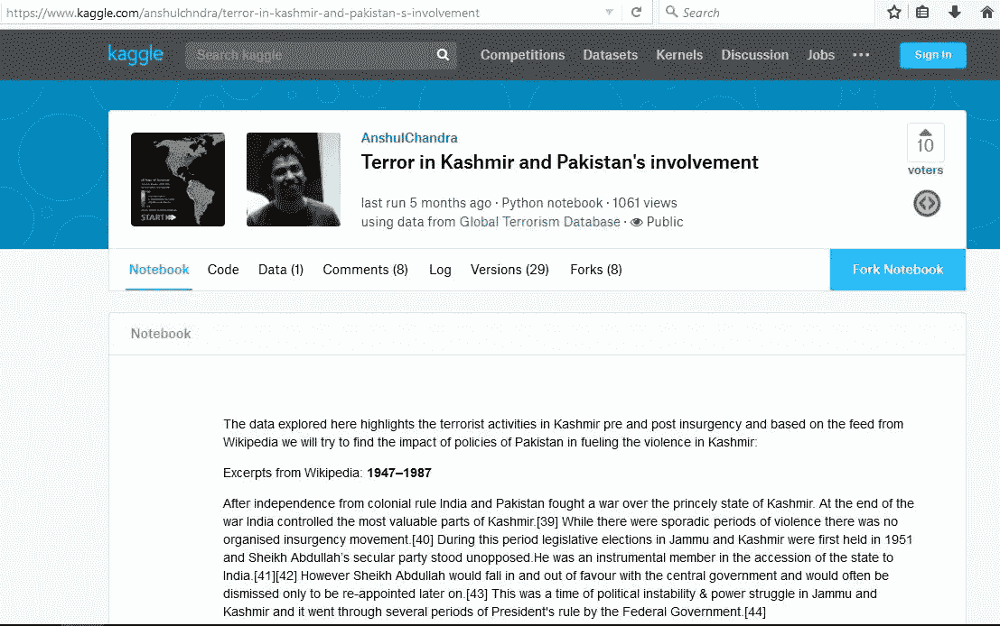

以下可视化是使用至少有 1 个因果关系的数据作为恐怖袭击的结果。

## **巴基斯坦恐怖袭击概述**

该数据中分析的年份为 2002 年至 2015 年:根据 GTD 的数据，巴基斯坦发生了超过 10，000 起恐怖袭击，其中略多于 18，000 人死亡，超过 30，000 人受伤。

Overview of terrorist attacks in Pakistan

看起来整个巴基斯坦都受到了影响，这是真的，但大多数袭击发生在俾路支，FATA 和 KPK。

这三个地区位于阿富汗边境！

## **印度恐怖袭击概述**

这就是印度恐怖袭击在地图上的样子。

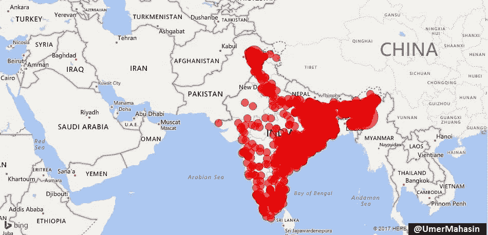

它从克什米尔开始，深入到印度的东部、南部、北部和东南部。

如果巴基斯坦在印度输出恐怖主义，为什么我们没有看到任何跨越 2900 多公里边界的活动？为什么只有克什米尔有麻烦？因为这是印巴之间有争议的领土，克什米尔人民正在为自由而战，这也是 GTD 数据库中的恐怖主义。

根据 GTD 的数据，2002 年至 2015 年期间，印度记录了 6488 起恐怖袭击事件。超过 7600 人死亡，超过 14400 人受伤。329 起袭击是由“伊斯兰”组织实施的，在过去的 15 年里造成了 **1119 起**伤亡，其余的则是由“非伊斯兰”组织实施的。正如我们在下面所看到的，超过 95%的“伊斯兰组织”的袭击发生在克什米尔，同样是自由运动活跃的争议地区。

这是印度“伊斯兰”组织的所有袭击，看起来像是在地图上…

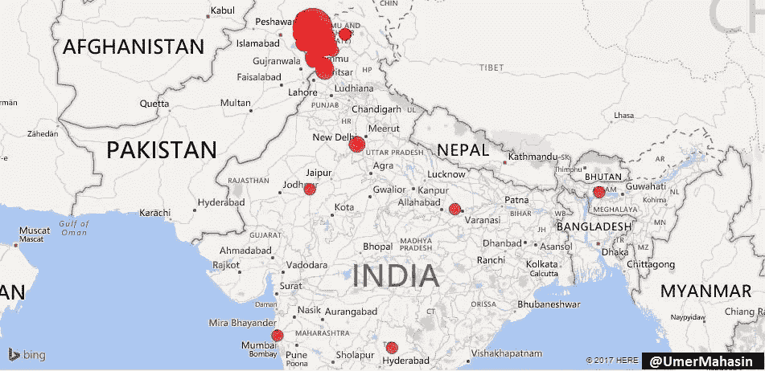

Attacks by “Islamic” groups in India

**亲爱的印度！你的问题既不是巴基斯坦也不是穆斯林。**

## **巴基斯坦受影响最严重的地区**

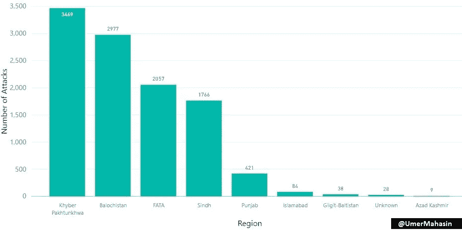

FATA 碰巧是像 TTP 这样的恐怖组织的大本营，但就袭击数量而言，它在名单上排名第三，这显然是因为没有多少“有价值”的目标。从 FATA 崛起后，第一个受到影响的地区是 KPK。

俾路支斯坦和阿富汗之间没有任何东西，所以即使俾路支斯坦的总人口不超过巴基斯坦的 5%,进入第二个国家也是显而易见的。

旁遮普是巴基斯坦人口最多的地区，人口占总人口的 50%以上。如果我们假设恐怖主义的根源在巴基斯坦内部，我们应该已经看到旁遮普、信德和伊斯兰堡的最大数量的袭击，但是**我们看到袭击数量和受影响最严重地区的地理位置(与阿富汗接壤)**之间存在正相关。还有一个原因导致了这些地区更多的恐怖活动。与这个国家的其他地区相比，这些地区被忽视并且不发达。

信德省并不与阿富汗接壤，但是阿富汗发生大量袭击事件的原因是相互之间以及与安全部队之间的政治和种族战争。

这是 FATA/KPK &旁遮普袭击的特写镜头。

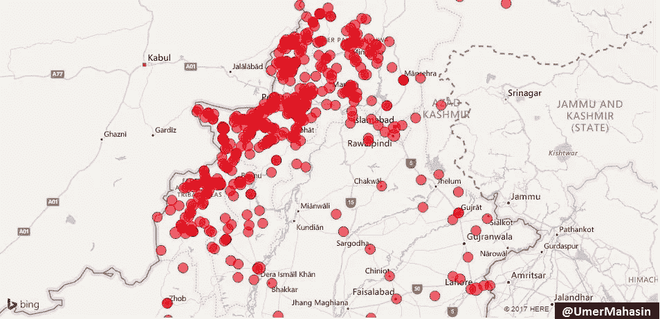

**袭击数量&各城市的伤亡人数**

卡拉奇是巴基斯坦最大的城市，人口超过 2000 万。因此，奎达和白沙瓦名列榜首。

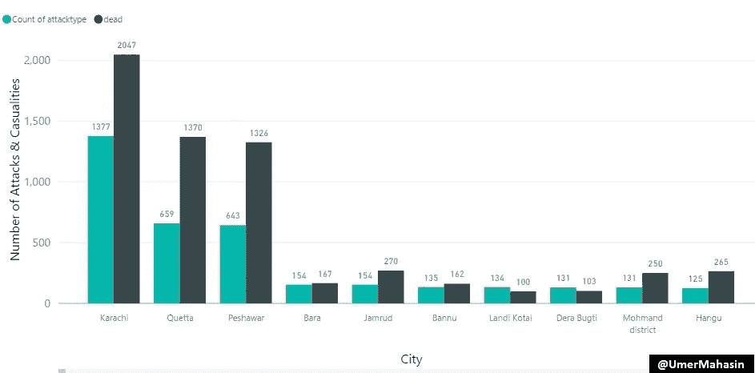

**按团体划分的攻击次数**

有趣的是，当我们看到 TTP 在 FATA 崛起时，我们也看到俾路支省的俾路支恐怖组织崛起。

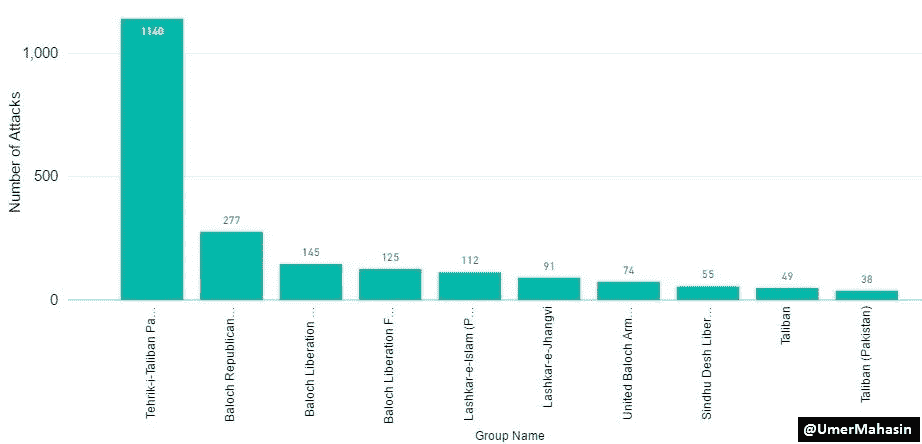

如果我们看看印度不同组织的袭击次数。很明显，巴泰虔诚军(LeT)T1 和 T2 伊斯兰圣战者组织 T3 分别位于 T4 的第 6 位、T42 的第 6 位和第 7 位，这使得他们对印度的威胁很小(至少除非他们先对付其他组织)。

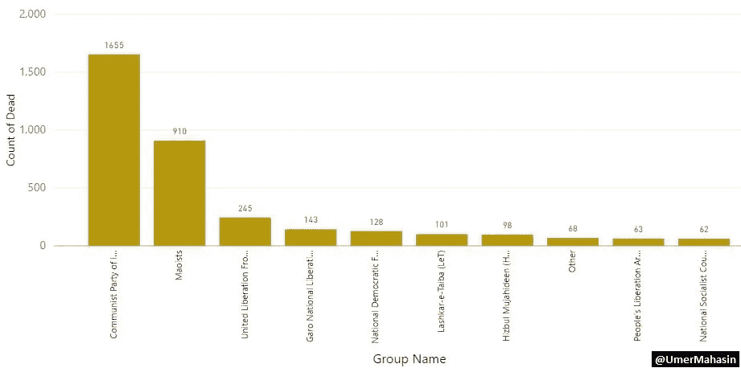

前 5 名是…

1.印度共产党(毛派)

2.毛派

3.阿萨姆联合解放阵线(ULFA)

4.加罗民族解放军

5.波多兰全国民主阵线(NDFB)

# **每年的攻击次数**

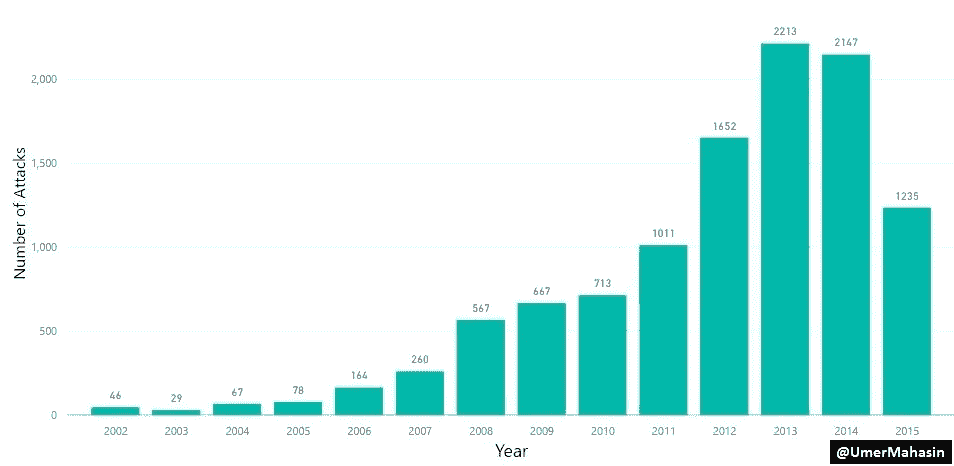

2007 年巴基斯坦恐怖袭击激增。以下是 2007 年及之前发生的几起助长巴基斯坦恐怖主义的重大事件。

**1。**印度沿巴基斯坦边境在阿富汗开设领事馆。

**2。**巴基斯坦[开始报道](https://www.outlookindia.com/magazine/story/raw-is-training-600-balochis-in-afghanistan/231032)印度干涉 FATA &俾路支省。

这篇报道发表于**2006 年 4 月 24 日**，四个月后[巴基斯坦于**2006 年 8 月 26 日**在俾路支省杀死了俾路支叛军首领阿克巴·布格提](https://www.dawn.com/news/207726)，这进一步助长了俾路支省的叛乱。

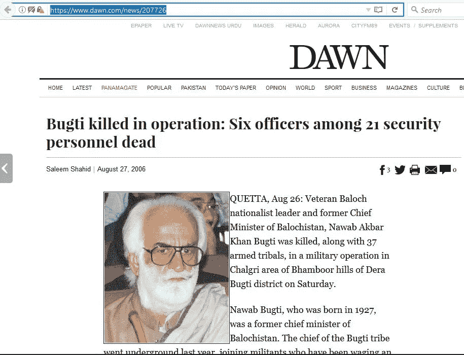

**1。恐怖分子接管了伊斯兰堡的拉尔清真寺，拉尔清真寺被围困是 2007 年 7 月伊斯兰原教旨主义武装分子和巴基斯坦政府之间的对抗。**

**2。拉尔清真寺的行动被用来助长斯瓦特地区的叛乱。TNSM 在 2007 年接管了斯瓦特的大部分地区。**

**3。**2007 年 12 月，大约 13 个组织在[巴伊图拉·马哈苏德](https://en.wikipedia.org/wiki/Baitullah_Mehsud)的领导下联合起来，成立了巴基斯坦塔利班运动(TTP)。

**但好的一面是；过去几年，巴基斯坦似乎赢得了反恐战争的胜利。**

**多年来印度的攻击次数**

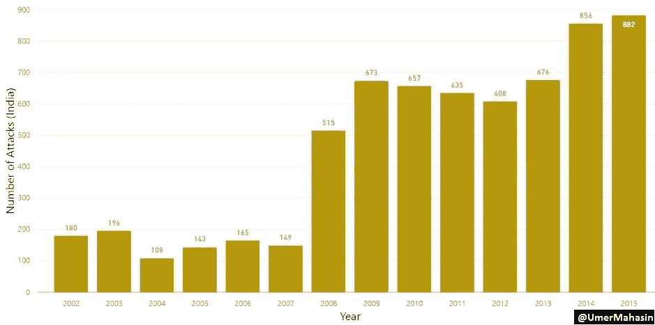

# **每月各天的攻击次数**

恐怖分子在每月的第一天最活跃，在每月的最后一天最不活跃。

为什么？嗯，我想不出一个可靠的理由，所以你能帮我理解吗？

以下是 TTP 每月每天发动的攻击数量。

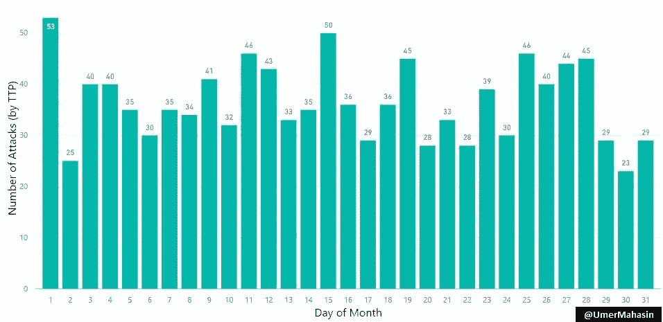

有趣的是，他们在每月的 1 号和 15 号进行了大部分的攻击。

为什么？也许是因为他们根据“表现”得到了**双周刊**的报酬，谁知道呢？:D

# **恐怖袭击中广泛使用的武器类型**

恐怖分子使用了**爆炸物/炸弹/炸药(61.81%)** 其次是**火器(31.98%)**

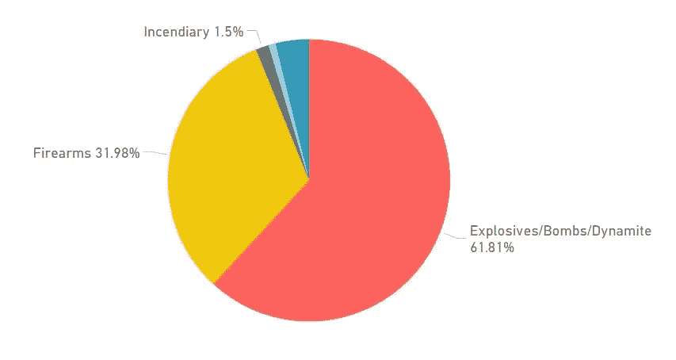

# **每月攻击次数**

恐怖分子喜欢在五月发动袭击。我不是军事专家，但我肯定有人能得出结论，为什么五月发生的袭击最多，为什么九月发生的袭击最少。

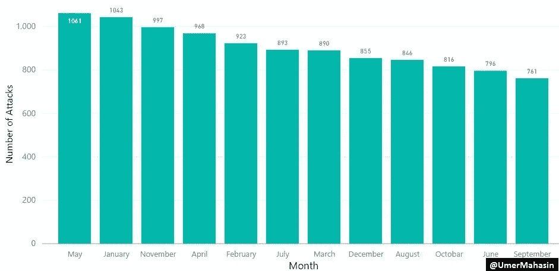

而 TTP 似乎在一月最活跃，十月最不活跃。

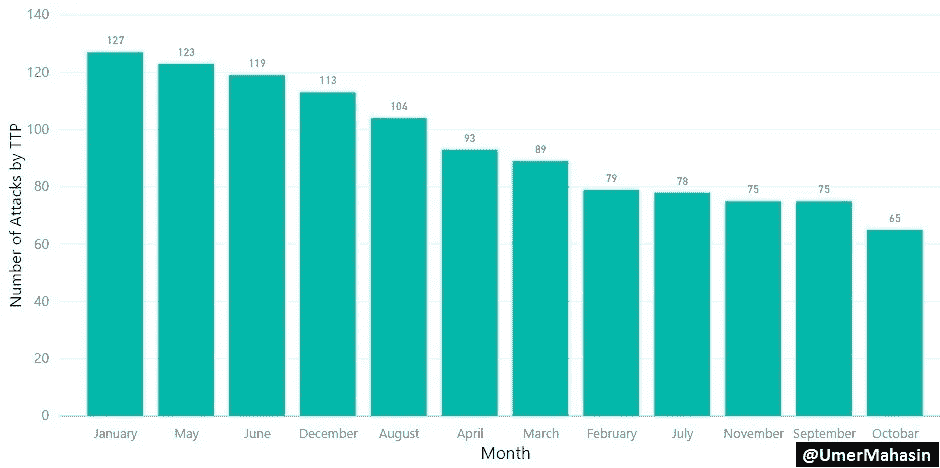

# **外国公民在巴基斯坦遇害**

从 2002 年到 2015 年，共有 427 名外国公民在巴基斯坦被杀，其中大部分是**阿富汗人**这是显而易见的，因为阿富汗人生活在恐怖袭击地区，如 **FATA，KPK &俾路支省**，他们也和巴基斯坦人一样成为受害者。

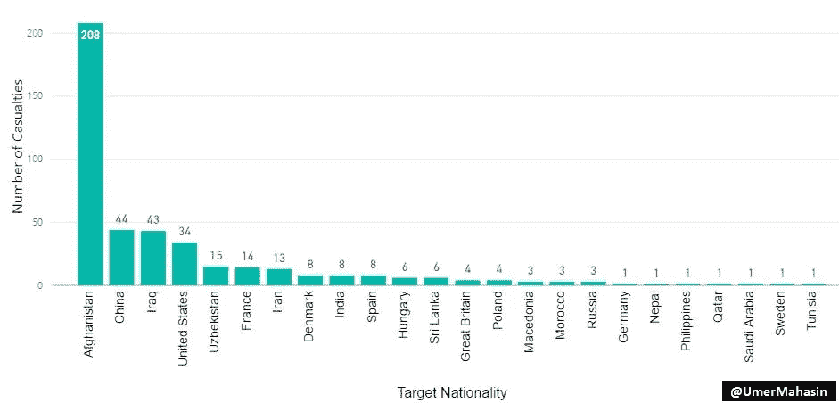

**这还不是全部！**

巴基斯坦将有许多出色的数据科学家，他们可以从这个数据库中提取更有价值的信息，并与我们分享。

> 在花了几天时间研究这些数据后，我得出结论，巴基斯坦和印度应该花更多的时间提高他们自己人民的生活水平，把更多的注意力放在被忽视的领域，而不是互相攻击。恐怖主义马上就会减少 70%。

> 爱与和平！