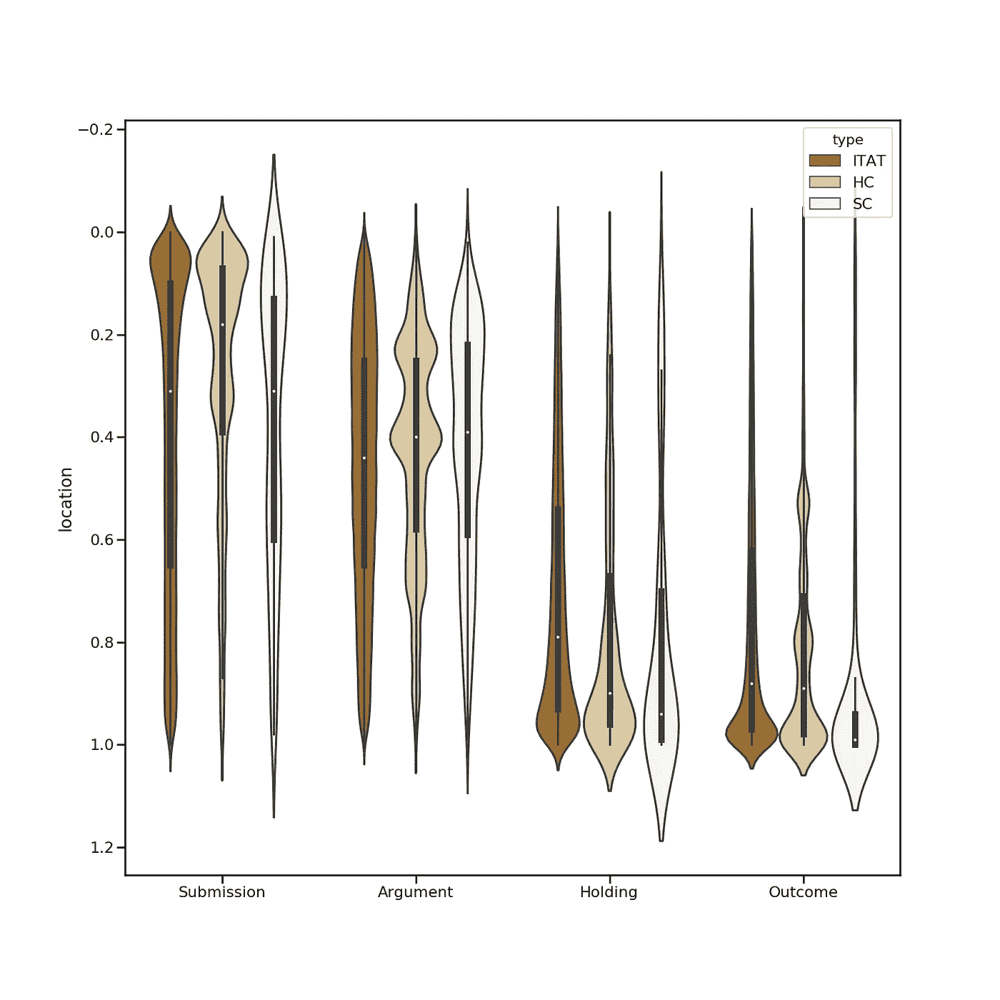
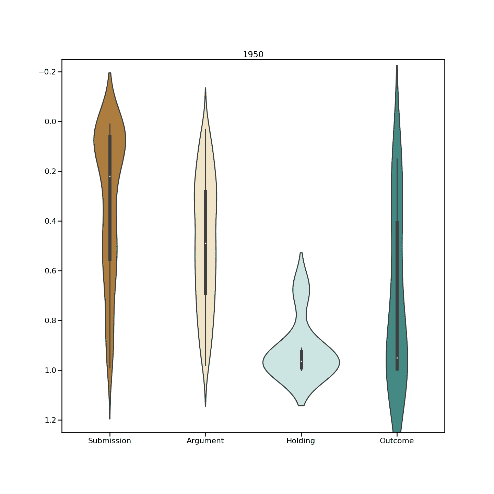

# 阅读法律案例文件，如专业指南和分析。

> 原文：<https://towardsdatascience.com/anatomy-of-an-indian-tax-case-f1311379bc8c?source=collection_archive---------13----------------------->

Type, type, type, done!

在印度，税务案件分为直接和间接。直接税包括所得税、财产税、利息税、赠与税等。间接税包括 [GST](https://www.gstindia.com/goods-and-service-tax-a-detailed-explanation-with-examples-2/) (自 2017 年生效)、增值税(仍适用于酒类、黄金、珠宝等)、关税等。我有机会分析了`223k direct tax cases`。最老的一个在`January, 1950`，而最近的一个在`August, 2018`。在一系列的帖子中，我很乐意从这个庞大的语料库中得出见解。就本文而言，这些是每个法院的案件数量，考虑到:

*   最高法院:`**3145** (1.4%)`
*   高等法院:`**64847** (29%)`
*   所得税上诉法庭(ITAT): `**154963** (69.6%)`

# 解剖

法律案例文档是一个人应该如何组织任何文本的主要例子。它是*(读起来应该是)*有说服力的，而且重要的是，它沿着一条线索将读者从一点平稳地带到另一点。理解构成判决的要素及其特征对任何读者都是有用的，更不用说律师和从业者了。 ***此外，即使在知道大小写之前就知道一个元素的大概位置，也能加快阅读过程。***

撇开创作自由、不必要的冗长和无根据的重复不谈，法律判决似乎遵循这种普遍的未明说的格式，正如一个不在法律领域的人所理解的那样:

**1。开始** -对案例的快速介绍、最初提交案例的详细信息以及其他先决条件信息。

> 这些是 2007-08 课税年度针对劳工处的命令而提出的交叉上诉。CIT(A)-XX，新德里，2013 年 3 月 6 日。

**二(一)。问题-** 手头的事情，是利益点和案件的基石。争议是对法律或事实的争论。基石。问题提出了，法庭欠我们答案。

> 被评人提出的第一个问题是反对劳工处的行动。CIT(A)确认增加 10，747 卢比，由 AO 作为捐赠和订阅账户。

**2(b)。理由-** 根据当事人的观点，理由是问题。理由是问题的问题。它们是一个案件的为什么的为什么。

> 在编号为 921/JP/2011 的 2004-05 年度 ITA 中，税务局基于以下理由提起上诉:1 .那是身份证。CIT (A)在删除《1961 年信息技术法》第 10(23c)(iiiad)条拒绝豁免请求的规定时，在法律上以及在本案的事实和情况上都犯了错误。

**2(c)。祈祷文** -祈祷文是对法庭的呼吁。

> 上诉人请求许可在审理时或之前补充、更改、修正和/或变更上诉理由。

一起，理由，问题和祈祷可以被称为提交给法院。

**3。事实是案件中发生的事情。案件的论证和推理依赖于事实。虽然双方通常对事实意见一致，但如果有争议，就会产生事实问题，法院必须解决这一问题。事实包括被评人的业务/行业、进行的交易、争议的金额及/或交易等。**

> 这个问题的简单事实是，被评估人是一家从事向其集团公司提供营销服务的公司。

**4。辩护律师为自己一方辩护时提出的论点或辩护。这些论点由陈述支持，这些陈述被称为案例的推理要素。律师引用法律和判例来支持他们的主张。法官或成员也将在进行辩论时提供必要的支持。**

> 经询问，被评估人认为这些费用实际上是在本年度发生的。
> 
> 是 ld 提交的。被评税者认为 CIT(A)通过的受质疑命令是作为被评税者的单方面行为。

**5。控股-** 裁决，包括双方将采取的指令部分。“指令部分”表示各方要采取的行动。

> 有鉴于此，现阶段不需要对案件的是非曲直作出裁决。

**6。结局-** 以一种浓缩的控股形式作为裁决，来概括这个案子。

> 参考资料被相应地处置，没有关于费用的命令。
> 
> 结果，被评人在 2008-09 及 2009-10 课税年度的上诉部分获得批准，而税务局在 2009-10 课税年度的上诉则被驳回。

*理想情况下，在涉及一个以上法律问题的情况下，应重复第 2 点至第 5 点，直到所有问题都得到解决。*

## 洞察力

平均判决长度为`6.87 pages`。平均来说，一个判断有`2015 words`呈现在`69.27 sentences`中，合并成`22.89 paragraphs.`

文本分类模型被用来预测所有判断中的这些元素。在超过 10 万个预测句子的聚合语料库中，观察到以下趋势。

这些元素的平均字符长度如下:

*   投稿:`307.09` 字符
*   参数`276.12` 字符
*   手持:`202.97` 字符
*   结果:`95.15` 字符

*意见书和论辩书明显比持有和判决长。这是因为这两个要素-意见书和论点需要阐述。论元句是那些包含明确陈述的句子，如上面的例子所示。预测每一个推理/论证句子，往好里说是尝试，往坏里说是不可能。*

在至少预测到一个提交的情况下，判决平均包含`3.74 submissions`、`7.44 arguments`、`1.07 holdings`和`1.91 outcome`个句子。

## 机器学习笔记

考虑到统计数据，一个判断将由`70 sentences`组成，其中只有`~14 sentences`属于任何一个类别。这大约发生在案件的`20%`左右。这是不平衡学习的一个典型例子，可以通过以下一种或多种方式来处理:欠采样、过采样、使用类似 SMOTE 的方法创建类的伪示例，或者调整模型的参数来惩罚这种不平衡。在我们的例子中，对少数类进行过采样是一个更好的方法，因为 ***这些元素的结构彼此非常相似。对少数类进行欠采样会导致信息丢失。***

为了验证上述说法，我在训练数据中随机抽取了一个案例的问题，得到了以下结果:

> 1.判决**是否应该**在摘要中报道？
> 根据本案的事实和情况，同时考虑到 KSBC 禁止在外服役，法庭允许塞尔维亚共和国的开支在法律和事实上是否正确。
> 2。了解到的下级机构**是否有材料**和**在法律上正确**认定法案第 269D(2)(b)条包含的法定要求得到遵守？
> 3。这种利益是否符合为外国游客提供服务的利润，这是个问题。
> 4。为了支出的目的，是否提取了任何资本，或者，换句话说，发生支出的目的是否是使用作为业务资本而获得的资本。

(高亮显示的单词和短语是在表示怀疑或询问某事时使用的假设情景的经典例子。所有这些元素都可以单独评估它们的词类和其他语言特征，但那是以后的事了。)

通常，一个元素可以属于两个类(不是互斥的)，而`multi-label classification`是合适的。然而，从上述类的一个元素开始比从其他元素开始更容易

因为一个类的大多数元素在结构上是相似的，所以一个`bag of words`或者一个`TF-IDF`方法可以很好地用于建模。`Word vectors`在不太大的训练集中表现不佳，而前者表现良好。

如下图所示，位置也是该车型的一个突出特点。

## **案件中这些要素的分布**

Where’s what?

## 注意事项:

在 x 轴上，我们有一个案件的各种元素。为了便于理解图表， **y 轴已经倒置**。在 y 轴上，我们有一个案例中的位置，即从第一行开始，要到达文本中的特定行(0.2 =案例中的 20%)必须穿过案例的范围。

例如，显而易见，提交的案例(问题和理由)位于案例正文的前 **40%** 处。该分布持续存在并最终收敛。

## 分析和见解:

1.  提交、支持、结果——这些要素清楚地位于案件的某些特定点上，而论点和理由几乎均匀地散布在整个案件中。
2.  控股公司紧随其后的是结果声明。
3.  另一方面，提交的材料和论点更多地是在高级委员会和高级委员会中提出的。这些在上面的图表中显示为块状。**经分析，HC 和 SC 评委的写作风格连贯清晰。他们从清楚地描述一个问题开始，然后在继续另一个问题之前详细地讨论它。另一方面，在没有这种固定模式的 ITAT 判决中存在着一种混乱状态。**
4.  持有和结果声明显示了法院几乎相似的趋势。
5.  事实*(上面没有显示)*分散在整个案件中。
6.  这些元素的平均位置如下:

*   提交:`0.29`
*   论据:`0.46`
*   原因:`0.53`
*   控股:`0.76`
*   结果:`0.82`

*这个顺序验证了我们之前关于理想判断顺序的假设。*

看了几年，下图小提琴情节具体化。

What’s where, when?

有一个明显的趋势表明，随着时间的推移，判断已经从相当结构化的要素转变为更加松散的结构。在上图中，小提琴的*球形度*表示判断中特定位置的元素密度。我们可以看到，这种进展是从被严重描绘(更多球状)到更分散的集中(更少球状)，表明元素现在在判断中的位置方面更加分散。

虽然许多人说撰写判决书是一门艺术，但通常阅读判决书也是一门艺术。如果这种艺术形式至少在核心上是一致的，那肯定是有帮助的。

**结尾注释:**

1.  临时命令、诉讼记录和其他非最后文件不在此分析之列，因为它们包含缺乏这些核心要素的琐碎信息。
2.  数据来源-我在 [Riverus 工作，](http://www.riverus.in)一家致力于为从业者和普通民众简化法律的法律技术公司。