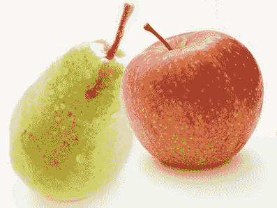
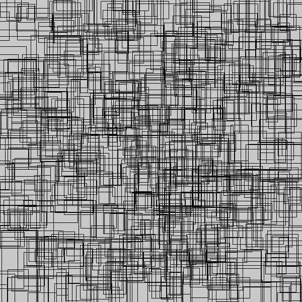
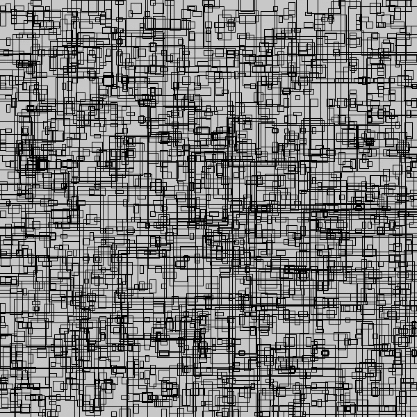
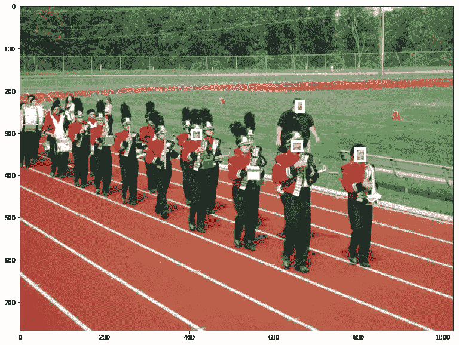
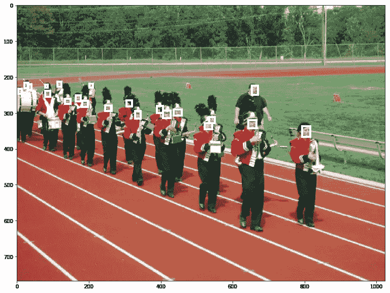
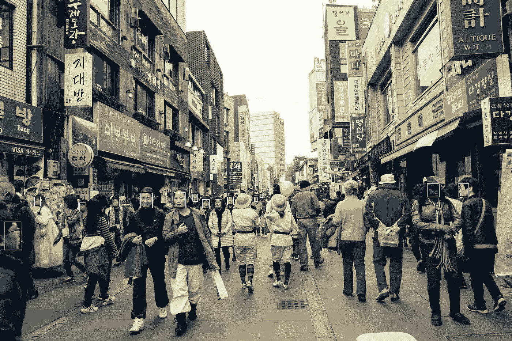

# 锚盒——质量目标检测的关键

> 原文：<https://towardsdatascience.com/anchor-boxes-the-key-to-quality-object-detection-ddf9d612d4f9?source=collection_archive---------0----------------------->

在学习用于对象检测的卷积神经网络时，最难理解的概念之一是锚盒的概念。它也是可以优化以提高数据集性能的最重要的参数之一。事实上，如果锚盒没有正确调整，你的神经网络甚至永远不会知道某些小的、大的或不规则的对象的存在，也永远不会有机会检测到它们。幸运的是，你可以采取一些简单的步骤来确保你不会落入这个陷阱。

# 什么是锚盒？

当你使用像 YOLO 或 SDD 这样的神经网络来预测一张图片中的多个对象时，网络实际上正在进行成千上万次预测，并且只显示它确定为对象的那些。多个预测以下列格式输出:

预测一:(X，Y，高度，宽度)，类
…。
预测~8 万:(X，Y，高度，宽度)，类

其中(X，Y，高度，宽度)被称为“边界框”，或包围对象的框。这个框和 object 类由人工注释者手动标记。

在一个极其简单的示例中，假设我们有一个模型，它有两个预测，并接收到以下图像:

我们需要告诉我们的网络它的每一个预测是否正确，以便它能够学习。但是我们告诉神经网络 it 预测*应该是什么呢？预测的类别应该是:*

预测一:梨
预测二:苹果

或者应该是:

预测一:苹果
预测二:梨

如果网络预测:

预测一:苹果
预测二:苹果

我们需要我们网络的两个预测者能够分辨出他们的工作是预测梨还是苹果。要做到这一点，有几种工具。预测器可以专注于特定大小的对象、具有特定纵横比(高与宽)的对象或图像不同部分的对象。大多数网络使用所有三个标准。在梨/苹果图像的示例中，我们可以让预测 1 针对图像左侧的对象，预测 2 针对图像右侧的对象。那么我们就有了网络应该预测的答案:

预测一:梨
预测二:苹果

# 实践中的锚箱

现有技术的物体检测系统目前做以下工作:

1.为每个预测器创建数千个“锚框”或“先验框”，代表它专门预测的对象的理想位置、形状和大小。

2.对于每个锚定框，计算哪个对象的边界框具有最高的重叠除以非重叠。这被称为并集上的交集或 IOU。

3.如果最高 IOU 大于 50%，告诉锚盒它应该检测给出最高 IOU 的对象。

4.否则，如果 IOU 大于 40%，则告诉神经网络真实检测是不明确的，并且不要从该示例中学习。

5.如果最高 IOU 低于 40%，那么主播框应该预测没有对象。

这在实践中效果很好，数以千计的预测器在决定他们的对象类型是否出现在图像中方面做得非常好。看一看 RetinaNet 的[开源实现，这是一个最先进的对象检测器，我们可以可视化锚框。太多了，无法一次全部形象化，然而这里只是其中的 1%:](https://github.com/kuangliu/pytorch-retinanet)

使用默认的锚框配置可以创建*太过*专门化的预测器，并且出现在图像中的对象可能无法实现带有*任何*锚框的 50% IOU。在这种情况下，神经网络将永远不会知道这些对象的存在，也永远不会学会预测它们。我们可以将锚盒调整得更小，比如这个 1%的样本:

在 RetinaNet 配置中，最小的锚盒大小为 32x32。这意味着许多比这更小的物体将无法被探测到。这里有一个来自 [WiderFace](http://mmlab.ie.cuhk.edu.hk/projects/WIDERFace/) 数据集(杨，硕和罗，平和洛伊，陈变和唐，小欧)的例子，其中我们将边界框与它们各自的锚框进行匹配，但有些没有被发现:

Source: [WIDER FACE](http://shuoyang1213.me/WIDERFACE/)

在这种情况下，只有四个基本事实边界框与任何锚框重叠。神经网络永远不会学会预测其他面孔。我们可以通过改变默认的锚盒配置来解决这个问题。减小最小的锚框尺寸，所有的脸至少与我们的锚框之一对齐，我们的神经网络可以学习检测它们！

Source: [WIDER FACE](http://shuoyang1213.me/WIDERFACE/)

# 改进锚箱配置

一般来说，在开始训练模型之前，您应该问自己以下关于数据集的问题:

1.  我希望能够检测到的最小尺寸的盒子是什么？
2.  我希望能够检测到的最大尺寸的盒子是什么？
3.  这个盒子可以有哪些形状？例如，只要汽车或摄像机不会侧翻，汽车检测器可能有短而宽的锚盒。

您可以通过实际计算数据集中最极端的大小和长宽比来获得粗略的估计。另一个物体检测器 YOLO v3 使用 K 均值来估计理想的边界框。另一个选择是[学习锚箱配置](https://arxiv.org/abs/1807.00980)。

一旦你想通了这些问题，你就可以开始设计你的锚盒了。一定要对它们进行测试，方法是对你的基本事实边界框进行编码，然后对它们进行解码，就好像它们是来自你的模型的预测一样。您应该能够恢复地面真实边界框。

此外，请记住，如果边界框和定位框的中心不同，这将减少 IOU。即使你有小的锚盒，如果锚盒之间的跨度很大，你可能会错过一些地面真相盒。改善这种情况的一种方法是将 IOU 阈值从 50%降至 40%。

[David Pacassi Torrico 最近的一篇文章](https://www.liip.ch/en/blog/face-detection-an-overview-and-comparison-of-different-solutions-part1)比较了当前人脸检测的 API 实现，强调了正确指定锚盒的重要性。你可以看到算法做得很好*除了*对于小脸。下面是一些 API 根本无法检测到任何人脸的图片，但我们的新模型检测到了许多人脸:

如果你喜欢这篇文章，你可能会喜欢阅读没有锚盒的[对象检测*。*](https://medium.com/@andersasac/the-end-of-anchors-improving-object-detection-models-and-annotations-73828c7b39f6)