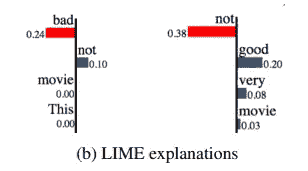
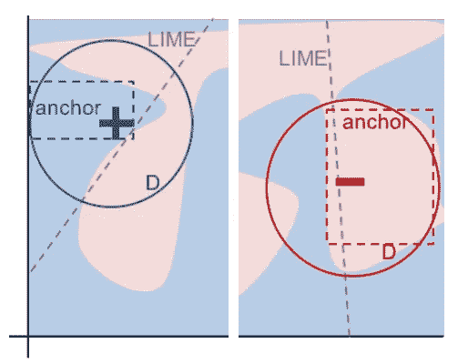
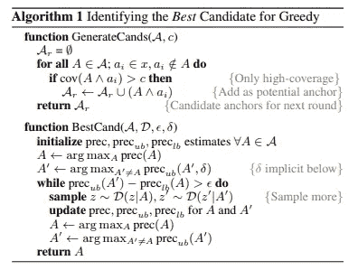
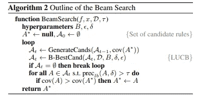
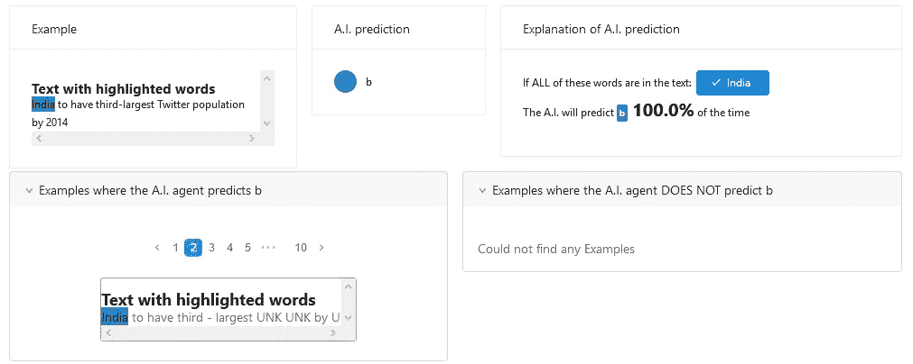

# 锚定你的模型

> 原文：<https://towardsdatascience.com/anchor-your-model-interpretation-by-anchors-aa4ed7104032?source=collection_archive---------8----------------------->


“top view of two white yachts” by [Tom Grimbert](https://unsplash.com/@tom_grimbert?utm_source=medium&utm_medium=referral) on [Unsplash](https://unsplash.com?utm_source=medium&utm_medium=referral)

模型解释意味着提供原因和背后的逻辑，以实现模型的可问责性和透明性。正如之前的博客([模型解释简介](/3-ways-to-interpretate-your-nlp-model-to-management-and-customer-5428bc07ce15)和 [SHAP](/interpreting-your-deep-learning-model-by-shap-e69be2b47893) 所提到的，模型解释对于数据科学获得管理层和客户的信任非常重要。

LIME 的作者提到，LIME 在某些情况下无法正确解释模型。因此，他们提出了一种新的模型解释方法，即**锚。**

看完这篇文章，你会明白:

*   石灰解释的局限性
*   新方法:锚

# 石灰解释的局限性



From Ribeiro, Singh, and Guestrin 2018

虽然我们可以用简单函数来局部解释复杂性，但它只能解释特定的情况。这意味着它可能不适合看不见的情况。

从以上对情绪预测的解释来看，“不”在左手边提供了积极的影响，而在右手边提供了严重的消极影响。如果我们只看其中一种解释，这是没问题的，但是如果我们把两种解释放在一起看，我们就会感到困惑。

# 新方法:锚



From Ribeiro, Singh, and Guestrin 2018

通过学习直线(或斜率)，LIME 解释了预测结果。与 LIME 不同，Anchors 使用“局部区域”来学习如何解释模型。为了解释,“局部区域”是指生成数据集的更好构造。

有两种方法可以找到锚点。第一种是自下而上的方法，这种方法简单，但需要更多的时间来计算结果。第二种是“锚”库中采用的波束搜索。

*自下而上的方法*



From Ribeiro, Singh, and Guestrin 2018

该方法从空集开始。在每次迭代中，它将生成一组候选项，并且每次将添加一个新的特征谓词(特征输入)。如果规则达到精度并满足等式 3 的标准，它将停止寻找下一个特征谓词。因为它的目标是找到**最短的锚点**，因为他们注意到短锚点可能具有更高的覆盖率。

直觉上，有两个主要问题。一次只能添加一个功能。同样，贪婪搜索的主要目的是识别最短路径。

*光束搜索方法*



From Ribeiro, Singh, and Guestrin 2018

这种方法解决了贪婪搜索的局限性。它使用 KL-LUCB 算法来选择那些最佳候选。预期的结果是，这种方法比自底向上搜索更有可能识别具有更高覆盖率的锚点。

# 履行

```
explainer = anchor_text.AnchorText(spacy_nlp, labels, use_unk_distribution=True)
    exp = explainer.explain_instance(x_test[idx], estimator, threshold=0.8, use_proba=True, batch_size=30)max_pred = 2
    print('Key Singal from Anchors: %s' % (' AND '.join(exp.names())))
    print('Precision: %.2f' % exp.precision())
    print()exp.show_in_notebook() 
```

当调用“解释实例”时，我们需要提供

1.  x _ test[idx]:x 的目标
2.  评估者:你的模型
3.  阈值:锚点使用此阈值来查找包含锚点(特征)的最小精度
4.  batch_size:要生成的批的数量。更多的批处理意味着生成更多可能的数据集，但也需要更长的时间



根据上面的解释，Anchors 规定“印度”是将输入分类为“b”类别的输入锚点。

# 外卖食品

要访问所有代码，你可以访问我的 github repo。

*   与 SHAP 相比，**计算时间更少。**
*   在我之前的文章中，我用 SHAP 和锚来解释这个预测。你也可以**考虑使用多模型解释器**。
*   **标签只能接受整数**。意味着不能传递准确的分类名称，只能传递编码的类别。

# 关于我

我是湾区的数据科学家。专注于数据科学、人工智能，尤其是 NLP 和平台相关领域的最新发展。你可以通过[媒体博客](http://medium.com/@makcedward/)、 [LinkedIn](https://www.linkedin.com/in/edwardma1026) 或 [Github](https://github.com/makcedward) 联系我。

# 参考

里贝罗·m·t·辛格·s·格斯特林·C..“我为什么要相信你？”解释任何分类器的预测。2016.[https://arxiv.org/pdf/1602.04938.pdf](https://arxiv.org/pdf/1602.04938.pdf)

里贝罗·m·t·辛格·s·格斯特林·C..锚:高精度模型不可知的解释。2018.[https://homes.cs.washington.edu/~marcotcr/aaai18.pdf](https://homes.cs.washington.edu/~marcotcr/aaai18.pdf)

Kaufmann E .，Kalyanakrishnan s .“Bandit 子集选择中的信息复杂性”，2013 年。[http://proceedings.mlr.press/v30/Kaufmann13.pdf](http://proceedings.mlr.press/v30/Kaufmann13.pdf)