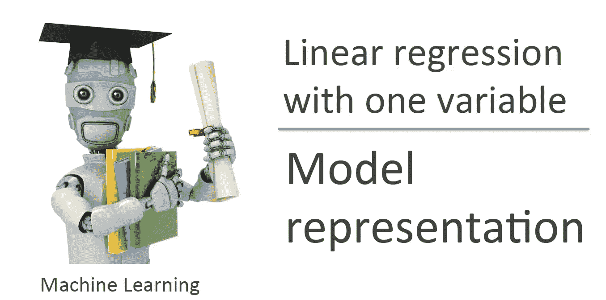
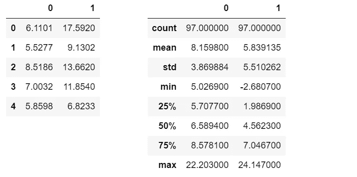
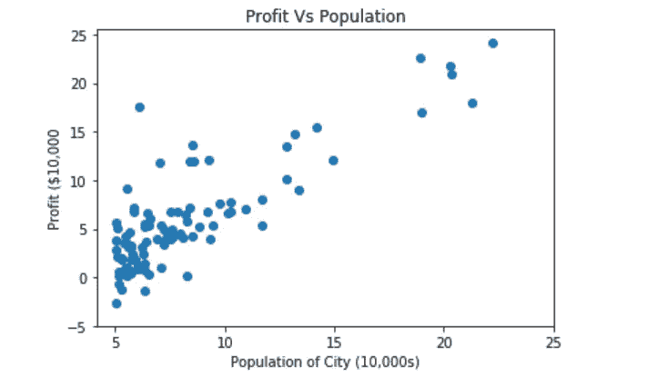
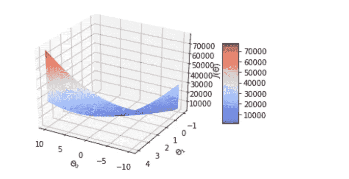
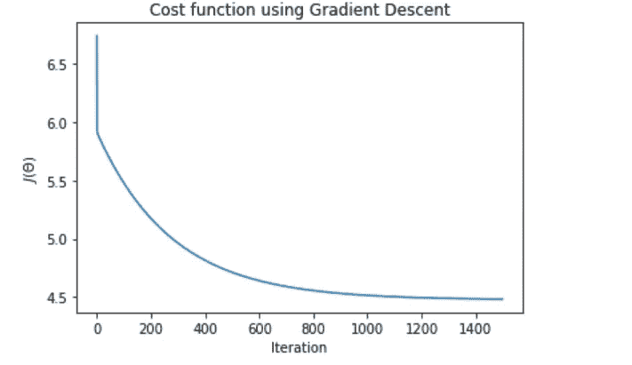
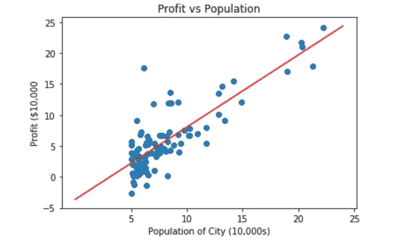
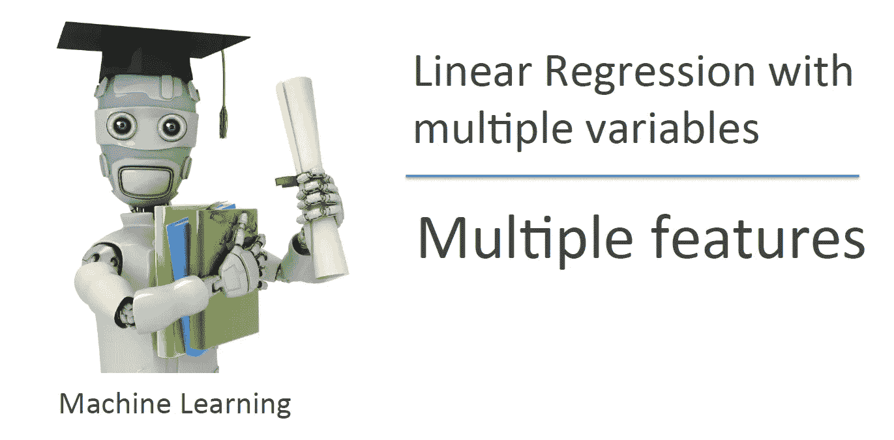
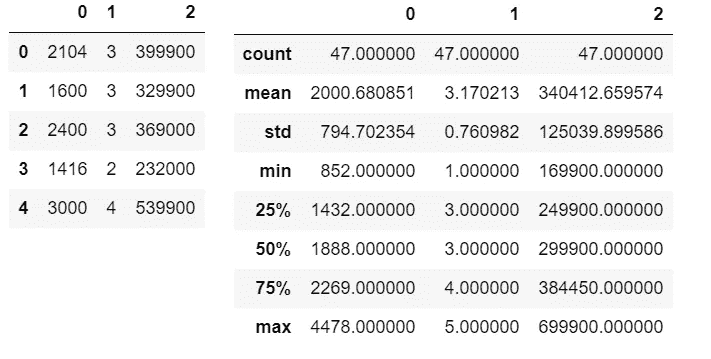
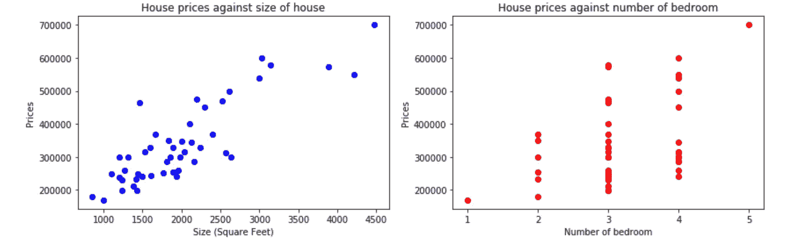
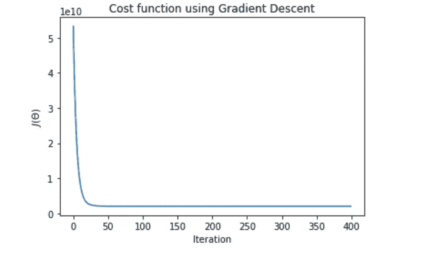

# 吴恩达的 Python(线性回归)机器学习教程

> 原文：<https://towardsdatascience.com/andrew-ngs-machine-learning-course-in-python-linear-regression-dd04fba8e137?source=collection_archive---------4----------------------->



Machine Learning — Andrew Ng

我是一名药学本科生，一直想做的远不止是一名临床药师。我曾试图在我对它的热爱和我拥有的医疗保健知识之间找到某种融合，但在当今这个时代，人们真的会感到迷失在丰富的信息中。

6 个月前，我偶然发现了数据科学的概念及其在医疗保健行业的应用。鉴于数据和计算能力的进步，利用计算机来识别、诊断和治疗疾病不再是梦想。在更高级的层面上，计算机视觉可以帮助使用射线照相图像识别疾病，而在更简单的层面上，算法可以检测改变生活的潜在药物相互作用。

带着进入医疗 IT 行业的目标，我为那些没有技术背景的人设计了一个数据科学课程，我在这里[展示了它](https://link.medium.com/AEFl6oLRES)。

斯坦福大学在 Coursera([https://www.coursera.org/learn/machine-learning](https://www.coursera.org/learn/machine-learning))开设的吴恩达机器学习是数据科学社区强烈推荐的课程之一。经过 6 个月的基础数学和 python 培训，我开始了这门课程，以步入机器学习的世界。你们很多人都知道，这门课是在 Octave 或 Matlab 中进行的。虽然学习一些 Octave 编程并完成编程任务是很好的，但我想测试我的 python 知识，并尝试从头开始完成 python 的任务。

本文将是我撰写的系列文章的一部分，记录我在课程中编程作业的 python 实现。这绝不是其他人的指南，因为我也在不断学习，但可以作为那些希望做同样事情的人的起点。也就是说，我很高兴从你们那里收到一些建设性的反馈。

**首先将使用数据集** `**ex1data1.txt**`进行一元线性回归

首先，我将导入所有相关的库并将数据集加载到 jupyter 笔记本中

```
import numpy as np
import matplotlib.pyplot as plt
import pandas as pddata=pd.read_csv("Uni_linear.txt", header=None)
```

为了养成良好的习惯，我会经常看数据，并对数据有良好的感觉

```
data.head()
data.describe()
```



绘制数据，以显示因变量(y)和自变量(X)之间的关系

```
plt.scatter(data[0],data[1])
plt.xticks(np.arange(5,30,step=5))
plt.yticks(np.arange(-5,30,step=5))
plt.xlabel("Population of City (10,000s)")
plt.ylabel("Profit ($10,000")
plt.title("Profit Vs Population")
```



我已经习惯了这种绘制图形的方式，但是我意识到使用 matplotlib 有一种面向对象的方式，我将在本作业的其他一些图形中使用这种方式

接下来计算成本函数 J(θ)

```
def computeCost(X,y,theta):
    """
    Take in a numpy array X,y, theta and generate the cost function     of using theta as parameter in a linear regression model
    """
    m=len(y)
    predictions=X.dot(theta)
    square_err=(predictions - y)**2

    return 1/(2*m) * np.sum(square_err)
```

初始化 X，y 并计算使用θ=(0，0)的成本

```
data_n=data.values
m=len(data_n[:,-1])
X=np.append(np.ones((m,1)),data_n[:,0].reshape(m,1),axis=1)
y=data_n[:,1].reshape(m,1)
theta=np.zeros((2,1))computeCost(X,y,theta)
```

这可能不是最好的方法，但这是我找到的唯一一个为₀.增加一列 1 的解决方案这里的`computeCost`函数将给出`32.072733877455676`

现在通过最小化成本函数 J(θ)来实现梯度下降以优化θ

```
def gradientDescent(X,y,theta,alpha,num_iters):
    """
    Take in numpy array X, y and theta and update theta by taking   num_iters gradient steps
    with learning rate of alpha

    return theta and the list of the cost of theta during each  iteration
    """

    m=len(y)
    J_history=[]

    for i in range(num_iters):
        predictions = X.dot(theta)
        error = np.dot(X.transpose(),(predictions -y))
        descent=alpha * 1/m * error
        theta-=descent
        J_history.append(computeCost(X,y,theta))

    return theta, J_historytheta,J_history = gradientDescent(X,y,theta,0.01,1500)print("h(x) ="+str(round(theta[0,0],2))+" + "+str(round(theta[1,0],2))+"x1")
```

print 语句将打印出假设:`*h*(*x*) = -3.63 + 1.17x₁`，显示四舍五入到小数点后两位的优化θ值

为了使任务更加完整，我还尝试将标准单变量情况下的成本函数可视化

```
from mpl_toolkits.mplot3d import Axes3D#Generating values for theta0, theta1 and the resulting cost valuetheta0_vals=np.linspace(-10,10,100)
theta1_vals=np.linspace(-1,4,100)
J_vals=np.zeros((len(theta0_vals),len(theta1_vals)))for i in range(len(theta0_vals)):
    for j in range(len(theta1_vals)):
        t=np.array([theta0_vals[i],theta1_vals[j]])
        J_vals[i,j]=computeCost(X,y,t)#Generating the surface plot
fig = plt.figure()
ax = fig.add_subplot(111, projection='3d')
surf=ax.plot_surface(theta0_vals,theta1_vals,J_vals,cmap="coolwarm")
fig.colorbar(surf, shrink=0.5, aspect=5)
ax.set_xlabel("$\Theta_0$")
ax.set_ylabel("$\Theta_1$")
ax.set_zlabel("$J(\Theta)$")#rotate for better angle
ax.view_init(30,120)
```



上面的代码块生成如图所示的 3d 表面图。正如在讲座中提到的，成本函数是一个凸函数，只有一个全局最小值，因此，梯度下降将总是导致找到全局最小值

顺便说一下，我使用了 mplot3d 教程来帮助我进行 3d 绘图。([https://matplotlib.org/mpl_toolkits/mplot3d/tutorial.html](https://matplotlib.org/mpl_toolkits/mplot3d/tutorial.html))

```
plt.plot(J_history)
plt.xlabel("Iteration")
plt.ylabel("$J(\Theta)$")
plt.title("Cost function using Gradient Descent")
```



相对于迭代次数绘制成本函数给出了良好的下降趋势，表明梯度下降实现在降低成本函数方面起作用

现在，有了优化的θ值，我将把预测值(最佳拟合线)一起绘制成图

```
plt.scatter(data[0],data[1])
x_value=[x for x in range(25)]
y_value=[y*theta[1]+theta[0] for y in x_value]
plt.plot(x_value,y_value,color="r")
plt.xticks(np.arange(5,30,step=5))
plt.yticks(np.arange(-5,30,step=5))
plt.xlabel("Population of City (10,000s)")
plt.ylabel("Profit ($10,000")
plt.title("Profit vs Population")
```



同样，这可能不是基于θ生成直线的最佳方式，如果有更好的方式，请告诉我

作业的最后一部分包括根据你的模型做出预测

```
def predict(x,theta):
    """
    Takes in numpy array of x and theta and return the predicted value of y based on theta
    """

    predictions= np.dot(theta.transpose(),x)

    return predictions[0]predict1=predict(np.array([1,3.5]),theta)*10000print("For population = 35,000, we predict a profit of $"+str(round(predict1,0)))
```

打印报表打印:`For population = 35,000, we predict a profit of $4520.0`

```
predict2=predict(np.array([1,7]),theta)*10000
print("For population = 70,000, we predict a profit of $"+str(round(predict2,0)))
```

打印报表打印:`For population = 70,000, we predict a profit of $45342.0`



Machine Learning – Andrew Ng

**现在使用数据集** `**ex1data2.txt**`进行多元线性回归

与所有数据集一样，我首先加载数据并查看数据

```
data2=pd.read_csv("Multi_linear.txt", header=None)
data2.head()
data2.describe()
```



如你所见，现在 X 有两个特征，使它成为一个多元问题

```
# Create 2 subplot, 1 for each variable
fig, axes = plt.subplots(figsize=(12,4),nrows=1,ncols=2)axes[0].scatter(data2[0],data2[2],color="b")
axes[0].set_xlabel("Size (Square Feet)")
axes[0].set_ylabel("Prices")
axes[0].set_title("House prices against size of house")
axes[1].scatter(data2[1],data2[2],color="r")
axes[1].set_xlabel("Number of bedroom")
axes[1].set_ylabel("Prices")
axes[1].set_xticks(np.arange(1,6,step=1))
axes[1].set_title("House prices against number of bedroom")# Enhance layout
plt.tight_layout()
```



针对每个功能绘制价格图显示了它们之间的关系。仅仅通过看这个图，我们就应该期望因变量和自变量之间有某种程度的正相关。

对于使用梯度下降的多变量问题优化，需要特征归一化来加速优化过程。

```
def featureNormalization(X):
    """
    Take in numpy array of X values and return normalize X values,
    the mean and standard deviation of each feature
    """
    mean=np.mean(X,axis=0)
    std=np.std(X,axis=0)

    X_norm = (X - mean)/std

    return X_norm , mean , stddata_n2=data2.values
m2=len(data_n2[:,-1])
X2=data_n2[:,0:2].reshape(m2,2)
X2, mean_X2, std_X2 = featureNormalization(X2)
X2 = np.append(np.ones((m2,1)),X2,axis=1)
y2=data_n2[:,-1].reshape(m2,1)
theta2=np.zeros((3,1))
```

接下来是测试我们之前的函数，`computeCost(X, y, theta)`和`gradientDescent(X, y, theta, alpha, num_iters)`是否适用于多特征输入

使用`computeCost(X2,y2,theta2)`给出`65591548106.45744`，这是使用θ(0，0，0)作为参数的成本

```
theta2, J_history2 = gradientDescent(X2,y2,theta2,0.01,400)
print("h(x) ="+str(round(theta2[0,0],2))+" + "+str(round(theta2[1,0],2))+"x1 + "+str(round(theta2[2,0],2))+"x2")
```

打印语句 print: `h(x) =334302.06 + 99411.45x1 + 3267.01x2`，它是优化后的θ值，四舍五入到小数点后两位

```
plt.plot(J_history2)
plt.xlabel("Iteration")
plt.ylabel("$J(\Theta)$")
plt.title("Cost function using Gradient Descent")
```



绘制*J*(θ)*与迭代次数的关系图给出了一个下降趋势，证明我们的`gradientDescent` 函数也适用于多元情况*

*最后，使用优化后的θ值对一栋 1650 平方英尺、有 3 间卧室的房子进行预测。*

```
*#feature normalisation of x values
x_sample = featureNormalization(np.array([1650,3]))[0]
x_sample=np.append(np.ones(1),x_sample)
predict3=predict(x_sample,theta2)
print("For size of house = 1650, Number of bedroom = 3, we predict a house value of $"+str(round(predict3,0)))*
```

*此打印声明打印:`For size of house = 1650, Number of bedroom = 3, we predict a house value of $430447.0`*

*第一个练习到此为止。希望你能像我写它一样喜欢阅读它。请随时给我留下一些意见，告诉我如何改进。如果你想访问 Jupyter 笔记本来完成这个任务，我已经上传了 Github 中的代码([https://Github . com/Ben lau 93/Machine-Learning-by-Andrew-Ng-in-Python](https://github.com/Benlau93/Machine-Learning-by-Andrew-Ng-in-Python))。*

*对于本系列中的其他 python 实现，*

*   *[逻辑回归](https://medium.com/@ben_lau93/andrew-ngs-machine-learning-course-in-python-logistic-regression-c0ae25509feb)*
*   *[正则化逻辑回归](https://medium.com/@ben_lau93/andrew-ngs-machine-learning-course-in-python-regularized-logistic-regression-lasso-regression-721f311130fb)*
*   *[神经网络](https://medium.com/@ben_lau93/andrew-ngs-machine-learning-course-in-python-neural-networks-e526b41fdcd9)*
*   *[支持向量机](https://medium.com/@ben_lau93/andrew-ngs-machine-learning-course-in-python-support-vector-machines-435fc34b7bf9)*
*   *[无监督学习](https://medium.com/@ben_lau93/andrew-ngs-machine-learning-course-in-python-kmeans-clustering-pca-b7ba6fafa74)*
*   *[异常检测](https://medium.com/@ben_lau93/andrew-ngs-machine-learning-course-in-python-anomaly-detection-1233d23dba95)*

*感谢阅读。*